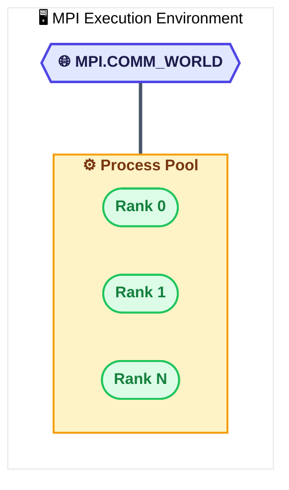
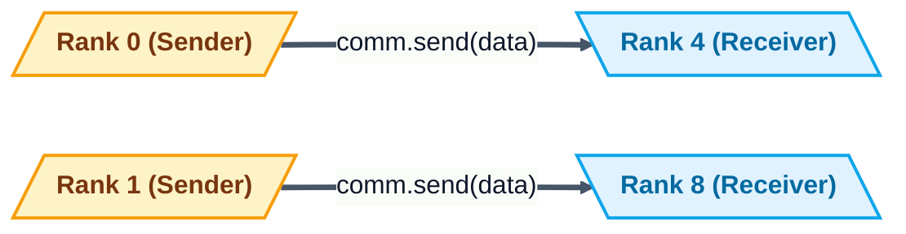
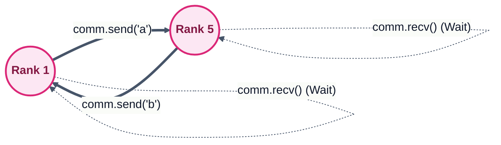
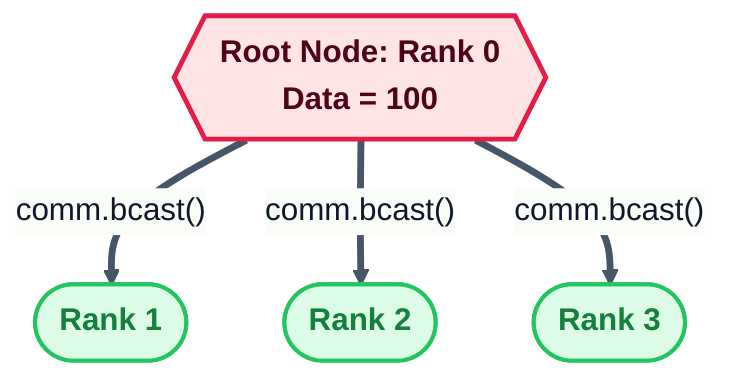
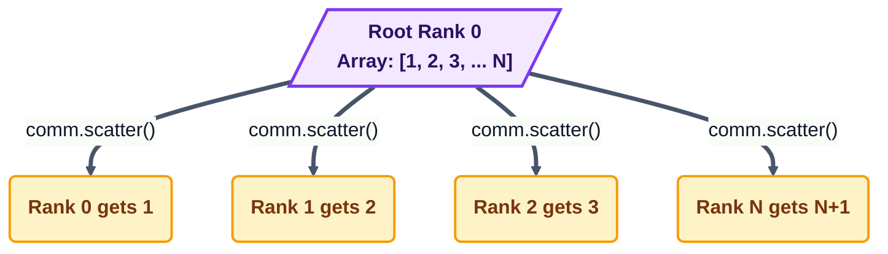
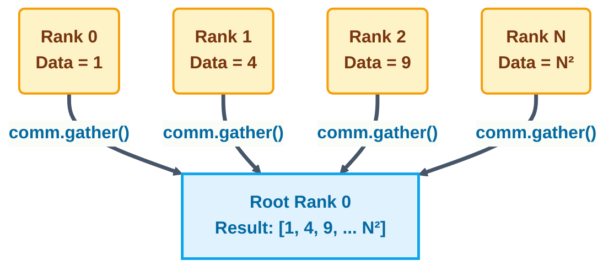
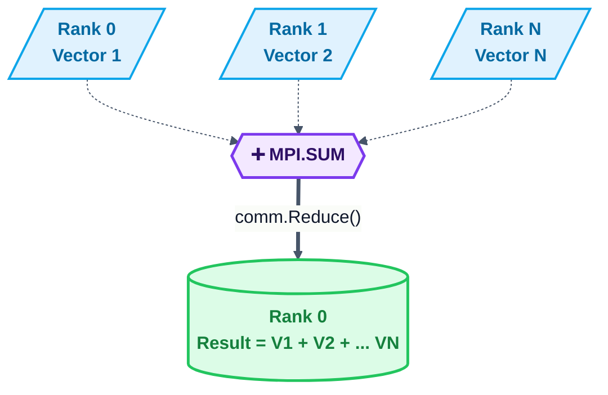
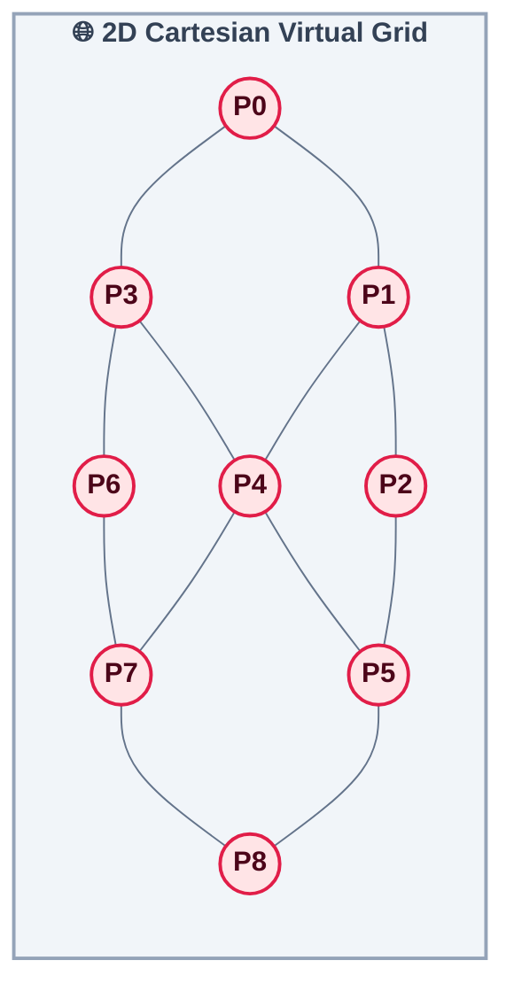

# Chapter 4: Message Passing

> **Comprehensive Theory and Practical Implementation Guide**
> This chapter focuses on the Message Passing Interface (MPI) framework using Python's `mpi4py` module. It covers point-to-point and collective communication patterns, along with strategies to avoid deadlocks and optimize performance through virtual topologies.

---

## Table of Contents
1. [Understanding the MPI Structure](#1-understanding-the-mpi-structure)
2. [Implementing Point-to-Point Communication](#2-implementing-point-to-point-communication)
3. [Avoiding Deadlock Problems](#3-avoiding-deadlock-problems)
4. [Collective Communication: Broadcast](#4-collective-communication-broadcast)
5. [Collective Communication: Scatter](#5-collective-communication-scatter)
6. [Collective Communication: Gather](#6-collective-communication-gather)
7. [Collective Communication: Alltoall](#7-collective-communication-alltoall)
8. [The Reduction Operation](#8-the-reduction-operation)
9. [Optimizing Communication](#9-optimizing-communication)

---

## 1. Understanding the MPI Structure
Message Passing Interface (MPI) is a standardized and portable message-passing standard designed to function on parallel computing architectures.
- **Communicator:** `MPI.COMM_WORLD` is the default communicator encompassing all processes initialized in your MPI job.
- **Rank:** A unique integer identifier assigned to each process by the communicator.
- **Size:** The total number of processes in a given communicator.

**Example Implementation:** See [helloworld_MPI.py](Codes/helloworld_MPI.py)

## 2. Implementing Point-to-Point Communication
Point-to-point communication typically involves exactly two processes: one sender and one receiver.
- **Send/Recv:** The primary methods `send()` and `recv()` can transmit arbitrary Python objects (like lists, dictionaries, etc.).
- **Tags & Destinations:** To pair the messages, the sender specifies the `dest` (destination rank), while the receiver specifies the `source` (source rank).

**Example Implementation:** See [pointToPointCommunication.py](Codes/pointToPointCommunication.py)

## 3. Avoiding Deadlock Problems
In message passing, deadlocks happen when processes are indefinitely waiting on each other. If Process A does a blocking `recv()` waiting for Process B, but Process B is also doing a blocking `recv()` waiting for Process A, the program freezes.
- **Solution:** Reorder communication routines so calls do not block each other, or utilize non-blocking variants (`isend()`, `irecv()`). By arranging the `send()` before the `recv()` properly based on conditions, deadlock is naturally avoided.

**Example Implementation:** See [deadLockProblems.py](Codes/deadLockProblems.py)

## 4. Collective Communication: Broadcast
In collective communications, every process in the communicator must invoke the same function. 
- **Broadcast (`bcast`):** The `root` process sends identical data to all other processes inside the communicator.

**Example Implementation:** See [broadcast.py](Codes/broadcast.py)

## 5. Collective Communication: Scatter
Scatter involves taking an array (or list) from the root process and splitting it equally among all processes.
- **Scatter (`scatter`):** If an array contains 10 items and we have 10 processes, Process 0 receives index 0, Process 1 receives index 1, etc.

**Example Implementation:** See [scatter.py](Codes/scatter.py)

## 6. Collective Communication: Gather
Gather is the exact inverse of scatter.
- **Gather (`gather`):** It fetches an element from each process and aggregates them all tightly packed into an array stored on the root process.

**Example Implementation:** See [gather.py](Codes/gather.py)

## 7. Collective Communication: Alltoall
`Alltoall` is considered a transposition method and is an extension of `scatter` and `gather`. Each process scatters a payload array to all other processes while symmetrically gathering payloads from all processes.

**Example Implementation:** See [alltoall.py](Codes/alltoall.py)

## 8. The Reduction Operation
Reduction operations perform global math operations, like summation or calculating the maximum, across distributed fragments of data holding identical properties, pushing the final result onto the root.
- **`comm.Reduce`**: Processes supply subsets, and using operations like `MPI.SUM`, `MPI.MAX`, etc., the result populates on `root=0`.

**Example Implementation:** See [reduction.py](Codes/reduction.py)

## 9. Optimizing Communication
In complex computations, linear topological alignment becomes a bottleneck. Building a **Virtual Topology** (like a multi-dimensional Cartesian Grid) allows mapping parallel application processes logically, easing boundary conditions, and improving adjacent memory access.
- **Cartesian Grid:** With `comm.Create_cart()`, you construct a 2D or 3D coordinate space. `Shift()` identifies neighboring ranks precisely like traversing coordinates (UP, DOWN, LEFT, RIGHT).

**Example Implementation:** See [virtualTopology.py](Codes/virtualTopology.py)
