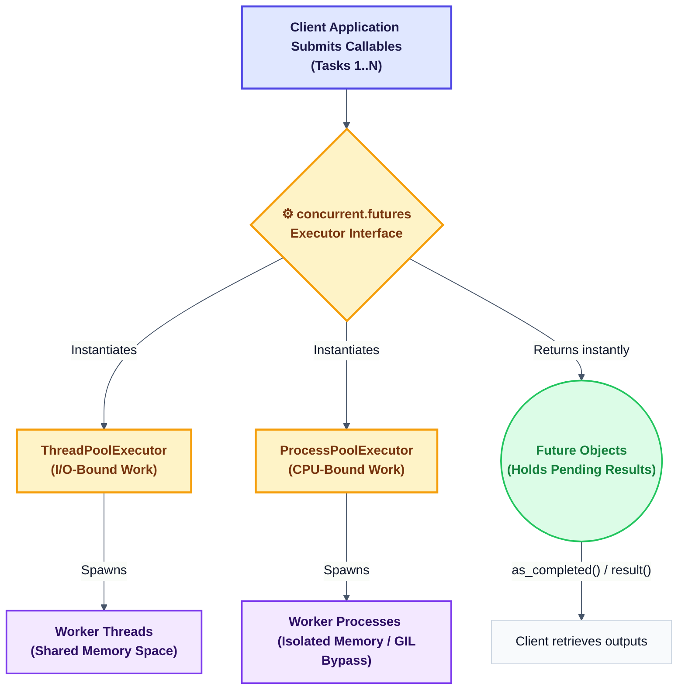
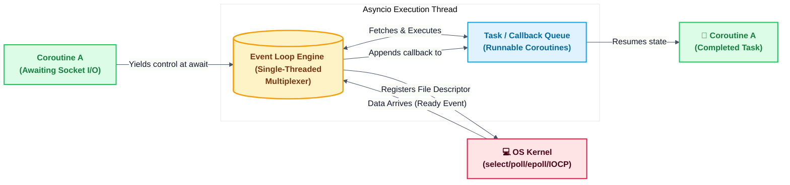
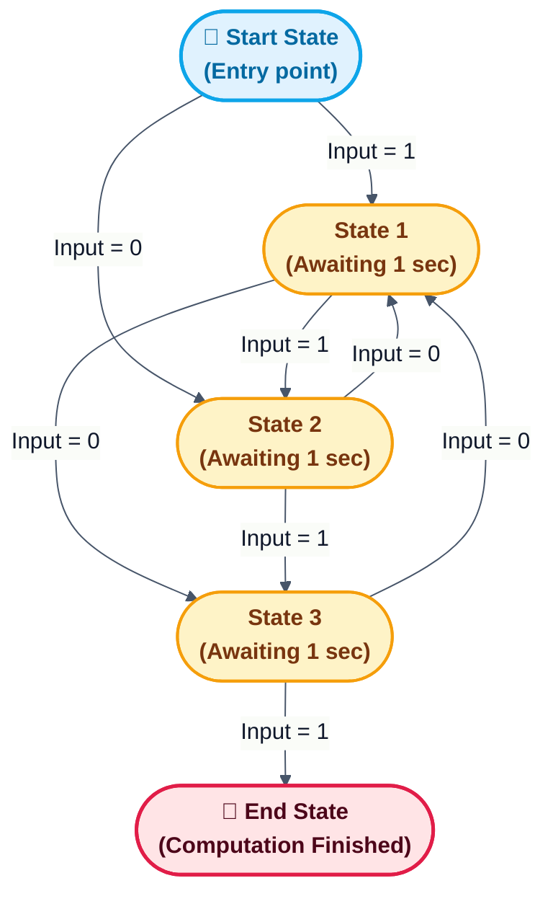
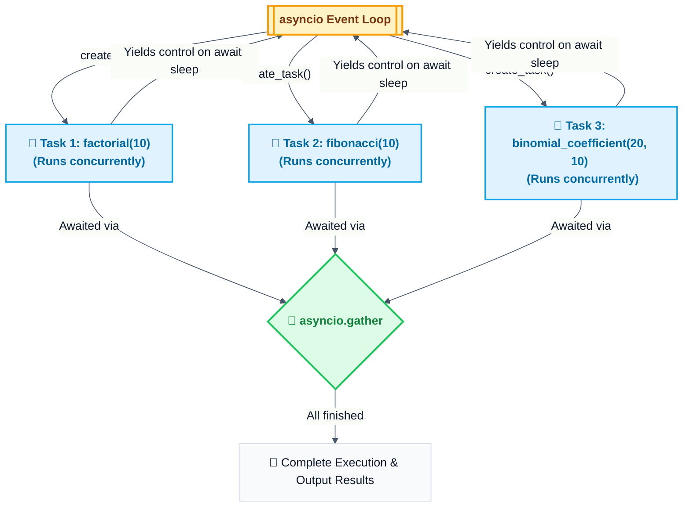
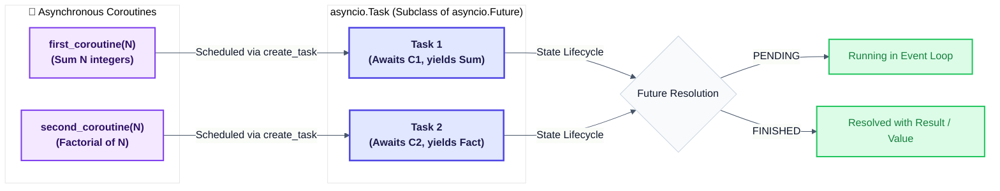

# Chapter 5: Asynchronous Programming

> **Comprehensive Theory and Practical Implementation Guide**
> This chapter focuses on asynchronous programming patterns in Python. It covers the high-level `concurrent.futures` module for executing code using pools of threads or processes, and explores `asyncio` for single-threaded cooperative multitasking, covering event loops, coroutines, task scheduling, and futures coordination.

---

## Table of Contents
1. [Using the `concurrent.futures` Python module](#1-using-the-concurrentfutures-python-module)
2. [Managing the event loop with `asyncio`](#2-managing-the-event-loop-with-asyncio)
3. [Handling coroutines with `asyncio`](#3-handling-coroutines-with-asyncio)
4. [Manipulating tasks with `asyncio`](#4-manipulating-tasks-with-asyncio)
5. [Dealing with `asyncio` and futures](#5-dealing-with-asyncio-and-futures)

---

## 1. Using the `concurrent.futures` Python module

### Getting ready
The `concurrent.futures` module provides a high-level interface for asynchronously executing callables in Python. It abstracts the complexity of managing threads and processes, allowing developers to implement concurrency patterns through simple, intuitive APIs. The module offers two primary executor classes:
- **ThreadPoolExecutor**: Optimized for I/O-bound tasks such as network requests, file operations, or database queries, where tasks spend time waiting for external resources.
- **ProcessPoolExecutor**: Designed for CPU-bound tasks like heavy computations or data processing, as it bypasses Python's Global Interpreter Lock (GIL) by using separate processes.



### How to do it...
To use this module, you start by creating an executor instance. Tasks are then submitted to the executor using the `submit()` method, which returns a Future object representing the pending result. Alternatively, the `map()` method can be used to apply a function across an iterable of inputs. Results can be retrieved by calling `result()` on the Future, or by iterating over futures using `as_completed()` to process them in the order they finish, rather than the order they were submitted.

**Example Implementation:** See [concurrent_futures_pooling.py](Codes/concurrent_futures_pooling.py)

### How it works...
When a task is submitted, the executor places it in an internal queue managed by worker threads or processes. The Future object acts as a placeholder that tracks the task's state—pending, running, completed, or cancelled—and holds the eventual result or exception. The `as_completed()` function yields futures as they complete, enabling responsive handling of results without waiting for all tasks to finish. Executors automatically manage worker lifecycle, resource cleanup, and exception propagation.

### There's more...
- The `max_workers` parameter allows you to control the level of parallelism based on your system's capabilities and task characteristics.
- Exceptions raised within tasks are captured by the Future and can be accessed via the `exception()` method, preventing unhandled errors from crashing the program.
- Tasks can be cancelled using the `cancel()` method, though cancellation only succeeds if the task has not yet started executing.
- For advanced coordination, `concurrent.futures.wait()` supports conditions like `FIRST_COMPLETED` or `ALL_COMPLETED` to synchronize multiple futures.

### See also
- Official Python documentation for `concurrent.futures`
- The `threading` and `multiprocessing` modules for lower-level concurrency control
- The `asyncio` module for single-threaded cooperative concurrency

---

## 2. Managing the event loop with `asyncio`

### Understanding event loops
The event loop is the central execution mechanism in `asyncio`. It operates on a single thread and enables cooperative multitasking by scheduling and running coroutines. The loop monitors I/O operations, timers, and callbacks, and switches between tasks whenever a coroutine reaches an `await` point. Unlike threading, coroutines voluntarily yield control, eliminating race conditions and reducing memory overhead.



### How to do it...
To manage the event loop, the recommended approach is to use `asyncio.run()`, which creates a new loop, executes your main coroutine, and properly shuts down the loop afterward. For more advanced scenarios, you can access the running loop via `asyncio.get_running_loop()` or create a custom loop using `asyncio.new_event_loop()` when you need finer control over lifecycle management.

**Example Implementation:** See [asyncio_event_loop.py](Codes/asyncio_event_loop.py)

### How it works...
Internally, the event loop relies on I/O multiplexing mechanisms provided by the operating system, such as `select`, `poll`, `epoll` (Linux), or `IOCP` (Windows). When a coroutine awaits an I/O operation, the loop registers a callback for that operation and proceeds to execute other ready coroutines. Once the I/O completes, the loop resumes the waiting coroutine exactly where it left off, maintaining seamless asynchronous flow.

### There's more...
- Enabling debug mode provides detailed warnings about slow callbacks, unclosed resources, and common pitfalls during development.
- Third-party event loop implementations like `uvloop` (based on libuv) can significantly improve performance on Unix-like systems.
- The event loop can also integrate signal handlers, subprocesses, and inter-task communication primitives like queues and locks.

### See also
- Official `asyncio` documentation
- PEP 3156: Asynchronous IO Support Rebooted
- Alternative async frameworks like `trio` and `curio`

---

## 3. Handling coroutines with `asyncio`

### Getting ready
Coroutines are defined using the `async def` syntax and return coroutine objects that do not execute until explicitly awaited or scheduled. The `await` keyword serves as a suspension point, allowing the coroutine to yield control back to the event loop while waiting for an operation to complete. `await` can only be used inside functions declared with `async def`.



### How to do it...
To execute a coroutine, you can pass it directly to `asyncio.run()` for simple scripts. For concurrent execution of multiple coroutines, use `asyncio.gather()` to run them simultaneously and collect results, or `asyncio.wait()` for more granular control over completion conditions. Coroutines can also be scheduled as background tasks using `asyncio.create_task()`.

**Example Implementation:** See [asyncio_coroutine.py](Codes/asyncio_coroutine.py)

### How it works...
When a coroutine encounters an `await` expression, its execution pauses at that point, and control returns to the event loop. The loop then proceeds to run other pending coroutines. Once the awaited operation (such as I/O or a timer) completes, the loop resumes the original coroutine with the result of the operation. This cooperative scheduling model enables high concurrency without the complexity of thread synchronization.

### There's more...
- `asyncio.as_completed()` allows you to iterate over coroutines in the order they finish, useful for processing results as soon as they are available.
- Timeouts can be enforced using `asyncio.wait_for()`, which raises a `TimeoutError` if a coroutine does not complete within the specified duration.
- For safe data sharing between coroutines, `asyncio.Queue` provides a FIFO interface designed for asynchronous producers and consumers.

### See also
- Python documentation: Coroutines and Tasks
- `contextlib.asynccontextmanager` for managing asynchronous resources
- `aiohttp` for building asynchronous HTTP clients and servers

---

## 4. Manipulating tasks with `asyncio`

### How to do it...
Tasks are wrappers around coroutines that schedule them for execution on the event loop. You can create a task using `asyncio.create_task()` or `asyncio.ensure_future()`. Tasks support cancellation via the `cancel()` method, and you can attach completion handlers using `add_done_callback()` to trigger custom logic when the task finishes.



**Example Implementation:** See [asyncio_task_manipulation.py](Codes/asyncio_task_manipulation.py)

### How it works...
A Task object implements the Future interface, meaning it supports methods like `result()`, `exception()`, and `done()` to inspect its state. When a task is cancelled, a `CancelledError` is raised inside the associated coroutine. Properly handling this exception is essential to ensure clean resource cleanup and avoid silent failures.

### There's more...
- Starting with Python 3.11, `asyncio.TaskGroup` provides structured concurrency, automatically waiting for all child tasks and propagating exceptions.
- Always use `try/finally` blocks or context managers when working with background tasks to guarantee cleanup even if cancellation occurs.
- Assigning descriptive names to tasks using the `name` parameter improves debugging and logging clarity.

### See also
- `asyncio.Task` class documentation
- Structured concurrency patterns and best practices
- `anyio` library for writing backend-agnostic asynchronous code

---

## 5. Dealing with `asyncio` and futures

### Getting ready
Both Futures and Tasks represent values that will be available at some point in the future. A Future is a low-level primitive for asynchronous result handling, while a Task is a specialized Future that wraps a coroutine. It is important to distinguish between `concurrent.futures.Future` (from the threading/process model) and `asyncio.Future` (from the async model), as they operate in different concurrency contexts.



### How to do it...
To bridge the two models, use `asyncio.wrap_future()` to convert a `concurrent.futures.Future` into an `asyncio.Future`, allowing it to be awaited in async code. Conversely, to run blocking code from within an async context, use `loop.run_in_executor()` to delegate the work to a thread or process pool and receive an awaitable result.

**Example Implementation:** See [asyncio_and_futures.py](Codes/asyncio_and_futures.py)

> **Execution Note:** Since this script accesses `sys.argv`, run it by passing two integer arguments:
> ```bash
> python asyncio_and_futures.py 100 5
> ```

### How it works...
`wrap_future()` creates an asyncio-compatible Future that automatically resolves when the original concurrent.futures Future completes. This enables seamless integration between thread-based or process-based concurrency and asynchronous code. Similarly, `run_in_executor()` schedules a blocking function in a separate thread or process and returns a Future that can be awaited, keeping the main event loop responsive.

### There's more...
- When mixing executors with async code, ensure thread-safety for any shared resources or data structures.
- Python 3.9+ introduces `asyncio.to_thread()`, a convenient way to run a blocking function in a separate thread without manually managing an executor.
- Properly propagate cancellation signals between Futures and Tasks to avoid resource leaks or inconsistent states.

### See also
- Guides on mixing threads and asyncio
- `aiomultiprocess` for asynchronous multiprocessing patterns
- Best practices for combining async/await with traditional concurrency models
