# Chapter 3: Process-Based Parallelism (With Mermaid Diagrams)

## 3.1 Understanding Python's multiprocessing Module

The `multiprocessing` module implements shared memory programming paradigm, allowing processes to run in parallel on multiple CPU cores, bypassing Python's GIL limitations.

**Basic Workflow:**

```mermaid
flowchart TD
    subgraph Main["Main (Parent Process)"]
        A[1. Define Process Object] --> B[2. start() Method]
        B --> C[3. join() Method]
    end
    
    C --> D[Create Child Processes]
    
    subgraph Children["Child Processes"]
        E[Child Process 1<br/>Independent Memory Space]
        F[Child Process 2<br/>Independent Memory Space]
        G[Child Process N<br/>Independent Memory Space]
    end
    
    D --> E
    D --> F
    D --> G
    
    E --> H[Execute Target Function]
    F --> H
    G --> H
```

**Key Advantages over Threading:**

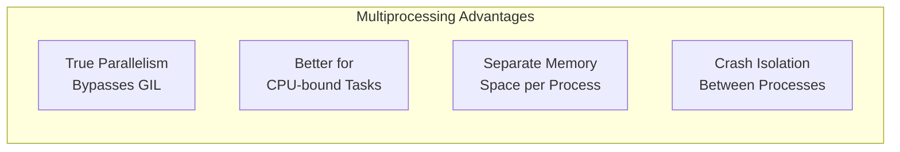

---

## 3.2 Spawning a Process

**Process Lifecycle:**

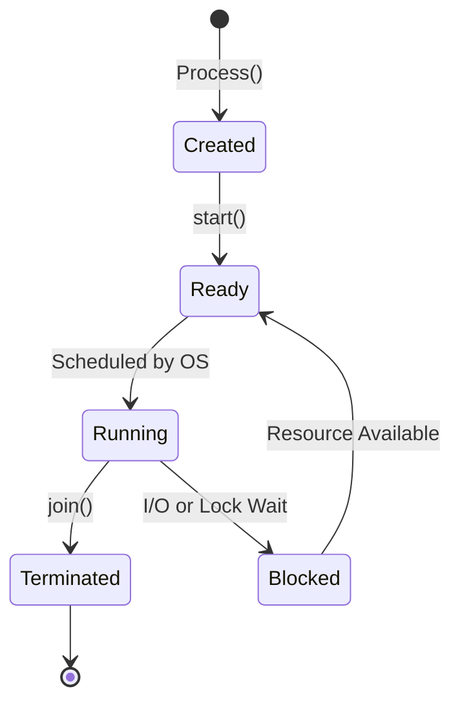

**Basic Process Creation:**

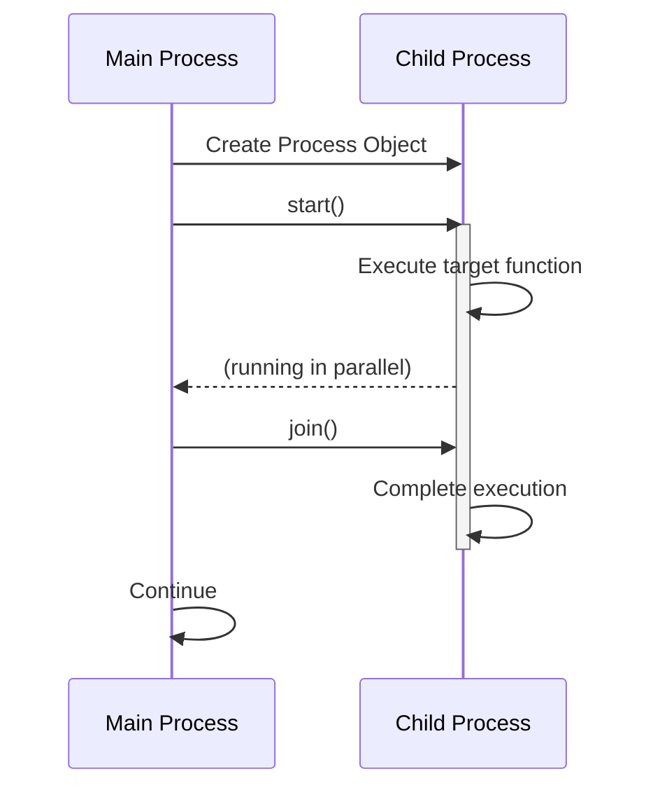

**Code Example:**
```python
import multiprocessing

def myFunc(i):
    print(f'calling myFunc from process N°: {i}')
    for j in range(i):
        print(f'output from myFunc is : {j}')

if __name__ == '__main__':
    for i in range(6):
        process = multiprocessing.Process(target=myFunc, args=(i,))
        process.start()
        process.join()
```

---

## 3.3 Naming a Process

```mermaid
flowchart LR
    subgraph ProcessIdentification["Process Identification"]
        A[multiprocessing.current_process()] --> B[.name]
        A --> C[.pid]
        A --> D[.ident]
    end
    
    subgraph ProcessTypes["Process Types"]
        E[MainProcess] --> F["multiprocessing.process._MainProcess"]
        G[Child Process] --> H["multiprocessing.process.Process"]
    end
```

**Code Example:**
```python
import multiprocessing
import time

def myFunc():
    name = multiprocessing.current_process().name
    print(f"Starting process name = {name}")
    time.sleep(3)
    print(f"Exiting process name = {name}")

if __name__ == '__main__':
    process_with_name = multiprocessing.Process(
        name='myFunc process', 
        target=myFunc
    )
    process_with_default_name = multiprocessing.Process(
        target=myFunc
    )
    
    process_with_name.start()
    process_with_default_name.start()
    
    process_with_name.join()
    process_with_default_name.join()
```

---

## 3.4 Running Processes in the Background (Daemon Processes)

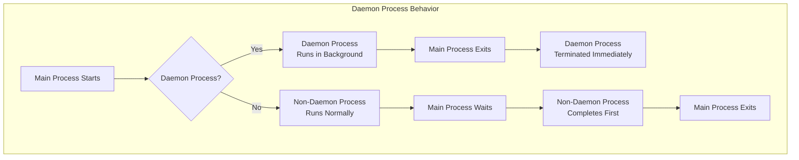

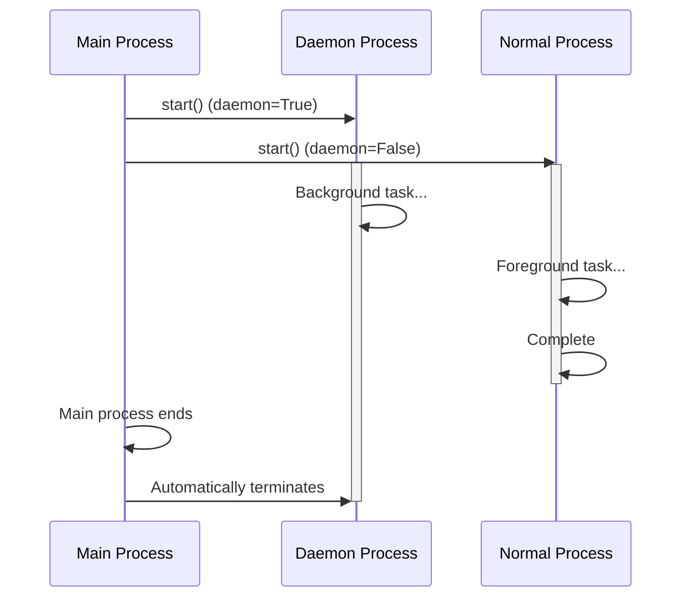

**Code Example:**
```python
import multiprocessing
import time

def foo():
    name = multiprocessing.current_process().name
    print(f"Starting {name}")
    
    if name == 'background_process':
        for i in range(5):
            print(f'---> {i}')
            time.sleep(1)
    else:
        for i in range(5, 10):
            print(f'---> {i}')
            time.sleep(1)
    
    print(f"Exiting {name}")

if __name__ == '__main__':
    background_process = multiprocessing.Process(
        name='background_process', 
        target=foo
    )
    background_process.daemon = True
    
    NO_background_process = multiprocessing.Process(
        name='NO_background_process', 
        target=foo
    )
    NO_background_process.daemon = False
    
    background_process.start()
    NO_background_process.start()
```

---

## 3.5 Killing a Process

```mermaid
flowchart LR
    subgraph ProcessTermination["Process Termination Methods"]
        A[Running Process] --> B{Termination Method}
        B -->|terminate()| C[SIGTERM Signal<br/>Graceful Termination]
        B -->|kill()| D[SIGKILL Signal<br/>Forceful Termination]
        B -->|close()| E[Release Resources<br/>Without Termination]
    end
    
    subgraph ExitCodes["Exit Code Values"]
        F[0] --> G[No Error<br/>Normal Termination]
        H[>0] --> I[Error<br/>Process Exited with Code]
        J[<0] --> K[Killed by Signal<br/>-1 × exitcode]
    end
```

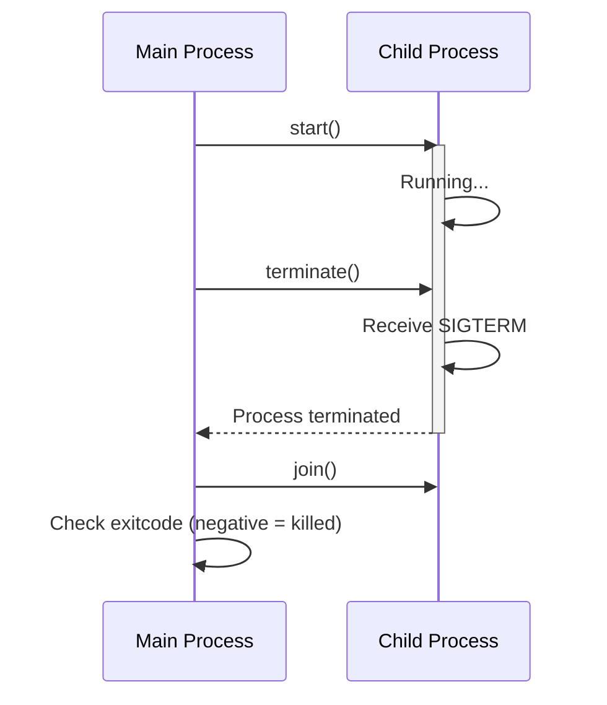

**Code Example:**
```python
import multiprocessing
import time

def foo():
    print('Starting function')
    for i in range(10):
        print(f'-> {i}')
        time.sleep(1)
    print('Finished function')

if __name__ == '__main__':
    p = multiprocessing.Process(target=foo)
    print('Process before execution:', p, p.is_alive())
    
    p.start()
    print('Process running:', p, p.is_alive())
    
    p.terminate()  # Immediately kill the process
    print('Process terminated:', p, p.is_alive())
    
    p.join()
    print('Process joined:', p, p.is_alive())
    print('Process exit code:', p.exitcode)
```

---

## 3.6 Defining Processes in a Subclass

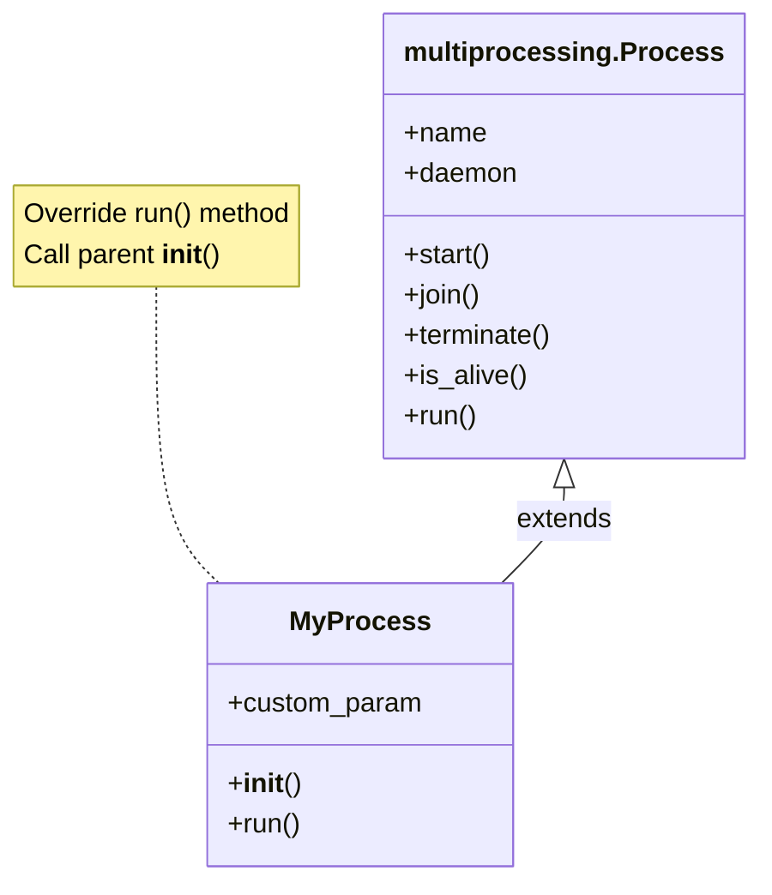

```mermaid
flowchart TD
    subgraph SubclassWorkflow["Subclass Process Workflow"]
        A[Create MyProcess Instance] --> B[Call start()]
        B --> C[Parent start() Method]
        C --> D[Invoke run() Method]
        D --> E[Execute Custom Logic]
        E --> F[Process Completes]
    end
```

**Code Example:**
```python
import multiprocessing

class MyProcess(multiprocessing.Process):
    def run(self):
        print(f'called run method by {self.name}')
        return

if __name__ == '__main__':
    processes = []
    for i in range(10):
        p = MyProcess()
        processes.append(p)
        p.start()
    
    for p in processes:
        p.join()
```

---

## 3.7 Using Queue to Exchange Data

```mermaid
flowchart LR
    subgraph QueueCommunication["Queue-Based Communication"]
        P1[Producer Process 1] -->|put()| Q[multiprocessing.Queue<br/>Thread-Safe FIFO]
        P2[Producer Process 2] -->|put()| Q
        Q -->|get()| C1[Consumer Process 1]
        Q -->|get()| C2[Consumer Process 2]
    end
```

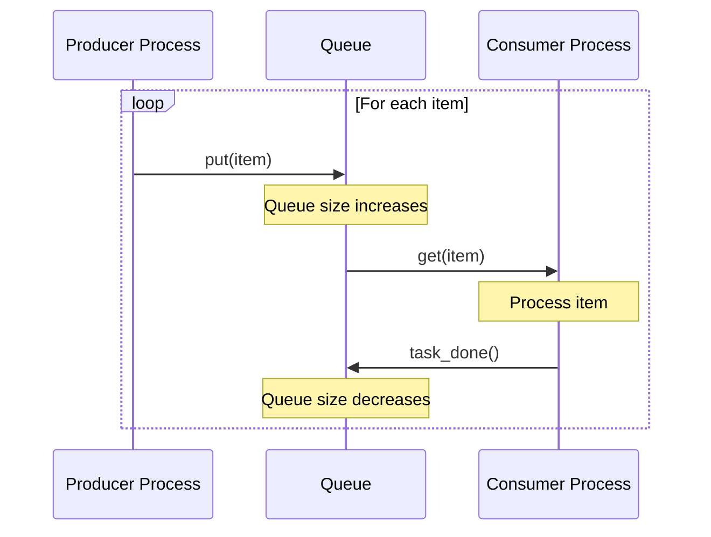

**Queue Methods:**

```mermaid
graph LR
    subgraph QueueMethods["Queue Methods"]
        A[put()] --> A1["Add item<br/>Block if full"]
        B[get()] --> B1["Remove & return<br/>Block if empty"]
        C[task_done()] --> C1["Mark item processed"]
        D[join()] --> D1["Wait until empty"]
        E[qsize()] --> E1["Get approximate size"]
    end
```

**Code Example:**
```python
import multiprocessing
import random
import time

class Producer(multiprocessing.Process):
    def __init__(self, queue):
        multiprocessing.Process.__init__(self)
        self.queue = queue
    
    def run(self):
        for i in range(10):
            item = random.randint(0, 256)
            self.queue.put(item)
            print(f"Process Producer : item {item} appended")
            time.sleep(1)

class Consumer(multiprocessing.Process):
    def __init__(self, queue):
        multiprocessing.Process.__init__(self)
        self.queue = queue
    
    def run(self):
        while True:
            if self.queue.empty():
                print("the queue is empty")
                break
            else:
                item = self.queue.get()
                print(f"Process Consumer : item {item} popped")
                time.sleep(1)

if __name__ == '__main__':
    queue = multiprocessing.Queue()
    process_producer = Producer(queue)
    process_consumer = Consumer(queue)
    
    process_producer.start()
    process_consumer.start()
    
    process_producer.join()
    process_consumer.join()
```

---

## 3.8 Using Pipes to Exchange Objects

```mermaid
flowchart LR
    subgraph PipeArchitecture["Pipe Architecture"]
        direction LR
        P1[Process 1] -->|send()| C1[conn1<br/>Pipe End]
        C1 <-->|Pipe<br/>Bidirectional| C2[conn2<br/>Pipe End]
        C2 -->|recv()| P2[Process 2]
    end
```

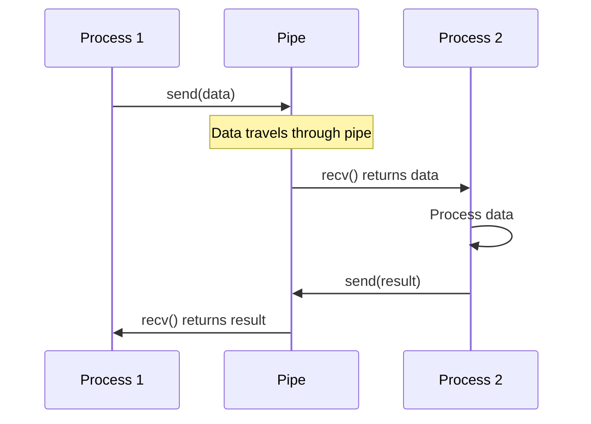

**Pipe Types:**

```mermaid
flowchart TD
    A[multiprocessing.Pipe()] --> B{duplex parameter}
    B -->|duplex=True| C[Bidirectional Pipe<br/>Both ends can send/receive]
    B -->|duplex=False| D[Unidirectional Pipe<br/>conn1: receive only<br/>conn2: send only]
```

**Code Example:**
```python
import multiprocessing

def create_items(pipe):
    output_pipe, _ = pipe
    for item in range(10):
        output_pipe.send(item)
    output_pipe.close()

def multiply_items(pipe_1, pipe_2):
    close, input_pipe = pipe_1
    close.close()
    output_pipe, _ = pipe_2
    
    try:
        while True:
            item = input_pipe.recv()
            output_pipe.send(item * item)
    except EOFError:
        output_pipe.close()

if __name__ == '__main__':
    pipe_1 = multiprocessing.Pipe(True)
    process_pipe_1 = multiprocessing.Process(
        target=create_items, 
        args=(pipe_1,)
    )
    process_pipe_1.start()
    
    pipe_2 = multiprocessing.Pipe(True)
    process_pipe_2 = multiprocessing.Process(
        target=multiply_items, 
        args=(pipe_1, pipe_2,)
    )
    process_pipe_2.start()
    
    pipe_1[0].close()
    pipe_2[0].close()
    
    try:
        while True:
            print(pipe_2[1].recv())
    except EOFError:
        print("End")
```

**Pipe vs. Queue:**

```mermaid
graph TD
    subgraph Comparison["Pipe vs Queue"]
        A[Pipe] --> A1[2 connection points only]
        A --> A2[Faster performance]
        A --> A3[Simple two-way communication]
        
        B[Queue] --> B1[Multiple points]
        B --> B2[Slower (built on Pipe)]
        B --> B3[Multiple producers/consumers]
    end
```

---

## 3.9 Synchronizing Processes

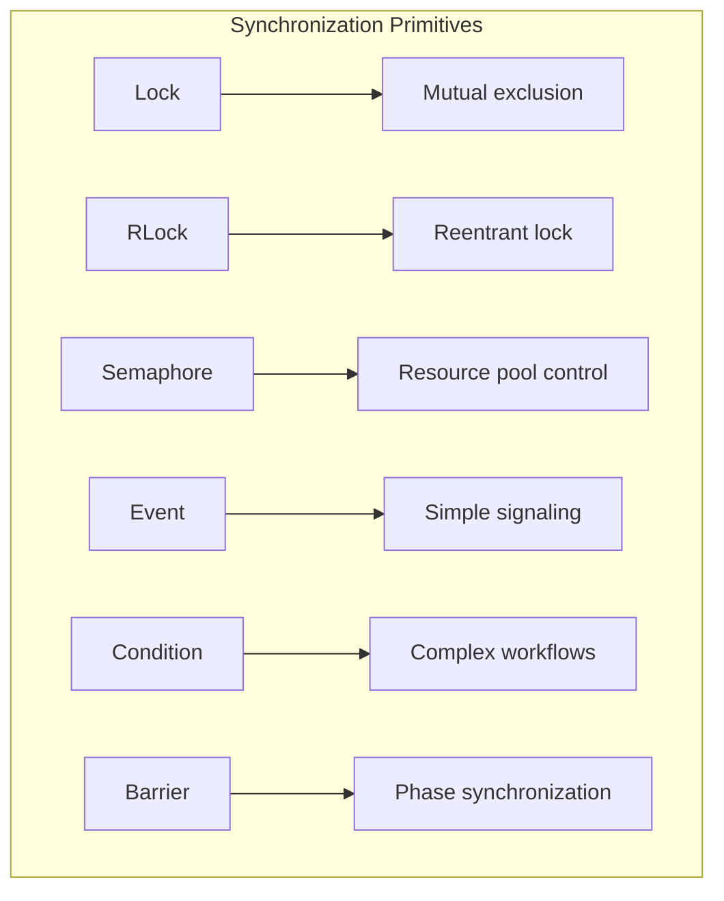

### Barrier Example

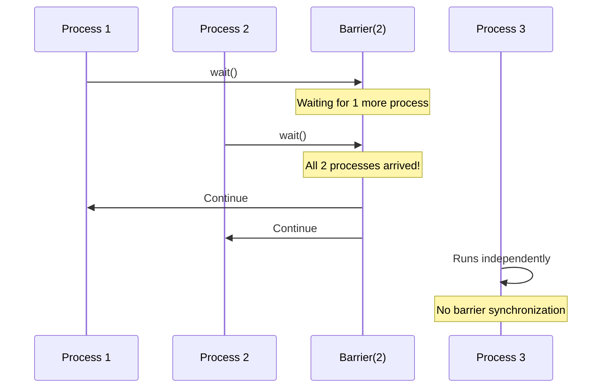

```mermaid
flowchart LR
    subgraph BarrierVisualization["Barrier Synchronization"]
        direction TB
        P1[Process 1] --> B{Barrier}
        P2[Process 2] --> B
        P3[Process 3] --> B
        P4[Process 4] --> B
        B -- "All 4 arrived" --> C[Continue Execution]
    end
```

**Code Example:**
```python
import multiprocessing
from multiprocessing import Barrier, Lock, Process
from time import time
from datetime import datetime

def test_with_barrier(synchronizer, serializer):
    name = multiprocessing.current_process().name
    synchronizer.wait()
    now = time()
    
    with serializer:
        print(f"process {name} ---> {datetime.fromtimestamp(now)}")

def test_without_barrier():
    name = multiprocessing.current_process().name
    now = time()
    print(f"process {name} ---> {datetime.fromtimestamp(now)}")

if __name__ == '__main__':
    synchronizer = Barrier(2)  # Wait for 2 processes
    serializer = Lock()
    
    Process(name='p1 - test_with_barrier', 
            target=test_with_barrier, 
            args=(synchronizer, serializer)).start()
    
    Process(name='p2 - test_with_barrier', 
            target=test_with_barrier, 
            args=(synchronizer, serializer)).start()
    
    Process(name='p3 - test_without_barrier', 
            target=test_without_barrier).start()
    
    Process(name='p4 - test_without_barrier', 
            target=test_without_barrier).start()
```

---

## 3.10 Managing State Between Processes

```mermaid
flowchart LR
    subgraph SharedMemory["Shared Memory Types"]
        A[Value] --> A1[Single value<br/>Type codes: 'i', 'f', 'd']
        B[Array] --> B1[Sequence of values<br/>Fixed length]
    end
    
    subgraph SharedMemoryAccess["Memory Access Pattern"]
        C[Parent Process] -->|Creates| D[Shared Memory]
        D -->|Read/Write| E[Child Process 1]
        D -->|Read/Write| F[Child Process 2]
    end
```

**Shared Memory Type Codes:**

```mermaid
graph LR
    subgraph TypeCodes["Type Codes"]
        A['i'] --> A1[signed int]
        B['f'] --> B1[float]
        C['d'] --> C2[double]
        D['c'] --> D1[char]
        E['b'] --> E1[signed char]
    end
```

**Code Example:**
```python
import multiprocessing

def worker(num, arr):
    num.value = 100
    for i in range(len(arr)):
        arr[i] = arr[i] * 2

if __name__ == '__main__':
    shared_number = multiprocessing.Value('i', 0)
    shared_array = multiprocessing.Array('i', range(5))
    
    p = multiprocessing.Process(target=worker, args=(shared_number, shared_array))
    p.start()
    p.join()
    
    print(f"Shared number: {shared_number.value}")
    print(f"Shared array: {list(shared_array)}")
```

---

## 3.11 Using a Process Pool

**Pool Architecture:**

```mermaid
flowchart TD
    subgraph PoolArchitecture["Process Pool Architecture"]
        A[Main Process] --> B[Pool Manager]
        
        B --> C[Task Queue]
        
        C --> D1[Worker 1]
        C --> D2[Worker 2]
        C --> D3[Worker 3]
        C --> D4[Worker N]
        
        D1 --> E1[Result 1]
        D2 --> E2[Result 2]
        D3 --> E3[Result 3]
        D4 --> E4[Result N]
        
        E1 --> F[Result Collection]
        E2 --> F
        E3 --> F
        E4 --> F
        
        F --> G[Main Process]
    end
```

**Pool Methods:**

```mermaid
flowchart LR
    subgraph PoolMethods["Pool Methods"]
        A[map()] --> A1[Blocks, returns list]
        B[map_async()] --> B1[Non-blocking, returns AsyncResult]
        C[apply()] --> C1[Single task, blocks]
        D[apply_async()] --> D1[Single task, non-blocking]
        E[starmap()] --> E1[Multiple arguments]
    end
```

**AsyncResult States:**

```mermaid
stateDiagram-v2
    [*] --> Pending: submit task
    Pending --> Ready: task complete
    Pending --> Error: exception raised
    Ready --> [*]: get() returns result
    Error --> [*]: get() raises exception
```

**Code Example:**
```python
import multiprocessing

def function_square(data):
    return data * data

if __name__ == '__main__':
    inputs = list(range(0, 100))
    
    # Create a pool of 4 processes
    pool = multiprocessing.Pool(processes=4)
    
    # Map function to inputs (parallel execution)
    pool_outputs = pool.map(function_square, inputs)
    
    pool.close()
    pool.join()
    
    print('Pool:', pool_outputs)
```

**Pool with Context Manager:**
```python
from multiprocessing import Pool

def f(x):
    return x + 10

if __name__ == '__main__':
    with Pool(processes=5) as p:
        result = p.map(f, [1, 2, 3, 5, 6, 7, 8, 9, 10])
        print(result)
```

---

## Chapter Summary

### Process vs. Thread Comparison

```mermaid
graph TD
    subgraph ProcessVsThread["Process vs Thread"]
        P[Process] --> P1[Separate memory space]
        P --> P2[Expensive creation]
        P --> P3[IPC required]
        P --> P4[Crash isolated]
        P --> P5[True parallelism]
        
        T[Thread] --> T1[Shared memory space]
        T --> T2[Cheap creation]
        T --> T3[Direct communication]
        T --> T4[Crash affects all]
        T --> T5[GIL limited]
    end
```

### IPC Methods Comparison

```mermaid
graph TD
    subgraph IPCMethods["IPC Methods"]
        A[Queue] --> A1[Multiple producers/consumers]
        A --> A2[Moderate speed]
        A --> A3[Low complexity]
        
        B[Pipe] --> B1[Two-way only]
        B --> B2[Fast speed]
        B --> B3[Medium complexity]
        
        C[Shared Memory] --> C1[Multiple access]
        C --> C2[Very fast]
        C --> C3[High complexity]
    end
```

### Best Practices Flowchart

```mermaid
flowchart TD
    A[Start] --> B{Task Type?}
    
    B -->|CPU-bound| C[Use multiprocessing]
    B -->|I/O-bound| D[Consider threading/asyncio]
    
    C --> E{Communication Pattern?}
    
    E -->|Simple data passing| F[Use Queue]
    E -->|Two-way only| G[Use Pipe]
    E -->|Large data| H[Use Shared Memory]
    E -->|Many tasks| I[Use Pool]
    
    F --> J[Always join processes]
    G --> J
    H --> J
    I --> J
    
    J --> K[Done]
```

