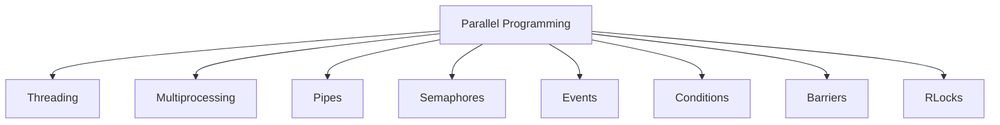
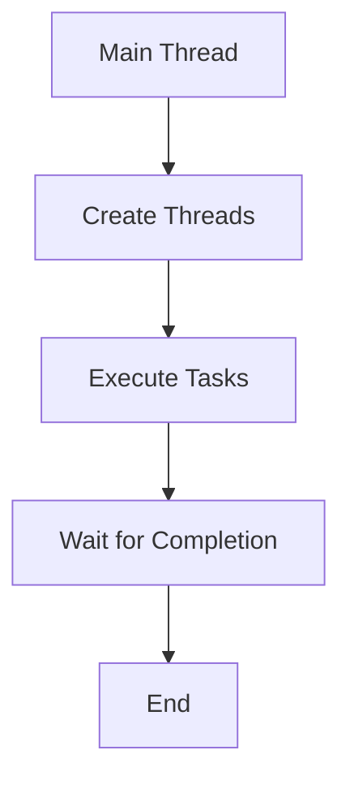
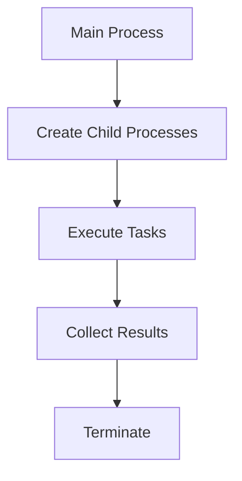
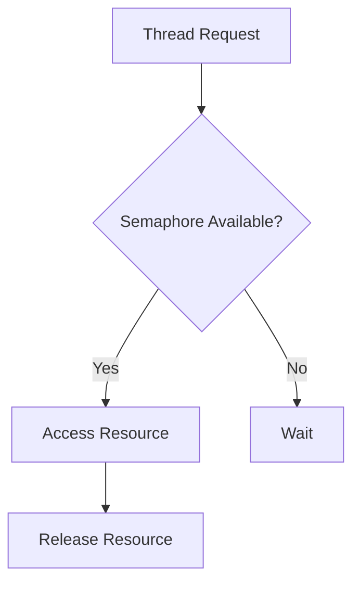
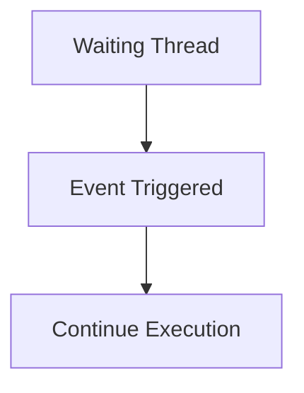
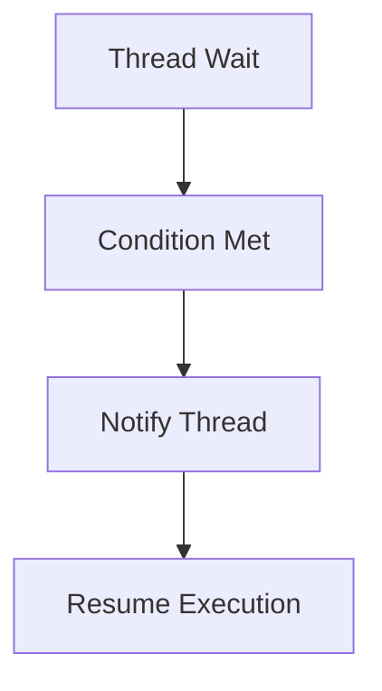
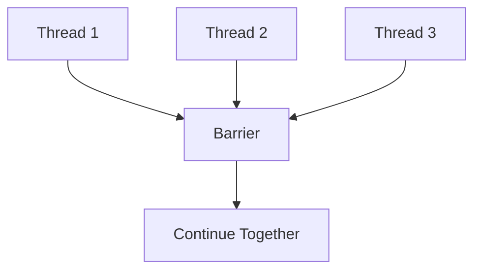
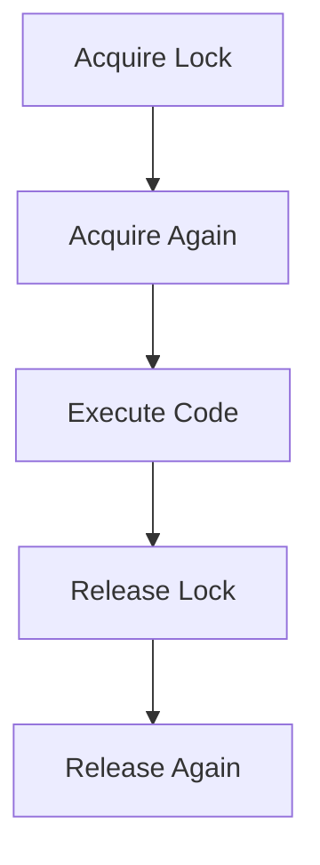
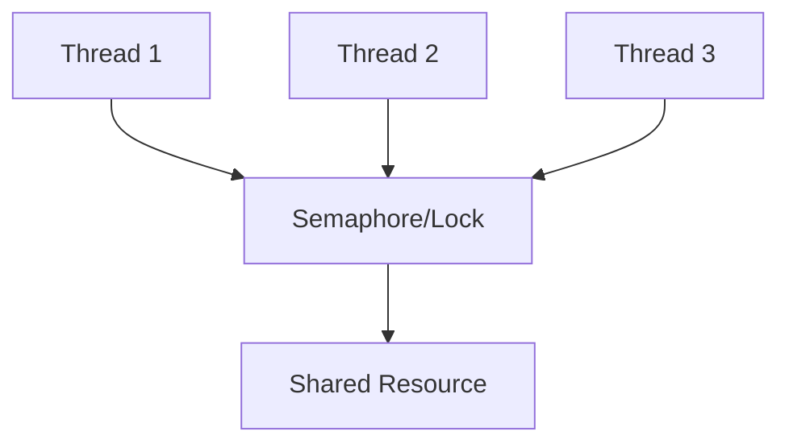

# Chapter 05 – Synchronization and Communication in Parallel Programming

## Chapter Overview

---

# 1. Threading

### Definition

Threading allows multiple threads to execute within a single process.

### Flow

### Advantages

- Lightweight
- Shared memory
- Fast context switching

### Disadvantages

- Race conditions
- Synchronization issues

---

# 2. Multiprocessing

### Definition

Multiprocessing uses separate processes to achieve true parallel execution.

### Flow

### Advantages

- Utilizes multiple CPU cores
- Better performance for CPU-bound tasks

### Disadvantages

- Higher memory usage
- Inter-process communication required

---

# 3. Pipes

### Definition

Pipes provide communication between processes.

### Flow

### Advantages

- Simple IPC mechanism
- Fast communication

### Disadvantages

- Limited flexibility
- Mainly for related processes

---

# 4. Semaphore

### Definition

A semaphore controls access to shared resources.

### Flow

### Advantages

- Prevents resource conflicts
- Controls concurrent access

### Disadvantages

- Deadlock possibility
- Difficult debugging

---

# 5. Event

### Definition

An Event is used for signaling between threads.

### Flow

### Advantages

- Easy thread coordination
- Clear signaling mechanism

### Disadvantages

- Limited synchronization capability

---

# 6. Condition

### Definition

A Condition allows threads to wait until a specific condition becomes true.

### Flow

### Advantages

- Efficient waiting
- Supports producer-consumer pattern

### Disadvantages

- Complex implementation

---

# 7. Barrier

### Definition

A Barrier blocks threads until all participating threads reach the same point.

### Flow

### Advantages

- Synchronizes groups of threads
- Useful in parallel algorithms

### Disadvantages

- One slow thread delays all others

---

# 8. RLock

### Definition

An RLock (Reentrant Lock) allows the same thread to acquire a lock multiple times.

### Flow

### Advantages

- Prevents self-deadlock
- Useful for nested locking

### Disadvantages

- Slightly higher overhead

---

# Synchronization Architecture

---

# Threading vs Multiprocessing

| Feature | Threading | Multiprocessing |
|----------|-----------|----------------|
| Memory | Shared | Separate |
| Speed | Faster Creation | Slower Creation |
| CPU Usage | Limited by GIL | True Parallelism |
| Communication | Easy | Complex |
| Best For | I/O Tasks | CPU Tasks |

---

# Final Summary

- Threading enables lightweight concurrency.
- Multiprocessing provides true parallel execution.
- Pipes support inter-process communication.
- Semaphores control resource access.
- Events provide thread signaling.
- Conditions enable waiting for specific states.
- Barriers synchronize multiple threads.
- RLocks allow repeated locking by the same thread.
- Synchronization mechanisms prevent race conditions and improve program reliability.
