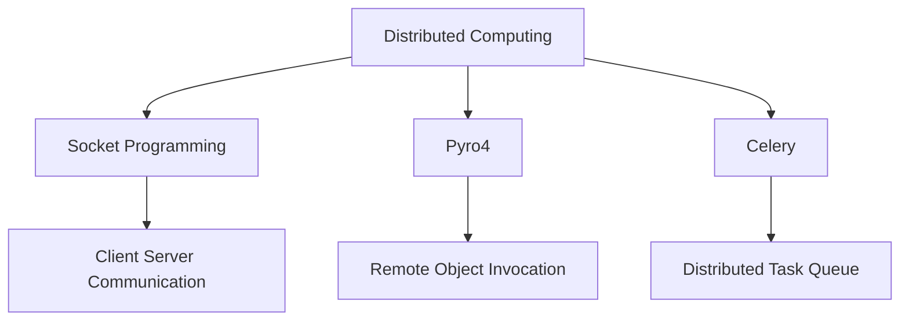
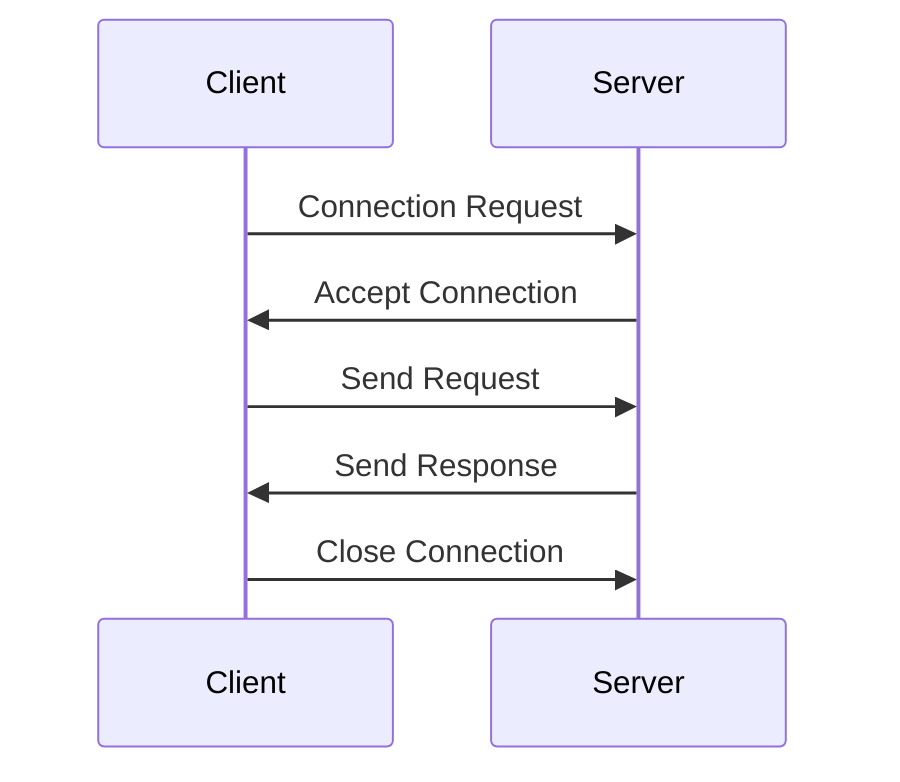
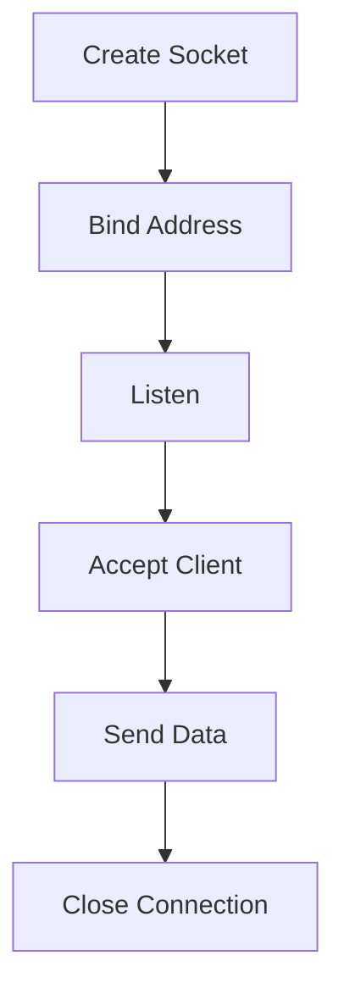
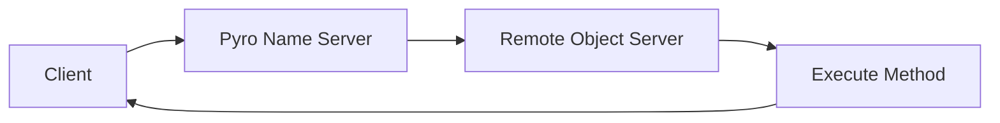
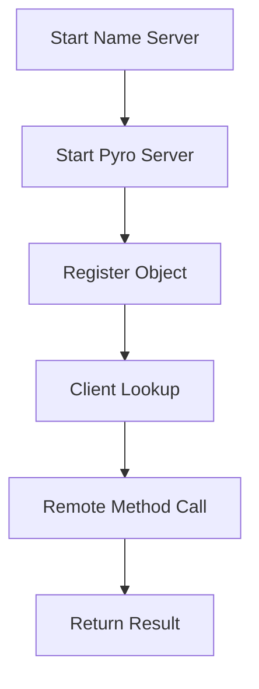
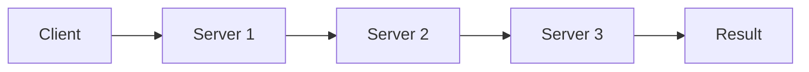
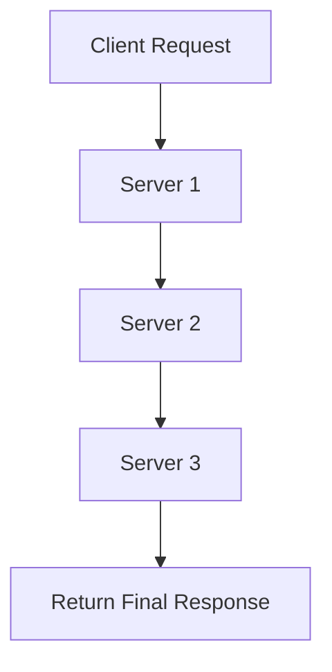
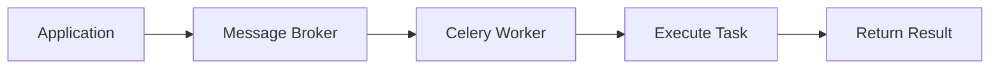
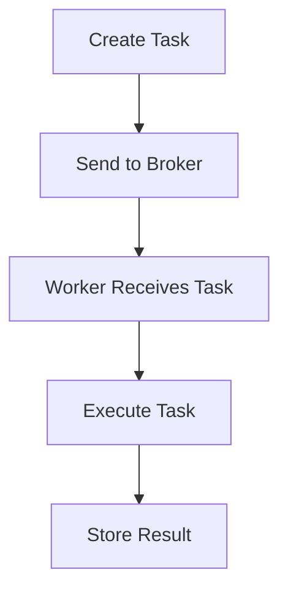
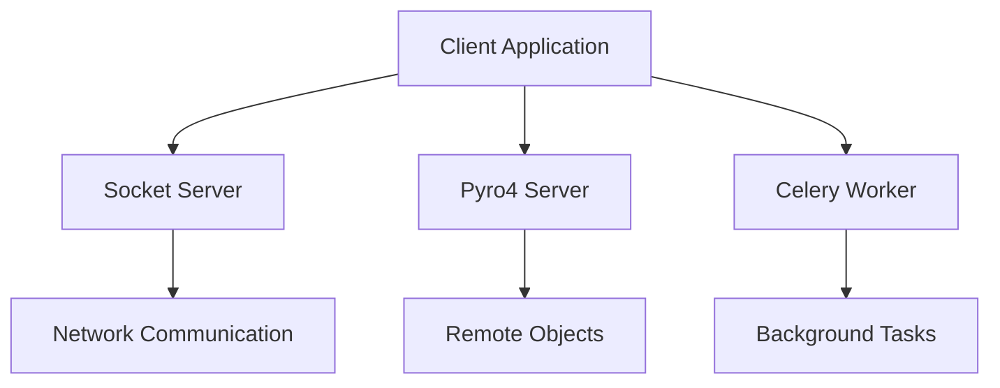

# Chapter 06 – Distributed Computing and Network Communication in Python
## Chapter Overview

This chapter introduces different approaches for distributed computing and network communication in Python.

The chapter demonstrates:

- Socket Programming
- Client-Server Communication
- Remote Procedure Calls using Pyro4
- Distributed Task Execution using Celery

---

## Chapter Architecture



---

## Project Structure

```text
Chapter06/
│
├── Celery/
├── Pyro4/
└── Socket/
```

---

# 1. Socket Programming

## Definition

Socket programming enables communication between two computers or processes over a network.

One program acts as a Server and another acts as a Client.

---

## Communication Flow



---

## Working Process



### Advantages

- Easy network communication
- Supports distributed applications
- Fast data exchange

### Disadvantages

- Connection management required
- Error handling can be complex

---

# 2. Pyro4 (Python Remote Objects)

## Definition

Pyro4 allows a Python program to call methods on an object running in another process or machine.

It works similarly to calling local functions, but the execution happens remotely.

---

## Pyro4 Architecture



---

## First Example

### Objective

Create a remote server that provides a welcome message and allow clients to invoke it remotely.

### Workflow



### Advantages

- Simple remote communication
- Object-oriented design
- Easy implementation

### Disadvantages

- Requires Name Server
- Network dependency

---

# 3. Chain Topology using Pyro4

## Definition

Multiple servers are connected in sequence where requests travel through a chain of remote objects.

---

## Architecture



---

## Workflow



### Applications

- Distributed Systems
- Service Chaining
- Microservices Architecture
- Multi-layer Processing

---

# 4. Celery Distributed Tasks

## Definition

Celery is a distributed task queue used for executing background jobs asynchronously.

Instead of waiting for a task to complete, the task is sent to a worker process.

---

## Celery Architecture



---

## Task Execution Flow



### Advantages

- Background processing
- Scalable architecture
- Distributed execution
- Improved performance

### Disadvantages

- Additional setup required
- Requires broker service

---

# Comparison

| Feature | Socket | Pyro4 | Celery |
|----------|---------|--------|---------|
| Communication | Low-Level | Remote Objects | Task Queue |
| Complexity | High | Medium | Medium |
| Scalability | Moderate | Good | Excellent |
| Asynchronous | Limited | Possible | Yes |
| Distributed Support | Yes | Yes | Yes |
| Best Use Case | Networking | Remote Method Calls | Background Tasks |

---

# Distributed Computing Model



---

# Learning Outcomes

After completing this chapter, you will be able to:

- Understand distributed computing concepts.
- Build client-server applications using sockets.
- Implement remote method invocation using Pyro4.
- Create chain topology architectures.
- Execute asynchronous tasks using Celery.
- Understand message brokers and workers.
- Design scalable distributed systems.

---

# Requirements

```bash
pip install Pyro4
pip install celery
```

---

# Running Examples

## Socket Server

```bash
python server.py
```

## Socket Client

```bash
python client.py
```

## Pyro4 Name Server

```bash
python -m Pyro4.naming
```

## Pyro4 Server

```bash
python pyro_server.py
```

## Pyro4 Client

```bash
python pyro_client.py
```

## Celery Worker

```bash
celery -A addTask worker --loglevel=info
```

## Execute Task

```bash
python addTask_main.py
```

---

# Final Summary

- Socket Programming provides the foundation of network communication.
- Pyro4 enables remote method invocation and distributed object-oriented programming.
- Celery simplifies asynchronous and distributed task execution.
- Distributed computing improves scalability, responsiveness, and performance.
- These technologies form the basis of modern distributed systems and network applications.# Chapter 06 – Distributed Computing and Network Communication in Python

## Chapter Overview

This chapter introduces different approaches for distributed computing and network communication in Python.

The chapter demonstrates:

- Socket Programming
- Client-Server Communication
- Remote Procedure Calls using Pyro4
- Distributed Task Execution using Celery

---

## Chapter Architecture


---

## Project Structure

```text
Chapter06/
│
├── Celery/
├── Pyro4/
└── Socket/
```

---

# 1. Socket Programming

## Definition

Socket programming enables communication between two computers or processes over a network.

One program acts as a Server and another acts as a Client.

---

## Communication Flow


---

## Working Process


### Advantages

- Easy network communication
- Supports distributed applications
- Fast data exchange

### Disadvantages

- Connection management required
- Error handling can be complex

---

# 2. Pyro4 (Python Remote Objects)

## Definition

Pyro4 allows a Python program to call methods on an object running in another process or machine.

It works similarly to calling local functions, but the execution happens remotely.

---

## Pyro4 Architecture


---

## First Example

### Objective

Create a remote server that provides a welcome message and allow clients to invoke it remotely.

### Workflow


### Advantages

- Simple remote communication
- Object-oriented design
- Easy implementation

### Disadvantages

- Requires Name Server
- Network dependency

---

# 3. Chain Topology using Pyro4

## Definition

Multiple servers are connected in sequence where requests travel through a chain of remote objects.

---

## Architecture


---

## Workflow


### Applications

- Distributed Systems
- Service Chaining
- Microservices Architecture
- Multi-layer Processing

---

# 4. Celery Distributed Tasks

## Definition

Celery is a distributed task queue used for executing background jobs asynchronously.

Instead of waiting for a task to complete, the task is sent to a worker process.

---

## Celery Architecture


---

## Task Execution Flow


### Advantages

- Background processing
- Scalable architecture
- Distributed execution
- Improved performance

### Disadvantages

- Additional setup required
- Requires broker service

---

# Comparison

| Feature | Socket | Pyro4 | Celery |
|----------|---------|--------|---------|
| Communication | Low-Level | Remote Objects | Task Queue |
| Complexity | High | Medium | Medium |
| Scalability | Moderate | Good | Excellent |
| Asynchronous | Limited | Possible | Yes |
| Distributed Support | Yes | Yes | Yes |
| Best Use Case | Networking | Remote Method Calls | Background Tasks |

---

# Distributed Computing Model


---

# Learning Outcomes

After completing this chapter, you will be able to:

- Understand distributed computing concepts.
- Build client-server applications using sockets.
- Implement remote method invocation using Pyro4.
- Create chain topology architectures.
- Execute asynchronous tasks using Celery.
- Understand message brokers and workers.
- Design scalable distributed systems.

---

# Requirements

```bash
pip install Pyro4
pip install celery
```

---

# Running Examples

## Socket Server

```bash
python server.py
```

## Socket Client

```bash
python client.py
```

## Pyro4 Name Server

```bash
python -m Pyro4.naming
```

## Pyro4 Server

```bash
python pyro_server.py
```

## Pyro4 Client

```bash
python pyro_client.py
```

## Celery Worker

```bash
celery -A addTask worker --loglevel=info
```

## Execute Task

```bash
python addTask_main.py
```

---

# Final Summary

- Socket Programming provides the foundation of network communication.
- Pyro4 enables remote method invocation and distributed object-oriented programming.
- Celery simplifies asynchronous and distributed task execution.
- Distributed computing improves scalability, responsiveness, and performance.
- These technologies form the basis of modern distributed systems and network applications.
