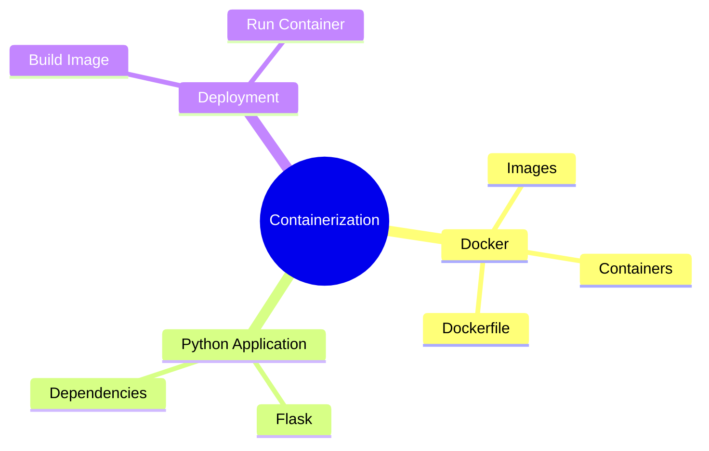
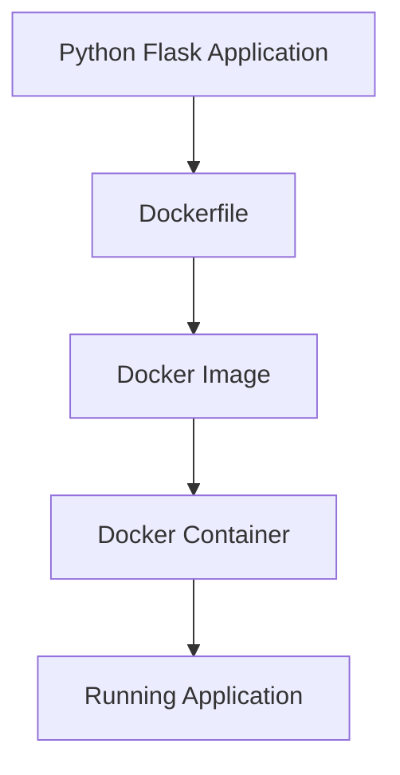
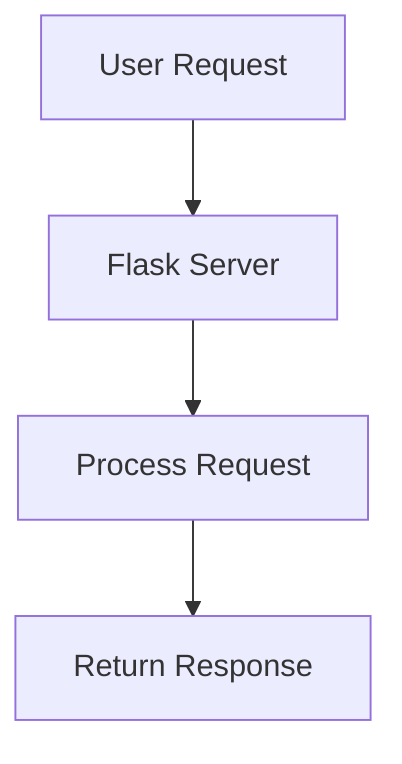
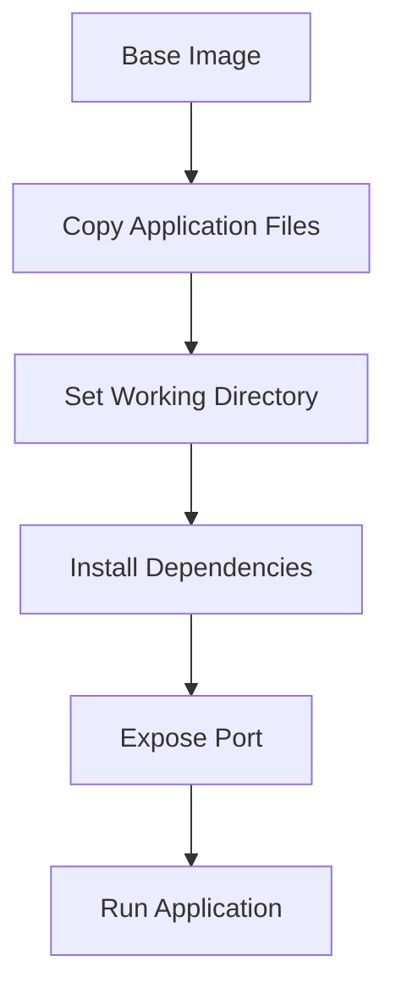
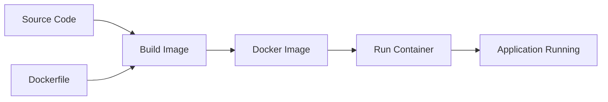
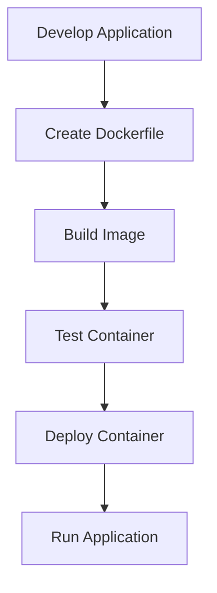

# Chapter 07
## Containerization of a Python Application using Docker

---

## Introduction

Containerization is a software deployment approach that packages an application along with all its dependencies, libraries, and configurations into a single container.

Docker is one of the most widely used containerization platforms that enables applications to run consistently across different environments.

This chapter demonstrates how to containerize a simple Python Flask application using Docker.

---

## Topic Overview



---

## Project Structure

```text
Chapter07/
│
├── README.md
│
└── codes/
    └── how to containerize a Python application/
        ├── Dockerfile
        ├── dockerize.py
        └── requirements.txt
```

---

## Docker Architecture



---

## Application Overview

### Flask Application

The project contains a simple Flask web application.

```python
@app.route("/")
def hello():
    return "Hello World!"
```

When a user accesses the root URL, the application returns:

```text
Hello World!
```

---

## Application Workflow



---

## Dockerfile

### Purpose

A Dockerfile contains instructions used to create a Docker image.

### Dockerfile Workflow



---

## Dockerfile Explanation

### Base Image

```dockerfile
FROM python:alpine3.7
```

Uses a lightweight Python image based on Alpine Linux.

### Copy Files

```dockerfile
COPY . /app
```

Copies project files into the container.

### Working Directory

```dockerfile
WORKDIR /app
```

Sets the working directory.

### Install Dependencies

```dockerfile
RUN pip install -r requirements.txt
```

Installs required Python packages.

### Expose Port

```dockerfile
EXPOSE 5000
```

Makes port 5000 available.

### Start Application

```dockerfile
CMD python ./dockerize.py
```

Runs the Flask application when the container starts.

---

## Dependency Management

### requirements.txt

```text
flask
```

The requirements file specifies external packages required by the application.

---

## Container Build Process



---

## Docker Components

| Component | Description |
|------------|-------------|
| Dockerfile | Blueprint for image creation |
| Image | Packaged application |
| Container | Running instance of image |
| Flask App | Web application |
| Requirements File | Dependency list |

---

## Building the Docker Image

### Command

```bash
docker build -t flask-app .
```

This command creates a Docker image from the Dockerfile.

---

## Running the Container

### Command

```bash
docker run -p 5000:5000 flask-app
```

This starts the container and maps port 5000 from the container to the host machine.

---

## Accessing the Application

Open a browser and visit:

```text
http://localhost:5000
```

Output:

```text
Hello World!
```

---

## Advantages of Containerization

- Consistent deployment environment
- Lightweight compared to virtual machines
- Faster application startup
- Simplified dependency management
- Easy scalability
- Improved portability

---

## Disadvantages of Containerization

- Learning curve for beginners
- Additional Docker configuration required
- Security considerations for shared environments

---

## Docker vs Virtual Machines

| Feature | Docker Containers | Virtual Machines |
|----------|------------------|------------------|
| Startup Time | Fast | Slow |
| Resource Usage | Low | High |
| Portability | High | Moderate |
| Isolation | Process Level | Full OS Level |
| Size | Small | Large |

---

## Deployment Lifecycle



---

## Learning Objectives

After completing this chapter, students should be able to:

- Understand containerization concepts.
- Understand Docker architecture.
- Create Dockerfiles.
- Build Docker images.
- Run Docker containers.
- Deploy Python applications using Docker.
- Manage application dependencies inside containers.

---

## Conclusion

This chapter demonstrates the basic process of containerizing a Python Flask application using Docker. By packaging the application and its dependencies into a container, developers can ensure consistent execution across different environments. Containerization simplifies deployment, improves portability, and forms the foundation of modern cloud-native applications.
