# Chapter 1: Getting Started with Parallel Computing and Python

> [!NOTE]
> **Comprehensive Foundations**
> This chapter establishes the critical theoretical foundations of parallel computing and introduces Python's powerful toolkit for concurrent programming.

---

## Table of Contents
1. [Why Do We Need Parallel Computing?](#1-why-do-we-need-parallel-computing)
2. [Flynn's Taxonomy](#2-flynns-taxonomy)
3. [Memory Organization](#3-memory-organization)
4. [Parallel Programming Models](#4-parallel-programming-models)
5. [Designing a Parallel Program](#5-designing-a-parallel-program)
6. [Evaluating the Performance of a Parallel Program](#6-evaluating-the-performance-of-a-parallel-program)
7. [Introducing Python](#7-introducing-python)
8. [Introducing Python Parallel Programming](#8-introducing-python-parallel-programming)

---

## 1. Why Do We Need Parallel Computing?

Parallel computing is the simultaneous execution of multiple computations to solve a problem faster or to solve larger problems.
- **Performance Limitations of Single-Core:** Historically, processor performance increased through higher clock speeds. However, physical limitations (power consumption, heat dissipation) halted this trend around the mid-2000s.
- **Multi-Core Era:** Manufacturers shifted to multi-core processors. To utilize this hardware, software must be written to execute tasks concurrently.
- **Problem Size:** Some problems are too large or complex for a single processor to handle in reasonable time (e.g., weather forecasting, genomic analysis, large-scale simulations).
- **Throughput:** Parallel computing increases system throughput, allowing more tasks to be completed in a given time period.

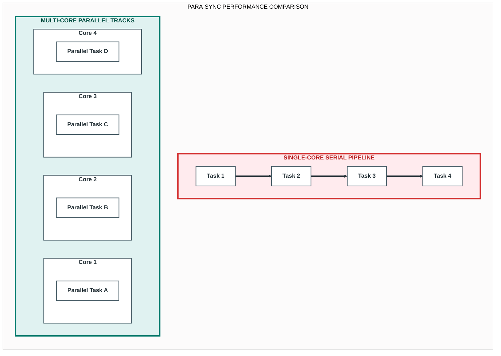

## 2. Flynn's Taxonomy

Flynn's Taxonomy classifies computer architectures based on the number of instruction streams and data streams they can process simultaneously.

### 2.1 Single Instruction Single Data (SISD)
- **Definition:** A traditional von Neumann architecture with one processor executing one instruction stream on one data stream at a time.
- **Characteristics:** Sequential execution. No parallelism at the hardware level.
- **Example:** Classic single-core processors.

### 2.2 Multiple Instruction Single Data (MISD)
- **Definition:** Multiple processors execute different instructions on the same data stream simultaneously.
- **Characteristics:** Rare in practice. Theoretical use in fault-tolerant systems where multiple processors perform different computations on the same input to verify results.
- **Example:** Spacecraft control systems with redundant processors for error checking.

### 2.3 Single Instruction Multiple Data (SIMD)
- **Definition:** A single instruction is executed by multiple processors, each operating on different data elements simultaneously.
- **Characteristics:** Ideal for data-parallel tasks where the same operation is applied to large datasets.
- **Example:** Graphics Processing Units (GPUs), vector processors, and multimedia instruction sets like SSE or AVX in modern CPUs.

### 2.4 Multiple Instruction Multiple Data (MIMD)
- **Definition:** Multiple processors execute different instruction streams on different data streams independently.
- **Characteristics:** Most flexible and common architecture for general-purpose parallel computing. Processors can work on completely different tasks.
- **Example:** Multi-core CPUs, distributed computing clusters, and modern supercomputers.

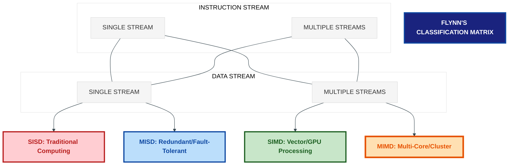

## 3. Memory Organization

Memory organization defines how processors access memory in a parallel system.

### 3.1 Shared Memory
- **Definition:** All processors share a single, unified address space. Any processor can access any memory location.
- **Advantages:** Simple programming model. Data sharing is implicit and fast (via memory reads/writes).
- **Disadvantages:** Scalability limitations due to memory bus contention. Requires synchronization mechanisms (locks, semaphores) to prevent race conditions.
- **Hardware Implementation:** Uniform Memory Access (UMA) where all processors have equal access time to memory, or Non-Uniform Memory Access (NUMA) where access time depends on memory location relative to the processor.

### 3.2 Distributed Memory
- **Definition:** Each processor has its own private memory. Processors cannot directly access each other's memory.
- **Communication:** Processors exchange data by sending messages over a network.
- **Advantages:** Highly scalable. No memory contention issues.
- **Disadvantages:** Complex programming model. Programmer must explicitly manage data distribution and communication.
- **Example:** Computer clusters, distributed systems.

### 3.3 Massively Parallel Processing (MPP)
- **Definition:** A distributed memory architecture with a large number of processors (hundreds to thousands), each with its own memory and operating system.
- **Characteristics:** Designed for high-performance computing. Processors are interconnected via high-speed networks.
- **Use Case:** Scientific computing, big data analytics, and large-scale simulations.

### 3.4 Clusters of Workstations
- **Definition:** A collection of independent, commodity computers (workstations or servers) connected via a network to work as a single parallel system.
- **Characteristics:** Cost-effective alternative to specialized supercomputers. Often use message-passing libraries like MPI.
- **Challenge:** Network latency and bandwidth can become bottlenecks.

### 3.5 Heterogeneous Architectures
- **Definition:** Systems that combine different types of processing units, such as CPUs, GPUs, FPGAs, or specialized accelerators.
- **Characteristics:** Different units excel at different tasks (e.g., CPUs for control logic, GPUs for parallel data processing).
- **Programming Challenge:** Requires managing data movement and task allocation across different architectures with different instruction sets and memory spaces.

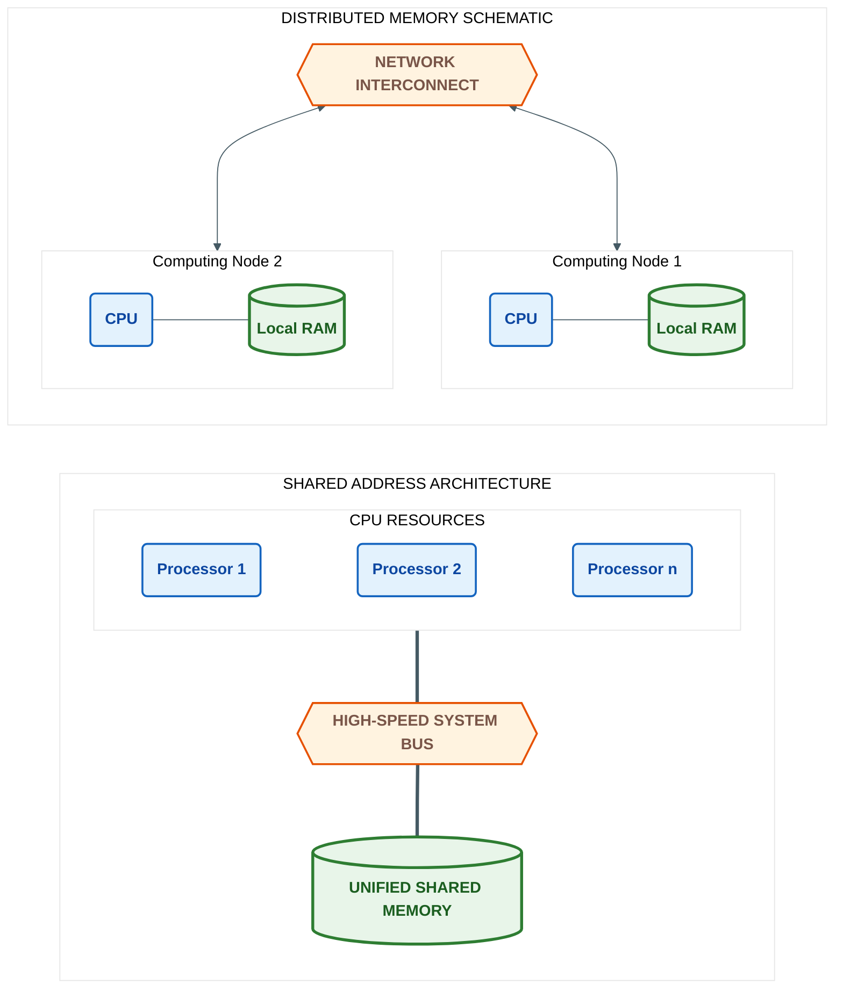

## 4. Parallel Programming Models

A programming model defines how parallelism is expressed and managed in software.

### 4.1 Shared Memory Model
- **Concept:** Threads or processes share a common address space. Parallelism is expressed through threads that execute concurrently and communicate via shared variables.
- **Synchronization:** Requires explicit synchronization primitives (locks, condition variables) to coordinate access to shared data.
- **API Examples:** POSIX threads (pthreads), OpenMP, Python threading module.

### 4.2 Multithread Model
- **Concept:** A specific case of the shared memory model where a single process contains multiple threads of execution.
- **Characteristics:** Threads are lightweight compared to processes. Context switching between threads is faster.
- **Challenge:** Thread safety. Shared data must be protected to avoid race conditions and deadlocks.

### 4.3 Message Passing Model
- **Concept:** Processes have private memory and communicate exclusively by sending and receiving messages.
- **Characteristics:** Explicit communication. Well-suited for distributed memory systems.
- **API Examples:** Message Passing Interface (MPI), sockets.
- **Advantage:** Clear separation of data reduces unintended side effects.

### 4.4 Data-Parallel Model
- **Concept:** The same operation is applied simultaneously to multiple data elements. The focus is on distributing data across processors.
- **Characteristics:** Ideal for SIMD architectures and array-based computations.
- **API Examples:** OpenMP parallel for directives, CUDA kernels, NumPy vectorized operations.

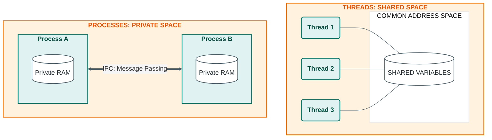

## 5. Designing a Parallel Program

A systematic approach to parallel program design involves four key steps.

### 5.1 Task Decomposition
- **Definition:** Breaking down the overall computation into smaller, independent tasks that can potentially execute concurrently.
- **Approaches:**
  - *Domain Decomposition:* Partitioning the data, and each task processes a subset of the data.
  - *Functional Decomposition:* Partitioning the computation based on different functions or operations.

### 5.2 Task Assignment
- **Definition:** Assigning decomposed tasks to processors or threads.
- **Goal:** Balance the workload to ensure all processors are utilized efficiently and minimize idle time.

### 5.3 Agglomeration
- **Definition:** Combining small tasks into larger ones to reduce overhead.
- **Rationale:** Creating and managing many fine-grained tasks incurs communication and synchronization overhead. Agglomeration trades off some parallelism for reduced overhead.

### 5.4 Mapping
- **Definition:** Assigning the agglomerated tasks to specific physical processors.
- **Static Mapping:** Tasks are assigned to processors before execution. Suitable when task execution times are predictable.
- **Dynamic Mapping (5.5):** Tasks are assigned to processors at runtime. Suitable when task execution times are unpredictable or when the system is heterogeneous. Improves load balancing but adds scheduling overhead.

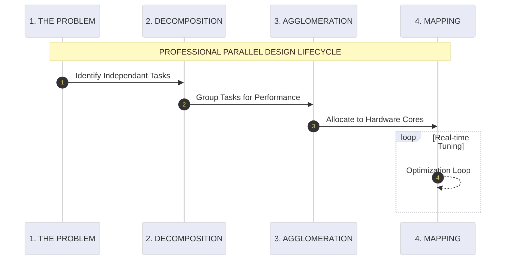

## 6. Evaluating the Performance of a Parallel Program

Metrics to quantify the effectiveness of parallelization.

### 6.1 Speedup
- **Definition:** The ratio of the execution time of the best sequential algorithm to the execution time of the parallel algorithm on p processors.
- **Formula:** `S(p) = T(1) / T(p)`
- **Ideal Speedup:** Linear speedup (`S(p) = p`) means the program runs p times faster on p processors. Rarely achieved in practice due to overhead.

### 6.2 Efficiency
- **Definition:** Measures how well the processors are utilized. It is the speedup divided by the number of processors.
- **Formula:** `E(p) = S(p) / p = T(1) / (p * T(p))`
- **Interpretation:** Efficiency of 1 (or 100%) means perfect utilization. Values less than 1 indicate overhead from communication, synchronization, or load imbalance.

### 6.3 Scaling
- **Strong Scaling:** The problem size is fixed, and the number of processors is increased. Measures how much faster a fixed problem can be solved with more resources.
- **Weak Scaling:** The problem size per processor is fixed, and the total problem size grows with the number of processors. Measures the ability to solve larger problems with more resources.

### 6.4 Amdahl's Law
- **Statement:** The maximum speedup achievable by parallelizing a program is limited by the fraction of the program that must execute sequentially.
- **Formula:** `S(p) <= 1 / (f + (1-f)/p)`, where `f` is the sequential fraction.
- **Implication:** Even with infinite processors, speedup is bounded by `1/f`. If 10% of a program is sequential, maximum speedup is 10x.

### 6.5 Gustafson's Law
- **Statement:** As the number of processors increases, the problem size can also increase, allowing the parallel portion to dominate.
- **Formula:** `S(p) = p - f*(p-1)`
- **Implication:** For scalable problems, speedup can grow linearly with the number of processors by increasing the workload. Contrasts with Amdahl's Law by assuming the problem size scales with resources.

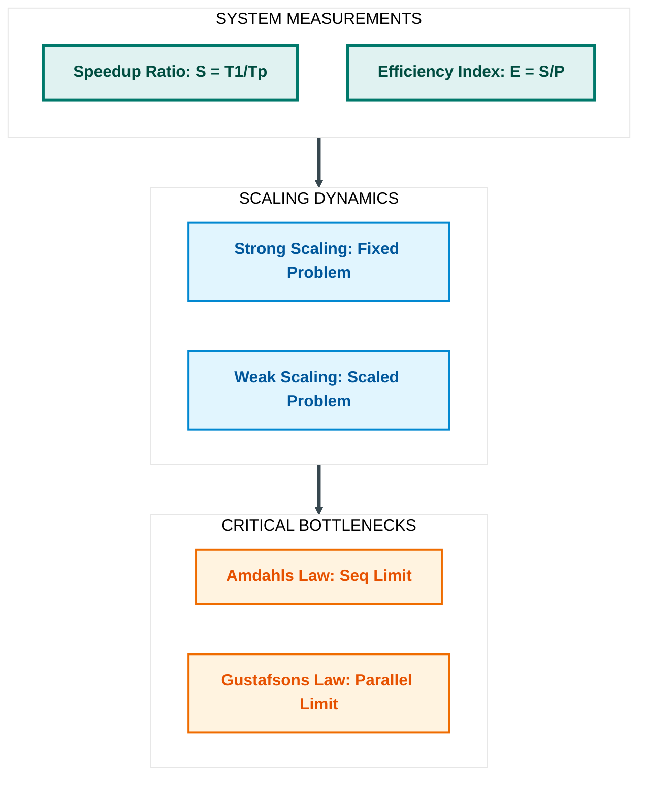

## 7. Introducing Python

A brief overview of Python features relevant to parallel programming.

### 7.1 Help Functions
- `help()`: Provides interactive documentation for modules, classes, and functions.
- `dir()`: Lists the attributes and methods of an object.
- Essential for exploring libraries and understanding APIs without leaving the interpreter.

**Example implementation (`Chapter01/Codes/dir.py`):**
```python
# In this program, 
# we check if the number is positive or
# negative or zero and 
# display an appropriate message

num = 1

# Try these two variations as well:
# num = 0
# num = -4.5

if num > 0:
    print("Positive number")
elif num == 0:
    print("Zero")
else:
    print("Negative number")

# Program to find the sum of all numbers stored in a list

# List of numbers
numbers = [6, 6, 3, 8, -3, 2, 5, 44, 12]

# variable to store the sum
sum = 0

# iterate over the list
for val in numbers:
	sum = sum+val

# Output: The sum is 48
print("The sum is", sum)
```

**Output:**
<p align="center">
  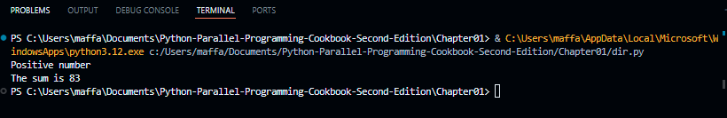
</p>

### 7.2 Syntax
- Python uses indentation (whitespace) to define code blocks, not braces.
- Simple, readable syntax reduces development time and improves code maintainability.

### 7.3 Comments
- Single-line: `# This is a comment`
- Multi-line: Enclosed in triple quotes (`"""` or `'''`), though these are technically string literals often used as docstrings.

### 7.4 Assignments
- Dynamic typing: Variables do not need explicit type declarations. Type is inferred from the assigned value.
- Multiple assignment: `a, b = 1, 2`
- Augmented assignment: `x += 1`

### 7.5 Data Types
- Built-in types: `int`, `float`, `bool`, `str`, `list`, `tuple`, `dict`, `set`.
- Mutable vs Immutable: Lists, dicts, sets are mutable (can be changed). Strings, tuples, numbers are immutable (cannot be changed after creation). Important for understanding behavior in concurrent contexts.

### 7.6 Strings
- Immutable sequences of characters.
- Support slicing, formatting, and a rich set of methods for manipulation.

### 7.7 Flow Control
- Conditional: `if`, `elif`, `else`
- Loops: `for` (iterates over sequences), `while` (condition-based)
- Loop control: `break`, `continue`, `pass`

**Example implementation (`Chapter01/Codes/flow.py`):**
```python
# IF

# In this program, we check if the number is positive or negative or zero and 
# display an appropriate message

num = 1
if num > 0:
    print("Positive number")
elif num == 0:
    print("Zero")
else:
    print("Negative number")


# FOR
# Program to find the sum of all numbers stored in a list
numbers = [6, 6, 3, 8, -3, 2, 5, 44, 12]
sum = 0
for val in numbers:
	sum = sum+val

# Output: The sum is 48
print("The sum is", sum)


#WHILE
# Program to add natural numbers upto sum = 1+2+3+...+n

n = 10
# initialize sum and counter
sum = 0
i = 1
while i <= n:
    sum = sum + i
    i = i+1    # update counter

# print the sum
print("The sum is", sum)
```

**Output:**
<p align="center">
  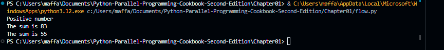
</p>

### 7.8 Functions
- Defined using `def` keyword.
- Support default arguments, variable-length arguments (`*args`, `**kwargs`), and keyword-only arguments.
- First-class objects: Functions can be passed as arguments, returned from other functions, and assigned to variables.

**Example implementation (`Chapter01/Codes/do_something.py`):**
```python
import random

# function to generate random numbers
def do_something(count, out_list):
    for i in range(count):
        out_list.append(random.random())   # add random number between 0 and 1

# create empty list
numbers = []

# how many random numbers we want
count = 5

# call the function
do_something(count, numbers)

# print the result
print("Random numbers list:")
print(numbers)
```

**Output:**
<p align="center">
  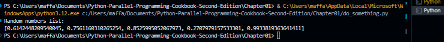
</p>

### 7.9 Classes
- Python supports Object-Oriented Programming with classes.
- Key concepts: inheritance, encapsulation, polymorphism.
- Special methods (e.g., `__init__`, `__str__`) enable customization of object behavior.

**Example implementation (`Chapter01/Codes/classes.py`):**
```python
class Myclass:
    common = 10
    def __init__ (self):
        self.myvariable = 3
    def myfunction (self, arg1, arg2):
        return self.myvariable

instance = Myclass()
print("instance.myfunction(1, 2)" , instance.myfunction(1, 2))

instance2 = Myclass()
print("instance.common ",instance.common)
print("instance2.common ",instance2.common)

Myclass.common = 30

print("instance.common ", instance.common)

print("instance2.common ", instance2.common)

instance.common = 10
print("instance.common ", instance.common)

print("instance2.common " , instance2.common)
Myclass.common = 50

print("instance.common ", instance.common)
print("instance2.common " , instance2.common)

class AnotherClass (Myclass):
    # The "self" argument is passed automatically
    # and refers to the class's instance, so you can set
    # instance variables as above, but from within the class.
    def __init__ (self, arg1):
        self.myvariable = 3
        print (arg1)

instance = AnotherClass ("hello")
print("instance.myfunction (1, 2) " , instance.myfunction (1, 2))

instance.test = 10
print("instance.test " , instance.test)
```

**Output:**
<p align="center">
  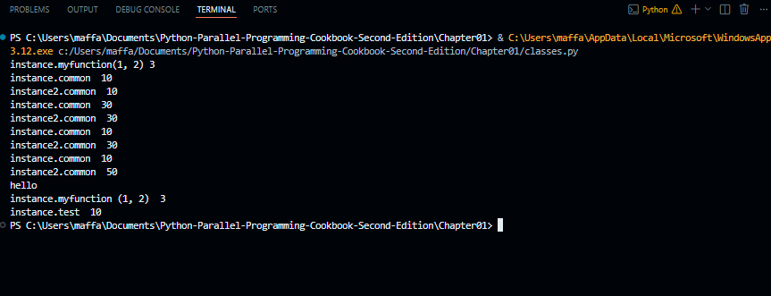
</p>

### 7.10 Exceptions
- Error handling using `try`, `except`, `else`, `finally` blocks.
- Built-in exception hierarchy (`Exception`, `ValueError`, `TypeError`, etc.).
- Custom exceptions can be defined by inheriting from `Exception`.
- Critical for writing robust parallel programs that can handle errors in individual threads or processes.

### 7.11 Importing Libraries
- `import module`: Imports an entire module.
- `from module import name`: Imports specific names from a module.
- `import module as alias`: Imports with an alias for convenience.
- Modules are the primary mechanism for code organization and reuse in Python.

### 7.12 Managing Files
- `open()` function to open files with modes: `'r'` (read), `'w'` (write), `'a'` (append), `'b'` (binary).
- Context manager (`with` statement) ensures files are properly closed: `with open('file.txt', 'r') as f: ...`
- Essential for I/O-bound parallel tasks.

**Example implementation (`Chapter01/Codes/file.py`):**
```python
f = open ('test.txt', 'w')
f.write ('first line of file \n') 

f.write ('second line of file \n') 

f.close()
f = open ('test.txt')
content = f.read()
print (content)

f.close()
```

**Output:**
<p align="center">
  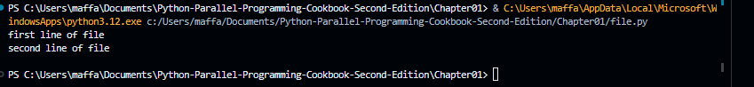
</p>

### 7.13 List Comprehensions
- Concise syntax for creating lists: `[x**2 for x in range(10) if x % 2 == 0]`
- More efficient and readable than equivalent for-loops with `append()`.
- Can be parallelized using libraries like multiprocessing for large datasets.

**Example implementation (`Chapter01/Codes/lists.py`):**
```python
example = [1, ["another", "list"], ("a", "tuple")]
example
mylist = ["element 1", 2, 3.14]
mylist
mylist[0] = "yet element 1"
print(mylist[0])
mylist[-1] = 3.15
print (mylist[-1])
mydict = {"Key 1": "value 1", 2: 3, "pi": 3.14}
print(mydict)
mydict["pi"] = 3.15
print(mydict["pi"])
mytuple = (1, 2, 3)
print(mytuple)
myfunc = len
print (myfunc(mylist))
```

**Output:**
<p align="center">
  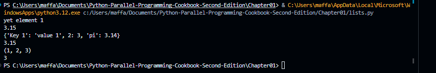
</p>

### 7.14 Running Python Scripts
- Command line: `python script.py`
- Shebang line (`#!/usr/bin/env python3`) allows direct execution on Unix-like systems.
- `__name__ == "__main__"` idiom: Code inside this block runs only when the script is executed directly, not when imported as a module. Crucial for parallel programming to avoid unintended process/thread spawning on import.

### 7.15 Installing Python Packages Using pip
- `pip` is the standard package installer for Python.
- Installing pip (7.16): Usually bundled with modern Python installations. Can be installed via `get-pip.py` if missing.
- Updating pip (7.17): `python -m pip install --upgrade pip`
- Using pip (7.18):
  - Install: `pip install package_name`
  - Uninstall: `pip uninstall package_name`
  - List: `pip list`
  - Requirements file: `pip install -r requirements.txt` (for reproducible environments)

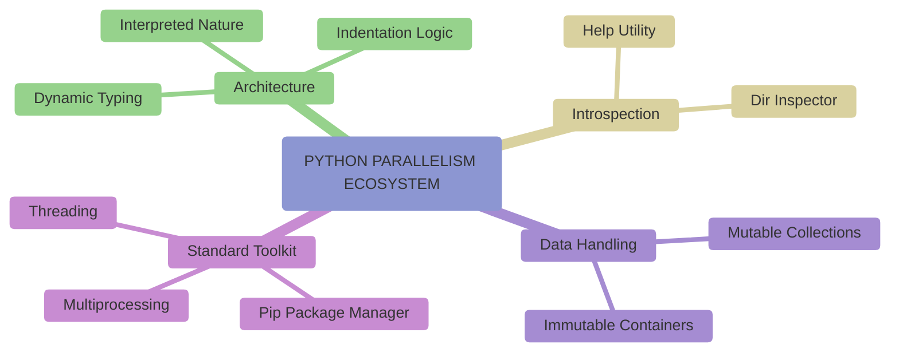

## 8. Introducing Python Parallel Programming

### 8.1 Processes and Threads
- **Process:** An independent program in execution with its own memory space. Created using the multiprocessing module. Inter-process communication (IPC) requires explicit mechanisms (pipes, queues, shared memory).
- **Thread:** A lightweight unit of execution within a process. Created using the threading module. Threads share memory, enabling fast communication but requiring synchronization to avoid race conditions.
- **Choice Between Them:**
  - Use threads for I/O-bound tasks (network, disk) where the GIL is released during I/O operations.
  - Use processes for CPU-bound tasks to bypass the GIL and achieve true parallelism on multi-core systems.
- **Global Interpreter Lock (GIL):** A mutex in CPython that allows only one thread to execute Python bytecode at a time. It simplifies memory management but limits CPU-bound multi-threaded performance. Multiprocessing circumvents the GIL by using separate processes, each with its own Python interpreter and GIL.

**Example implementation (`Chapter01/Codes/serial_test.py`):**
```python
import time
from do_something import *

if __name__ == "__main__":
    start_time = time.time()
    size = 10000000   
    n_exec = 10
    for i in range(0, n_exec):
        out_list = list()
        do_something(size, out_list)
       
 
    print ("List processing complete.")
    end_time = time.time()
    print("serial time=", end_time - start_time)
```

**Output:**
<p align="center">
  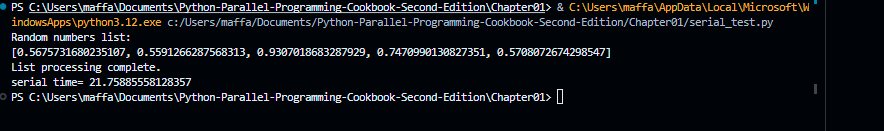
</p>

**Example implementation (`Chapter01/Codes/multithreading_test.py`):**
```python
from do_something import *
import time
import threading

if __name__ == "__main__":
    start_time = time.time()
    size = 10000000
    threads = 10  
    jobs = []
    for i in range(0, threads):
        out_list = list()
        thread = threading.Thread(target=do_something(size, out_list))
        jobs.append(thread)
    for j in jobs:
        j.start()

    
    for j in jobs:
        j.join()

    print ("List processing complete.")
    end_time = time.time()
    print("multithreading time=", end_time - start_time)
```

**Output:**
<p align="center">
  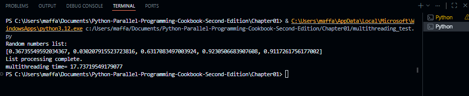
</p>

**Example implementation (`Chapter01/Codes/multiprocessing_test.py`):**
```python
from do_something import *
import time
import multiprocessing

if __name__ == "__main__":
    start_time = time.time()
    size = 10000000   
    procs = 10   
    jobs = []
    for i in range(0, procs):
        out_list = list()
        process = multiprocessing.Process\
                  (target=do_something,args=(size,out_list))
        jobs.append(process)

    for j in jobs:
        j.start()

    for j in jobs:
        j.join()

    print ("List processing complete.")
    end_time = time.time()
    print("multiprocesses time=", end_time - start_time)
```

**Output:**
<p align="center">
  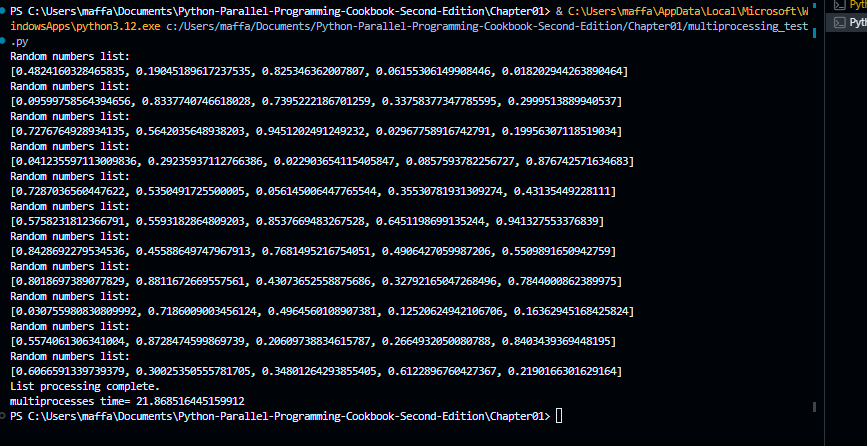
</p>

**Example implementation (`Chapter01/Codes/thread_and_processes.py`):**
```python
import os
import time
import threading
import multiprocessing
import random

NUM_WORKERS = 10
size = 1000000
out_list = list()

def do_something(count, out_list):
    for i in range(count):
        out_list.append(random.random())


# ---------------- Serial Execution ----------------
start_time = time.time()

for _ in range(NUM_WORKERS):
    do_something(size, out_list)

end_time = time.time()
print("Serial time =", end_time - start_time)


# ---------------- Multithreading ----------------
out_list = []
start_time = time.time()

jobs = []

for i in range(NUM_WORKERS):
    thread = threading.Thread(target=do_something, args=(size, out_list))
    jobs.append(thread)

for j in jobs:
    j.start()

for j in jobs:
    j.join()

print("List processing complete.")
end_time = time.time()
print("Threading time =", end_time - start_time)


# ---------------- Multiprocessing ----------------
out_list = []
start_time = time.time()

jobs = []

for i in range(NUM_WORKERS):
    process = multiprocessing.Process(target=do_something, args=(size, out_list))
    jobs.append(process)

for j in jobs:
    j.start()

for j in jobs:
    j.join()

print("List processing complete.")
end_time = time.time()
print("Processes time =", end_time - start_time)
```

**Output:**
<p align="center">
  
  
</p>

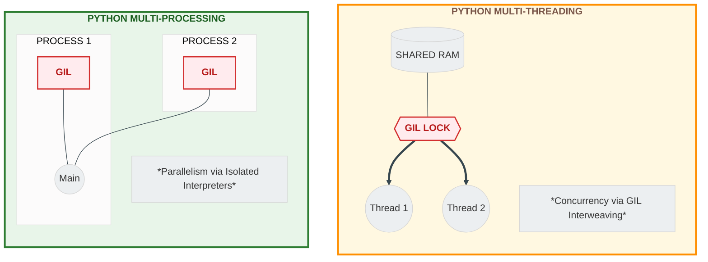


