# Chapter 2: Thread-Based Parallelism

> **Comprehensive Theory and Practical Implementation Guide**
> This chapter focuses on concurrency using threads within a single Python process, pairing theoretical explanations with practical code examples.

---

## Table of Contents
1. [What is a Thread?](#1-what-is-a-thread)
2. [Python Threading Module](#2-python-threading-module)
3. [Defining a Thread](#3-defining-a-thread)
4. [Determining the Current Thread](#4-determining-the-current-thread)
5. [Defining a Thread Subclass](#5-defining-a-thread-subclass)
6. [Thread Synchronization with a Lock](#6-thread-synchronization-with-a-lock)
7. [Thread Synchronization with RLock](#7-thread-synchronization-with-rlock)
8. [Thread Synchronization with Semaphores](#8-thread-synchronization-with-semaphores)
9. [Thread Synchronization with a Condition](#9-thread-synchronization-with-a-condition)
10. [Thread Synchronization with an Event](#10-thread-synchronization-with-an-event)
11. [Thread Synchronization with a Barrier](#11-thread-synchronization-with-a-barrier)
12. [Thread Communication Using a Queue](#12-thread-communication-using-a-queue)

---

## 1. What is a Thread?
A thread is the smallest unit of execution that can be scheduled by an operating system. It exists within a process.
- **Process vs Thread:** A process is an instance of a program in execution with its own memory space. A thread is a sequence of execution within that process. Multiple threads within the same process share the same memory space (heap), but each thread has its own stack and program counter.
- **Concurrency vs Parallelism:** Concurrency means dealing with multiple things at once (switching between tasks), while parallelism means doing multiple things at once (simultaneous execution).
- **The Global Interpreter Lock (GIL):** In CPython (the standard Python implementation), the GIL is a mutex that protects access to Python objects. It prevents multiple native threads from executing Python bytecodes at once. This means that for CPU-bound tasks, threads may not offer true parallelism. However, for I/O-bound tasks (like network requests or file operations), threads are highly effective because the GIL is released during I/O operations.

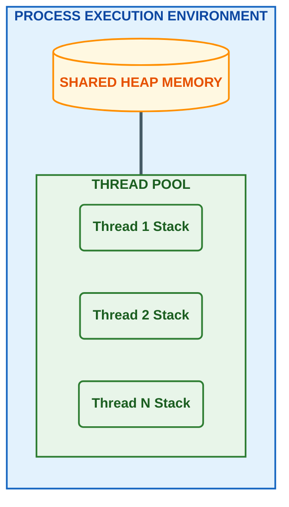

## 2. Python Threading Module
The threading module is the standard library interface for thread-based parallelism in Python.
- It provides high-level abstractions over the lower-level thread module.
- It allows developers to create, manage, and synchronize threads without dealing with operating system-specific thread APIs directly.
- Key components include the `Thread` class, `Lock`, `RLock`, `Semaphore`, `Condition`, `Event`, `Barrier`, and `Queue` classes.

## 3. Defining a Thread
This refers to the functional approach of creating a thread.
- **Mechanism:** You instantiate the `threading.Thread` class.
- **Target Function:** You pass a callable object (function) to the `target` argument. This function contains the code the thread will execute.
- **Arguments:** Arguments to be passed to the target function are provided via the `args` (tuple) or `kwargs` (dictionary) parameters.
- **Lifecycle:**
  - `start()`: This method initiates the thread's activity. It arranges for the object's `run()` method to be invoked in a separate thread of control.
  - `join()`: This method blocks the calling thread until the thread whose `join()` method is called terminates. This is used to synchronize the completion of threads.

**Example implementation (`Chapter02/Thread_definition.py`):**
```python
import threading

def my_func(thread_number):
    return print('my_func called by thread N°{}'.format(thread_number))

def main():
    threads = []
    for i in range(10):
        t = threading.Thread(target=my_func, args=(i,))
        threads.append(t)
        t.start()
        t.join()

if __name__ == "__main__":
    main()
```

**Output:**
<p align="center">
  
</p>

## 4. Determining the Current Thread
In a multi-threaded environment, it is often necessary to identify which thread is executing a specific piece of code.
- `threading.current_thread()`: This function returns the current `Thread` object corresponding to the caller's thread of control.
- **Thread Identification:** Each thread has a name (default is `Thread-N`) and a unique identifier. Knowing the current thread is useful for logging, debugging, and thread-specific behavior logic.
- **Main Thread:** The thread that starts the Python program is called the `MainThread`. Other threads are spawned from this main thread.

**Example implementation (`Chapter02/Thread_determine.py`):**
```python
import threading
import time

def function_A():
    print (threading.current_thread().getName()+str('--> starting \n'))
    time.sleep(2)
    print (threading.current_thread().getName()+str( '--> exiting \n'))
    return

def function_B():
    print (threading.current_thread().getName()+str('--> starting \n'))
    time.sleep(2)
    print (threading.current_thread().getName()+str( '--> exiting \n'))
    return

def function_C():
    print (threading.current_thread().getName()+str('--> starting \n'))
    time.sleep(2)
    print (threading.current_thread().getName()+str( '--> exiting \n'))
    return

if __name__ == "__main__":
    t1 = threading.Thread(name='function_A', target=function_A)
    t2 = threading.Thread(name='function_B', target=function_B)
    t3 = threading.Thread(name='function_C',target=function_C) 

    t1.start()
    t2.start()
    t3.start()

    t1.join()
    t2.join()
    t3.join()
```

**Output:**
<p align="center">
  
</p>

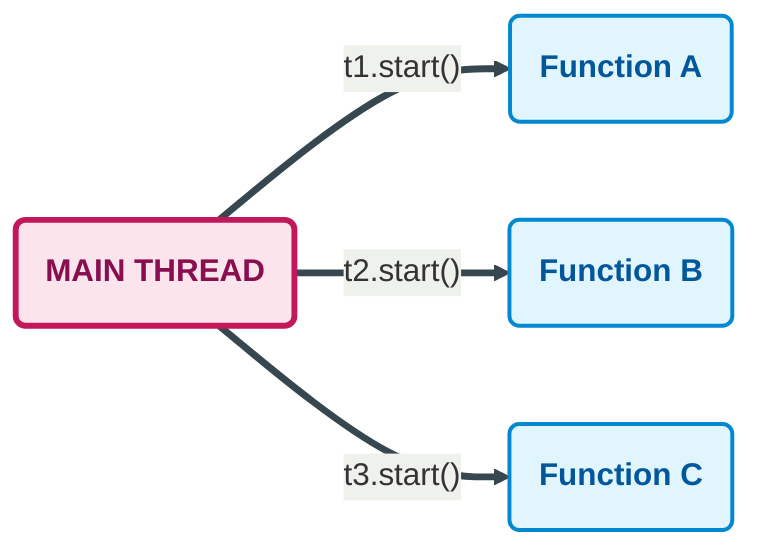

> [!NOTE]  
> *`current_thread()` is preferred over the older `currentThread()`)*

## 5. Defining a Thread Subclass
This refers to the Object-Oriented approach of creating a thread.
- **Mechanism:** Instead of passing a target function, you create a new class that inherits from `threading.Thread`.
- **Overriding `run()`:** You override the `run()` method in your subclass. The code inside `run()` is what gets executed when the thread starts.
- **Usage:** This approach is preferred when you need to maintain state within the thread object itself or when you need to customize the thread's behavior beyond just executing a single function. It allows for better encapsulation of data and logic related to that specific thread.

**Example implementation (`Chapter02/MyThreadClass.py`):**
```python
import time
import os
from random import randint
from threading import Thread

class MyThreadClass (Thread):
   def __init__(self, name, duration):
      Thread.__init__(self)
      self.name = name
      self.duration = duration
      
   def run(self):
      print ("---> " + self.name + \
             " running, belonging to process ID "\
             + str(os.getpid()) + "\n")
      time.sleep(self.duration)
      print ("---> " + self.name + " over\n")

def main():
    start_time = time.time()
    
    # Thread Creation
    thread1 = MyThreadClass("Thread#1 ", randint(1,10))
    # ... more threads created ...
    
    # Thread Running
    thread1.start()
    
    # Thread joining
    thread1.join()
    
    print("--- %s seconds ---" % (time.time() - start_time))

if __name__ == "__main__":
    main()
```

**Output:**
<p align="center">
  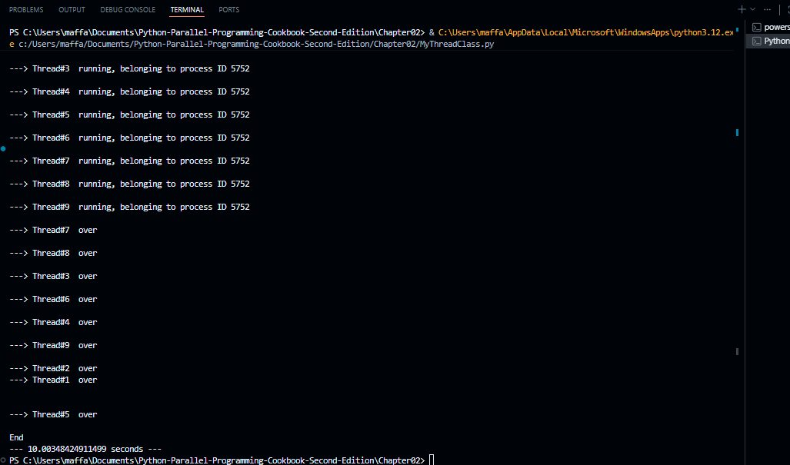
</p>

## 6. Thread Synchronization with a Lock
When multiple threads access shared data simultaneously, race conditions can occur. A race condition happens when the behavior of software depends on the timing of uncontrollable events (like thread scheduling).
- **Mutual Exclusion:** A Lock (mutex) ensures that only one thread can execute a specific block of code (critical section) at a time.
- **Acquire and Release:**
  - `acquire()`: The thread attempts to gain ownership of the lock. If the lock is held by another thread, the calling thread blocks until the lock is released.
  - `release()`: The thread releases the lock, allowing other waiting threads to acquire it.
- **Importance:** This prevents data corruption when multiple threads try to modify the same variable or resource concurrently.

**Example implementation (`Chapter02/MyThreadClass_lock.py`):**
```python
import threading
import time
import os
from threading import Thread
from random import randint

# Lock Definition
threadLock = threading.Lock()

class MyThreadClass (Thread):
   def __init__(self, name, duration):
      Thread.__init__(self)
      self.name = name
      self.duration = duration
      
   def run(self):
      # Acquire the Lock
      threadLock.acquire()      
      print ("---> " + self.name + \
             " running, belonging to process ID "\
             + str(os.getpid()) + "\n")
      time.sleep(self.duration)
      print ("---> " + self.name + " over\n")
      # Release the Lock
      threadLock.release()
      
# ... main execution as before ...
```

**Output:**
<p align="center">
  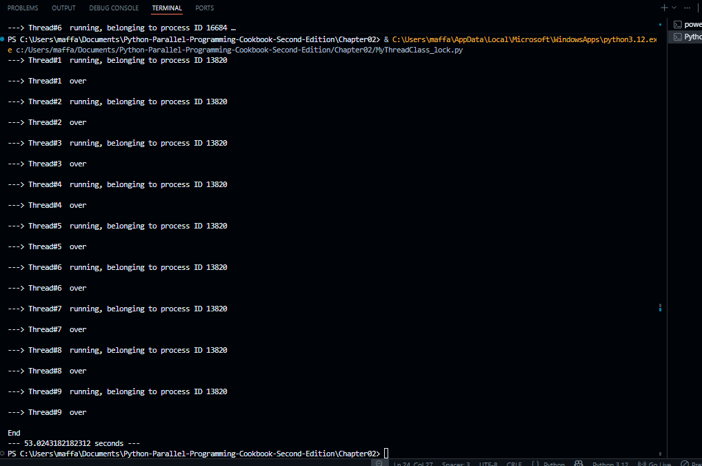
</p>

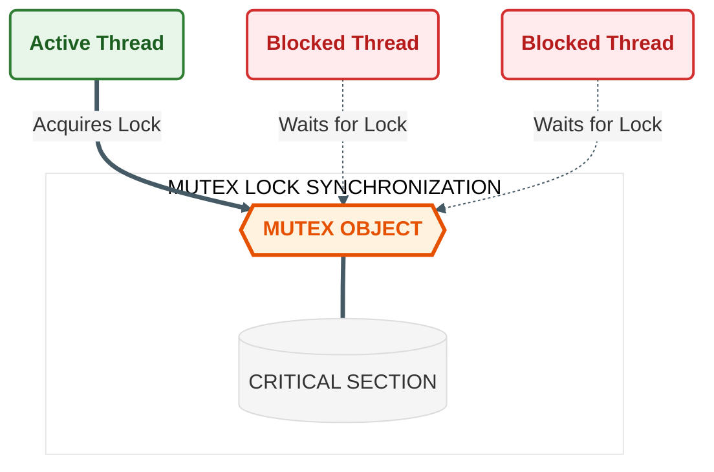

## 7. Thread Synchronization with RLock
RLock stands for Reentrant Lock.
- **Problem with Standard Lock:** A standard Lock cannot be acquired again by the same thread if it already holds it. If a thread tries to acquire a lock it already owns, it will deadlock (wait for itself forever).
- **RLock Solution:** An RLock allows the same thread to acquire the lock multiple times. It keeps track of a recursion level.
- **Mechanism:** The lock must be released the same number of times it was acquired by that thread before it is actually unlocked for other threads.
- **Use Case:** This is useful in recursive functions where a thread might call a function that requires the lock, which in turn calls another function that also requires the same lock.

**Example implementation (`Chapter02/Rlock.py`):**
```python
import threading
import time
import random

class Box:
    def __init__(self):
        self.lock = threading.RLock()
        self.total_items = 0

    def execute(self, value):
        with self.lock:
            self.total_items += value

    def add(self):
        with self.lock: # Uses RLock recursively inside execute
            self.execute(1)

    def remove(self):
        with self.lock:
            self.execute(-1)

def adder(box, items):
    while items:
        box.add()
        time.sleep(1)
        items -= 1

def remover(box, items):
    while items:
        box.remove()
        time.sleep(1)
        items -= 1

def main():
    box = Box()
    t1 = threading.Thread(target=adder, args=(box, random.randint(10,20)))
    t2 = threading.Thread(target=remover, args=(box, random.randint(1,10)))
    
    t1.start()
    t2.start()
    t1.join()
    t2.join()

if __name__ == "__main__":
    main()
```

**Output:**
<p align="center">
  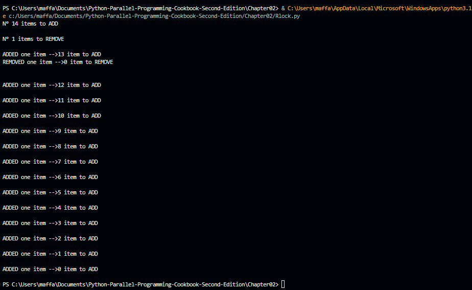
</p>

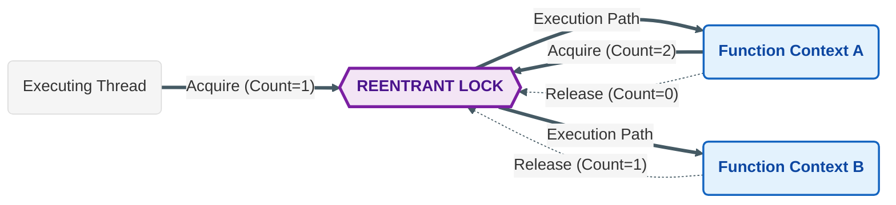

## 8. Thread Synchronization with Semaphores
A Semaphore is a more generalized lock that manages a counter instead of a binary flag.
- **Counting Mechanism:** A semaphore maintains an internal counter. The counter is decremented by each `acquire()` call and incremented by each `release()` call.
- **Resource Limiting:** It is used to limit the number of threads that can access a resource simultaneously. For example, if you have a pool of 5 database connections, you can use a semaphore with a value of 5. Only 5 threads can acquire the semaphore at once; others must wait.
- **Bounded Semaphore:** A variation that raises an error if `release()` is called more times than `acquire()`, preventing programming errors where the counter increases indefinitely.

**Example implementation (`Chapter02/Semaphore.py`):**
```python
import logging
import threading
import time
import random

logging.basicConfig(level=logging.INFO, format='%(asctime)s %(threadName)-17s %(levelname)-8s %(message)s')

semaphore = threading.Semaphore(0)
item = 0

def consumer():
    logging.info('Consumer is waiting')
    semaphore.acquire()
    logging.info('Consumer notify: item number {}'.format(item))

def producer():
    global item
    time.sleep(3)
    item = random.randint(0, 1000)
    logging.info('Producer notify: item number {}'.format(item))
    semaphore.release()

def main():
    for i in range(10):
        t1 = threading.Thread(target=consumer)
        t2 = threading.Thread(target=producer)
        t1.start()
        t2.start()
        t1.join()
        t2.join()

if __name__ == "__main__":
    main()
```

**Output:**
<p align="center">
  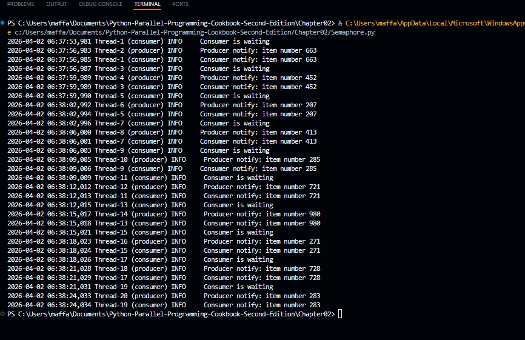
</p>

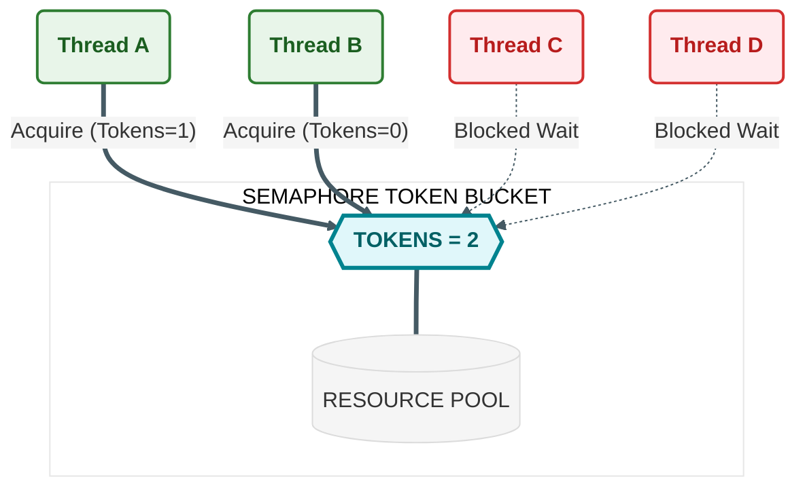

## 9. Thread Synchronization with a Condition
A Condition object allows one or more threads to wait until they are notified by another thread. It is built on top of a Lock.
- **Wait and Notify:**
  - `wait()`: The thread releases the lock and enters a waiting state until it is notified.
  - `notify()`: Another thread calls this to wake up one or more waiting threads.
- **Use Case:** This is essential for Producer-Consumer problems. A consumer thread waits on a condition until a producer thread adds data to a shared resource and notifies the consumer. It ensures threads do not waste CPU cycles constantly checking (polling) for a state change.

**Example implementation (`Chapter02/Condition.py`):**
```python
import logging
import threading
import time

logging.basicConfig(level=logging.INFO)
items = []
condition = threading.Condition()

class Consumer(threading.Thread):
    def consume(self):
        with condition:
            if len(items) == 0:
                condition.wait()
            items.pop()
            condition.notify()

    def run(self):
        for i in range(20):
            time.sleep(2)
            self.consume()

class Producer(threading.Thread):
    def produce(self):
        with condition:
            if len(items) == 10:
                condition.wait()
            items.append(1)
            condition.notify()

    def run(self):
        for i in range(20):
            time.sleep(0.5)
            self.produce()

def main():
    producer = Producer(name='Producer')
    consumer = Consumer(name='Consumer')
    producer.start()
    consumer.start()
    producer.join()
    consumer.join()

if __name__ == "__main__":
    main()
```

**Output:**
<p align="center">
  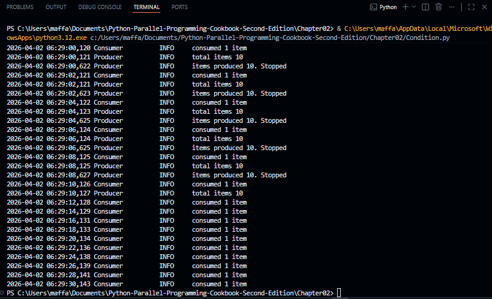
</p>

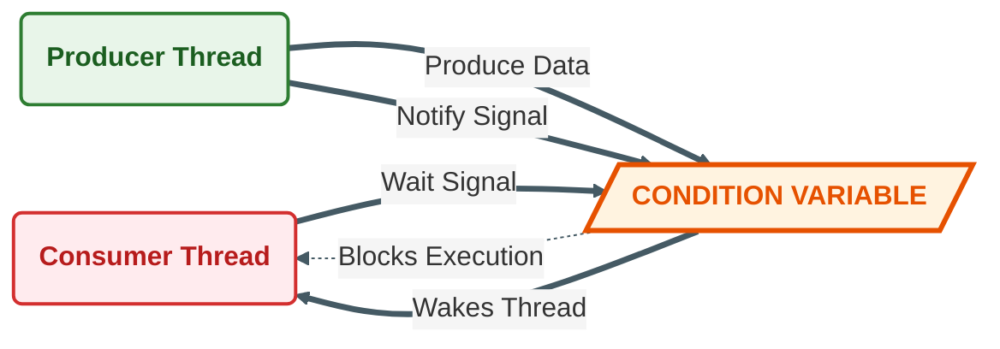

## 10. Thread Synchronization with an Event
An Event is a simple synchronization object that represents an internal flag.
- **Mechanism:**
  - `set()`: Sets the internal flag to true. All threads waiting for the event will wake up.
  - `clear()`: Sets the internal flag to false.
  - `wait()`: Blocks the thread until the internal flag is true.
- **Difference from Condition:** Events are simpler than Conditions. They are best used for one-time signals or simple state changes, whereas Conditions are better for complex state management involving shared data.

**Example implementation (`Chapter02/Event.py`):**
```python
import logging
import threading
import time
import random

items = []
event = threading.Event()

class Consumer(threading.Thread):
    def run(self):
        while True:
            time.sleep(2)
            event.wait()
            item = items.pop()

class Producer(threading.Thread):
    def run(self):
        for i in range(5):
            time.sleep(2)
            item = random.randint(0, 100)
            items.append(item)
            event.set()
            event.clear()

if __name__ == "__main__":
    t1 = Producer()
    t2 = Consumer()
    t1.start()
    t2.start()
    t1.join()
    t2.join()
```

**Output:**
<p align="center">
  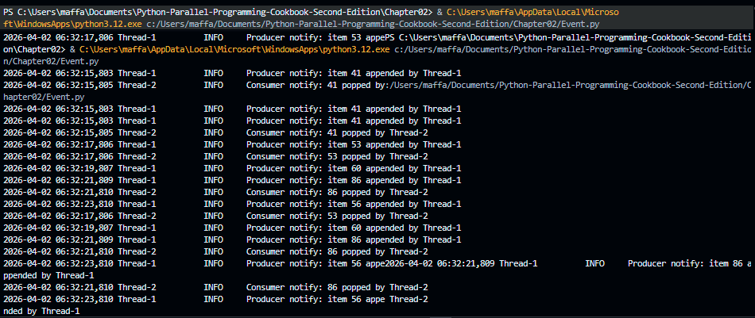
</p>

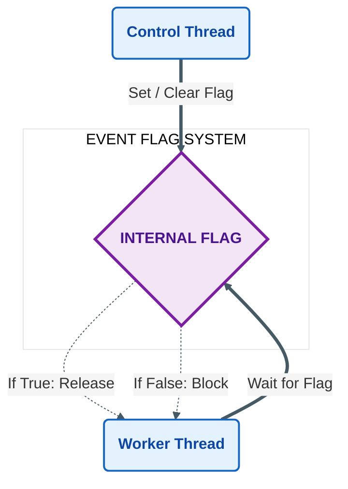

## 11. Thread Synchronization with a Barrier
A Barrier provides a synchronization point for a fixed number of threads.
- **Rendezvous Point:** All participating threads must call `wait()` on the barrier.
- **Blocking Behavior:** Each thread blocks at the barrier until all specified threads have arrived.
- **Release:** Once the last thread arrives, all waiting threads are released simultaneously to continue execution.
- **Use Case:** Useful in parallel algorithms where a phase of computation must be completed by all threads before the next phase can begin.

**Example implementation (`Chapter02/Barrier.py`):**
```python
from random import randrange
from threading import Barrier, Thread
from time import ctime, sleep

num_runners = 3
finish_line = Barrier(num_runners)
runners = ['Huey', 'Dewey', 'Louie']

def runner():
    name = runners.pop()
    sleep(randrange(2, 5))
    print('%s reached the barrier at: %s \n' % (name, ctime()))
    finish_line.wait() # All threads wait here until 3 reach it

def main():
    threads = []
    for i in range(num_runners):
        threads.append(Thread(target=runner))
        threads[-1].start()
    for thread in threads:
        thread.join()
    print('Race over!')

if __name__ == "__main__":
    main()
```

**Output:**
<p align="center">
  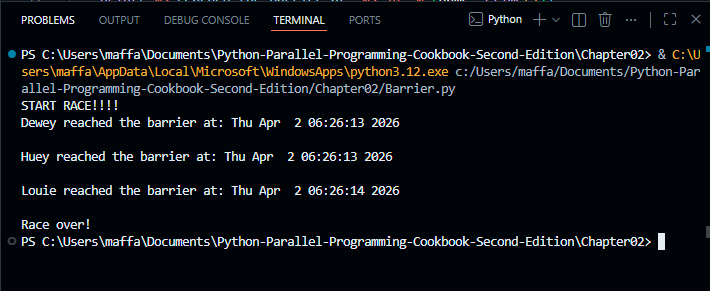
</p>

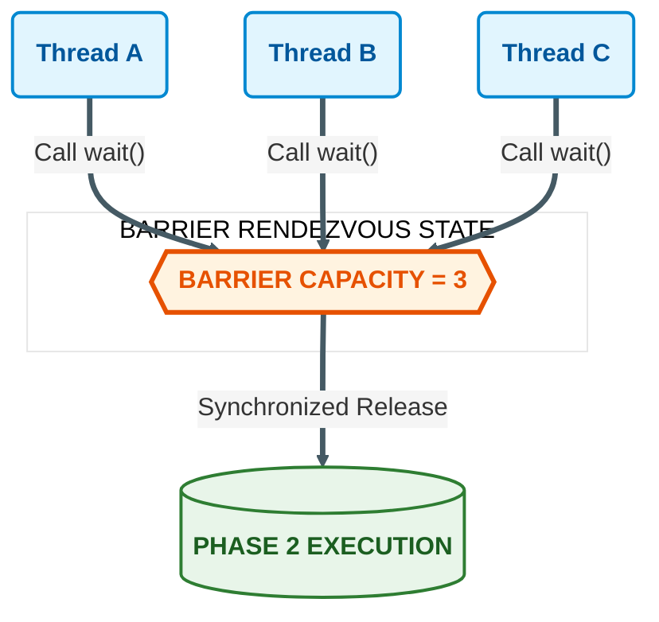

## 12. Thread Communication Using a Queue
While locks and conditions manage access to shared variables, queues provide a safer and easier way to exchange data between threads.
- **Thread-Safe:** The `queue.Queue` class is designed to be safe for use by multiple threads. It handles all necessary locking internally.
- **Producer-Consumer Pattern:** One or more threads (producers) put data into the queue, and one or more threads (consumers) get data from the queue.
- **Blocking Operations:**
  - `put()`: Adds an item to the queue. It can block if the queue is full.
  - `get()`: Removes and returns an item from the queue. It can block if the queue is empty.
- **Advantage:** Decouples the production of data from the consumption of data, simplifying synchronization logic and preventing race conditions.

**Example implementation (`Chapter02/Threading_with_queue.py`):**
```python
from threading import Thread
from queue import Queue
import time
import random

class Producer(Thread):
    def __init__(self, queue):
        Thread.__init__(self)
        self.queue = queue

    def run(self):
        for i in range(5):
            item = random.randint(0, 256)
            self.queue.put(item)
            time.sleep(1)

class Consumer(Thread):
    def __init__(self, queue):
        Thread.__init__(self)
        self.queue = queue

    def run(self):
        while True:
            item = self.queue.get()
            self.queue.task_done()

if __name__ == '__main__':
    queue = Queue()

    t1 = Producer(queue)
    t2 = Consumer(queue)
    t3 = Consumer(queue)
    t4 = Consumer(queue)

    t1.start()
    t2.start()
    t3.start()
    t4.start()

    t1.join()
    t2.join()
    t3.join()
    t4.join()
```

**Output:**
<p align="center">
  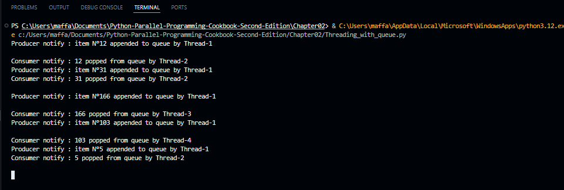
</p>

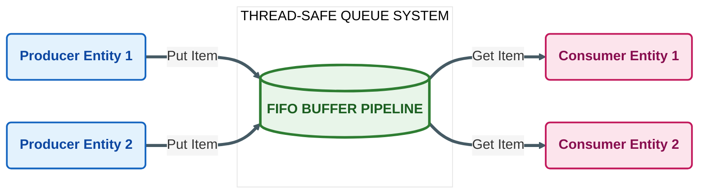
