# Chapter 3: Process-Based Parallelism

> **Comprehensive Theory and Practical Implementation Guide**
> This chapter focuses on concurrency using multiple processes in Python, bypassing the Global Interpreter Lock (GIL) to achieve true parallelism for CPU-bound tasks.

---

## Table of Contents
1. [Understanding Python's multiprocessing module](#1-understanding-pythons-multiprocessing-module)
2. [Spawning a process](#2-spawning-a-process)
3. [Naming a process](#3-naming-a-process)
4. [Running processes in the background](#4-running-processes-in-the-background)
5. [Killing a process](#5-killing-a-process)
6. [Defining processes in a subclass](#6-defining-processes-in-a-subclass)
7. [Using a queue to exchange data](#7-using-a-queue-to-exchange-data)
8. [Using pipes to exchange objects](#8-using-pipes-to-exchange-objects)
9. [Synchronizing processes](#9-synchronizing-processes)
10. [Using a process pool](#10-using-a-process-pool)

---

## 1. Understanding Python's multiprocessing module
The `multiprocessing` module allows the creation of isolated processes, each running its own Python interpreter. 
- **Bypassing the GIL:** Unlike the `threading` module, `multiprocessing` sidesteps the Global Interpreter Lock (GIL). This makes it perfectly suited for CPU-bound tasks.
- **Process Isolation:** Each process has its own memory space, which avoids data corruption by race conditions but requires specialized mechanisms like Pipes or Queues to communicate.

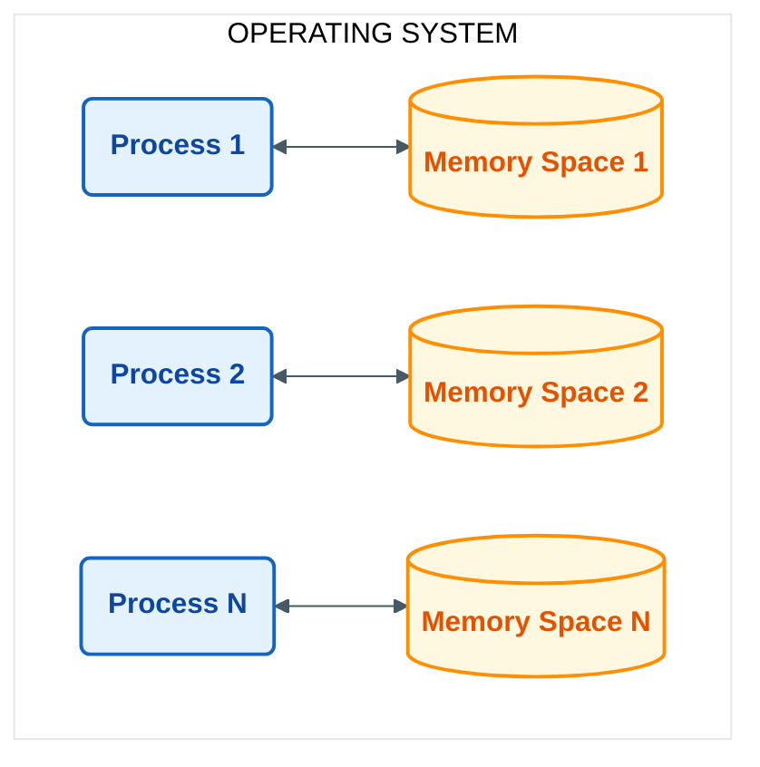

## 2. Spawning a process
A process is created by instantiating the `multiprocessing.Process` object and passing a target function.
- `start()` initiates the process.
- `join()` blocks the main process until the spawned process has completed.

**Example implementation (`Codes/spawning_processes.py`):**
```python
#Spawn a Process – Chapter 3: Process Based Parallelism
import multiprocessing

def myFunc(i):
    print ('calling myFunc from process n°: %s' %i)
    for j in range (0,i):
        print('output from myFunc is :%s' %j)
    return

if __name__ == '__main__':
    for i in range(6):
        process = multiprocessing.Process(target=myFunc, args=(i,))
        process.start()
        process.join()
```

**Output:**
<p align="center">
  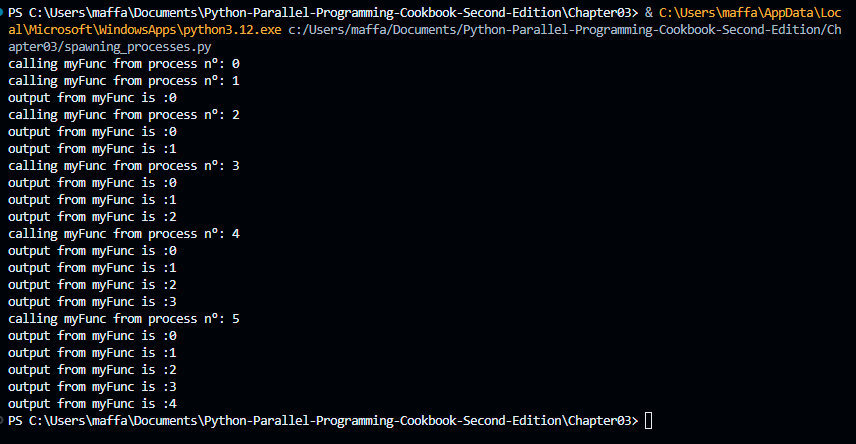
</p>


## 3. Naming a process
Naming processes helps in debugging and identifying which process is executing. Use the `name` parameter in `multiprocessing.Process` or `multiprocessing.current_process().name` to differentiate them.

**Example implementation (`Codes/naming_processes.py`):**
```python
import multiprocessing
import time

def myFunc():
    name = multiprocessing.current_process().name
    print ("Starting process name = %s \n" %name)
    time.sleep(3)
    print ("Exiting process name = %s \n" %name)

if __name__ == '__main__':
    process_with_name = multiprocessing.Process\
                        (name='myFunc process',\
                         target=myFunc)

    process_with_default_name = multiprocessing.Process\
                                (target=myFunc)

    process_with_name.start()
    process_with_default_name.start()

    process_with_name.join()
    process_with_default_name.join()
```

**Output:**
<p align="center">
  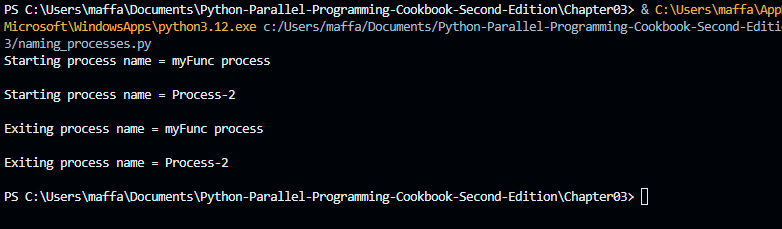
</p>

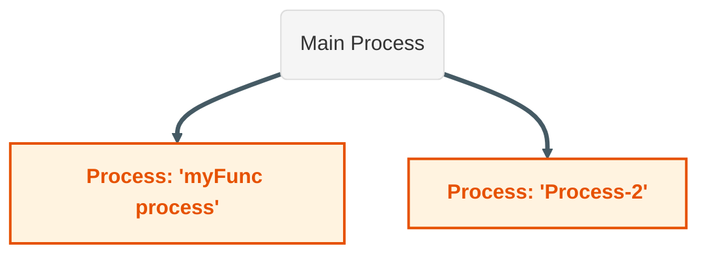

## 4. Running processes in the background
Processes can be set as `daemon=True` to run in the background. A background (daemon) process will be terminated abruptly when the main program exits, without completing its tasks or cleaning up resources.

**Example implementation (`Codes/run_background_processes.py`):**
```python
import multiprocessing
import time

def foo():
    name = multiprocessing.current_process().name
    print ("Starting %s \n" %name)
    if name == 'background_process':
        for i in range(0,5):
            print('---> %d \n' %i)
        time.sleep(1)
    else:
        for i in range(5,10):
            print('---> %d \n' %i)
        time.sleep(1)
    print ("Exiting %s \n" %name)
    
if __name__ == '__main__':
    background_process = multiprocessing.Process\
                         (name='background_process',\
                          target=foo)
    background_process.daemon = True

    NO_background_process = multiprocessing.Process\
                            (name='NO_background_process',\
                             target=foo)
    NO_background_process.daemon = False
    
    background_process.start()
    NO_background_process.start()
```

**Output:**
<p align="center">
  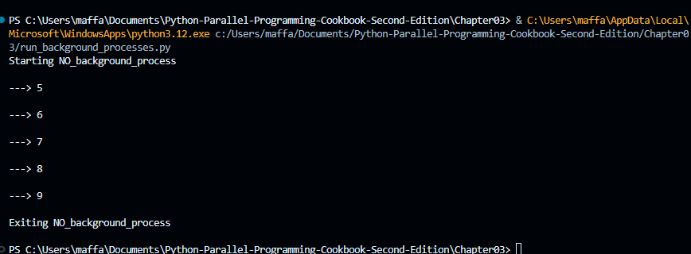
</p>

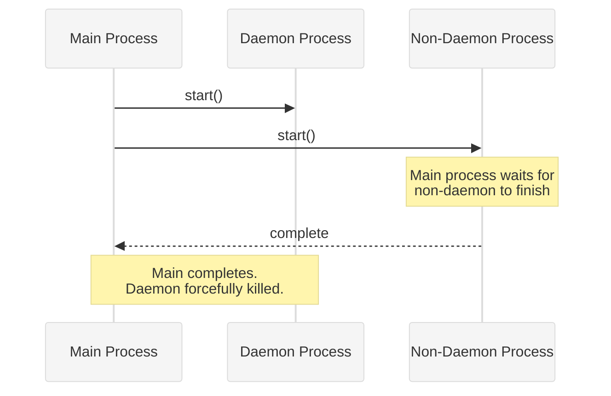

## 5. Killing a process
To explicitly terminate a process, call `process.terminate()`. This sends a SIGTERM signal (on Unix) or TerminateProcess (on Windows) to immediately stop it. The process `is_alive()` method helps check status.

**Example implementation (`Codes/killing_processes.py`):**
```python
import multiprocessing
import time

def foo():
    print ('Starting function')
    for i in range(0,10):
        print('-->%d\n' %i)
        time.sleep(1)
    print ('Finished function')

if __name__ == '__main__':
    p = multiprocessing.Process(target=foo)
    print ('Process before execution:', p, p.is_alive())
    p.start()
    print ('Process running:', p, p.is_alive())
    p.terminate()
    print ('Process terminated:', p, p.is_alive())
    p.join()
    print ('Process joined:', p, p.is_alive())
    print ('Process exit code:', p.exitcode)
```

**Output:**
<p align="center">
  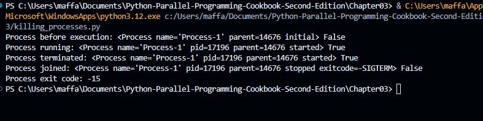
</p>


## 6. Defining processes in a subclass
Like threads, you can inherit from `multiprocessing.Process` and override its `run()` method. This object-oriented approach is ideal when you need to maintain state inside the process.

**Example implementation (`Codes/process_in_subclass.py`):**
```python
import multiprocessing

class MyProcess(multiprocessing.Process):

    def run(self):
        print ('called run method in %s' %self.name)
        return

if __name__ == '__main__':
    for i in range(10):
        process = MyProcess()
        process.start()
        process.join()
```

**Output:**
<p align="center">
  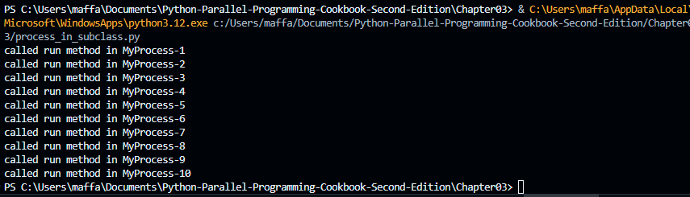
</p>

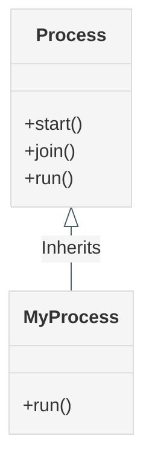

## 7. Using a queue to exchange data
Because memory is isolated, sharing data requires inter-process communication (IPC) tools. `multiprocessing.Queue` operates identically to `queue.Queue` but is built for process-safe communication via locking mechanisms.

**Example implementation (`Codes/communicating_with_queue.py`):**
```python
import multiprocessing
import random
import time

class producer(multiprocessing.Process):
    def __init__(self, queue):
        multiprocessing.Process.__init__(self)
        self.queue = queue

    def run(self) :
        for i in range(10):
            item = random.randint(0, 256)
            self.queue.put(item) 
            print ("Process Producer : item %d appended to queue %s"\
                   % (item,self.name))
            time.sleep(1)
            print ("The size of queue is %s"\
                   % self.queue.qsize())
       
class consumer(multiprocessing.Process):
    def __init__(self, queue):
        multiprocessing.Process.__init__(self)
        self.queue = queue

    def run(self):
        while True:
            if (self.queue.empty()):
                print("the queue is empty")
                break
            else :
                time.sleep(2)
                item = self.queue.get()
                print ('Process Consumer : item %d popped \
                        from by %s \n'\
                       % (item, self.name))
                time.sleep(1)

if __name__ == '__main__':
        queue = multiprocessing.Queue()
        process_producer = producer(queue)
        process_consumer = consumer(queue)
        process_producer.start()
        process_consumer.start()
        process_producer.join()
        process_consumer.join()
```

**Output:**
<p align="center">
  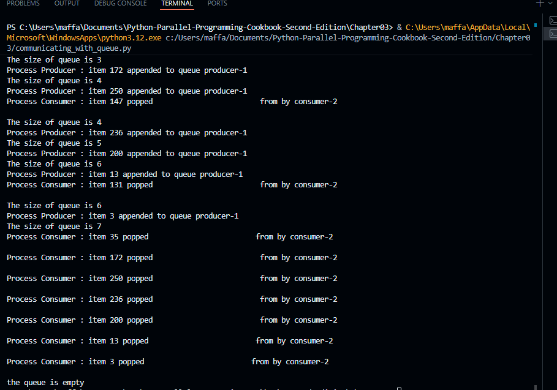
</p>


## 8. Using pipes to exchange objects
Pipes are preferred for high-speed, two-way communication between exactly two processes. `multiprocessing.Pipe()` returns a pair of connection objects representing the ends of a pipe.

**Example implementation (`Codes/communicating_with_pipe.py`):**
```python
##Using Pipes with multiprocessing – Chapter 3: Process Based Parallelism
import multiprocessing 
def create_items(pipe):
    output_pipe, _ = pipe
    for item in range(10):
        output_pipe.send(item)
    output_pipe.close()
 
def multiply_items(pipe_1, pipe_2):
    close, input_pipe = pipe_1
    close.close()
    output_pipe, _ = pipe_2
    try:
        while True:
            item = input_pipe.recv()
            output_pipe.send(item * item)
    except EOFError:
        output_pipe.close()
 
if __name__== '__main__':
    pipe_1 = multiprocessing.Pipe(True)
    process_pipe_1 = \
                   multiprocessing.Process\
                   (target=create_items, args=(pipe_1,))
    process_pipe_1.start()

    pipe_2 = multiprocessing.Pipe(True)
    process_pipe_2 = \
                   multiprocessing.Process\
                   (target=multiply_items, args=(pipe_1, pipe_2,))
    process_pipe_2.start()
 
    pipe_1[0].close()
    pipe_2[0].close()

    try:
        while True:
            print (pipe_2[1].recv())
    except EOFError:
        print ("End")
```

**Output:**
<p align="center">
  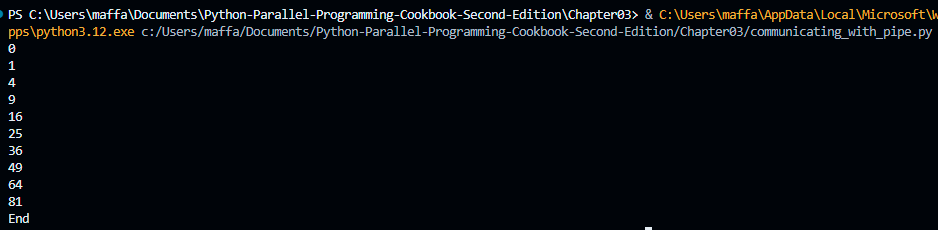
</p>


## 9. Synchronizing processes
Like threads, processes can use synchronization primitives such as Lock, Event, Condition, and Barrier from the `multiprocessing` module to avoid resource contention.

**Example implementation (`Codes/processes_barrier.py`):**
```python
import multiprocessing
from multiprocessing import Barrier, Lock, Process
from time import time
from datetime import datetime

def test_with_barrier(synchronizer, serializer):
    name = multiprocessing.current_process().name
    synchronizer.wait()
    now = time()
    with serializer:
        print("process %s ----> %s" \
              %(name,datetime.fromtimestamp(now)))

def test_without_barrier():
    name = multiprocessing.current_process().name
    now = time()
    print("process %s ----> %s" \
          %(name ,datetime.fromtimestamp(now)))

if __name__ == '__main__':
    synchronizer = Barrier(2)
    serializer = Lock()
    Process(name='p1 - test_with_barrier'\
            ,target=test_with_barrier,\
            args=(synchronizer,serializer)).start()
    Process(name='p2 - test_with_barrier'\
            ,target=test_with_barrier,\
            args=(synchronizer,serializer)).start()
    Process(name='p3 - test_without_barrier'\
            ,target=test_without_barrier).start()
    Process(name='p4 - test_without_barrier'\
            ,target=test_without_barrier).start()
```

**Output:**
<p align="center">
  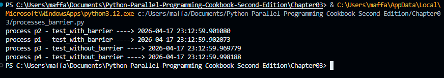
</p>

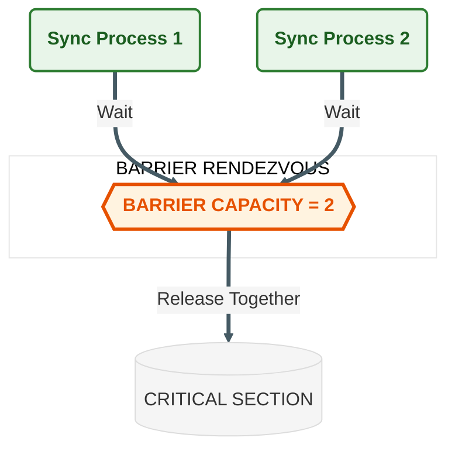

## 10. Using a process pool
The `multiprocessing.Pool` class abstraction offers a convenient way to parallelize a function across multiple input values, distributing the input data across processes efficiently (data parallelism).
- `pool.map()` behaves like the built-in map, but chops tasks into chunks and farms them out to processes.

**Example implementation (`Codes/process_pool.py`):**
```python
#Using a Process Pool – Chapter 3: Process Based Parallelism
import multiprocessing

def function_square(data):
    result = data*data
    return result

if __name__ == '__main__':
    inputs = list(range(0,100))
    pool = multiprocessing.Pool(processes=4)
    pool_outputs = pool.map(function_square, inputs)

    pool.close() 
    pool.join()  
    print ('Pool    :', pool_outputs)
```

**Output:**
<p align="center">
  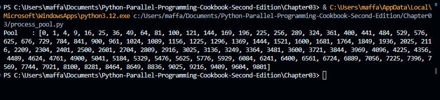
</p>

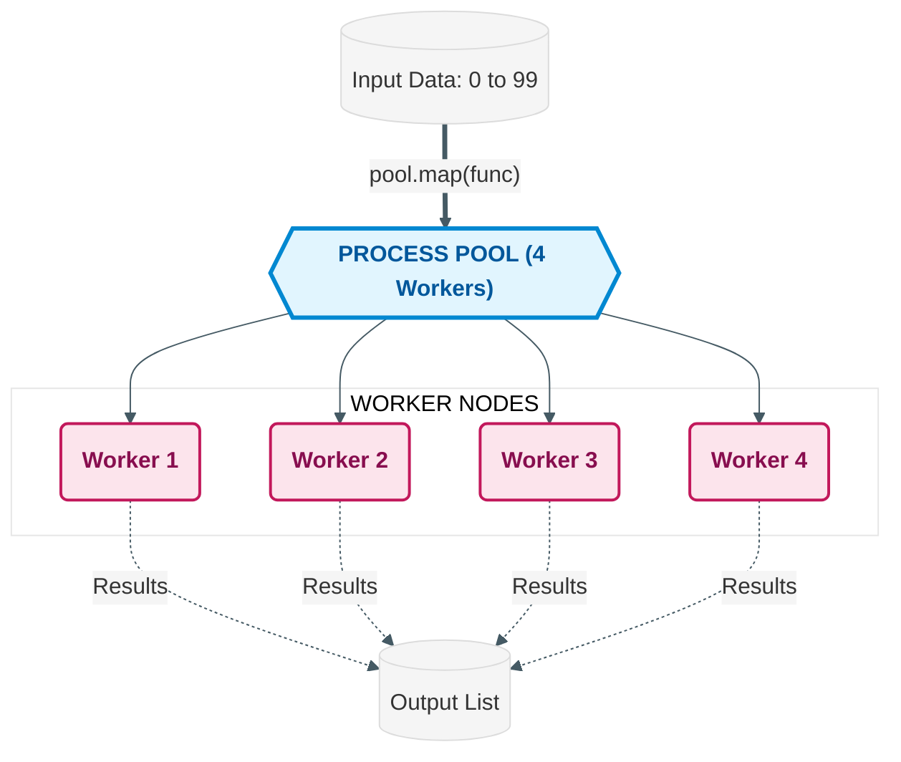
