# Chapter 4: Message Passing

> **Comprehensive Theory and Practical Implementation Guide**
> This chapter focuses on the Message Passing Interface (MPI) framework using Python's `mpi4py` module. It covers point-to-point and collective communication patterns, along with strategies to avoid deadlocks and optimize performance through virtual topologies.

---

## Table of Contents
1. [Understanding the MPI Structure](#1-understanding-the-mpi-structure)
2. [Implementing Point-to-Point Communication](#2-implementing-point-to-point-communication)
3. [Avoiding Deadlock Problems](#3-avoiding-deadlock-problems)
4. [Collective Communication: Broadcast](#4-collective-communication-broadcast)
5. [Collective Communication: Scatter](#5-collective-communication-scatter)
6. [Collective Communication: Gather](#6-collective-communication-gather)
7. [Collective Communication: Alltoall](#7-collective-communication-alltoall)
8. [The Reduction Operation](#8-the-reduction-operation)
9. [Optimizing Communication](#9-optimizing-communication)

---

## 1. Understanding the MPI Structure
Message Passing Interface (MPI) is a standardized and portable message-passing standard designed to function on parallel computing architectures.
- **Communicator:** `MPI.COMM_WORLD` is the default communicator encompassing all processes initialized in your MPI job.
- **Rank:** A unique integer identifier assigned to each process by the communicator.
- **Size:** The total number of processes in a given communicator.

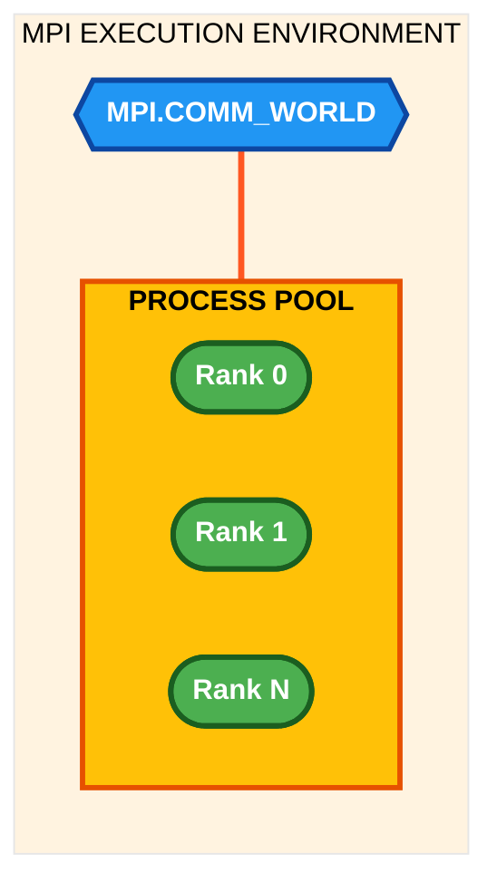

**Example implementation (`Chapter04/Codes/helloworld_MPI.py`):**
```python
#hello.py
from mpi4py import MPI
comm = MPI.COMM_WORLD
rank = comm.Get_rank()
print ("hello world from process ", rank)
```

**Output:**
<p align="center">
  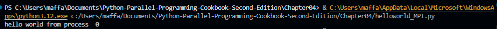
</p>

## 2. Implementing Point-to-Point Communication
Point-to-point communication typically involves exactly two processes: one sender and one receiver.
- **Send/Recv:** The primary methods `send()` and `recv()` can transmit arbitrary Python objects (like lists, dictionaries, etc.).
- **Tags & Destinations:** To pair the messages, the sender specifies the `dest` (destination rank), while the receiver specifies the `source` (source rank).


**Example implementation (`Chapter04/Codes/pointToPointCommunication.py`):**
```python
from mpi4py import MPI

comm=MPI.COMM_WORLD
rank = comm.rank
print("my rank is : " , rank)

if rank==0:
    data= 10000000
    destination_process = 4
    comm.send(data,dest=destination_process)
    print ("sending data %s " %data +\
           "to process %d" %destination_process)
   
if rank==1:
    destination_process = 8
    data= "hello"
    comm.send(data,dest=destination_process)
    print ("sending data %s :" %data + \
           "to process %d" %destination_process)
   

if rank==4:
    data=comm.recv(source=0)
    print ("data received is = %s" %data)
    
    
if rank==8:
    data1=comm.recv(source=1)
    print ("data1 received is = %s" %data1)
```

**Output:**
<p align="center">
  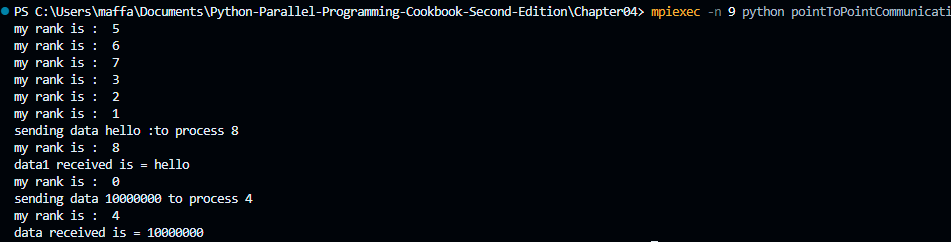
</p>

## 3. Avoiding Deadlock Problems
In message passing, deadlocks happen when processes are indefinitely waiting on each other. If Process A does a blocking `recv()` waiting for Process B, but Process B is also doing a blocking `recv()` waiting for Process A, the program freezes.
- **Solution:** Reorder communication routines so calls do not block each other, or utilize non-blocking variants (`isend()`, `irecv()`). By arranging the `send()` before the `recv()` properly based on conditions, deadlock is naturally avoided.

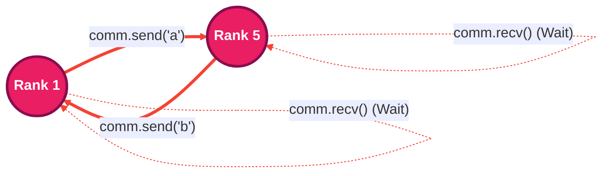

**Example implementation (`Chapter04/Codes/deadLockProblems.py`):**
```python
from mpi4py import MPI

comm = MPI.COMM_WORLD
rank = comm.Get_rank()
size = comm.Get_size()

print("my rank is %i" % (rank))

if rank == 1 and size > 5:  # Only if enough processes
    data_send = "a"
    destination_process = 5
    source_process = 5
    
    comm.send(data_send, dest=destination_process)
    data_received = comm.recv(source=source_process)
    
    print("sending data %s to process %d" % (data_send, destination_process))
    print("data received is = %s" % data_received)

elif rank == 5 and size > 5:  # Only if enough processes
    data_send = "b"
    destination_process = 1
    source_process = 1
    
    data_received = comm.recv(source=source_process)
    comm.send(data_send, dest=destination_process)
    
    print("sending data %s to process %d" % (data_send, destination_process))
    print("data received is = %s" % data_received)

else:
    print("Process %d has nothing to do (need at least 6 processes)" % rank)
```

**Output:**
<p align="center">
  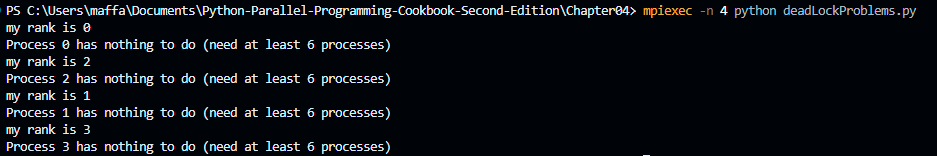
</p>

## 4. Collective Communication: Broadcast
In collective communications, every process in the communicator must invoke the same function. 
- **Broadcast (`bcast`):** The `root` process sends identical data to all other processes inside the communicator.

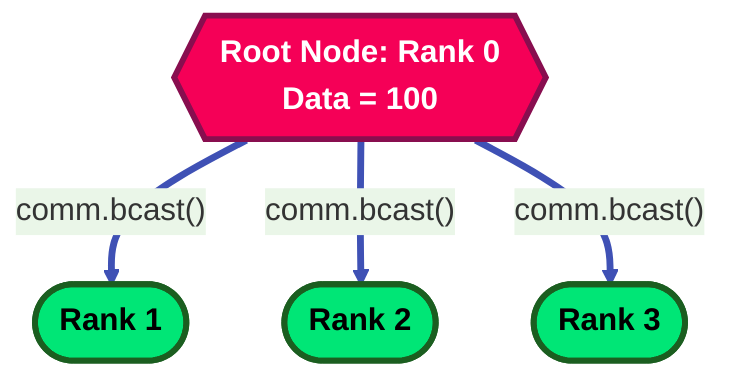

**Example implementation (`Chapter04/Codes/broadcast.py`):**
```python
from mpi4py import MPI

comm = MPI.COMM_WORLD
rank = comm.Get_rank()

if rank == 0:
   variable_to_share = 100 
           
else:
   variable_to_share = None

variable_to_share = comm.bcast(variable_to_share, root=0)
print("process = %d" %rank + " variable shared  = %d " %variable_to_share)
```

**Output:**
<p align="center">
  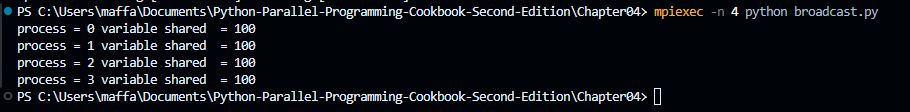
</p>

## 5. Collective Communication: Scatter
Scatter involves taking an array (or list) from the root process and splitting it equally among all processes.
- **Scatter (`scatter`):** If an array contains 10 items and we have 10 processes, Process 0 receives index 0, Process 1 receives index 1, etc.

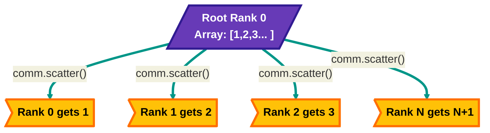

**Example implementation (`Chapter04/Codes/scatter.py`):**
```python
from mpi4py import MPI

comm = MPI.COMM_WORLD
rank = comm.Get_rank()
size = comm.Get_size()

if rank == 0:
    array_to_share = [1, 2, 3, 4, 5, 6, 7, 8, 9, 10]
else:
    array_to_share = None

# Scatter the array - each process gets one element
recvbuf = comm.scatter(array_to_share, root=0)
print("process = %d, received value = %d" % (rank, recvbuf))
```

**Output:**
<p align="center">
  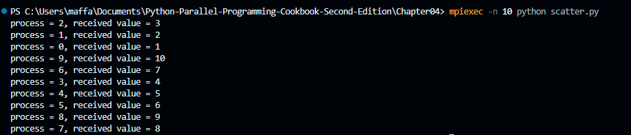
</p>

## 6. Collective Communication: Gather
Gather is the exact inverse of scatter.
- **Gather (`gather`):** It fetches an element from each process and aggregates them all tightly packed into an array stored on the root process.

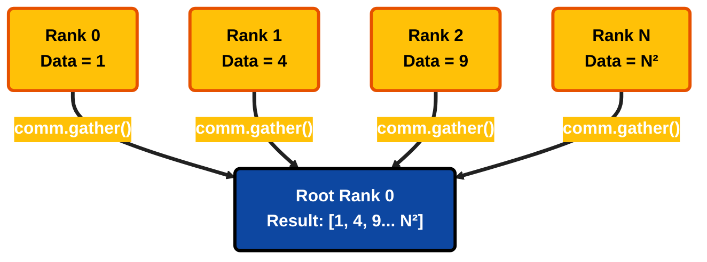

**Example implementation (`Chapter04/Codes/gather.py`):**
```python
from mpi4py import MPI

comm = MPI.COMM_WORLD
size = comm.Get_size()
rank = comm.Get_rank()
data = (rank+1)**2

data = comm.gather(data, root=0)
if rank == 0:
   print ("rank = %s " %rank +\
          "...receiving data to other process")
   for i in range(1,size):

      value = data[i]
      print(" process %s receiving %s from process %s"\
            %(rank , value , i))
```

**Output:**
<p align="center">
  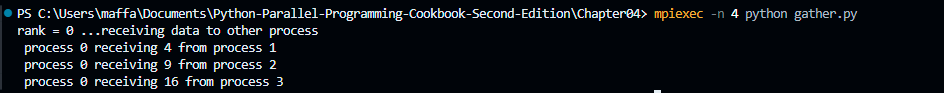
</p>

## 7. Collective Communication: Alltoall
`Alltoall` is considered a transposition method and is an extension of `scatter` and `gather`. Each process scatters a payload array to all other processes while symmetrically gathering payloads from all processes.

**Example implementation (`Chapter04/Codes/alltoall.py`):**
```python
from mpi4py import MPI
import numpy

comm = MPI.COMM_WORLD
size = comm.Get_size()
rank = comm.Get_rank()


senddata = (rank+1)*numpy.arange(size,dtype=int)
recvdata = numpy.empty(size,dtype=int)
comm.Alltoall(senddata,recvdata)


print(" process %s sending %s receiving %s"\
      %(rank , senddata , recvdata))
```

**Output:**
<p align="center">
  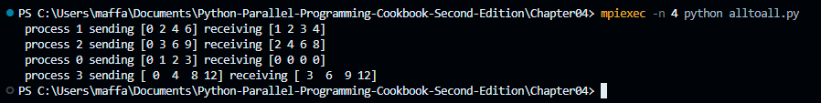
</p>

## 8. The Reduction Operation
Reduction operations perform global math operations, like summation or calculating the maximum, across distributed fragments of data holding identical properties, pushing the final result onto the root.
- **`comm.Reduce`**: Processes supply subsets, and using operations like `MPI.SUM`, `MPI.MAX`, etc., the result populates on `root=0`.

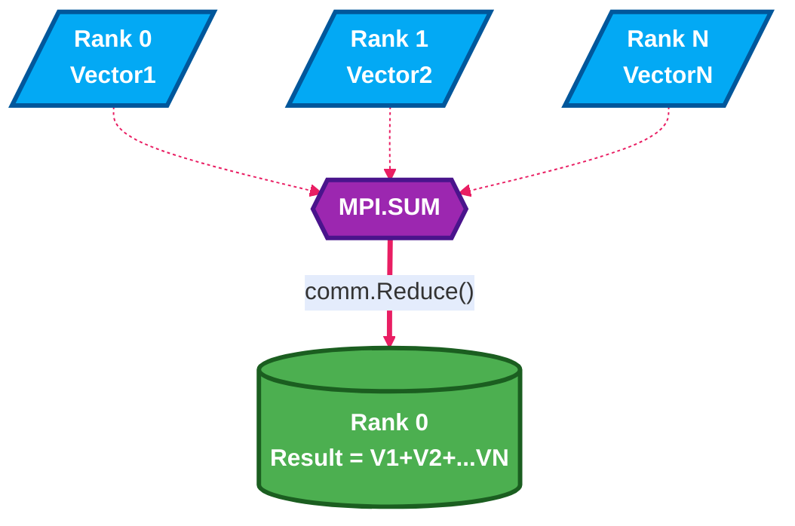

**Example implementation (`Chapter04/Codes/reduction.py`):**
```python
import numpy as np
from mpi4py import MPI

comm = MPI.COMM_WORLD
size = comm.Get_size()
rank = comm.Get_rank()

array_size = 10
recvdata = np.zeros(array_size, dtype=np.int64)  # Explicit 64-bit integer
senddata = (rank + 1) * np.arange(array_size, dtype=np.int64)

print("Process %d sending: %s" % (rank, senddata))

comm.Reduce(senddata, recvdata, root=0, op=MPI.SUM)

if rank == 0:
    print("Process %d after Reduce - SUM: %s" % (rank, recvdata))
```

**Output:**
<p align="center">
  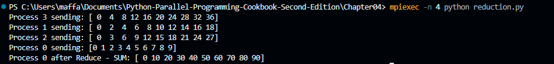
</p>

## 9. Optimizing Communication
In complex computations, linear topological alignment becomes a bottleneck. Building a **Virtual Topology** (like a multi-dimensional Cartesian Grid) allows mapping parallel application processes logically, easing boundary conditions, and improving adjacent memory access.
- **Cartesian Grid:** With `comm.Create_cart()`, you construct a 2D or 3D coordinate space. `Shift()` identifies neighboring ranks precisely like traversing coordinates (UP, DOWN, LEFT, RIGHT).

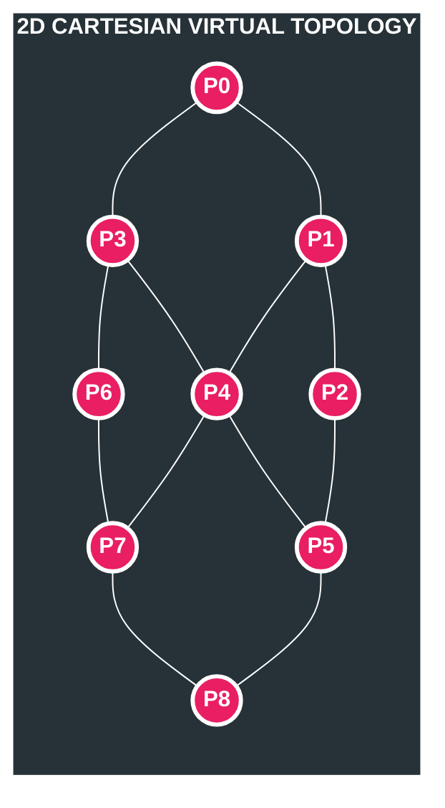

**Example implementation (`Chapter04/Codes/virtualTopology.py`):**
```python
from mpi4py import MPI
import numpy as np

UP = 0
DOWN = 1
LEFT = 2
RIGHT = 3
neighbour_processes = [0, 0, 0, 0]

if __name__ == "__main__":
    comm = MPI.COMM_WORLD
    rank = comm.Get_rank()  # Fixed
    size = comm.Get_size()  # Fixed

    # Create a grid as square as possible
    grid_row = int(np.floor(np.sqrt(size)))
    grid_column = size // grid_row
    
    # Adjust if product exceeds size
    while grid_row * grid_column > size:
        grid_column -= 1
    while grid_row * grid_column > size:
        grid_row -= 1

    if rank == 0:
        print("Building a %d x %d grid topology for %d processes:" % (grid_row, grid_column, size))
        print("Total processes in grid: %d" % (grid_row * grid_column))
        print("Note: Some processes may not be in the grid if size is not perfect square\n")

    # Create Cartesian topology
    cartesian_communicator = comm.Create_cart(
        dims=(grid_row, grid_column),
        periods=(True, True),  # Periodic boundaries (toroidal)
        reorder=True
    )
    
    # Only processes in the grid will have valid communicator
    if cartesian_communicator != MPI.COMM_NULL:
        my_mpi_row, my_mpi_col = cartesian_communicator.Get_coords(cartesian_communicator.Get_rank())
        
        # Get neighbors (shift by 1 in each dimension)
        neighbour_processes[UP], neighbour_processes[DOWN] = cartesian_communicator.Shift(0, 1)
        neighbour_processes[LEFT], neighbour_processes[RIGHT] = cartesian_communicator.Shift(1, 1)
        
        print("Process = %d, row = %d, column = %d" % (rank, my_mpi_row, my_mpi_col))
        print("----> neighbour_processes[UP] = %d" % neighbour_processes[UP])
        print("----> neighbour_processes[DOWN] = %d" % neighbour_processes[DOWN])
        print("----> neighbour_processes[LEFT] = %d" % neighbour_processes[LEFT])
        print("----> neighbour_processes[RIGHT] = %d\n" % neighbour_processes[RIGHT])
    else:
        print("Process %d is not part of the Cartesian grid" % rank)
```

**Output:**
<p align="center">
  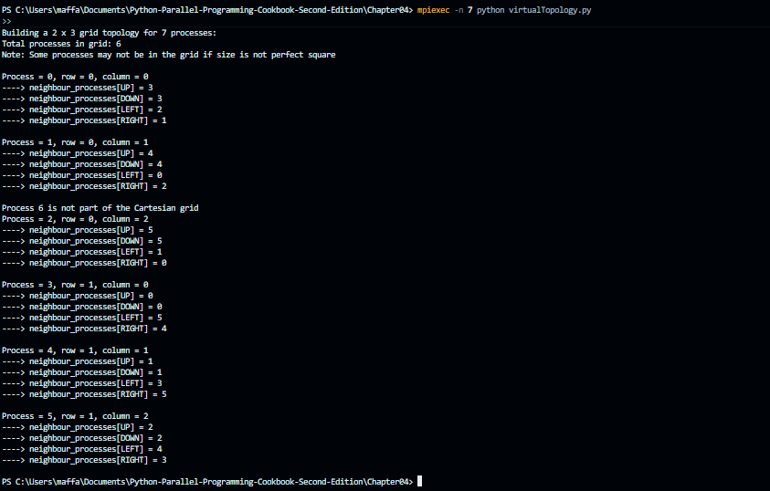
</p>
