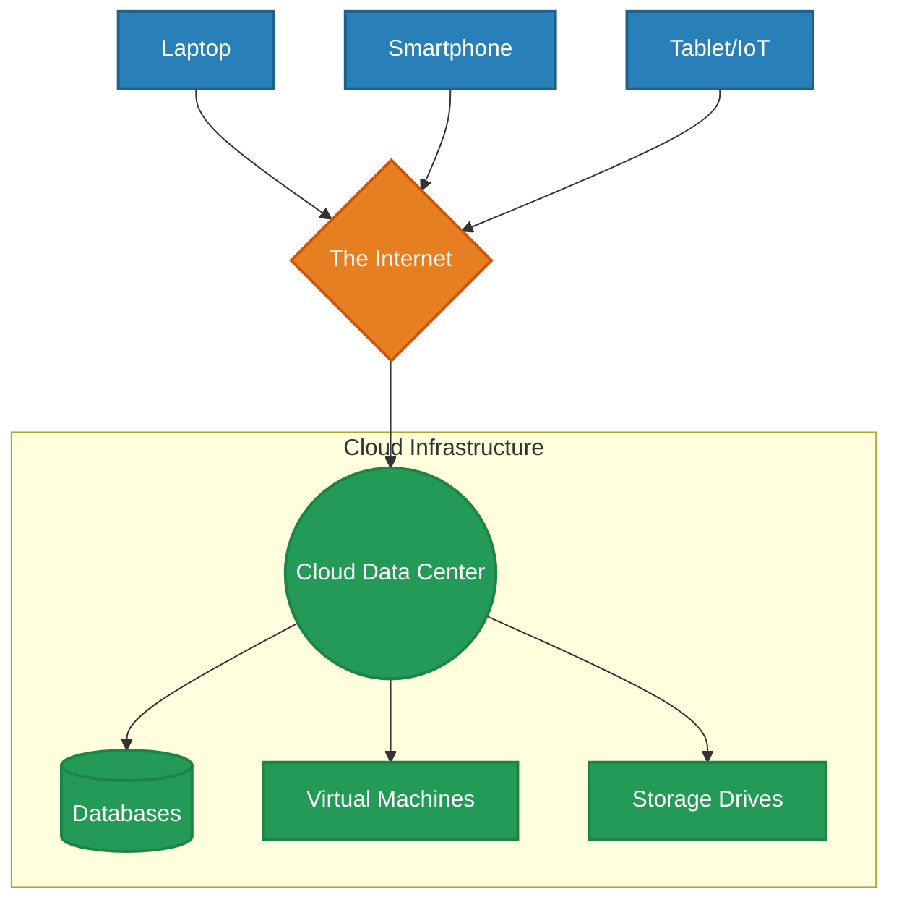
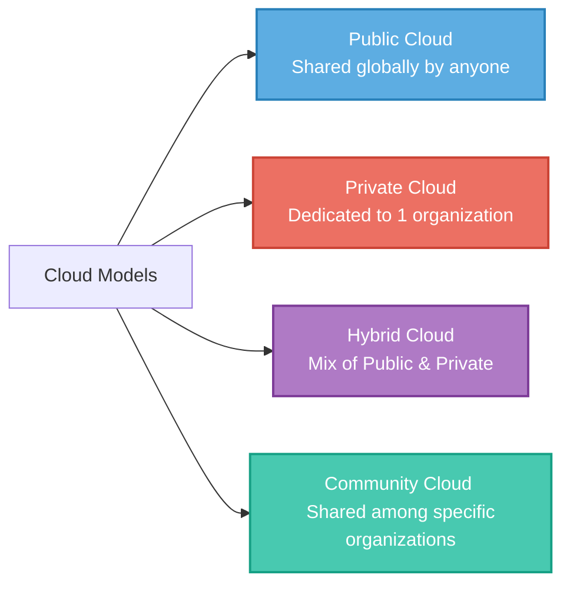
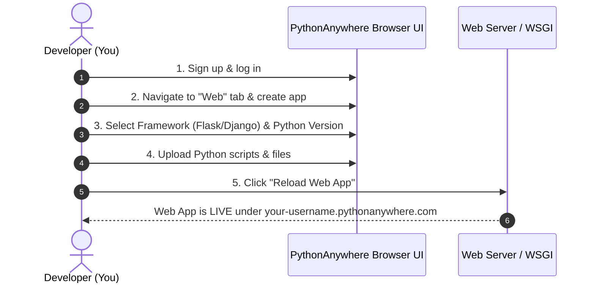
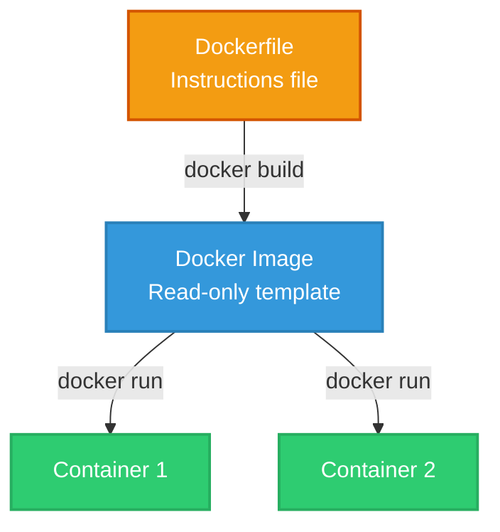
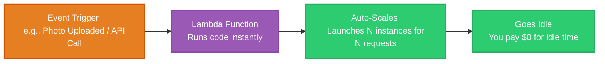

# Chapter 07: Cloud Computing, Containers, & Serverless

Welcome to **Chapter 07**! This guide explains cloud concepts, architecture styles, application deployment (PythonAnywhere), containerization (Docker), and serverless computing in an easy-to-understand way with colorful diagrams.

---

## Table of Contents
1. [What is Cloud Computing?](#1-what-is-cloud-computing)
2. [Cloud Architecture & Service Models (SaaS, PaaS, IaaS)](#2-cloud-architecture--service-models)
3. [Cloud Deployment & Distribution Models](#3-cloud-deployment--distribution-models)
4. [Developing Web Apps with PythonAnywhere](#4-developing-web-apps-with-pythonanywhere)
5. [Dockerizing a Python Application](#5-dockerizing-a-python-application)
6. [Serverless Computing & Lambda Functions](#6-serverless-computing--lambda-functions)

---

## 1. What is Cloud Computing?

Instead of storing files or running heavy programs on your local laptop's hardware, **Cloud Computing** lets you access storage, database, and processing power over the internet on someone else's high-performance physical servers (like Google or Amazon data centers). It is similar to renting electricity or water instead of building your own power station.

### Conceptual Representation of Cloud Computing


---

## 2. Cloud Architecture & Service Models

Cloud services are structured into three main models, offering varying levels of control and management.

```mermaid
graph BT
    %% Styling Definition
    classDef iaas fill:#EC7063,stroke:#CB4335,stroke-width:2px,color:#fff;
    classDef paas fill:#F4D03F,stroke:#D4AC0D,stroke-width:2px,color:#000;
    classDef saas fill:#5DADE2,stroke:#2980B9,stroke-width:2px,color:#fff;

    subgraph Service Stack (Lower Level to User Level)
        IaaS[IaaS <br/> Infrastructure as a Service <br/> Rent Virtual Machines & Storage]:::iaas
        PaaS[PaaS <br/> Platform as a Service <br/> Build & Run Apps without OS Setup]:::paas
        SaaS[SaaS <br/> Software as a Service <br/> End-user applications ready-to-use]:::saas
        
        IaaS --> PaaS
        PaaS --> SaaS
    end
```

### Comparison of Service Models

| Model | What You Manage | What Provider Manages | Popular Examples | Best For |
| :--- | :--- | :--- | :--- | :--- |
| **SaaS** | Nothing (just utilize the app configuration) | Everything (hardware, OS, application, code, patches) | Gmail, Netflix, Zoom, Google Docs | End-users looking for instant tools |
| **PaaS** | Application code & data configuration | Operating system, middleware, servers, storage, networking | Google App Engine, Heroku, AWS Elastic Beanstalk | Developers building web apps rapidly |
| **IaaS** | Operating System, runtime, applications, data | Physical servers, virtualization layer, hard drives, networks | AWS EC2, Microsoft Azure VMs, Google Compute Engine | System admins needing maximum infrastructure control |

---

## 3. Cloud Deployment & Distribution Models

Deployment models describe who owns, operates, and has access to the cloud environment.



### Key Characteristics of Deployment Models

> [!NOTE]  
> **Public Cloud:** Highly cost-effective and scalable, but shares physical infrastructure with other tenants.  
> **Private Cloud:** Highly secure and customizable, but requires high maintenance budget and physical management.  
> **Hybrid Cloud:** Best of both worlds. You can run critical/sensitive calculations on a secure private node and scale into the public cloud during spikes.

---

## 4. Developing Web Apps with PythonAnywhere

**PythonAnywhere** is a PaaS (Platform as a Service) tool. It lets developers write, run, and host Python web applications directly from a web browser.

###  Step-by-Step Deployment Flow



---

## 5. Dockerizing a Python Application

**Docker** packages your application code, dependencies, libraries, and operating system configuration into a single immutable unit called an **Image**. This image runs inside an isolated container exactly the same way across all machines.



###  Example Dockerfile for Python Web App
```dockerfile
# 1. Use an official Python runtime as a parent image
FROM python:3.9-slim

# 2. Set the working directory in the container
WORKDIR /app

# 3. Copy dependencies and install them
COPY requirements.txt ./
RUN pip install --no-cache-dir -r requirements.txt

# 4. Copy the rest of the application code
COPY . .

# 5. Make port 5000 available to the world outside
EXPOSE 5000

# 6. Define the command to run the app
CMD ["python", "app.py"]
```

---

## 6. Serverless Computing & Lambda Functions

In **Serverless Computing**, physical servers exist, but all provisioning, scaling, and system maintenance are completely hidden from you. You write standalone pieces of code called **Functions** (e.g., AWS Lambda), which only run when triggered by specific events.



###  Trade-offs: Serverless Pros & Cons

|  Advantages / Pros |  Challenges / Cons |
| :--- | :--- |
| **No Idle Costs:** Pay only for the exact milliseconds your code runs. | **Cold Starts:** First execution takes longer because the server needs time to spin up. |
| **Infinite Auto-Scaling:** Automatically scales up to handle thousands of concurrent requests. | **Execution Time Limits:** Functions usually terminate if they run longer than 5–15 minutes. |
| **Zero Maintenance:** No operating system updates or server patching to manage. | **Vendor Lock-in:** Moving code from AWS Lambda to Google Cloud Functions can require rewrites. |
