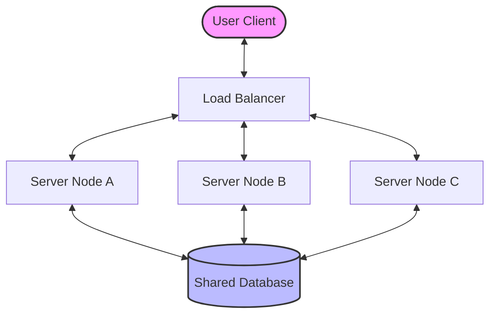
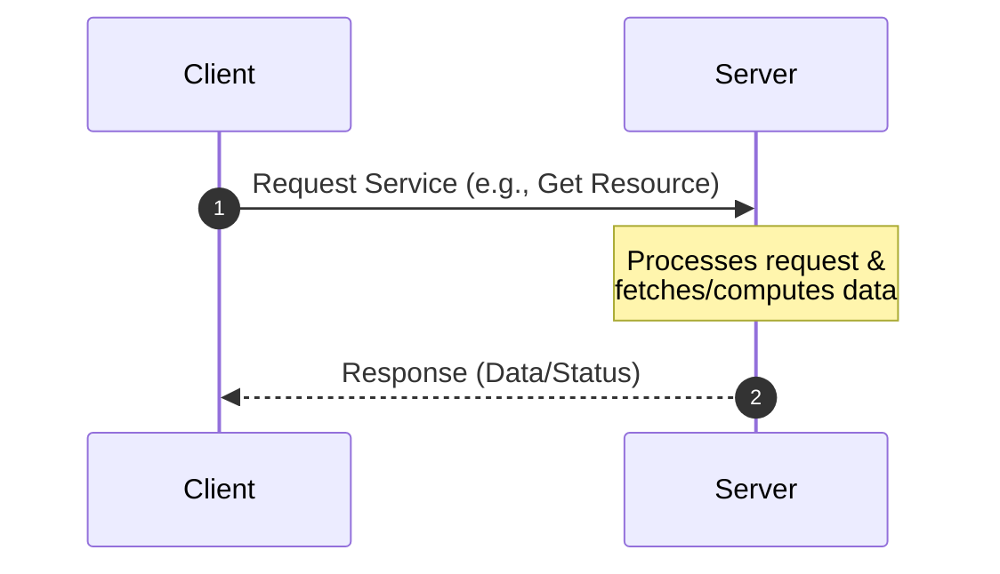
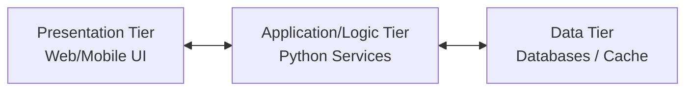
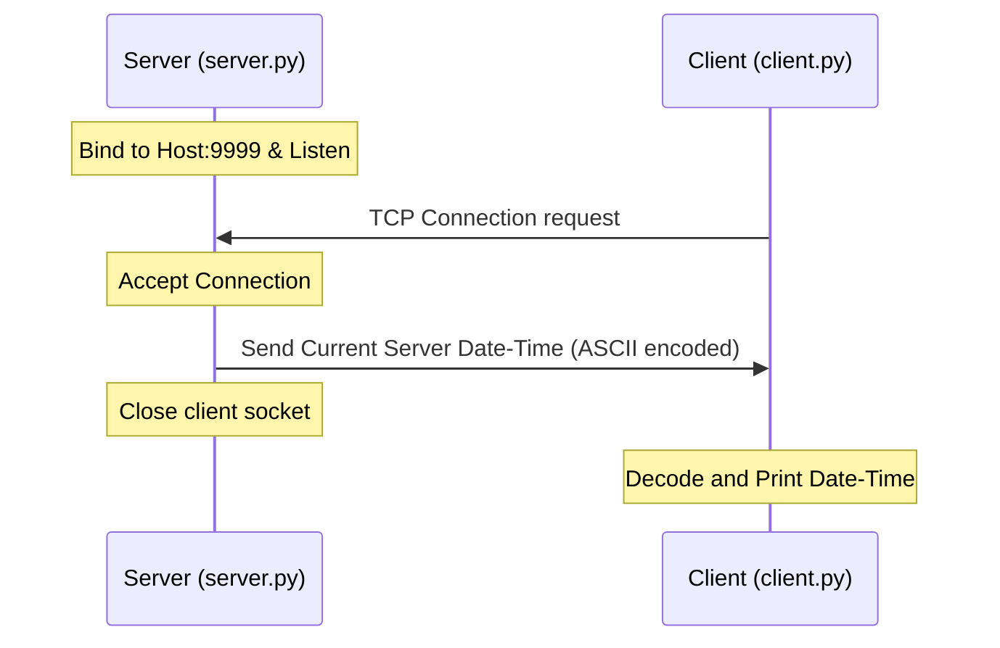
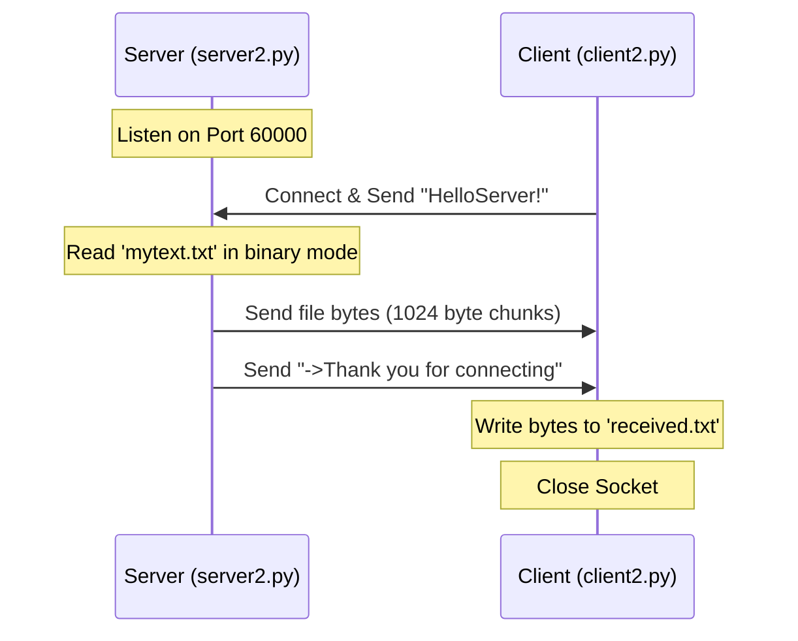
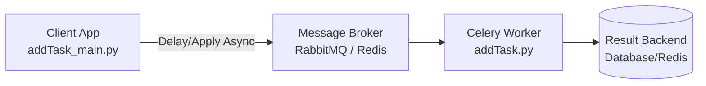
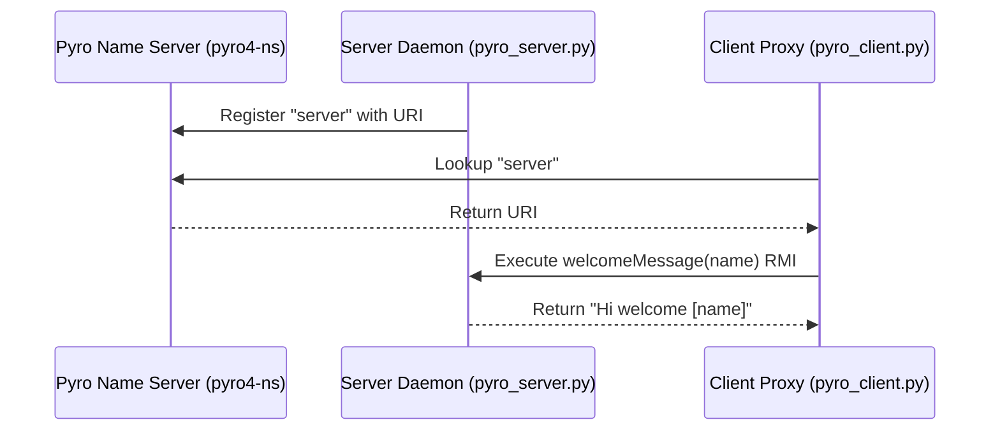
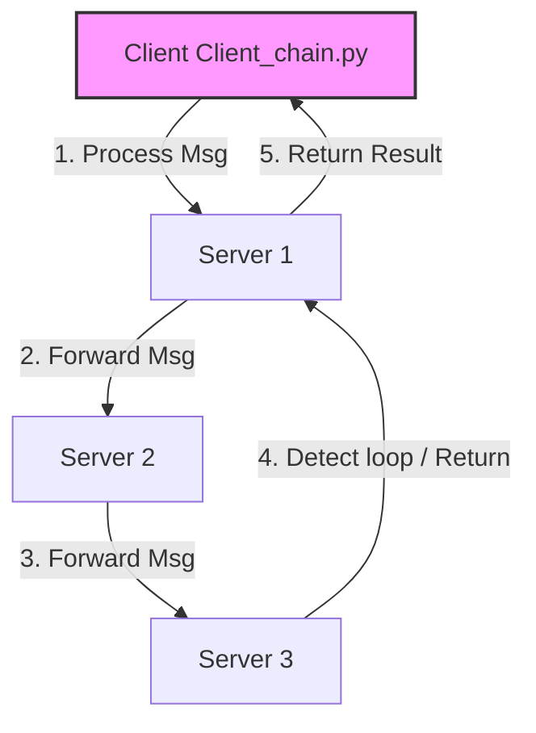

# Chapter 6: Distributed Python

Welcome to the comprehensive guide and documentation for **Chapter 6: Distributed Python**. This repository contains practical implementations, architectural explanations, step-by-step setup guides, and runtime outputs for building distributed systems in Python.

---

## Table of Contents
1. [Introducing Distributed Computing](#1-introducing-distributed-computing)
2. [Types of Distributed Applications](#2-types-of-distributed-applications)
   - [Client-Server Applications & Architecture](#client-server-applications--architecture)
   - [TCP/IP Client-Server Communications](#tcpip-client-server-communications)
   - [Multi-Level (N-Tier) Applications](#multi-level-n-tier-applications)
3. [Using the Python Socket Module](#3-using-the-python-socket-module)
   - [Example 1: Basic Date-Time Server & Client](#example-1-basic-date-time-server--client)
   - [Example 2: File Transfer Server & Client](#example-2-file-transfer-server--client)
4. [Distributed Task Management with Celery](#4-distributed-task-management-with-celery)
5. [Remote Method Invocation (RMI) with Pyro4](#5-remote-method-invocation-rmi-with-pyro4)
   - [Example 1: Basic Pyro4 Welcome Server](#example-1-basic-pyro4-welcome-server)
   - [Example 2: Implementing Chain Topology](#example-2-implementing-chain-topology)

---

## 1. Introducing Distributed Computing

**Distributed computing** is a field of computer science that studies distributed systems. A *distributed system* is a system whose components are located on different networked computers, which communicate and coordinate their actions by passing messages to one another. The components interact with each other in order to achieve a common goal.



### Key Motivations:
*   **Resource Sharing:** Sharing hardware, software, or data resources.
*   **Scalability:** The ability to handle growing amounts of work by adding resources (horizontal vs. vertical scaling).
*   **Fault Tolerance & Reliability:** If one node fails, the remaining nodes can continue to operate.
*   **Concurrency:** Multiple processing units running simultaneously to execute tasks faster.

---

## 2. Types of Distributed Applications

Distributed systems are designed in various shapes and structures depending on operational requirements.

### Client-Server Applications & Architecture
In a client-server architecture, tasks or workloads are partitioned between the providers of a resource or service, called **servers**, and service requesters, called **clients**.



### TCP/IP Client-Server Communications
Communication is established using standard network protocols. 
*   **TCP (Transmission Control Protocol):** Connection-oriented, guarantees delivery, ensures packet ordering, and handles error checking.
*   **IP (Internet Protocol):** Directs packets to the correct host using IP addressing.

### Multi-Level (N-Tier) Applications
An N-tier application separates the presentation, application processing, and data management functions.



---

## 3. Using the Python Socket Module

The `socket` module in Python provides access to the BSD socket interface. Sockets allow communication between two different processes on the same or different machines.

### Example 1: Basic Date-Time Server & Client

This implementation demonstrates a simple server that listens on a port, accepts client connections, sends the current server time, and closes the connection.

#### Architecture Flowchart:


#### Code Files:
*   **Server Code:** [server.py](file:///c:/Users/maffa/Desktop/Chapter06/Codes/socket/server.py)
*   **Client Code:** [client.py](file:///c:/Users/maffa/Desktop/Chapter06/Codes/socket/client.py)

#### Output Screenshot:


---

### Example 2: File Transfer Server & Client

This implementation demonstrates sending a file (`mytext.txt`) from a server to a client upon request.

#### Architecture Flowchart:


#### Code Files:
*   **Server Code:** [server2.py](file:///c:/Users/maffa/Desktop/Chapter06/Codes/socket/server2.py)
*   **Client Code:** [client2.py](file:///c:/Users/maffa/Desktop/Chapter06/Codes/socket/client2.py)

#### Output Screenshot:


---

## 4. Distributed Task Management with Celery

**Celery** is an asynchronous task queue/job queue based on distributed message passing. It is focused on real-time operation but supports scheduling as well.

### Celery Architecture Diagram:


### Windows Setup
On Windows, Celery needs a compatible event pool execution method. You can run Celery on Windows using `eventlet` or `gevent` pool solo:
```bash
celery -A addTask worker --loglevel=info -P solo
```

#### Code Files:
*   **Task Definition:** [addTask.py](file:///c:/Users/maffa/Desktop/Chapter06/Codes/Celery/addTask.py)
*   **Main Runner:** [addTask_main.py](file:///c:/Users/maffa/Desktop/Chapter06/Codes/Celery/addTask_main.py)

#### Output Screenshot:


---

## 5. Remote Method Invocation (RMI) with Pyro4

**Pyro4** (Python Remote Objects) is a library that enables you to build applications in which objects can talk to each other over the network, with minimal programming effort. You can just write normal Python classes and Pyro will make them callable remotely.

### Example 1: Basic Pyro4 Welcome Server

#### Pyro4 Communication Architecture:


#### Code Files:
*   **Pyro4 Server:** [pyro_server.py](file:///c:/Users/maffa/Desktop/Chapter06/Codes/Pyro4/First%20Example/pyro_server.py)
*   **Pyro4 Client:** [pyro_client.py](file:///c:/Users/maffa/Desktop/Chapter06/Codes/Pyro4/First%20Example/pyro_client.py)

#### Output Screenshot:


---

### Example 2: Implementing Chain Topology

In this configuration, a message is routed through a series of servers (forming a chain or ring topology). Each server adds its identifier to the message and forwards it to the next server in the chain until the chain is closed (i.e., a server detects that the message has returned to the originator).

#### Chain Topology Flowchart:


#### Code Files:
*   **Topology Definition:** [chainTopology.py](file:///c:/Users/maffa/Desktop/Chapter06/Codes/Pyro4/Second%20Example/chainTopology.py)
*   **Client Runner:** [client_chain.py](file:///c:/Users/maffa/Desktop/Chapter06/Codes/Pyro4/Second%20Example/client_chain.py)
*   **Server 1:** [server_chain_1.py](file:///c:/Users/maffa/Desktop/Chapter06/Codes/Pyro4/Second%20Example/server_chain_1.py)
*   **Server 2:** [server_chain_2.py](file:///c:/Users/maffa/Desktop/Chapter06/Codes/Pyro4/Second%20Example/server_chain_2.py)
*   **Server 3:** [server_chain_3.py](file:///c:/Users/maffa/Desktop/Chapter06/Codes/Pyro4/Second%20Example/server_chain_3.py)

#### Output Screenshot:

