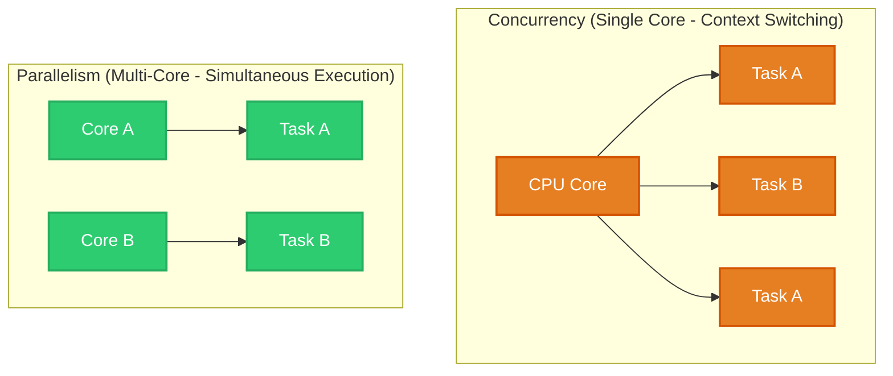
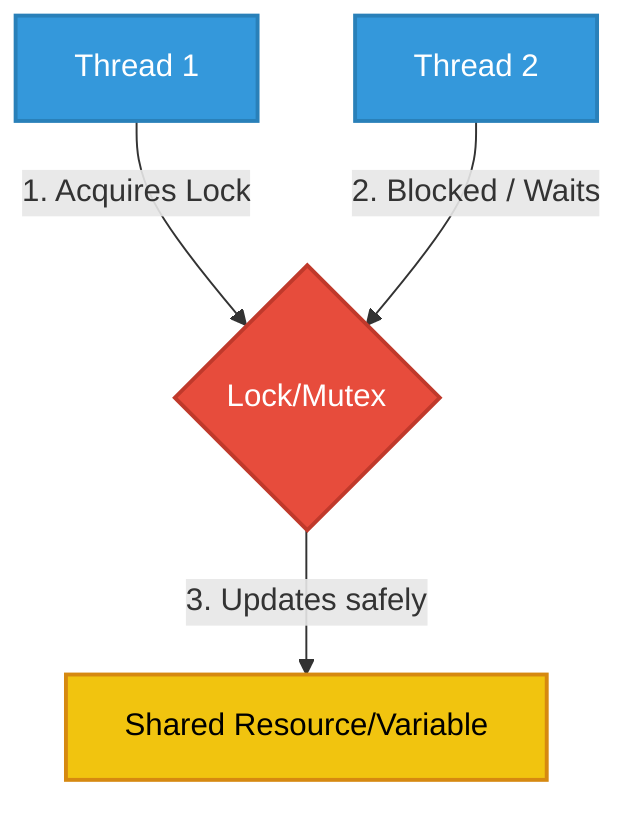
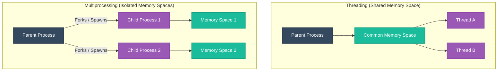
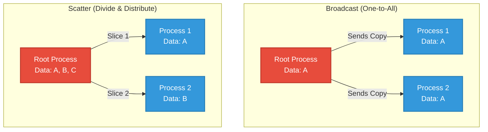
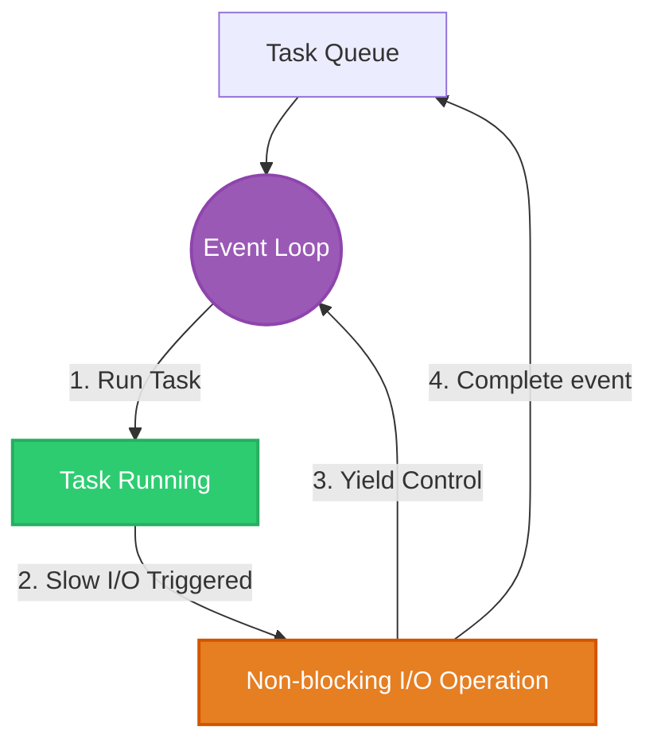
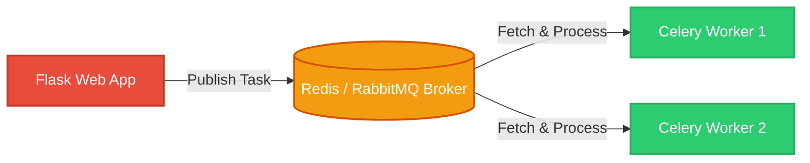
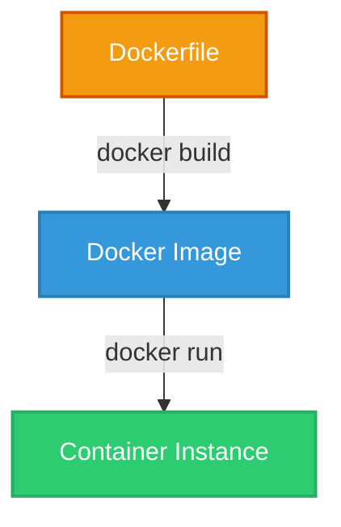

# Parallel & Distributed Computing (PDC-SP26-SE)

Welcome to the **Parallel & Distributed Computing (PDC)** learning portfolio of Muhammad Affan. This repository documents key theoretical concepts, practical implementations, and programming paradigms covered from Chapter 1 through Chapter 7.

> [!NOTE]  
> **Course Assignment Submission**  
> This portfolio and implementation work has been developed as an assignment under the supervision of **Miss Rameen Anwar**.

---

## Table of Contents
1. [Chapter 1: Getting Started with Parallel Computing & Python](#chapter-1-getting-started-with-parallel-computing--python)
2. [Chapter 2: Thread-Based Parallelism](#chapter-2-thread-based-parallelism)
3. [Chapter 3: Process-Based Parallelism](#chapter-3-process-based-parallelism)
4. [Chapter 4: Message Passing (MPI)](#chapter-4-message-passing-mpi)
5. [Chapter 5: Asynchronous Programming](#chapter-5-asynchronous-programming)
6. [Chapter 6: Distributed Python](#chapter-6-distributed-python)
7. [Chapter 7: Cloud Computing, Containers, & Serverless](#chapter-7-cloud-computing-containers--serverless)

---

## Chapter 1: Getting Started with Parallel Computing & Python

Introduces the fundamentals of high-performance computing, the distinction between concurrency and parallelism, and Flynn's Taxonomy.

### Concurrency vs. Parallelism
- **Concurrency:** Dealing with multiple things at once (overlapping execution on a single core via time slicing).
- **Parallelism:** Doing multiple things at the same time (simultaneous execution on multiple CPU cores).

**Explore Chapter:** [Chapter01 Folder](file:///c:/Semester6/Parallel%20Distributed%20and%20Computing/Muhammad-Affan-23FA-003-SE/Muhammad-Affan-23FA-003-SE/Chapter01)

---

## Chapter 2: Thread-Based Parallelism

Focuses on utilizing multiple threads within a single process to execute tasks concurrently. It covers Python’s `threading` module, race conditions, synchronization primitives, and the Global Interpreter Lock (GIL).

### Thread Synchronization & Lock Mechanism
When multiple threads access shared resources, data corruption (race conditions) can occur. **Locks (Mutexes)** guarantee that only one thread accesses a critical section at any given time.

**Explore Chapter:** [Chapter02 Folder](file:///c:/Semester6/Parallel%20Distributed%20and%20Computing/Muhammad-Affan-23FA-003-SE/Muhammad-Affan-23FA-003-SE/Chapter02)

---

## Chapter 3: Process-Based Parallelism

Since Python's GIL prevents multiple threads from running Python code in parallel on separate cores, Process-Based Parallelism runs tasks on completely separate operating system processes, bypassing the GIL.

### Memory Layout: Threading vs. Multiprocessing

**Explore Chapter:** [Chapter03 Folder](file:///c:/Semester6/Parallel%20Distributed%20and%20Computing/Muhammad-Affan-23FA-003-SE/Muhammad-Affan-23FA-003-SE/Chapter03)

---

## Chapter 4: Message Passing (MPI)

Introduces distributed memory parallelism using the **Message Passing Interface (MPI)** via the `mpi4py` library. Processes execute independently and coordinate by exchanging messages.

### Collective Communication Operations
- **Broadcast (bcast):** A single master process sends data to all other processes.
- **Scatter:** A master process divides an array/list and distributes portions to each process.
- **Gather:** Reverses Scatter by collecting individual results back into a single array on the master.

**Explore Chapter:** [Chapter04 Folder](file:///c:/Semester6/Parallel%20Distributed%20and%20Computing/Muhammad-Affan-23FA-003-SE/Muhammad-Affan-23FA-003-SE/Chapter04)

---

## Chapter 5: Asynchronous Programming

Explores single-threaded concurrency using Python's `asyncio` module. Instead of multi-threading or multi-processing, asynchronous code runs in a loop (Event Loop) and yields control during slow I/O operations (web requests, disk access).

### Asynchronous Event Loop Workflow

**Explore Chapter:** [Chapter05 Folder](file:///c:/Semester6/Parallel%20Distributed%20and%20Computing/Muhammad-Affan-23FA-003-SE/Muhammad-Affan-23FA-003-SE/Chapter05)

---

## Chapter 6: Distributed Python

Covers distributed computing frameworks. Using **Pyro4** (Remote Method Invocation) and **Celery** (Distributed Task Queue), code execution is offloaded across distinct networked machines.

### Celery & Message Broker Architecture

**Explore Chapter:** [Chapter06 Folder](file:///c:/Semester6/Parallel%20Distributed%20and%20Computing/Muhammad-Affan-23FA-003-SE/Muhammad-Affan-23FA-003-SE/Chapter06)

---

## Chapter 7: Cloud Computing, Containers, & Serverless

Summarizes modern cloud deployment paradigms including Service Models (IaaS, PaaS, SaaS), deployment on PythonAnywhere, containerization using Docker, and event-driven Serverless (Lambda) computing.

### Docker Container Lifecycle
Docker builds code, runtimes, and configs into a static image template, which is spun up as an isolated execution container environment.

**Explore Chapter:** [Chapter07 Folder](file:///c:/Semester6/Parallel%20Distributed%20and%20Computing/Muhammad-Affan-23FA-003-SE/Muhammad-Affan-23FA-003-SE/Chapter07)
