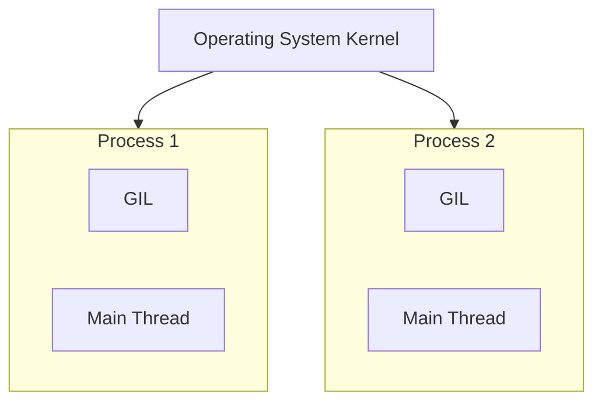

# Chapter 03: Process-Based Parallelism

## Overview

Welcome to the **Parallel and Distributed Computing (PDC)** documentation for Chapter 03. Moving away from the shared-memory architecture of Threading (Chapter 2), this chapter explores **Multiprocessing**, utilizing isolated memory spaces and OS-level processes to completely bypass the Python Global Interpreter Lock (GIL).

This guide is strictly divided into two sections: **Part 1** covers the theoretical computer science concepts behind isolated processes and inter-process communication, and **Part 2** showcases practical Python code implementations.

---

## Table of Contents

### Part 1: Theoretical Foundations
1. [The Multiprocessing Paradigm](#1-the-multiprocessing-paradigm)
2. [Process Management](#2-process-management)
    - [Process Subclassing & Pools](#process-subclassing--pools)
    - [Daemon Processes](#daemon-processes)
3. [Inter-Process Communication (IPC)](#3-inter-process-communication-ipc)

### Part 2: Practical Implementation
4. [Implementation Breakdown & Outputs](#4-implementation-breakdown--outputs)
    - [Basic Process Spawning](#basic-process-spawning)
    - [Daemon Processes](#daemon-processes-1)
    - [Process Pools](#process-pools)
    - [IPC: Communicating with Pipes](#ipc-communicating-with-pipes)
5. [Execution Guide](#5-execution-guide)

---

# PART 1: THEORETICAL FOUNDATIONS

## 1. The Multiprocessing Paradigm

Unlike Threading, Multiprocessing creates entirely independent Python processes at the operating system level. Each process receives its own Python interpreter, its own memory space, and crucially, its own Global Interpreter Lock (GIL).



- **Pros:** True parallelism capable of maximizing CPU utilization across multiple cores. Perfect for heavy mathematical computations (CPU-bound tasks).
- **Cons:** Significantly higher memory overhead. Spinning up a new process takes more time and memory than spinning up a thread.

## 2. Process Management

### Process Subclassing & Pools
- **Subclassing:** Similar to `threading.Thread`, you can inherit from `multiprocessing.Process` to create custom executable process architecture.
- **Process Pools:** Creating processes manually is expensive. A Process Pool pre-allocates a set number of worker processes. Workloads are then mapped to this pool, drastically improving performance by reusing active execution units.

### Daemon Processes
A daemon process is a background process. By default, a Python script will not exit until all of its spawned child processes complete. If a process is flagged as a `daemon=True`, the main Python script will forcefully terminate it the moment the main script concludes. Useful for infinite background monitoring loops.

## 3. Inter-Process Communication (IPC)

Because processes do not share memory, they require explicit IPC mechanisms to exchange data.


- **Pipes:** A two-way connection primarily between exactly two processes. Ideal for fast, direct communication.
- **Queues:** Thread-safe and process-safe structures allowing multiple producers and consumers to securely exchange Python objects.

---
---

# PART 2: PRACTICAL IMPLEMENTATION

## 4. Implementation Breakdown & Outputs

The `Chapter03` directory contains scripts demonstrating these advanced process mechanics.

### Basic Process Spawning
**File:** `spawning_processes.py`

**Code Snippet:**
```python
import multiprocessing

def myFunc(i):
    print(f'calling myFunc from process n°: {i}')
    return

if __name__ == '__main__':
    for i in range(6):
        process = multiprocessing.Process(target=myFunc, args=(i,))
        process.start()
        process.join()
```
**Expected Output:**
```text
calling myFunc from process n°: 0
calling myFunc from process n°: 1
...
calling myFunc from process n°: 5
```
*(Demonstrates basic allocation of OS-level processes bypassing the GIL).*

---

### Daemon Processes
**File:** `run_background_processes.py`

**Code Snippet:**
```python
import multiprocessing
import time

def foo():
    name = multiprocessing.current_process().name
    print(f"Starting {name}")
    time.sleep(2)
    print(f"Exiting {name}")

if __name__ == '__main__':
    background_process = multiprocessing.Process(name='background_process', target=foo)
    background_process.daemon = True
    
    background_process.start()
    # No join() means main thread finishes immediately and kills the daemon
```
**Expected Output:**
```text
Starting background_process
```
*(Notice "Exiting" is never printed because the main program exits and immediately kills the daemon process).*

---

### Process Pools
**File:** `process_pool.py`

**Code Snippet:**
```python
import multiprocessing

def function_square(data):
    result = data * data
    return result

if __name__ == '__main__':
    inputs = list(range(0,100))
    pool = multiprocessing.Pool(processes=4)
    pool_outputs = pool.map(function_square, inputs)
    
    pool.close() 
    pool.join()  
    print(f'Pool outputs: {pool_outputs}')
```
**Expected Output:**
```text
Pool outputs: [0, 1, 4, 9, 16, 25, 36, 49, 64, 81...]
```
*(Demonstrates efficient mapping of 100 workloads across a limited pool of exactly 4 reusable CPU processes).*

---

### IPC: Communicating with Pipes
**File:** `communicating_with_pipe.py`

**Code Snippet:**
```python
import multiprocessing

def create_items(pipe):
    output_pipe, _ = pipe
    for item in range(10):
        output_pipe.send(item)
    output_pipe.close()

def multiply_items(pipe_1, pipe_2):
    close, input_pipe = pipe_1
    close.close()
    output_pipe, _ = pipe_2
    try:
        while True:
            item = input_pipe.recv()
            output_pipe.send(item * item)
    except EOFError:
        output_pipe.close()

if __name__== '__main__':
    pipe_1 = multiprocessing.Pipe(True)
    process_pipe_1 = multiprocessing.Process(target=create_items, args=(pipe_1,))
    process_pipe_1.start()
    
    pipe_2 = multiprocessing.Pipe(True)
    process_pipe_2 = multiprocessing.Process(target=multiply_items, args=(pipe_1, pipe_2))
    process_pipe_2.start()
    
    pipe_1[0].close()
    pipe_2[0].close()
    
    try:
        while True:
            print(pipe_2[1].recv())
    except EOFError:
        print("End of stream")
```

**Expected Output:**
```text
0
1
4
9
16
25
36
49
64
81
End of stream
```
*(Demonstrates raw OS-level memory bridging allowing isolated processes to exchange mathematical data successfully).*

---

### Process Barrier Synchronization
**File:** `processes_barrier.py`

**Code Snippet:**
```python
import multiprocessing
from multiprocessing import Barrier, Lock, Process
from time import time
from datetime import datetime

def test_with_barrier(synchronizer, serializer):
    name = multiprocessing.current_process().name
    synchronizer.wait()
    now = time()
    with serializer:
        print("process %s ----> %s" %(name, datetime.fromtimestamp(now)))

def test_without_barrier():
    name = multiprocessing.current_process().name
    now = time()
    print("process %s ----> %s" %(name, datetime.fromtimestamp(now)))

if __name__ == '__main__':
    synchronizer = Barrier(2)
    serializer = Lock()
    Process(name='p1 - test_with_barrier', target=test_with_barrier, args=(synchronizer, serializer)).start()
    Process(name='p2 - test_with_barrier', target=test_with_barrier, args=(synchronizer, serializer)).start()
    Process(name='p3 - test_without_barrier', target=test_without_barrier).start()
    Process(name='p4 - test_without_barrier', target=test_without_barrier).start()
```

**Expected Output:**
```text
process p3 - test_without_barrier ----> 2026-06-04 22:31:12.482019
process p1 - test_with_barrier ----> 2026-06-04 22:31:12.498112
process p2 - test_with_barrier ----> 2026-06-04 22:31:12.498112
process p4 - test_without_barrier ----> 2026-06-04 22:31:12.502019
```
*(Demonstrates how barrier synchronization ensures p1 and p2 proceed past `synchronizer.wait()` at the exact same physical moment, while p3 and p4 run independently without synchronization).*

---

### Process Termination (Killing Processes)
**File:** `killing_processes.py`

**Code Snippet:**
```python
import multiprocessing
import time

def foo():
    print('Starting function')
    for i in range(0, 10):
        print('-->%d\n' % i)
        time.sleep(1)
    print('Finished function')

if __name__ == '__main__':
    p = multiprocessing.Process(target=foo)
    print('Process before execution:', p, p.is_alive())
    p.start()
    print('Process running:', p, p.is_alive())
    p.terminate()
    print('Process terminated:', p, p.is_alive())
    p.join()
    print('Process joined:', p, p.is_alive())
    print('Process exit code:', p.exitcode)
```

**Expected Output:**
```text
Process before execution: <Process name='Process-1' parent=1234 initial> False
Process running: <Process name='Process-1' pid=5678 parent=1234 started> True
Process terminated: <Process name='Process-1' pid=5678 parent=1234 started> True
Process joined: <Process name='Process-1' pid=5678 parent=1234 stopped exitcode=-15> False
Process exit code: -15
```
*(Notice how the process exit code is `-15` (SIGTERM on UNIX/Windows equivalent), proving that the child process was forcefully terminated before it could print 'Finished function' or run through all iterations).*

---

## 5. Execution Guide
To conduct these benchmarks locally, execute the corresponding scripts via your OS terminal. Ensure you are navigated inside the `Chapter03` directory:

```bash
python spawning_processes.py
python run_background_processes.py
python process_pool.py
python communicating_with_pipe.py
python processes_barrier.py
python killing_processes.py
```
