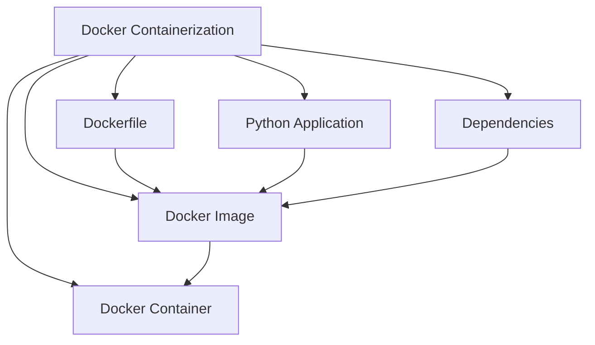
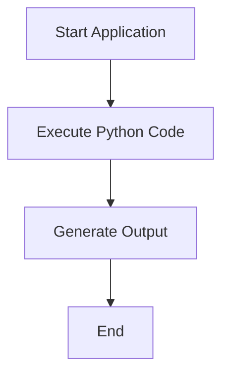
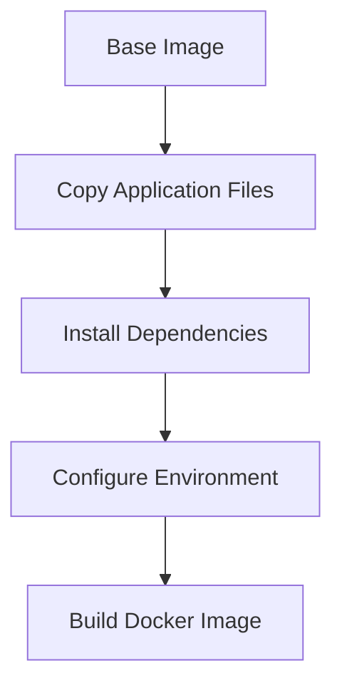
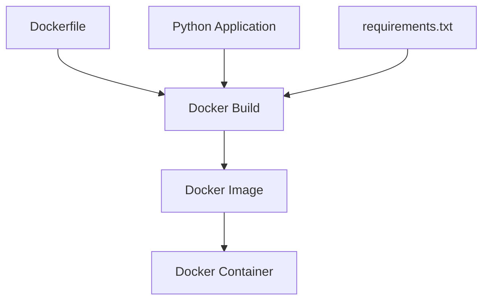
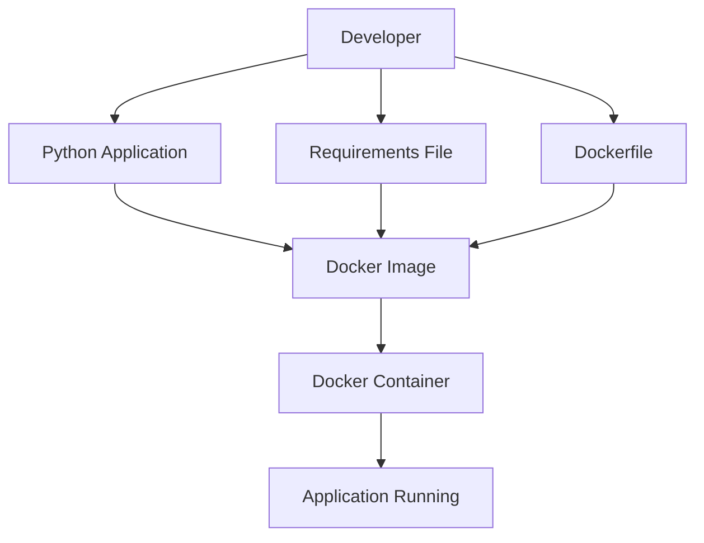
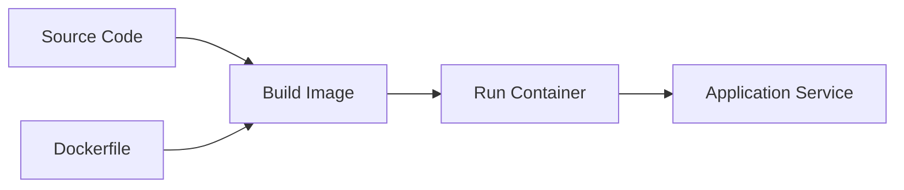

# Chapter 07 – Containerization with Docker

## Chapter Overview

### Definition

Containerization is the process of packaging an application along with its dependencies, libraries, and configurations into a portable container that can run consistently across different environments.

### Files Included

* `Dockerfile`
* `dockerize.py`
* `requirements.txt`

---

# 1. Python Application (`dockerize.py`)

### Definition

This is the main Python application that will run inside the Docker container.

### Flow

### Advantages

* Portable execution
* Easy deployment
* Consistent behavior

### Disadvantages

* Requires Python runtime
* Dependency management needed

---

# 2. Requirements File (`requirements.txt`)

### Definition

The requirements file contains all Python packages needed by the application.

### Flow

### Advantages

* Easy dependency management
* Reproducible environments

### Disadvantages

* Version conflicts may occur
* Large dependency lists increase installation time

---

# 3. Dockerfile (`Dockerfile`)

### Definition

A Dockerfile is a script containing instructions to build a Docker image.

### Flow

### Advantages

* Automated environment setup
* Easy deployment
* Consistent builds

### Disadvantages

* Learning curve for beginners
* Image size optimization required

---

# Docker Build Process

### Definition

The Docker build process combines application code, dependencies, and configuration into a reusable image.

### Advantages

* Repeatable builds
* Portable deployment
* Environment consistency

### Disadvantages

* Build time overhead
* Storage usage for images

---

# Docker Container Lifecycle

---

# Docker Architecture

---

# Traditional Deployment vs Docker

| Feature               | Traditional Deployment | Docker Deployment |
| --------------------- | ---------------------- | ----------------- |
| Environment Setup     | Manual                 | Automated         |
| Portability           | Low                    | High              |
| Dependency Management | Difficult              | Easy              |
| Scalability           | Moderate               | High              |
| Reproducibility       | Limited                | Excellent         |

---

# Containerization Workflow

---

# Benefits of Docker

### Advantages

* Platform independence
* Faster deployment
* Consistent environments
* Easy scaling
* Lightweight compared to virtual machines
* Simplified dependency management

### Disadvantages

* Requires Docker installation
* Security considerations
* Additional learning curve

---

# Final Summary

* Docker packages applications and dependencies into containers.
* The Dockerfile defines how the image is built.
* The Python application runs inside the container.
* The requirements file manages dependencies.
* Docker images are reusable deployment packages.
* Containers provide consistent execution environments.
* Containerization simplifies deployment and scaling.
* Docker improves portability and reproducibility.

## Key Concepts Learned

 Docker

 Containerization

 Dockerfile

 Docker Images

 Docker Containers

 Python Application Deployment

 Dependency Management

 Build Process

 Container Lifecycle

 Portable Software Deployment