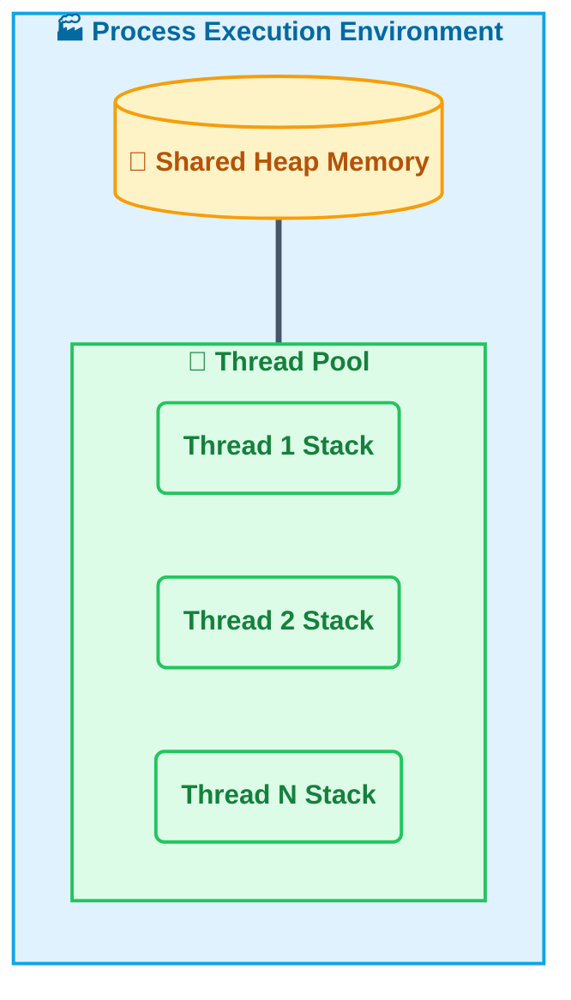
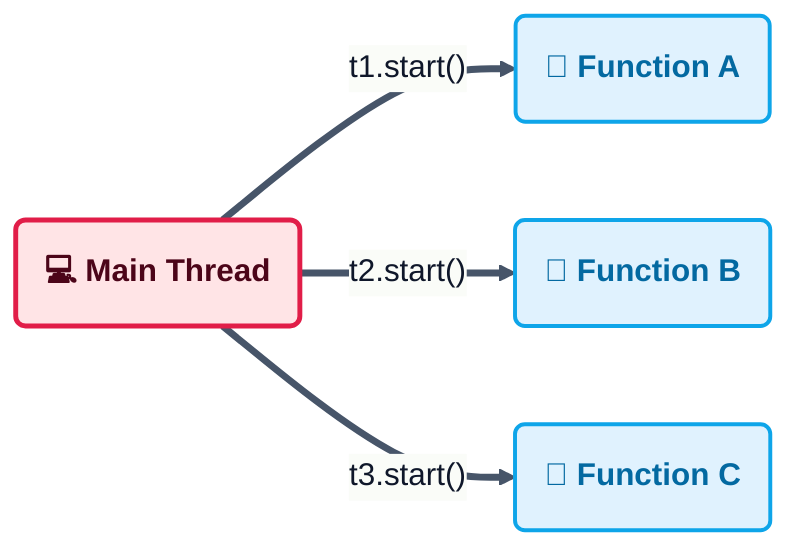
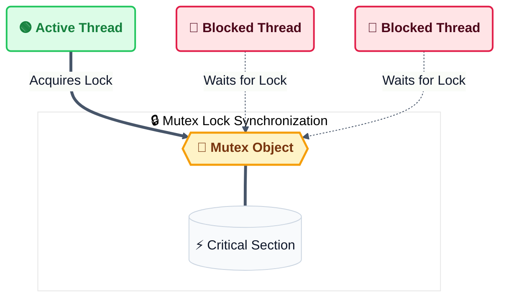
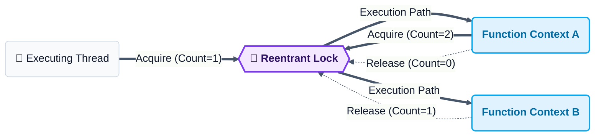
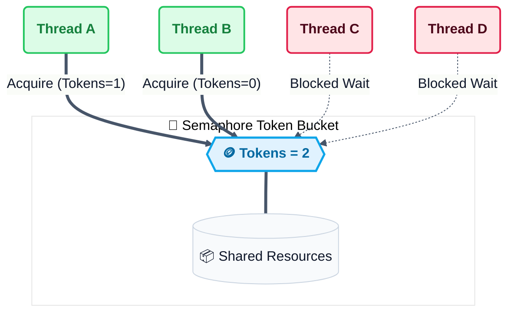
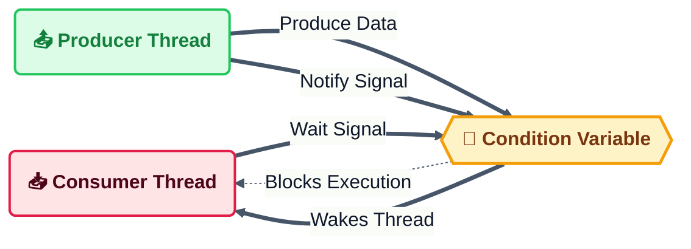
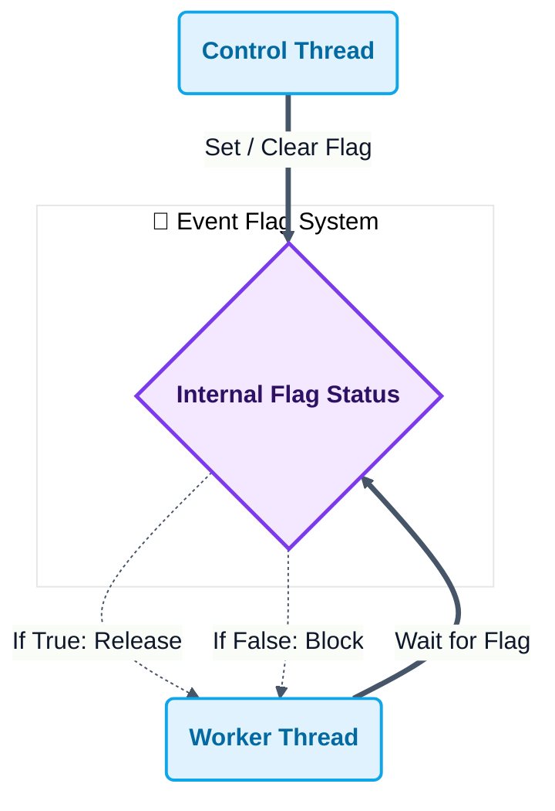
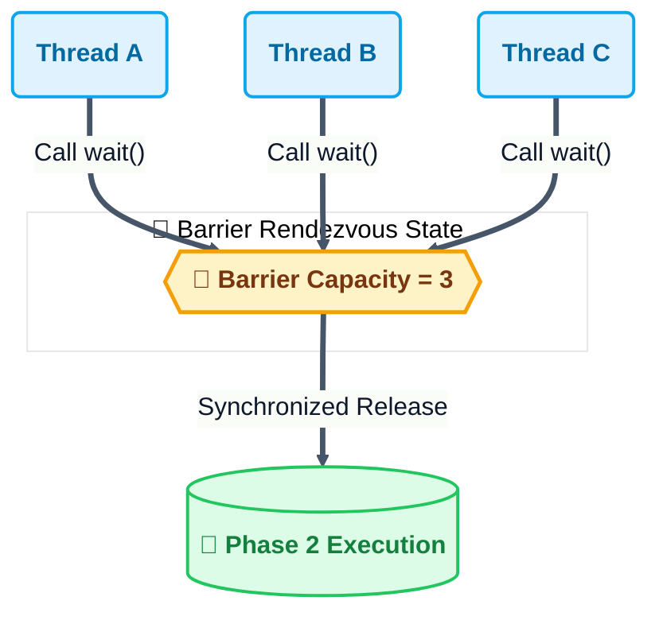
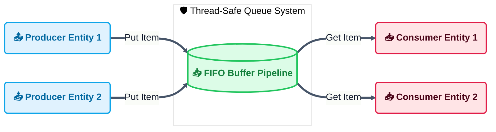

# Chapter 2: Thread-Based Parallelism

> **Comprehensive Theory and Practical Implementation Guide**
> This chapter focuses on concurrency using threads within a single Python process, pairing theoretical explanations with practical code examples.

---

## Table of Contents
1. [What is a Thread?](#1-what-is-a-thread)
2. [Python Threading Module](#2-python-threading-module)
3. [Defining a Thread](#3-defining-a-thread)
4. [Determining the Current Thread](#4-determining-the-current-thread)
   - [4.1 Thread Names and Process IDs](#41-thread-names-and-process-ids)
5. [Defining a Thread Subclass](#5-defining-a-thread-subclass)
6. [Thread Synchronization with a Lock](#6-thread-synchronization-with-a-lock)
   - [6.1 Releasing Locks Before Sleep (Non-Blocking Concurrency)](#61-releasing-locks-before-sleep-non-blocking-concurrency)
7. [Thread Synchronization with RLock](#7-thread-synchronization-with-rlock)
8. [Thread Synchronization with Semaphores](#8-thread-synchronization-with-semaphores)
9. [Thread Synchronization with a Condition](#9-thread-synchronization-with-a-condition)
10. [Thread Synchronization with an Event](#10-thread-synchronization-with-an-event)
11. [Thread Synchronization with a Barrier](#11-thread-synchronization-with-a-barrier)
12. [Thread Communication Using a Queue](#12-thread-communication-using-a-queue)

---

## 1. What is a Thread?
A thread is the smallest unit of execution that can be scheduled by an operating system. It exists within a process.
- **Process vs Thread:** A process is an instance of a program in execution with its own memory space. A thread is a sequence of execution within that process. Multiple threads within the same process share the same memory space (heap), but each thread has its own stack and program counter.
- **Concurrency vs Parallelism:** Concurrency means dealing with multiple things at once (switching between tasks), while parallelism means doing multiple things at once (simultaneous execution).
- **The Global Interpreter Lock (GIL):** In CPython (the standard Python implementation), the GIL is a mutex that protects access to Python objects. It prevents multiple native threads from executing Python bytecodes at once. This means that for CPU-bound tasks, threads may not offer true parallelism. However, for I/O-bound tasks (like network requests or file operations), threads are highly effective because the GIL is released during I/O operations.

## 2. Python Threading Module
The threading module is the standard library interface for thread-based parallelism in Python.
- It provides high-level abstractions over the lower-level thread module.
- It allows developers to create, manage, and synchronize threads without dealing with operating system-specific thread APIs directly.
- Key components include the `Thread` class, `Lock`, `RLock`, `Semaphore`, `Condition`, `Event`, `Barrier`, and `Queue` classes.

## 3. Defining a Thread
This refers to the functional approach of creating a thread.
- **Mechanism:** You instantiate the `threading.Thread` class.
- **Target Function:** You pass a callable object (function) to the `target` argument. This function contains the code the thread will execute.
- **Arguments:** Arguments to be passed to the target function are provided via the `args` (tuple) or `kwargs` (dictionary) parameters.
- **Lifecycle:**
  - `start()`: This method initiates the thread's activity. It arranges for the object's `run()` method to be invoked in a separate thread of control.
  - `join()`: This method blocks the calling thread until the thread whose `join()` method is called terminates. This is used to synchronize the completion of threads.

**Example Implementation:** See [Thread_definition.py](Codes/Thread_definition.py)

## 4. Determining the Current Thread
In a multi-threaded environment, it is often necessary to identify which thread is executing a specific piece of code.
- `threading.current_thread()`: This function returns the current `Thread` object corresponding to the caller's thread of control.
- **Thread Identification:** Each thread has a name (default is `Thread-N`) and a unique identifier. Knowing the current thread is useful for logging, debugging, and thread-specific behavior logic.
- **Main Thread:** The thread that starts the Python program is called the `MainThread`. Other threads are spawned from this main thread.

**Example Implementation:** See [Thread_determine.py](Codes/Thread_determine.py)

> [!NOTE]  
> *`current_thread()` is preferred over the older `currentThread()`)*

### 4.1 Thread Names and Process IDs
In concurrent environments, threads exist within a single process space. Each process is assigned a unique process identifier (PID) by the operating system, and all threads in that process share the same PID.

**Example Implementation:** See [Thread_name_and_processes.py](Codes/Thread_name_and_processes.py)

## 5. Defining a Thread Subclass
This refers to the Object-Oriented approach of creating a thread.
- **Mechanism:** Instead of passing a target function, you create a new class that inherits from `threading.Thread`.
- **Overriding `run()`:** You override the `run()` method in your subclass. The code inside `run()` is what gets executed when the thread starts.
- **Usage:** This approach is preferred when you need to maintain state within the thread object itself or when you need to customize the thread's behavior beyond just executing a single function. It allows for better encapsulation of data and logic related to that specific thread.

**Example Implementation:** See [MyThreadClass.py](Codes/MyThreadClass.py)

## 6. Thread Synchronization with a Lock
When multiple threads access shared data simultaneously, race conditions can occur. A race condition happens when the behavior of software depends on the timing of uncontrollable events (like thread scheduling).
- **Mutual Exclusion:** A Lock (mutex) ensures that only one thread can execute a specific block of code (critical section) at a time.
- **Acquire and Release:**
  - `acquire()`: The thread attempts to gain ownership of the lock. If the lock is held by another thread, the calling thread blocks until the lock is released.
  - `release()`: The thread releases the lock, allowing other waiting threads to acquire it.
- **Importance:** This prevents data corruption when multiple threads try to modify the same variable or resource concurrently.

**Example Implementation:** See [MyThreadClass_lock.py](Codes/MyThreadClass_lock.py)

### 6.1 Releasing Locks Before Sleep (Non-Blocking Concurrency)
In `MyThreadClass_lock.py`, the lock is acquired at the start of the critical block and is only released *after* the thread finishes its sleep duration. This means other threads are blocked from starting while the active thread is just sleeping. 

To improve concurrency, we should release the lock as soon as the critical section (where the shared console resource is printed) completes, allowing other threads to log their start messages before sleeping concurrently.

**Example Implementation:** See [MyThreadClass_lock_2.py](Codes/MyThreadClass_lock_2.py)

## 7. Thread Synchronization with RLock
RLock stands for Reentrant Lock.
- **Problem with Standard Lock:** A standard Lock cannot be acquired again by the same thread if it already holds it. If a thread tries to acquire a lock it already owns, it will deadlock (wait for itself forever).
- **RLock Solution:** An RLock allows the same thread to acquire the lock multiple times. It keeps track of a recursion level.
- **Mechanism:** The lock must be released the same number of times it was acquired by that thread before it is actually unlocked for other threads.
- **Use Case:** This is useful in recursive functions where a thread might call a function that requires the lock, which in turn calls another function that also requires the same lock.

**Example Implementation:** See [Rlock.py](Codes/Rlock.py)

## 8. Thread Synchronization with Semaphores
A Semaphore is a more generalized lock that manages a counter instead of a binary flag.
- **Counting Mechanism:** A semaphore maintains an internal counter. The counter is decremented by each `acquire()` call and incremented by each `release()` call.
- **Resource Limiting:** It is used to limit the number of threads that can access a resource simultaneously. For example, if you have a pool of 5 database connections, you can use a semaphore with a value of 5. Only 5 threads can acquire the semaphore at once; others must wait.
- **Bounded Semaphore:** A variation that raises an error if `release()` is called more times than `acquire()`, preventing programming errors where the counter increases indefinitely.

**Example Implementation:** See [Semaphore.py](Codes/Semaphore.py)

## 9. Thread Synchronization with a Condition
A Condition object allows one or more threads to wait until they are notified by another thread. It is built on top of a Lock.
- **Wait and Notify:**
  - `wait()`: The thread releases the lock and enters a waiting state until it is notified.
  - `notify()`: Another thread calls this to wake up one or more waiting threads.
- **Use Case:** This is essential for Producer-Consumer problems. A consumer thread waits on a condition until a producer thread adds data to a shared resource and notifies the consumer. It ensures threads do not waste CPU cycles constantly checking (polling) for a state change.

**Example Implementation:** See [Condition.py](Codes/Condition.py)

## 10. Thread Synchronization with an Event
An Event is a simple synchronization object that represents an internal flag.
- **Mechanism:**
  - `set()`: Sets the internal flag to true. All threads waiting for the event will wake up.
  - `clear()`: Sets the internal flag to false.
  - `wait()`: Blocks the thread until the internal flag is true.
- **Difference from Condition:** Events are simpler than Conditions. They are best used for one-time signals or simple state changes, whereas Conditions are better for complex state management involving shared data.

**Example Implementation:** See [Event.py](Codes/Event.py)

## 11. Thread Synchronization with a Barrier
A Barrier provides a synchronization point for a fixed number of threads.
- **Rendezvous Point:** All participating threads must call `wait()` on the barrier.
- **Blocking Behavior:** Each thread blocks at the barrier until all specified threads have arrived.
- **Release:** Once the last thread arrives, all waiting threads are released simultaneously to continue execution.
- **Use Case:** Useful in parallel algorithms where a phase of computation must be completed by all threads before the next phase can begin.

**Example Implementation:** See [Barrier.py](Codes/Barrier.py)

## 12. Thread Communication Using a Queue
While locks and conditions manage access to shared variables, queues provide a safer and easier way to exchange data between threads.
- **Thread-Safe:** The `queue.Queue` class is designed to be safe for use by multiple threads. It handles all necessary locking internally.
- **Producer-Consumer Pattern:** One or more threads (producers) put data into the queue, and one or more threads (consumers) get data from the queue.
- **Blocking Operations:**
  - `put()`: Adds an item to the queue. It can block if the queue is full.
  - `get()`: Removes and returns an item from the queue. It can block if the queue is empty.
- **Advantage:** Decouples the production of data from the consumption of data, simplifying synchronization logic and preventing race conditions.

**Example Implementation:** See [Threading_with_queue.py](Codes/Threading_with_queue.py)

