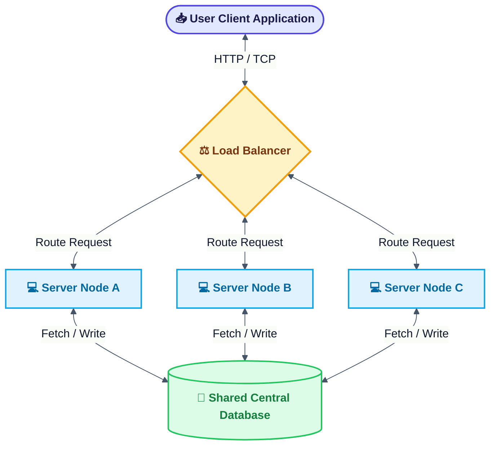
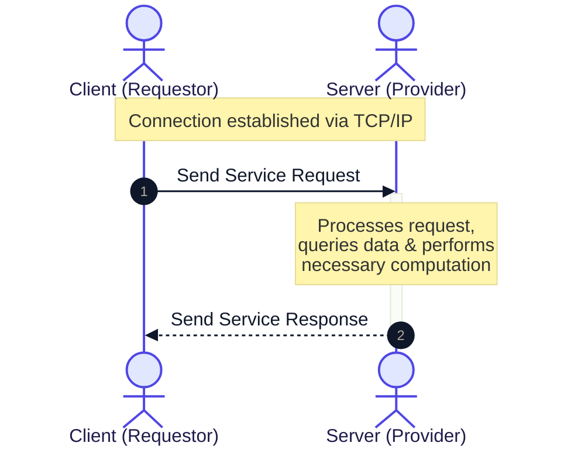
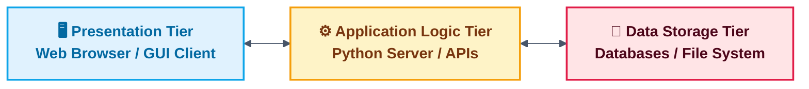
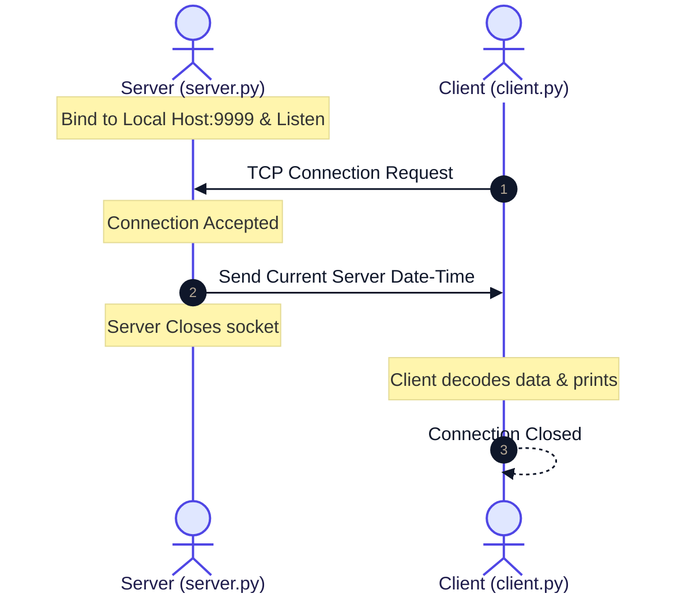
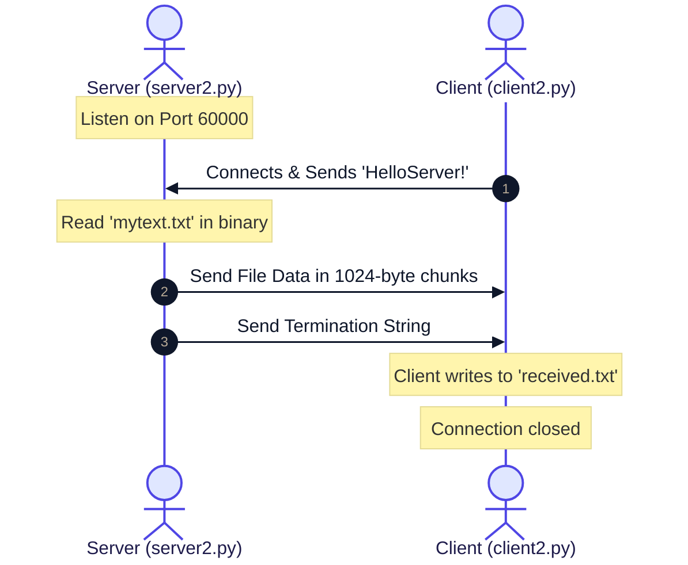
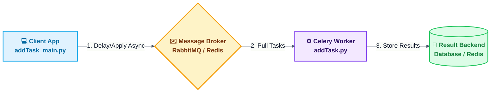
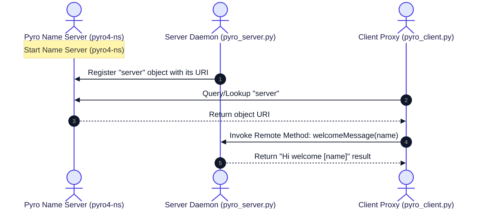
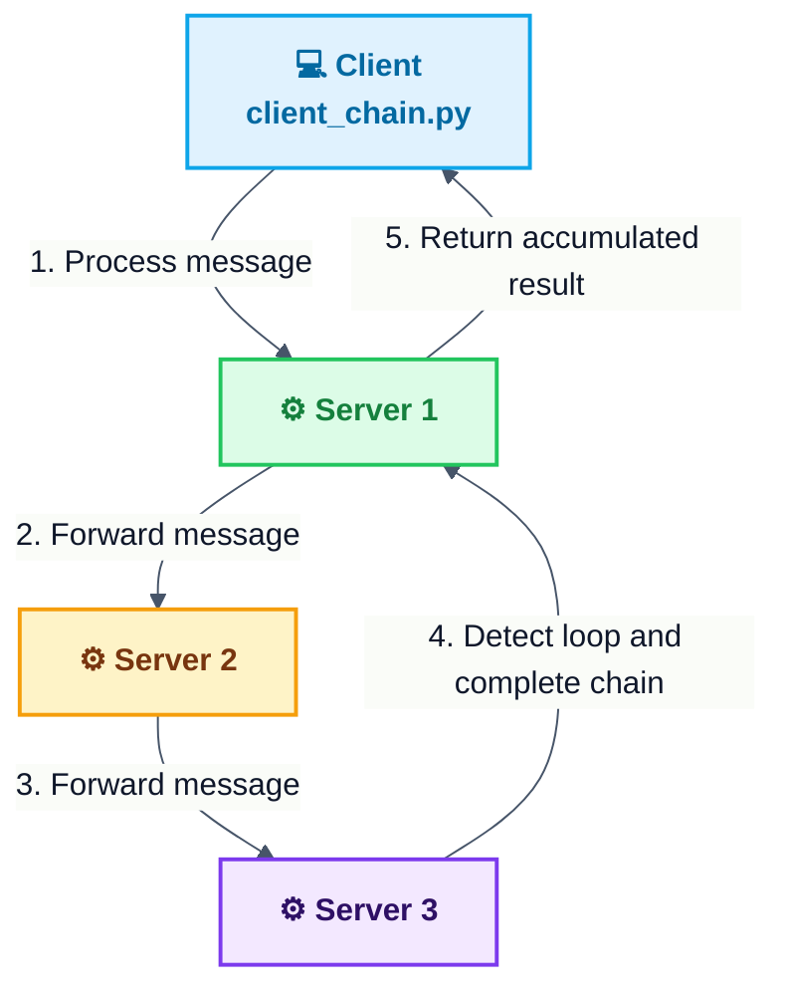

# Chapter 6: Distributed Python

Welcome to the comprehensive guide and documentation for **Chapter 6: Distributed Python**. This repository contains practical implementations, architectural explanations, step-by-step setup guides, and runtime outputs for building distributed systems in Python.

---

## Quick Installation & Dependencies Setup

Before running the codes, make sure you have all the required Python packages and external systems configured.

| Component / Topic | Required Library | Installation Command | Notes |
| :--- | :--- | :--- | :--- |
| **Python Sockets** | *None (Built-in)* | Already included in standard Python | Uses built-in `socket` module |
| **Celery Core** | `celery` | `pip install celery` | Asynchronous distributed task queue |
| **Celery Windows Pool** | `eventlet` | `pip install eventlet` | Required on Windows for worker execution |
| **Remote Method Invocation** | `Pyro4` | `pip install Pyro4` | Python Remote Objects library |

### Step-by-Step Dependency Installation

Open your terminal or command prompt and run the following commands:

```bash
# 1. Upgrade pip to ensure smooth installations
python -m pip install --upgrade pip

# 2. Install Pyro4 for Remote Method Invocation (RMI)
pip install Pyro4

# 3. Install Celery and eventlet (mandatory for Windows users)
pip install celery eventlet
```

> [!NOTE]
> **Celery Broker Setup:** Celery requires a message broker like **RabbitMQ** or **Redis** to send and receive messages.
> *   For **RabbitMQ** (Default): Install it from the [Official RabbitMQ Website](https://www.rabbitmq.com/download.html). Ensure it's running locally on `amqp://guest@localhost//`.
> *   For **Redis**: Run Redis on your machine and change the broker URL in `addTask.py` to `redis://localhost:6379/0`.

---

## Table of Contents
1. [Introducing Distributed Computing](#1-introducing-distributed-computing)
2. [Types of Distributed Applications](#2-types-of-distributed-applications)
   - [Client-Server Applications & Architecture](#client-server-applications--architecture)
   - [TCP/IP Client-Server Communications](#tcpip-client-server-communications)
   - [Multi-Level (N-Tier) Applications](#multi-level-n-tier-applications)
3. [Using the Python Socket Module](#3-using-the-python-socket-module)
   - [Example 1: Basic Date-Time Server & Client](#example-1-basic-date-time-server--client)
   - [Example 2: File Transfer Server & Client](#example-2-file-transfer-server--client)
4. [Distributed Task Management with Celery](#4-distributed-task-management-with-celery)
5. [Remote Method Invocation (RMI) with Pyro4](#5-remote-method-invocation-rmi-with-pyro4)
   - [Example 1: Basic Pyro4 Welcome Server](#example-1-basic-pyro4-welcome-server)
   - [Example 2: Implementing Chain Topology](#example-2-implementing-chain-topology)

---

## 1. Introducing Distributed Computing

**Distributed computing** is a field of computer science that studies distributed systems. A *distributed system* is a system whose components are located on different networked computers, which communicate and coordinate their actions by passing messages to one another. The components interact with each other in order to achieve a common goal.



### Key Motivations:
*   **Resource Sharing:** Sharing hardware, software, or data resources seamlessly.
*   **Scalability:** The ability to handle growing amounts of work by adding resources (Horizontal vs. Vertical scaling).
*   **Fault Tolerance & Reliability:** If one server node fails, the remaining nodes can continue to operate without system downtime.
*   **Concurrency:** Multiple processing units running simultaneously to execute tasks much faster.

---

## 2. Types of Distributed Applications

Distributed systems are designed in various shapes and structures depending on operational requirements.

### Client-Server Applications & Architecture
In a client-server architecture, tasks or workloads are partitioned between the providers of a service, called **servers**, and service requesters, called **clients**.



### TCP/IP Client-Server Communications
Communication is established using standard network protocols. 
*   **TCP (Transmission Control Protocol):** Connection-oriented, guarantees packet delivery, ensures packet ordering, and handles error checking.
*   **IP (Internet Protocol):** Directs packets to the correct host using IP addressing.

### Multi-Level (N-Tier) Applications
An N-tier application separates the presentation, application processing, and data management functions into isolated logical and physical tiers.



---

## 3. Using the Python Socket Module

The `socket` module in Python provides direct access to the BSD socket interface. Sockets allow communication between two different processes on the same or different machines.

### Example 1: Basic Date-Time Server & Client

This implementation demonstrates a simple server that listens on a port, accepts client connections, sends the current server time, and closes the connection.

#### Architecture Flowchart:


#### Code Implementation:

##### Server Code: See [server.py](Codes/socket/server.py)

##### Client Code: See [client.py](Codes/socket/client.py)

---

### Example 2: File Transfer Server & Client

This implementation demonstrates sending a file (`mytext.txt`) from a server to a client upon request.

#### Architecture Flowchart:


#### Code Implementation:

##### Server Code: See [server2.py](Codes/socket/server2.py)

##### Client Code: See [client2.py](Codes/socket/client2.py)

---

## 4. Distributed Task Management with Celery

**Celery** is an asynchronous task queue/job queue based on distributed message passing. It is focused on real-time operation but supports scheduling as well.

### Celery Architecture Diagram:


### Windows Setup & Execution
On Windows, Celery needs a compatible event pool execution method. You can run Celery on Windows using `eventlet` or `gevent` pool solo.

1.  **Start RabbitMQ Server** (Broker must be running).
2.  **Start Celery Worker Node:**
    ```bash
    celery -A addTask worker --loglevel=info -P solo
    ```
3.  **Run Client App** to queue tasks:
    ```bash
    python addTask_main.py
    ```

#### Code Implementation:

##### Task Definition: See [addTask.py](Codes/Celery/addTask.py)

##### Main Runner: See [addTask_main.py](Codes/Celery/addTask_main.py)

---

## 5. Remote Method Invocation (RMI) with Pyro4

**Pyro4** (Python Remote Objects) is a library that enables you to build applications in which objects can talk to each other over the network, with minimal programming effort. You can just write normal Python classes and Pyro will make them callable remotely.

### Example 1: Basic Pyro4 Welcome Server

#### Pyro4 Communication Architecture:


#### Running the Example:
1.  **Start Pyro4 Name Server** in a separate terminal:
    ```bash
    pyro4-ns
    ```
2.  **Start Pyro4 Server Daemon**:
    ```bash
    python pyro_server.py
    ```
3.  **Run Pyro4 Client**:
    ```bash
    python pyro_client.py
    ```

#### Code Implementation:

##### Pyro4 Server: See [pyro_server.py](Codes/Pyro4/First%20Example/pyro_server.py)

##### Pyro4 Client: See [pyro_client.py](Codes/Pyro4/First%20Example/pyro_client.py)

---

### Example 2: Implementing Chain Topology

In this configuration, a message is routed through a series of servers (forming a chain or ring topology). Each server adds its identifier to the message and forwards it to the next server in the chain until the chain is closed (i.e., a server detects that the message has returned to the originator).

#### Chain Topology Flowchart:


#### Running the Example:
1.  Start `pyro4-ns` name server.
2.  Run the three servers in three separate terminal windows:
    ```bash
    python server_chain_1.py
    ```
    ```bash
    python server_chain_2.py
    ```
    ```bash
    python server_chain_3.py
    ```
3.  Run the client chain runner to trigger the sequence:
    ```bash
    python client_chain.py
    ```

#### Code Implementation:

##### Chain Topology Logic: See [chainTopology.py](Codes/Pyro4/Second%20Example/chainTopology.py)

##### Client Runner: See [client_chain.py](Codes/Pyro4/Second%20Example/client_chain.py)

##### Server 1: See [server_chain_1.py](Codes/Pyro4/Second%20Example/server_chain_1.py)

##### Server 2: See [server_chain_2.py](Codes/Pyro4/Second%20Example/server_chain_2.py)

##### Server 3: See [server_chain_3.py](Codes/Pyro4/Second%20Example/server_chain_3.py)
