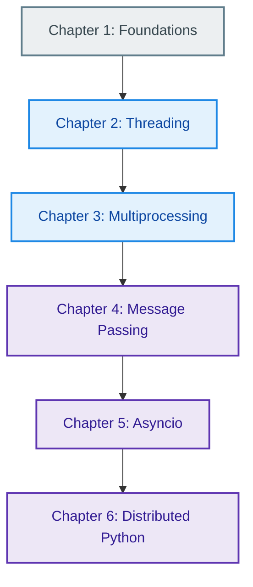
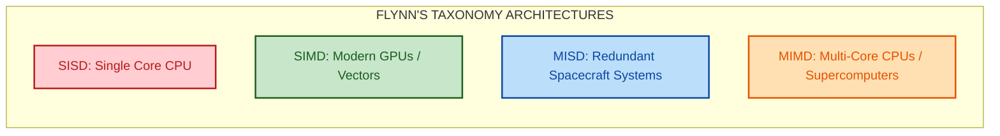
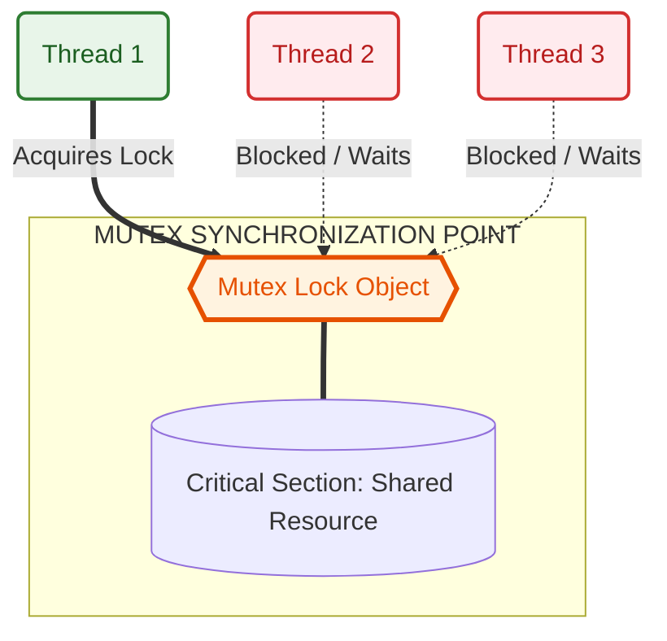
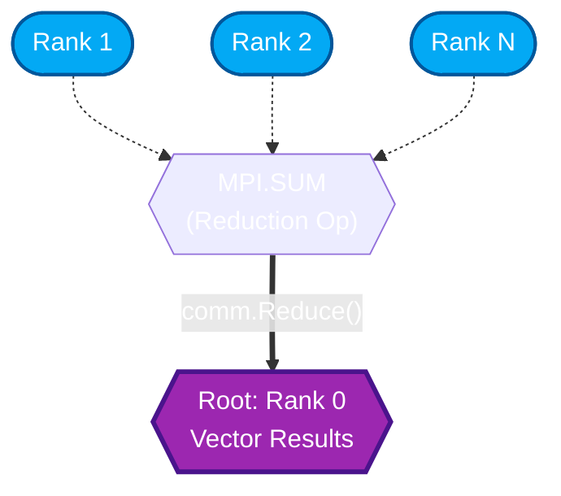
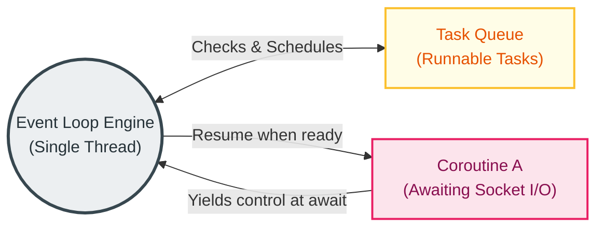
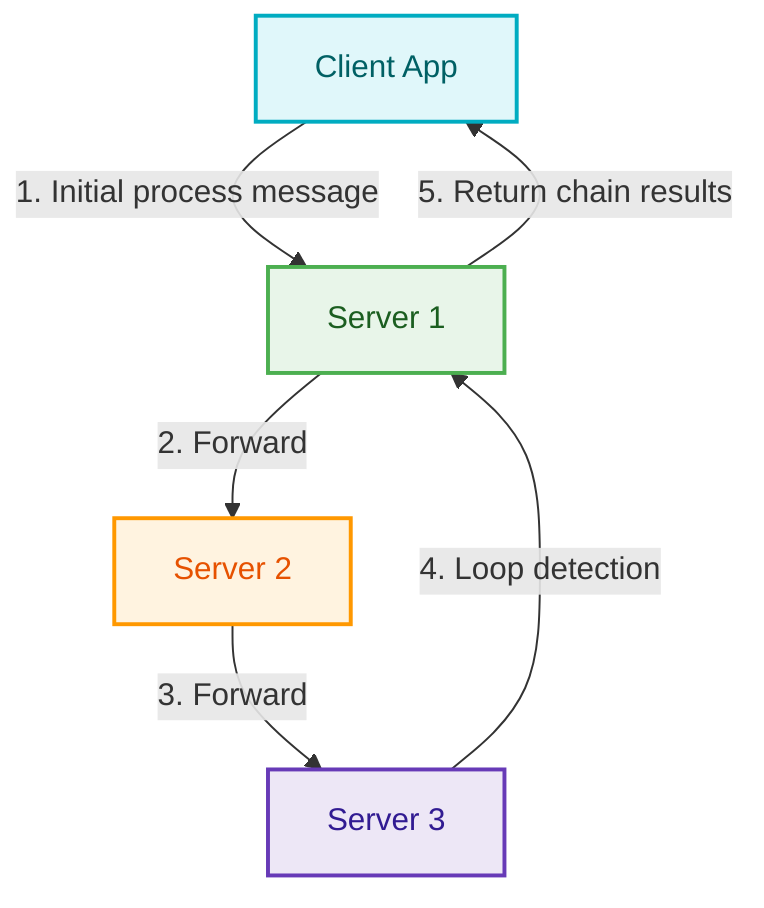

# Parallel & Distributed Computing in Python (PDC-SP26-SE) Course Overview

Welcome to the **Course Overview Reference Guide**. This document provides a high-level visual and conceptual index of the entire Parallel and Distributed Computing curriculum. Use this guide to quickly grasp the core logic, execution models, and architectural patterns of each chapter.

---

## Course Roadmap

The curriculum progresses systematically from theoretical foundations to thread-based concurrency, process-based parallelism, message-passing protocols, asynchronous multitasking, and finally, multi-node distributed systems.

---

## Chapter-by-Chapter Core Summaries

### [Chapter 1: Getting Started with Parallel Computing and Python](Chapter01/README.md)

*   **Core Logic:** Establishes the physical limitations of single-core processors (power and heat constraints) and the hardware evolution toward multi-core CPUs. Introduces the theoretical limits of parallel speedup (Amdahl's Law vs. Gustafson's Law) and maps hardware configurations using Flynn's Taxonomy.
*   **Key Primitives:** clock speeds, execution streams, concurrency, strong vs. weak scaling.
*   **Visual Execution Model:**

*   **Key Takeaways:**
    *   **Amdahl's Law:** Parallel speedup is strictly bounded by the sequential fraction of a program (`Speedup <= 1 / f`).
    *   **Gustafson's Law:** Real-world workloads scale alongside processing cores, enabling linear speedup by increasing problem size.
    *   **CPython's GIL:** Python's Global Interpreter Lock allows only one thread to execute bytecode at a time, limiting standard threads to concurrency rather than true parallelism for CPU-bound tasks.

---

### [Chapter 2: Thread-Based Parallelism](Chapter02/README.md)

*   **Core Logic:** Focuses on lightweight concurrency *within a single process*. Threads share the same address space (heap memory), which allows very fast memory access and message swapping, but introduces the threat of race conditions.
*   **Key Primitives:** `Thread`, `Lock`, `RLock`, `Semaphore`, `Condition`, `Event`, `Barrier`, `Queue`.
*   **Visual Execution Model:**

*   **Key Takeaways:**
    *   **Locks vs. RLocks:** A standard `Lock` cannot be acquired recursively by the same thread (resulting in self-deadlock), whereas an `RLock` (Reentrant Lock) tracks re-entry count.
    *   **Semaphores:** Limit access to a finite pool of resources via token counting.
    *   **Condition Variables:** Eliminate CPU-wasting polling loops by allowing consumer threads to go to sleep (`wait()`) until a producer explicitly wakes them (`notify()`).

---

### [Chapter 3: Process-Based Parallelism](Chapter03/README.md)

*   **Core Logic:** Sidesteps the GIL by spawning isolated processes, each running its own independent Python interpreter. Ideal for heavy mathematical calculations and CPU-bound workloads.
*   **Key Primitives:** `Process`, `Queue` (IPC), `Pipe` (duplex connection), `Pool` (task mapping).
*   **Visual Execution Model:**

*   **Key Takeaways:**
    *   **Memory Isolation:** Processes do not share address spaces; data sharing requires serialization (pickling) over Inter-Process Communication (IPC) channels.
    *   **Pipes vs. Queues:** Pipes offer high-speed, point-to-point duplex channels between two processes, while Queues support multiple producers and consumers safely.
    *   **Process Pools (`multiprocessing.Pool`):** Offers a high-level mapping abstraction (`pool.map()`) to automatically divide datasets into chunks and farm them out to multiple worker processes.

---

### [Chapter 4: Message Passing](Chapter04/README.md)

*   **Core Logic:** Explores message-passing architectures for distributed memory networks (clusters) using the Message Passing Interface (MPI) standard. Processes run independently (typically across different physical nodes) and communicate explicitly over a network fabric.
*   **Key Primitives:** `Get_rank()`, `Get_size()`, `send()`, `recv()`, `bcast()`, `scatter()`, `gather()`, `Reduce()`, `Create_cart()`.
*   **Visual Execution Model:**

*   **Key Takeaways:**
    *   **Point-to-Point vs. Collective:** Point-to-point (`send`/`recv`) involves exactly two processes; collective operations (`bcast`, `scatter`, `gather`, `Reduce`) synchronize all processes in a communicator.
    *   **Deadlock Prevention:** Reordering communication sequences or using non-blocking variants (`isend`, `irecv`) is vital to prevent processes from indefinitely waiting on one another.
    *   **Virtual Topologies:** Cartesian topologies (`Create_cart`) map processes logically to coordinate grids, optimizing spatial operations (like 2D grids) for neighbor communication.

---

### [Chapter 5: Asynchronous Programming](Chapter05/README.md)

*   **Core Logic:** Implements cooperative multitasking within a single thread. Instead of relying on the operating system scheduler, coroutines voluntarily yield control back to an event loop when awaiting slow I/O operations, making this highly scalable for network apps.
*   **Key Primitives:** `async def`, `await`, `asyncio.run()`, `create_task()`, `gather()`, `ThreadPoolExecutor`, `ProcessPoolExecutor`.
*   **Visual Execution Model:**

*   **Key Takeaways:**
    *   **Event Loop:** Single-threaded multiplexer that monitors registered socket events, file descriptors, and timers.
    *   **Coroutines vs. Tasks:** Coroutines (`async def` functions) are inert until scheduled; wrapping them in a `Task` registers them on the event loop for concurrent execution.
    *   **Mixing Models:** Blocking calls (CPU-bound or sync I/O) must be delegated to executors using `loop.run_in_executor()` to keep the main event loop responsive.

---

### [Chapter 6: Distributed Python](Chapter06/README.md)

*   **Core Logic:** Extends parallel processing across network boundaries. Covers low-level TCP/IP sockets for manual network transfers, Celery for queuing and executing tasks asynchronously using message brokers, and Pyro4 for executing Python methods on remote objects.
*   **Key Primitives:** `socket`, `Celery`, `@app.task`, `Pyro4.Daemon`, `Pyro4.Proxy`, `pyro4-ns`.
*   **Visual Execution Model (Pyro4 RMI Chain Topology):**

*   **Key Takeaways:**
    *   **TCP/IP Sockets:** Basic client/server communication using low-level connection buffers.
    *   **Celery task queues:** Offloads background task processing to worker nodes using brokers like RabbitMQ or Redis to coordinate job pipelines.
    *   **Pyro4 RMI:** Allows python processes to call methods on remote objects exactly like local object instances, abstracting remote procedure calls (RPC).

---

## Paradigm Comparison Matrix

| Computing Paradigm | Resource Space | GIL Status | Best Use Case | Scaling Type | Communication Mechanism |
| :--- | :--- | :--- | :--- | :--- | :--- |
| **Threading** (Ch 2) | Shared Heap Memory (Single Process) | Restricted (CPython) | I/O-bound (Network, Web Scraping) | Vertical (Saves memory context) | Shared variables, locking structures |
| **Multiprocessing** (Ch 3) | Isolated Memory (Multi-Process) | Bypassed (Fully Parallel) | Local CPU-bound (Data analytics, calculations) | Vertical (Utilizes local multi-core CPU) | Pipes, Queues (Serialization/Pickling) |
| **Message Passing (MPI)** (Ch 4) | Isolated Memory (Multi-Node / Network) | Bypassed (Fully Parallel) | Distributed Cluster Computing (Supercomputers) | Horizontal (Scale across physical nodes) | Message envelopes (Explicit send/recv/bcast) |
| **Asynchronous (Asyncio)** (Ch 5) | Shared Heap Memory (Single Thread) | Locked (Single-Threaded) | Massively concurrent I/O (Chat systems, APIs) | Vertical (Extremely low resource overhead) | Cooperative task yielding (await) |
| **Distributed (Celery/Pyro)** (Ch 6) | Network boundary nodes | Bypassed (Fully Parallel) | Remote Tasks, microservices, grid architecture | Horizontal (Add physical worker servers) | Message Brokers (AMQP/Redis) or Remote Proxies |
