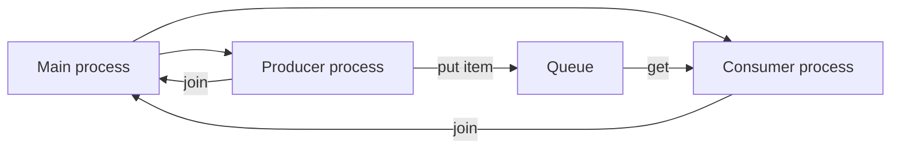
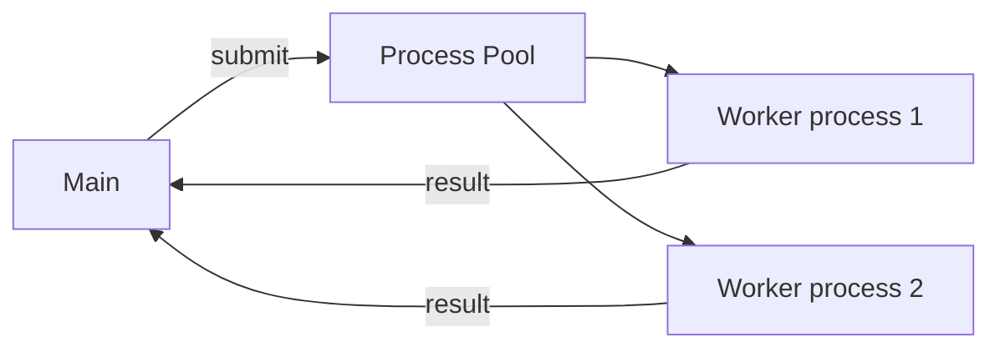

# Chapter 03 — Process-Based Parallelism
[](#)
[](#)
[](#)
[](#)
[](#)

---

##  Course Information
**Course:** Parallel and Distributed Computing (PDC) 
**Student Name:** Yahya Shahzad 
**Roll No:** 23FA-023-SE

---

## Overview
- This chapter demonstrates process-based parallelism using Python's `multiprocessing` module. Examples show creating processes, naming, daemon vs non-daemon behavior, process lifecycle (start/terminate/join), inter-process communication (`Pipe`, `Queue`), synchronization (`Lock`, `Barrier`), and `Pool`-based parallelism.

Files (detailed)
- `spawning_processes.py` — Starts several `multiprocessing.Process` instances that call `myFunc`. Good starting point to see independent workers and `join()` semantics.
- `process_in_subclass.py` — Implements `MyProcess(multiprocessing.Process)` and overrides `run()` so you can encapsulate worker behavior in a class.
- `naming_processes.py` — Demonstrates setting `name` on a `Process` and reading `multiprocessing.current_process()` metadata.
- `run_background_processes.py` / `run_background_processes_no_daemons.py` — Contrast `daemon=True` (background) vs `daemon=False` (foreground) processes and their exit semantics.
- `killing_processes.py` — Shows a long-running task being `terminate()`d, checking `.exitcode` and `.is_alive()`.
- `communicating_with_pipe.py` — Pipe chain: generator process -> worker process -> main process reads results; shows `EOFError` handling and closing ends you don't use.
- `communicating_with_queue.py` — Producer/consumer example using `Queue.put()` and `Queue.get()`, showing `.qsize()` and graceful consumer exit when queue is empty.
- `process_pool.py` — `Pool.map()` example for parallel execution of a pure function (`function_square`) across inputs.
- `processes_barrier.py` — Uses `Barrier` to synchronize a set of processes and `Lock` to serialize prints.
- `myFunc.py` — Simple helper used in spawn examples; useful when demonstrating arg passing and per-process output.

Run & examples
- Run a simple spawn example:
```bash
python Chap-3/FIles/spawning_processes.py
```
- Run the pool example:
```bash
python Chap-3/FIles/process_pool.py
```
- Run producer/consumer (queue):
```bash
python Chap-3/FIles/communicating_with_queue.py
```

Design patterns illustrated
- Worker processes: independent tasks with `Process` and `join()`.
- Subclassing: encapsulate behavior and state in a `Process` subclass.
- Pipelines: chain transforms using `Pipe` or `Queue` to stream data between processes.
- Pools: manage worker lifetime and map tasks safely across CPUs.

Diagrams & flows




Tips & troubleshooting
- Always guard process-creating code with `if __name__ == '__main__':` for cross-platform safety.
- If an example hangs, check for unmatched `send()`/`recv()` or blocking `get()` calls; add timeouts while debugging.
- Daemon processes exit abruptly when the parent exits; avoid using them for critical cleanup.
