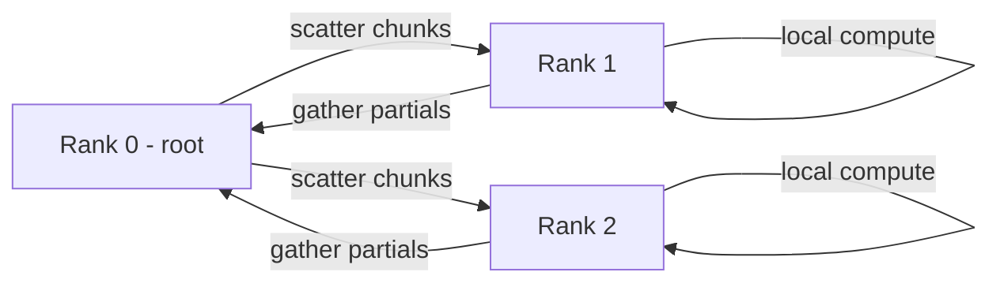

# Chapter 04 — Message Passing (MPI)
[](#)
[](#)
[](#)
[](#)
[](#)

---

##  Course Information
**Course:** Parallel and Distributed Computing (PDC) 
**Student Name:** Yahya Shahzad 
**Roll No:** 23FA-023-SE

---

## Overview
- This chapter uses `mpi4py` to illustrate classical MPI patterns: point-to-point send/recv, collective communication (broadcast, scatter, gather, reduce, alltoall), and virtual topologies (Cartesian communicators). It also highlights common pitfalls (deadlocks) and how to avoid them.

Files (detailed)
- `helloworld_MPI.py` — prints rank on each process; useful to verify MPI environment and `mpirun` invocation.
- `pointToPointCommunication.py` — explicit `send()`/`recv()` exchanges between chosen ranks; shows ordering and matching requirements.
- `broadcast.py` — demonstrates `bcast()` to share a variable from root.
- `scatter.py` / `gather.py` — scatter distributes array elements, gather collects results back to root.
- `reduction.py` — uses `comm.Reduce(..., op=MPI.SUM)` to combine arrays across ranks.
- `alltoall.py` — show full all-to-all communication where each rank sends distinct data to every other rank.
- `virtualTopology.py` — builds a 2D cartesian communicator and uses `Shift()` to find neighbour ranks for stencil-type exchanges.
- `deadLockProblems.py` — demonstrates patterns that can deadlock (e.g., two blocking `recv()`/`send()` pairs) and safe alternatives.

Run & example commands
- Run 4 ranks:
```bash
mpirun -n 4 python Chap-4/Files/helloworld_MPI.py
mpirun -n 4 python Chap-4/Files/pointToPointCommunication.py
```
- Example: run `scatter`/`gather` with 4 processes:
```bash
mpirun -n 4 python Chap-4/Files/scatter.py
mpirun -n 4 python Chap-4/Files/gather.py
```

Common patterns & gotchas
- Collectives are collective: all ranks in the communicator must call the same collective in the same order. Mismatched calls hang the program.
- For point-to-point, match `send()` with `recv(source=...)` and avoid using blocking calls when ordering is uncertain — use `Isend`/`Irecv` if needed.
- When exchanging large numpy arrays, prefer sending raw buffers (numpy arrays) to avoid extra serialization overhead.

Detailed example: scatter -> local compute -> gather


Topology example (2D cartesian neighbors)
```mermaid
flowchart TB
  subgraph Grid
    P0[rank0] --- P1[rank1]
    P0 --- P2[rank2]
    P1 --- P3[rank3]
    P2 --- P3
  end
  note right of P0: up/down/left/right neighbours via Cart.Create
```

Debugging tips
- Use small process counts when iterating on logic.
- Add prints with `rank` context to observe which process reaches which point.
- Run with `-n 2` to reproduce simple send/recv interactions locally.

