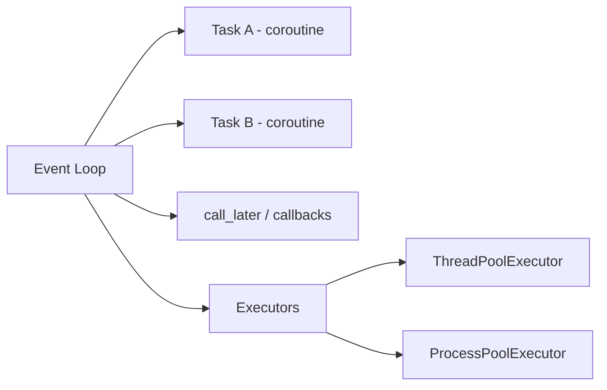

# Chapter 05 — Async Programming & Futures
[](#)
[](#)
[](#)
[](#)
[](#)

---

##  Course Information
**Course:** Parallel and Distributed Computing (PDC) 
**Student Name:** Yahya Shahzad 
**Roll No:** 23FA-023-SE

---

## Overview
- This chapter explores concurrency via `asyncio` (cooperative multitasking) and `concurrent.futures` (preemptive concurrency via thread/process pools). It includes coroutine state machines, event-loop scheduling, futures, and practical comparisons between executors.

Files (detailed)
- `asyncio_coroutine.py` — legacy-style `@asyncio.coroutine` + `yield from` finite-state-machine; useful to understand coroutine switching.
- `asyncio_event_loop.py` — demonstrates `loop.call_later()` and `run_forever()` orchestration of callbacks.
- `asyncio_task_manipulation.py` — creates `asyncio.Task` instances for `factorial`, `fibonacci` and `binomial_coefficient` to run concurrently.
- `asyncio_and_futures.py` — example of `asyncio.Future` with done callbacks.
- `concurrent_futures_pooling.py` — compares sequential execution, `ThreadPoolExecutor`, and `ProcessPoolExecutor` for a CPU-heavy `count()` routine.

Modernization notes
- The chapter uses the older `@asyncio.coroutine` / `yield from` syntax. Modernize by replacing with `async def` and `await`, and use `asyncio.run()` as an entry point on Python 3.7+.

Quick run examples
- Run the task example (modernized approach recommended):
```bash
python Chap-5/Files/asyncio_task_manipulation.py
```
- Test executor performance comparison:
```bash
python Chap-5/Files/concurrent_futures_pooling.py
```

Architecture & diagrams


Example: converting legacy coroutine to modern syntax
```python
async def start_state():
    # modern async/await equivalent of chapter example
    await state1()

async def main():
    await start_state()

if __name__ == '__main__':
    import asyncio
    asyncio.run(main())
```

Guidance
- Use `ThreadPoolExecutor` for I/O-bound tasks (network, file I/O). Use `ProcessPoolExecutor` for CPU-bound tasks to avoid GIL limits.
- Beware of mixing blocking calls (time.sleep, heavy CPU loops) inside coroutines; `await asyncio.to_thread()` or use executors instead.

