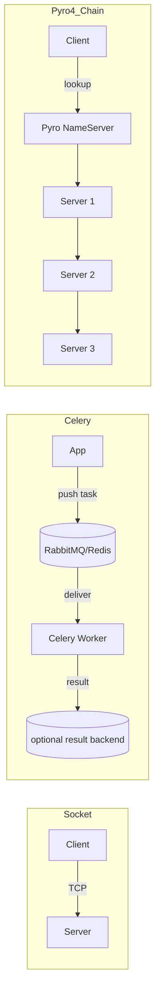

# Chapter 06 — Distributed Tasks & RPC
[](#)
[](#)
[](#)
[](#)
[](#)

---

##  Course Information
**Course:** Parallel and Distributed Computing (PDC) 
**Student Name:** Yahya Shahzad 
**Roll No:** 23FA-023-SE

---

## Overview
- Covers simple distributed communication techniques: raw `socket` TCP clients/servers, `Celery` task queue examples (brokered async tasks), and `Pyro4` RPC-style services including a chain topology. Each example includes the minimal steps to run locally and common deployment caveats.

Files (detailed)
- `socket/server.py` / `socket/client.py` — basic TCP server that sends the current time; `client` receives and prints it.
- `socket/server2.py` / `socket/client2.py` — file-transfer style example; server sends a file, client writes `received.txt`.
- `socket/addTask.py`, `socket/addTask_main.py` — toy task-dispatch over sockets (illustrative only).
- `Celery/addTask.py`, `Celery/addTask_main.py` — defines a Celery `add` task and a small launcher that calls `add.delay(5,5)`; requires a message broker (RabbitMQ/Redis) and worker processes.
- `Pyro4/First Example/pyro_server.py`, `pyro_client.py` — simple RPC service that returns a welcome message.
- `Pyro4/Second Example/*` — chain of Pyro servers (`chainTopology`) forwarding messages along a ring/chain to demonstrate service composition.

Run & examples
- Socket server (local test):
```bash
python Chapter06/socket/server.py
python Chapter06/socket/client.py
```
- File transfer example:
```bash
python Chapter06/socket/server2.py
python Chapter06/socket/client2.py
```
- Celery (requires broker & worker):
```bash
# start worker (in project root)
celery -A Chapter06.Celery.addTask worker --loglevel=info
# in another shell, invoke task
python Chapter06/Celery/addTask_main.py
```
- Pyro4 (start name server first):
```bash
pyro4-ns
python Chapter06/Pyro4/First\ Example/pyro_server.py
python Chapter06/Pyro4/First\ Example/pyro_client.py
```

Architecture diagrams


Notes & caveats
- `socket` examples are synchronous and blocking; adapt to non-blocking or threaded servers for concurrent clients.
- Celery requires external infrastructure (broker). For local testing install RabbitMQ or use Redis as a broker.
- Pyro4 depends on a running name server (`pyro4-ns`) and network accessibility; use local hostnames for single-machine tests.
