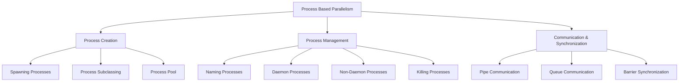
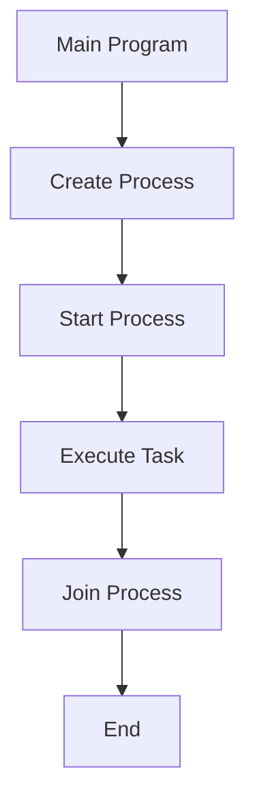
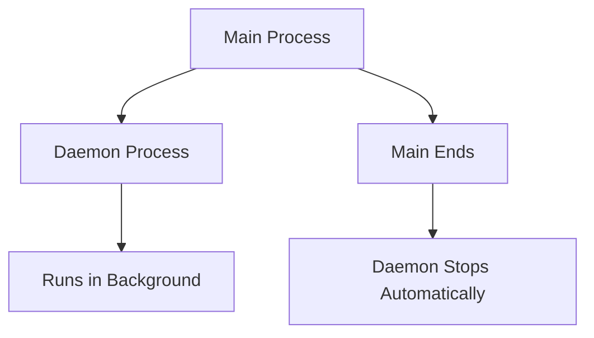
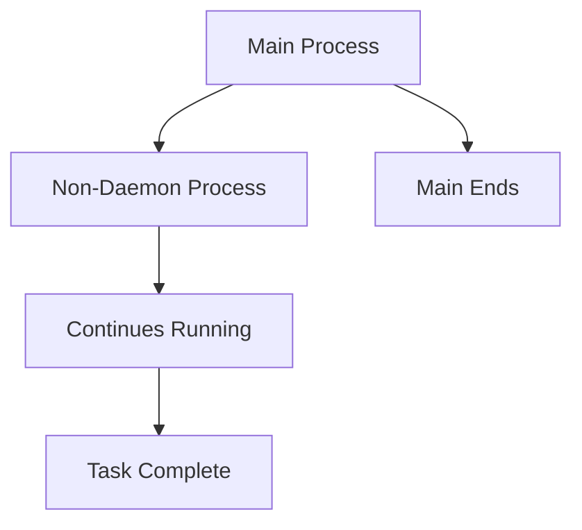
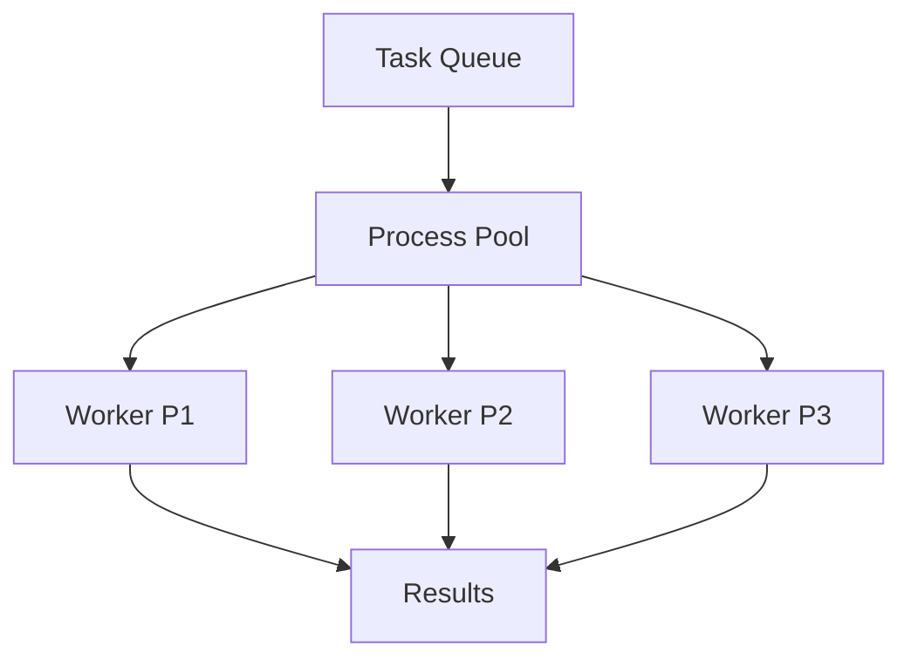
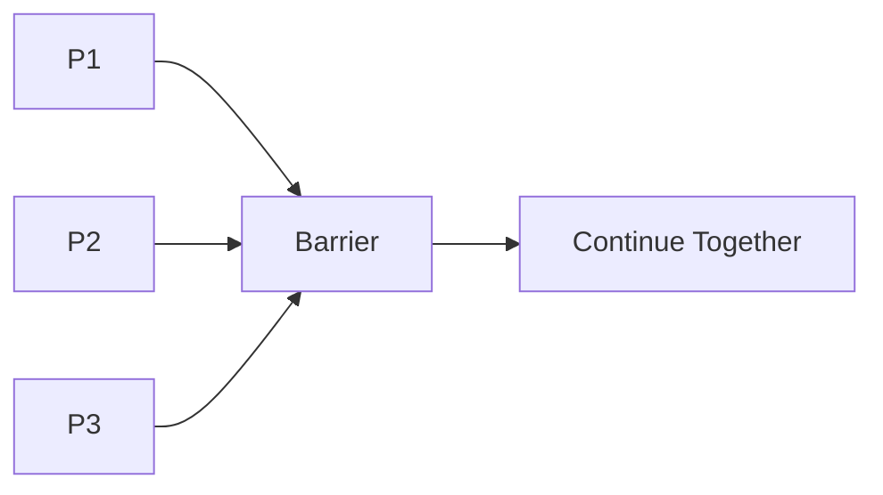
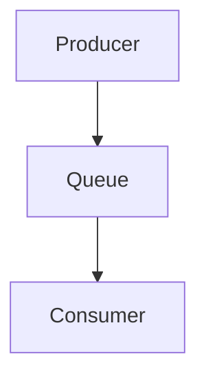
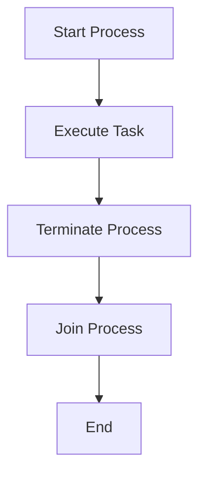

# Chapter 03 – Process Based Parallelism

## Chapter Overview

---

## 1. Spawning Processes 

### Definition

Process spawning is the creation of new processes to execute tasks independently.

### Flow

### Advantages

* True parallel execution
* Better CPU utilization
* Process isolation

### Disadvantages

* Higher memory usage
* Process creation overhead

---

## 2. Namespace Process Execution 

### Definition

Uses a function imported from another module and executes it inside separate processes.

### Flow

Import Function → Create Process → Execute Function → Join Process

### Advantages

* Better code organization
* Reusable functions

### Disadvantages

* Requires separate modules
* Slightly harder to debug

---

## 3. Custom Function

### Definition

A simple function executed by different processes to demonstrate multiprocessing.

### Flow

Receive Input → Print Process Number → Loop → Display Output

### Advantages

* Reusable function
* Easy to understand

### Disadvantages

* Limited functionality
* Used mainly for demonstration

---

## 4. Process Subclassing

### Definition

Creates a custom process by inheriting from the Process class.

### Flow

Create Subclass → Override run() Method → Start Process → Execute Task

### Advantages

* Cleaner object-oriented design
* Easy customization

### Disadvantages

* More code required
* Slightly complex for beginners

---

## 5. Naming Processes 

### Definition

Assigns custom names to processes for identification and debugging.

### Flow

Create Process → Assign Name → Start → Execute → End

### Advantages

* Easy monitoring
* Better debugging

### Disadvantages

* Extra configuration
* Names do not affect performance

---

## 6. Background Processes (Daemon) 

### Definition

Daemon processes run in the background and terminate automatically when the main process ends.

### Flow

### Advantages

* Useful for background services
* Automatic cleanup

### Disadvantages

* Can terminate unexpectedly
* Not suitable for critical tasks

---

## 7. Non-Daemon Processes 

### Definition

Processes continue running even if the parent process exits.

### Flow

### Advantages

* Reliable execution
* Completes assigned tasks

### Disadvantages

* Requires manual management
* May consume resources longer

---

## 8. Process Pool 

### Definition

A process pool manages multiple worker processes for executing tasks efficiently.

### Flow

### Advantages

* Faster task execution
* Efficient resource management

### Disadvantages

* More memory usage
* Pool management overhead

---

## 9. Process Barrier Synchronization 

### Definition

A Barrier synchronizes multiple processes, forcing them to wait until all reach the same point.

### Flow

### Advantages

* Synchronization control
* Prevents timing issues

### Disadvantages

* Can cause delays
* More complex coordination

---

## 10. Inter-Process Communication Using Pipe 

### Definition

A Pipe allows two processes to communicate directly by sending and receiving data.

### Flow

### Advantages

* Fast communication
* Simple implementation

### Disadvantages

* Limited scalability
* Suitable mainly for two processes

---

## 11. Inter-Process Communication Using Queue 

### Definition

A Queue allows multiple processes to safely exchange data.

### Flow

### Advantages

* Thread-safe and process-safe
* Supports multiple producers and consumers

### Disadvantages

* Slight communication overhead
* Queue management required

---

## 12. Killing Processes 

### Definition

Demonstrates how to terminate a running process before completion.

### Flow

### Advantages

* Stops unnecessary tasks
* Resource control

### Disadvantages

* Data loss risk
* Incomplete execution

---

# Process Communication Comparison

| Feature       | Pipe       | Queue           |
| ------------- | ---------- | --------------- |
| Communication | One-to-One | Many-to-Many    |
| Speed         | Faster     | Slightly Slower |
| Complexity    | Simple     | Flexible        |
| Scalability   | Limited    | High            |

---

# Final Summary

* Processes enable true parallel execution.
* Process spawning creates independent tasks.
* Process subclassing improves code structure.
* Named processes help debugging.
* Daemon processes run in the background.
* Process pools manage multiple workers efficiently.
* Barriers synchronize process execution.
* Pipes and Queues provide inter-process communication.
* Processes can be terminated when required.
* Multiprocessing improves performance for CPU-intensive tasks.

