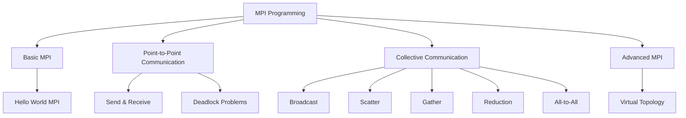
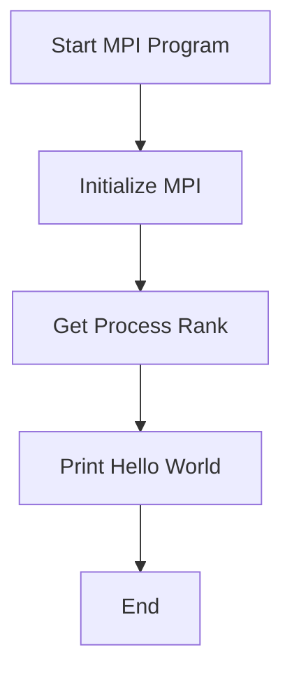
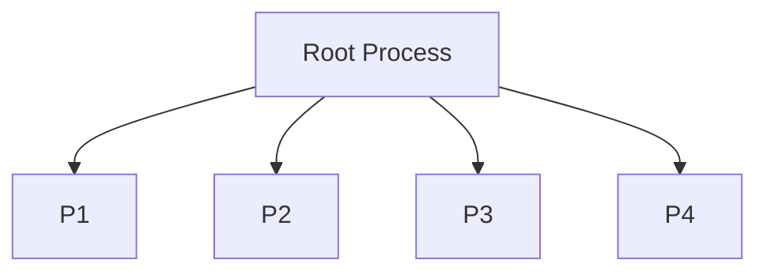
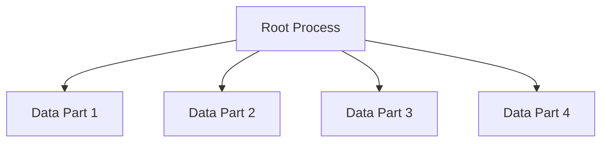
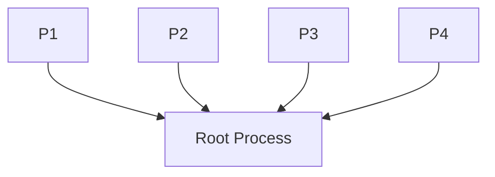
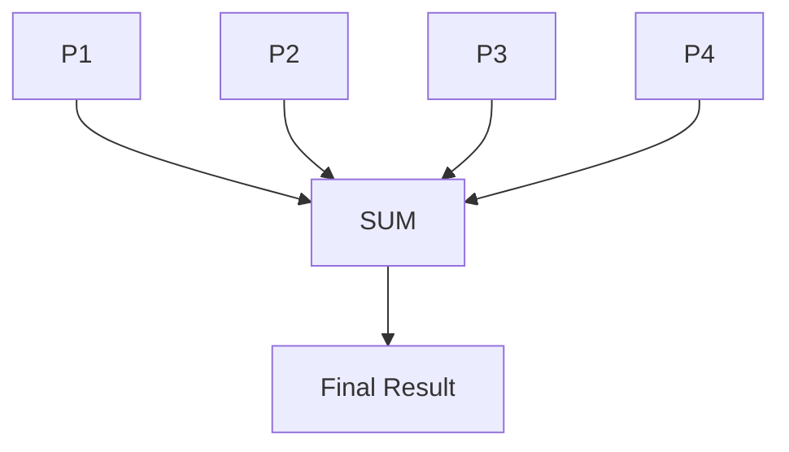
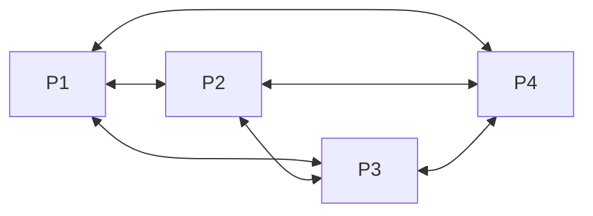
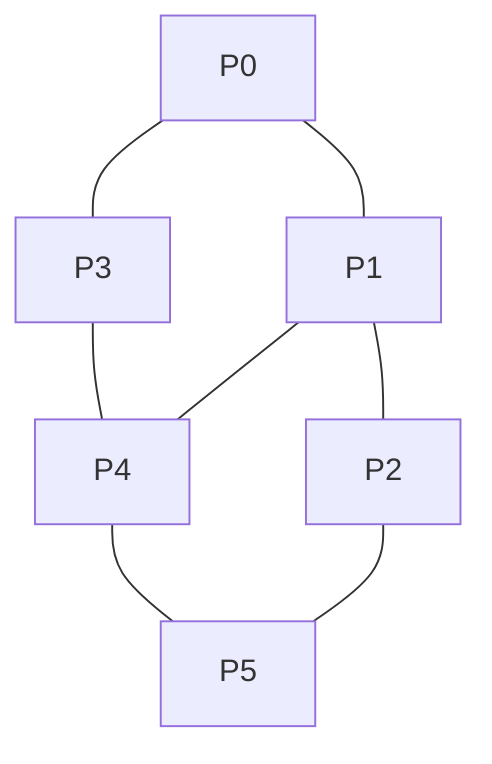
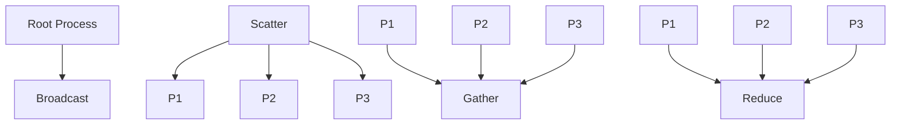

# Chapter 04 – MPI (Message Passing Interface)

## Chapter Overview

---

# 1. Hello World MPI 
### Definition

The simplest MPI program where each process prints its rank (ID).

### Flow

### Advantages

* Easy introduction to MPI
* Demonstrates process ranks

### Disadvantages

* No communication between processes
* Limited functionality

---

# 2. Point-to-Point Communication 

### Definition

Allows one process to send data directly to another process using send() and recv().

### Flow

### Advantages

* Simple communication model
* Direct data transfer

### Disadvantages

* Difficult to manage in large systems
* Requires sender and receiver coordination

---

# 3. Broadcast Communication 
### Definition

One process sends the same data to all other processes.

### Flow

### Advantages

* Efficient data sharing
* Reduces repeated sending operations

### Disadvantages

* All processes receive identical data
* Can increase network traffic

---

# 4. Scatter Communication 

### Definition

Scatter distributes different portions of data from one process to multiple processes.

### Flow

### Advantages

* Efficient workload distribution
* Supports parallel processing

### Disadvantages

* Requires data partitioning
* Uneven distribution may reduce efficiency

---

# 5. Gather Communication 

### Definition

Gather collects data from all processes and sends it to a root process.

### Flow

### Advantages

* Centralized result collection
* Easy data aggregation

### Disadvantages

* Root process can become a bottleneck
* Increased communication overhead

---

# 6. Reduction Operation 

### Definition

Combines data from all processes using an operation such as SUM, MAX, MIN, or PRODUCT.

### Flow

### Advantages

* Efficient aggregation
* Optimized MPI implementation

### Disadvantages

* Limited to supported operations
* Requires synchronization

---

# 7. All-to-All Communication 

### Definition

Every process sends data to every other process and receives data from all processes.

### Flow

### Advantages

* Complete data exchange
* Useful for distributed algorithms

### Disadvantages

* High communication cost
* Poor scalability for large systems

---

# 8. Deadlock Problems 

### Definition

A deadlock occurs when two or more processes wait indefinitely for each other to send or receive data.

### Flow

### Advantages

* Demonstrates synchronization issues
* Helps understand communication ordering

### Disadvantages

* Program may freeze
* Difficult debugging

---

# 9. Virtual Topology 

### Definition

MPI can arrange processes into logical structures such as grids, rings, or meshes to simplify communication.

### Flow

### Advantages

* Organized communication structure
* Simplifies neighbor communication

### Disadvantages

* More complex implementation
* Additional topology management

---

# MPI Communication Comparison

| Operation        | Purpose                     |
| ---------------- | --------------------------- |
| Send/Receive     | One-to-One Communication    |
| Broadcast        | One-to-All Communication    |
| Scatter          | Divide Data Among Processes |
| Gather           | Collect Data from Processes |
| Reduce           | Combine Results             |
| All-to-All       | Every Process Communicates  |
| Virtual Topology | Structured Communication    |

---

# MPI Collective Operations Overview

---

# Final Summary

* MPI enables parallel computing across multiple processes.
* Process ranks identify individual processes.
* Point-to-point communication uses Send and Receive operations.
* Broadcast shares data with all processes.
* Scatter distributes data among processes.
* Gather collects results from processes.
* Reduction combines multiple values into a single result.
* All-to-All allows complete process communication.
* Deadlocks occur when processes wait indefinitely.
* Virtual topologies organize process communication structures.

