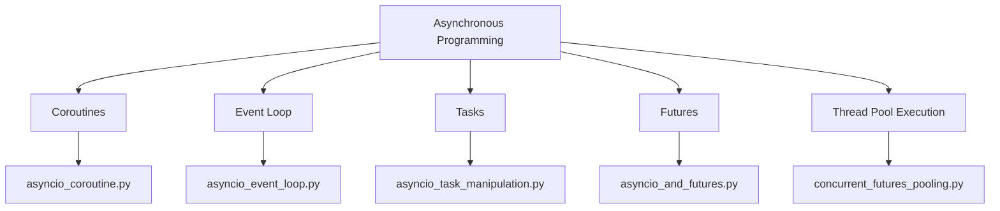
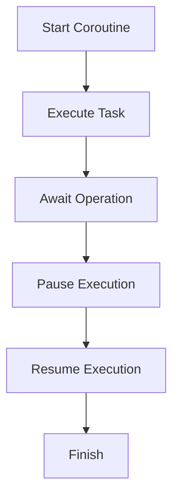
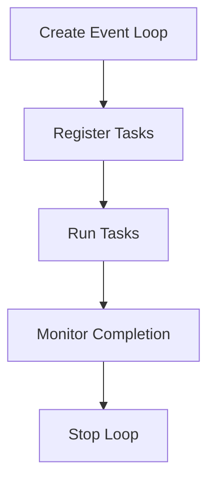
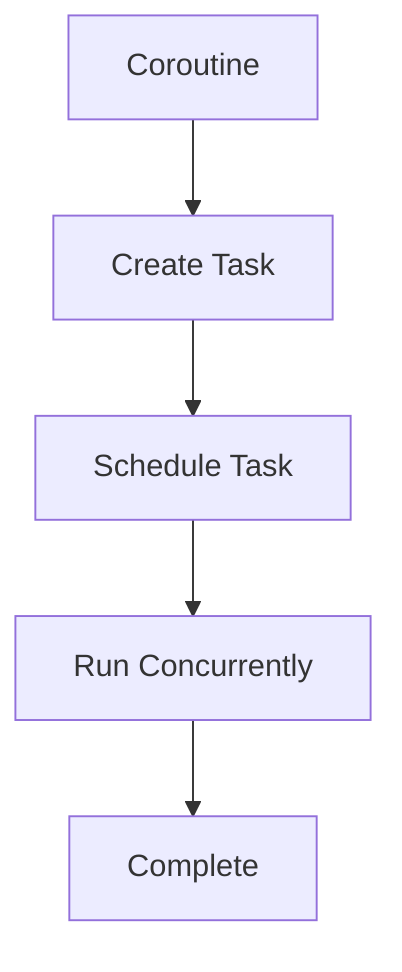
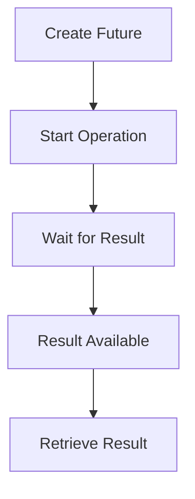
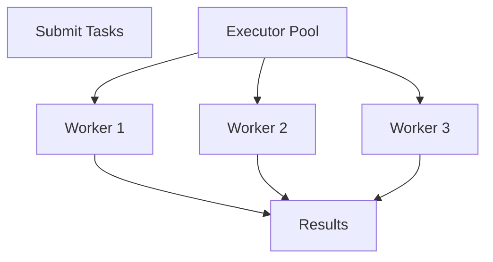
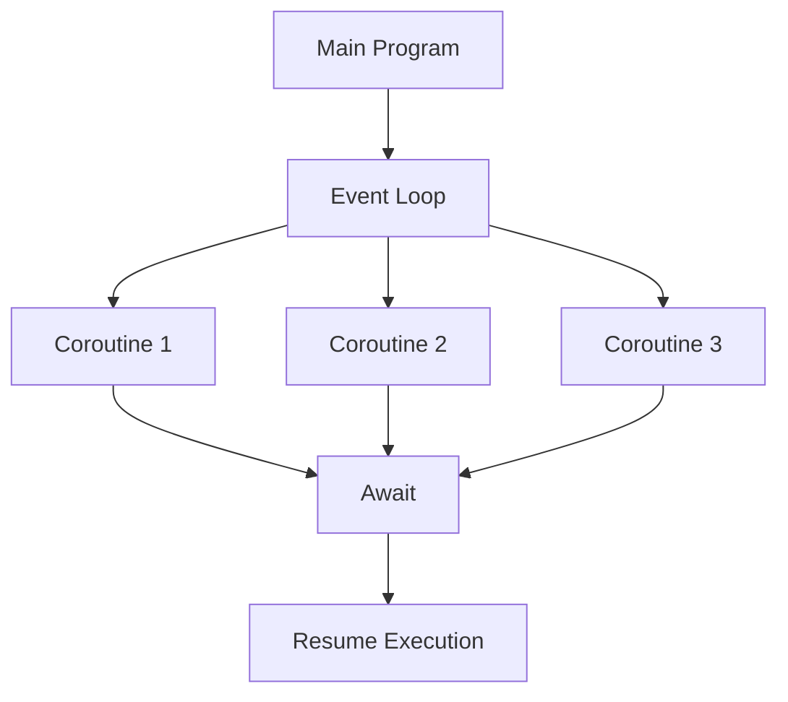
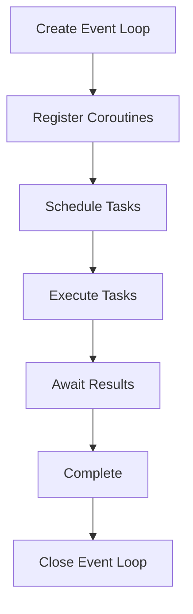

# Chapter 05 – Asynchronous Programming with AsyncIO and Futures

## Chapter Overview

---

# 1. AsyncIO Coroutines 

### Definition

A coroutine is a special function that can pause and resume execution without blocking the entire program.

### Flow

### Advantages

* Non-blocking execution
* Efficient resource utilization
* Handles many tasks concurrently

### Disadvantages

* More difficult to understand than normal functions
* Requires async/await syntax

---

# 2. AsyncIO Event Loop 

### Definition

The Event Loop is the core of AsyncIO. It schedules and manages all asynchronous tasks.

### Flow

### Advantages

* Efficient task scheduling
* Handles multiple operations concurrently

### Disadvantages

* Complex debugging
* Event loop management can be challenging

---

# 3. AsyncIO Task Manipulation 

### Definition

Tasks are wrappers around coroutines that allow them to run independently inside the event loop.

### Flow

### Advantages

* Better concurrency management
* Multiple tasks can run simultaneously

### Disadvantages

* Task synchronization can be difficult
* Requires careful handling of exceptions

---

# 4. AsyncIO and Futures

### Definition

A Future represents a value that will become available later after an asynchronous operation completes.

### Flow

### Advantages

* Enables asynchronous result handling
* Useful for long-running operations

### Disadvantages

* More complex than synchronous programming
* Requires future state management

---

# 5. Concurrent Futures Pooling 

### Definition

Concurrent Futures provides thread pools and process pools to execute tasks asynchronously.

### Flow

### Advantages

* Easy parallel execution
* Improves performance for I/O tasks
* Simplifies thread management

### Disadvantages

* Additional memory usage
* Overhead in creating worker pools

---

# AsyncIO Architecture

---

# AsyncIO vs Traditional Execution

| Feature        | Traditional Programming | AsyncIO    |
| -------------- | ----------------------- | ---------- |
| Execution      | Sequential              | Concurrent |
| Blocking       | Yes                     | No         |
| Resource Usage | Higher                  | Lower      |
| Scalability    | Limited                 | High       |
| Best For       | CPU Tasks               | I/O Tasks  |

---

# Futures vs Tasks

| Feature        | Future              | Task               |
| -------------- | ------------------- | ------------------ |
| Purpose        | Holds future result | Executes coroutine |
| Scheduling     | No                  | Yes                |
| Awaitable      | Yes                 | Yes                |
| Result Storage | Yes                 | Yes                |

---

# Event Loop Lifecycle

---

# Final Summary

* AsyncIO enables non-blocking asynchronous programming.
* Coroutines can pause and resume execution efficiently.
* The Event Loop manages all asynchronous operations.
* Tasks allow coroutines to run concurrently.
* Futures represent results that will be available later.
* Concurrent Futures simplifies thread and process pool execution.
* AsyncIO is highly efficient for network, database, and file operations.
* Asynchronous programming improves responsiveness and scalability.

