# Chapter 06 – Distributed Computing with Sockets, Pyro4, and Celery

## Chapter Overview

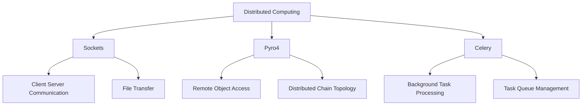

### Definition

Distributed Computing allows multiple computers or processes to communicate and work together over a network.

### Key Technologies Covered

* Socket Programming
* Pyro4 (Python Remote Objects)
* Celery Task Queues
* Client-Server Architecture
* Distributed Processing

---

# 1. Socket Programming 

### Definition

Socket programming enables communication between computers using network connections.

### Flow

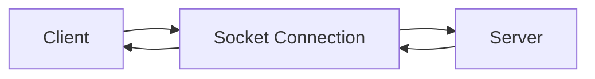

### Advantages

* Real-time communication
* Supports distributed systems
* Simple networking model

### Disadvantages

* Requires network management
* Error handling can be complex

---

# 2. Socket Client 

### Definition

A client initiates communication by connecting to the server and sending requests.

### Flow

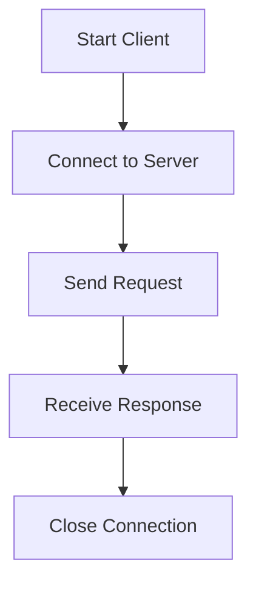

### Advantages

* Easy request handling
* Supports remote communication

### Disadvantages

* Depends on server availability
* Connection failures possible

---

# 3. Socket Server 

### Definition

The server listens for incoming client connections and responds to requests.

### Flow

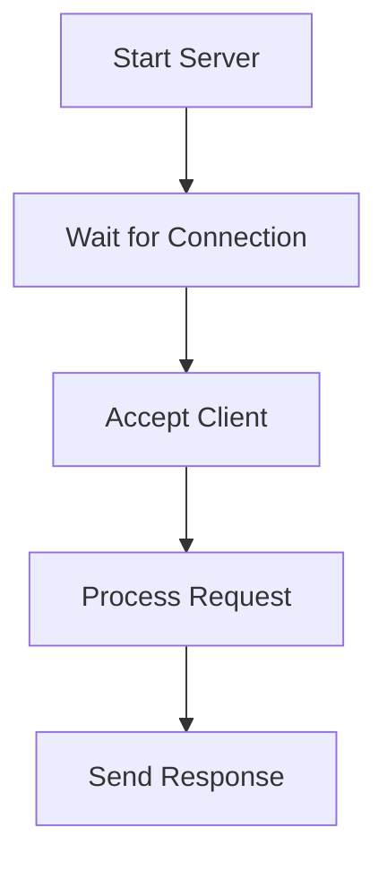

### Advantages

* Centralized communication
* Supports multiple clients

### Disadvantages

* Server overload possible
* Resource management required

---

# 4. File Transfer Using Sockets 

### Definition

Sockets can be used to transfer files between computers.

### Flow

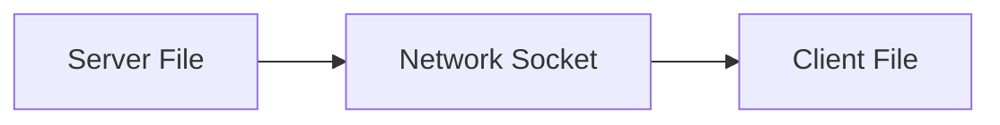

### Advantages

* Fast file sharing
* Simple implementation

### Disadvantages

* Requires network connection
* Large files increase transfer time

---

# 5. Celery Distributed Tasks 

### Definition

Celery is a distributed task queue used for background job processing.

### Flow

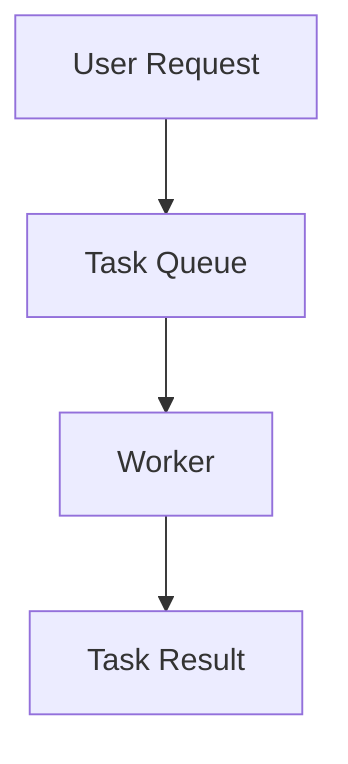

### Advantages

* Background execution
* Scalable architecture
* Improves application responsiveness

### Disadvantages

* Additional setup required
* Queue management complexity

---

# 6. Celery Task

### Definition

Defines a task that can be executed asynchronously by Celery workers.

### Flow

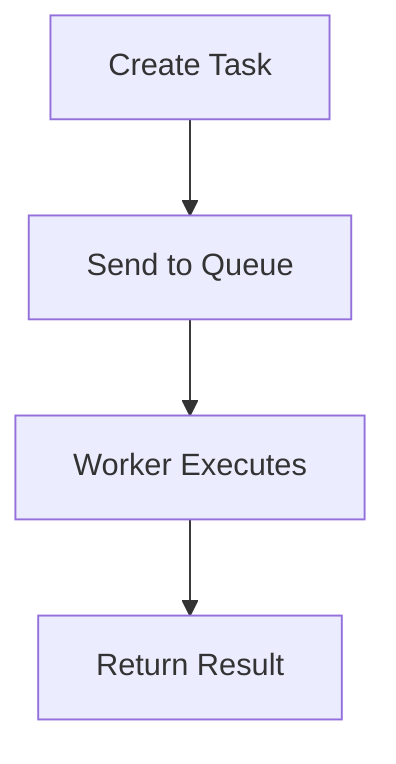

### Advantages

* Asynchronous execution
* Reusable tasks

### Disadvantages

* Requires worker processes
* Monitoring required

---

# 7. Celery Main Application 
### Definition

The main application submits tasks to the Celery queue.

### Flow

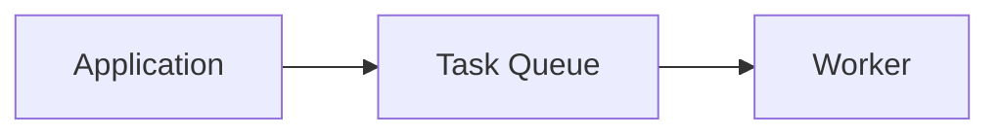

### Advantages

* Decouples processing
* Improves performance

### Disadvantages

* More components to manage
* Queue dependency

---

# 8. Pyro4 Remote Objects 
### Definition

Pyro4 allows remote method calls as if objects were local.

### Flow

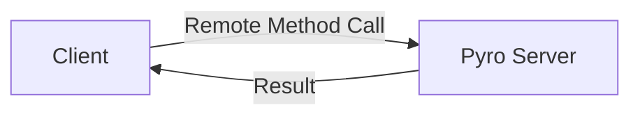

### Advantages

* Simplifies distributed programming
* Object-oriented communication

### Disadvantages

* Network dependency
* Additional framework required

---

# 9. Pyro4 Server 

### Definition

Hosts remote objects and exposes methods to clients.

### Flow

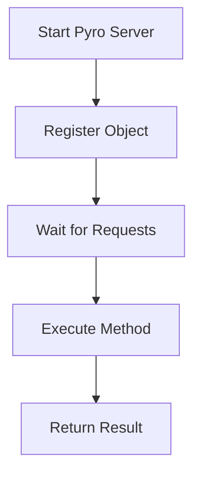

### Advantages

* Remote service hosting
* Centralized processing

### Disadvantages

* Server must remain active
* Security considerations

---

# 10. Pyro4 Client 

### Definition

Connects to a remote Pyro server and invokes methods.

### Flow

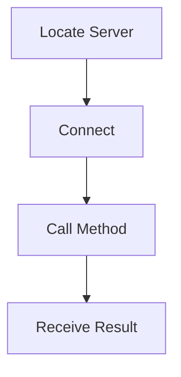

### Advantages

* Easy remote access
* Transparent communication

### Disadvantages

* Requires network availability
* Connection management needed

---

# 11. Chain Topology 

### Definition

Chain topology connects multiple servers in sequence where requests move through the chain.

### Flow

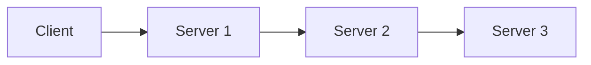

### Advantages

* Distributed processing
* Modular architecture

### Disadvantages

* Failure of one node affects chain
* Increased communication delay

---

# 12. Distributed Chain Servers

### Files

* `server_chain_1.py`
* `server_chain_2.py`
* `server_chain_3.py`

### Definition

Multiple Pyro servers cooperate to process requests across a distributed network.

### Flow

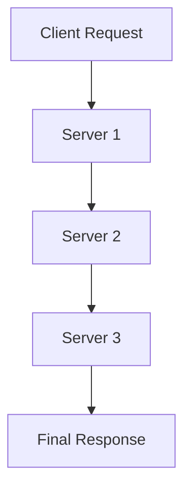

### Advantages

* Scalable architecture
* Distributed workload

### Disadvantages

* Complex coordination
* Network overhead

---

# Technology Comparison

| Technology     | Purpose              | Communication Type |
| -------------- | -------------------- | ------------------ |
| Socket         | Low-level networking | Client ↔ Server    |
| Pyro4          | Remote objects       | Object-based RPC   |
| Celery         | Task processing      | Queue-based        |
| Chain Topology | Distributed servers  | Multi-node         |

---

# Distributed Computing Architecture

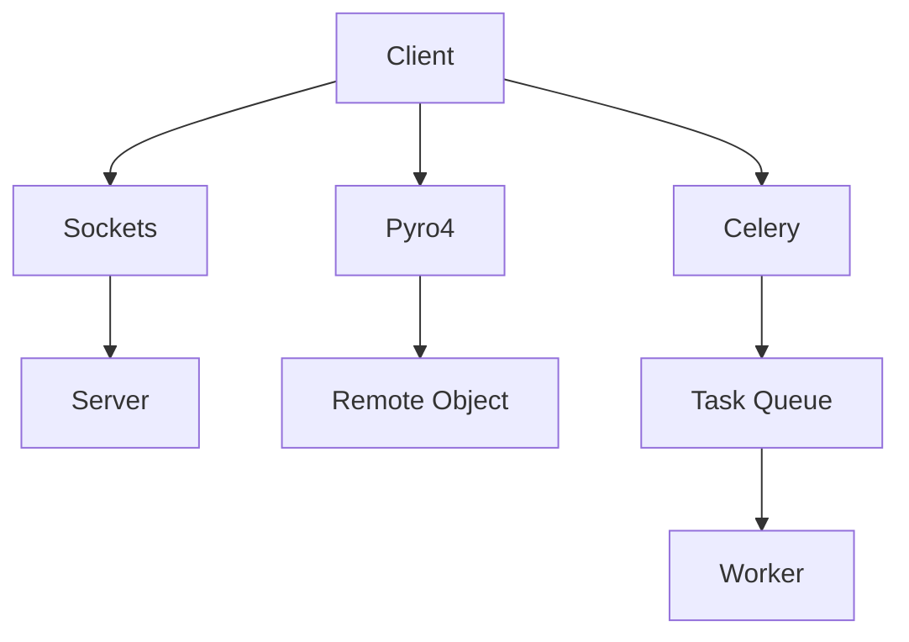

---

# Final Summary

* Socket programming enables network communication between clients and servers.
* Pyro4 provides remote object access and distributed object-oriented programming.
* Celery supports asynchronous background task execution.
* Chain topology demonstrates communication among multiple distributed servers.
* Distributed computing improves scalability and workload distribution.
* Client-server architecture forms the foundation of network applications.
* Task queues help execute long-running operations efficiently.
* Remote procedure calls simplify communication between systems.

