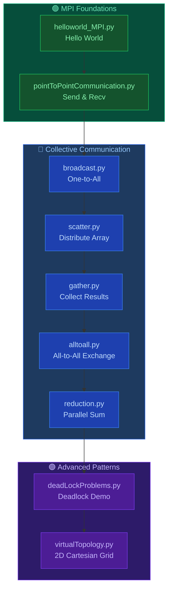
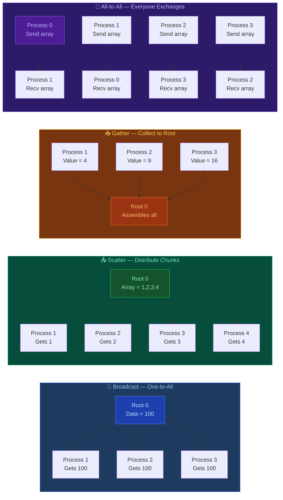
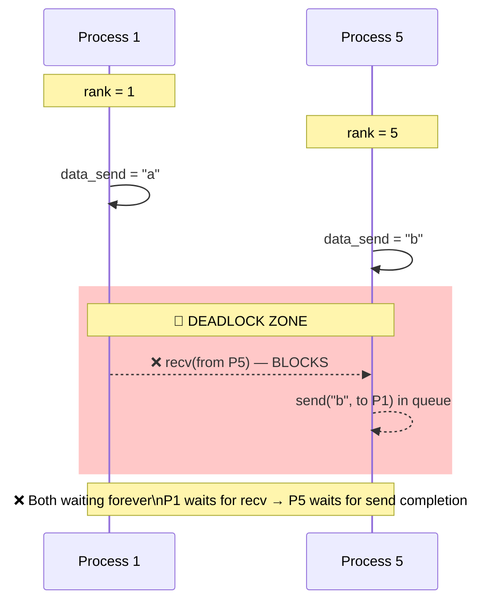
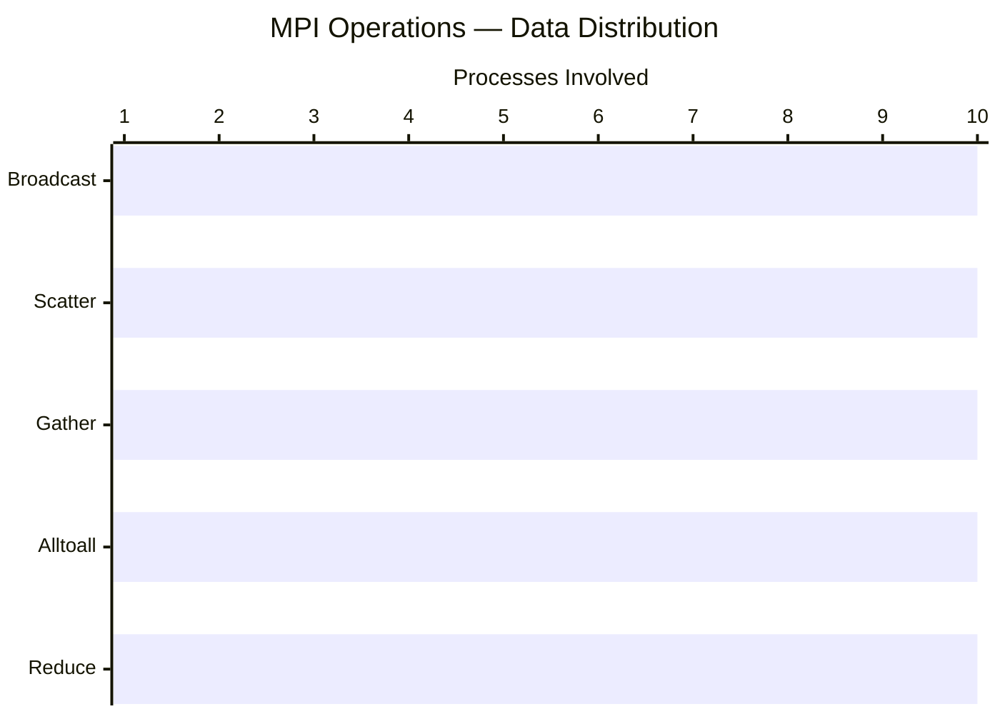
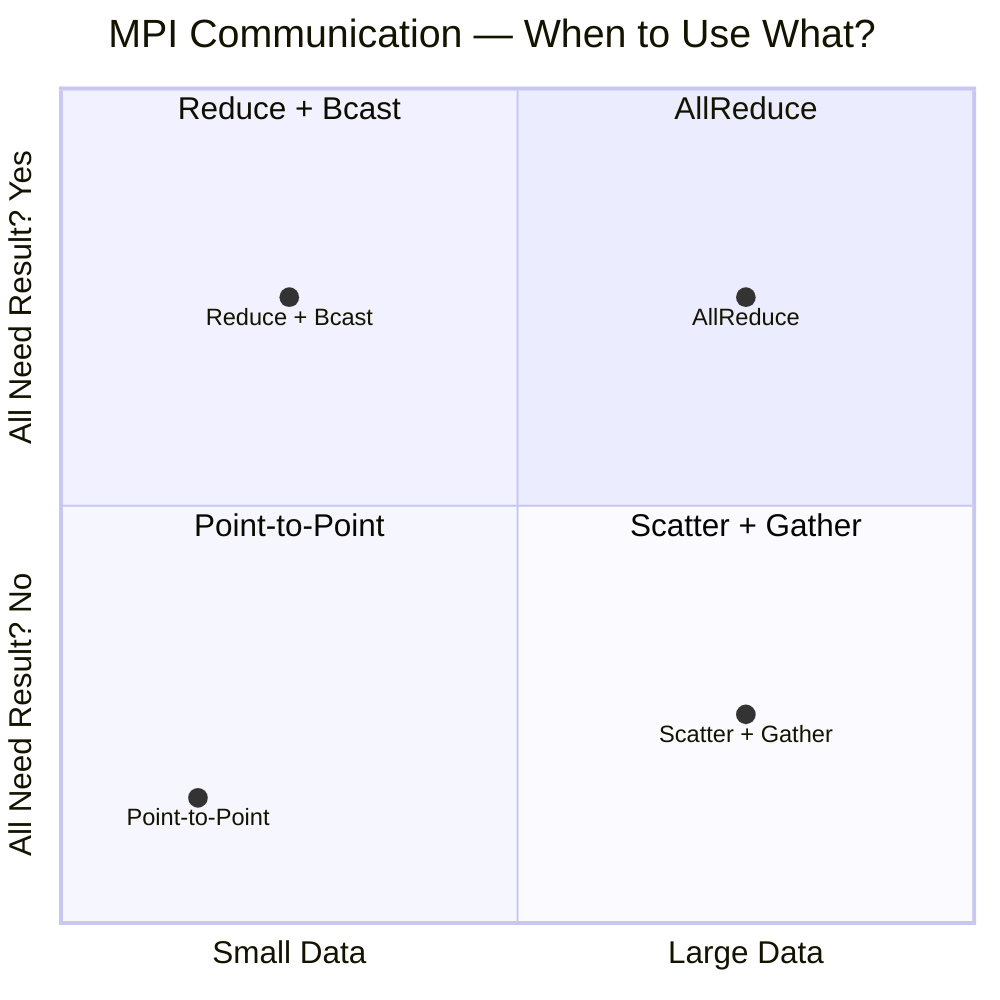
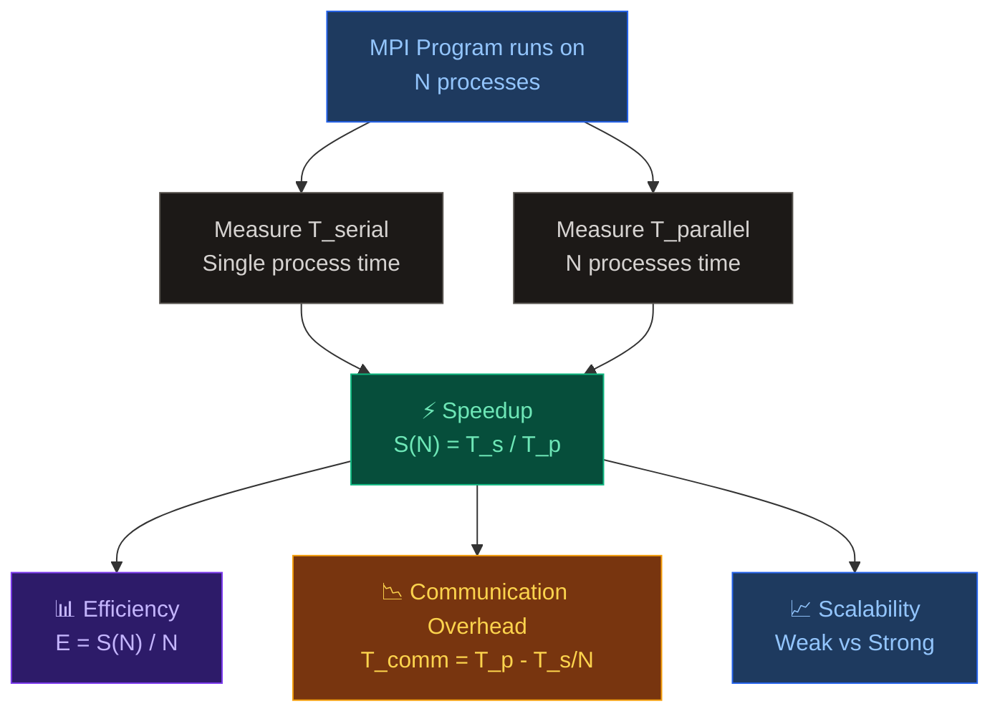
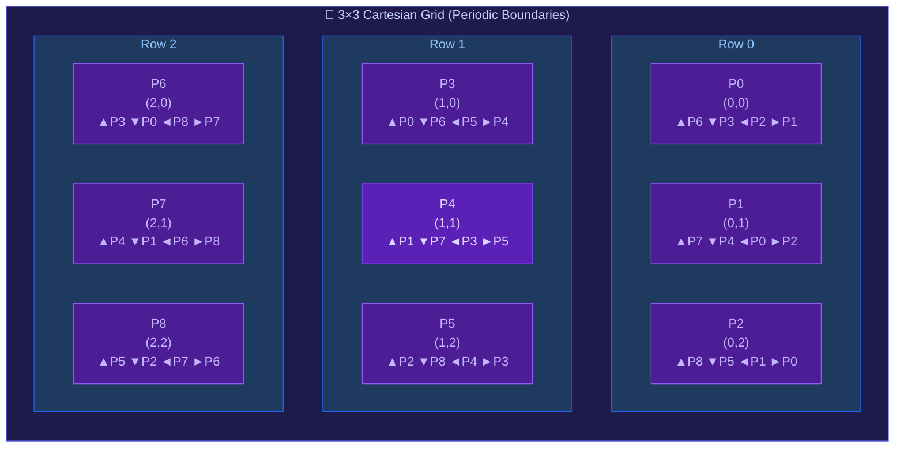
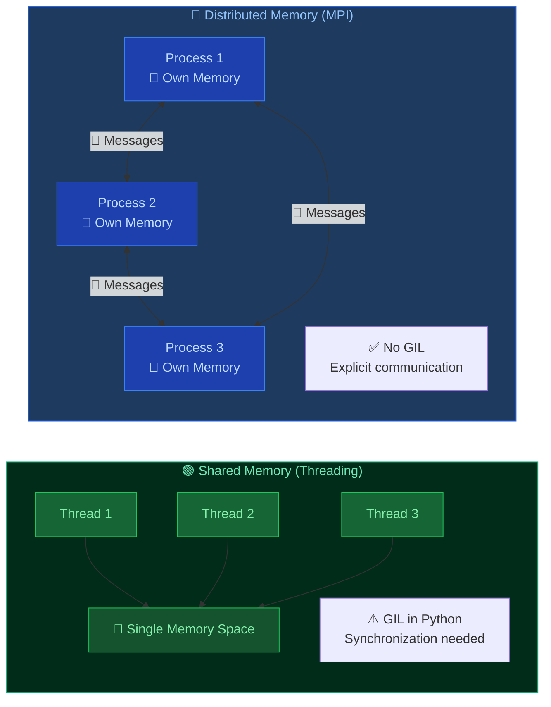

# Chapter 04 — Message Passing Interface (MPI) with Python

> `mpi4py` — Distributed Memory Parallelism: Point-to-Point, Collective Communication & Virtual Topologies.

---

## 📁 Files Overview

| File | Concept | Description |
|------|---------|-------------|
| `helloworld_MPI.py` | MPI Basics | Minimal "Hello World" across all processes |
| `pointToPointCommunication.py` | Point-to-Point | `send()` and `recv()` between specific ranks |
| `broadcast.py` | Collective — Broadcast | `bcast()` — one process shares data to all |
| `scatter.py` | Collective — Scatter | `scatter()` — distributes array chunks to all processes |
| `gather.py` | Collective — Gather | `gather()` — collects data from all processes to root |
| `alltoall.py` | Collective — All-to-All | `Alltoall()` — every process sends & receives from all |
| `reduction.py` | Collective — Reduce | `Reduce()` with `MPI.SUM` — global aggregation |
| `deadLockProblems.py` | Pitfall — Deadlock | Blocking `send/recv` order mismatch causing hang |
| `virtualTopology.py` | Virtual Topology | 2D Cartesian grid with periodic boundaries |

---

## 🗂️ File Dependency Map



---

## ⏱️ Communication Pattern Comparison

```mermaid
gantt
    title MPI Collective Operations — Data Flow Timeline
    dateFormat  X
    axisFormat  Phase %s

    section 🔵 Broadcast (0→All)
    Root sends           :b1, 0, 1
    All receive          :b2, 1, 2

    section 🟢 Scatter (0→All chunks)
    Root splits array    :s1, 0, 1
    Each gets chunk      :s2, 1, 2

    section 🟡 Gather (All→0)
    All send to root     :g1, 0, 2
    Root assembles       :g2, 2, 3

    section 🟣 All-to-All
    All exchange data    :a1, 0, 3

    section 🔴 Reduce (All→0 SUM)
    All compute partial  :r1, 0, 1
    Root aggregates      :r2, 1, 2
```



> 🔵 **Broadcast** — 1→N: Root sends same data to everyone  
> 🟢 **Scatter** — 1→N: Root distributes *different* chunks to each  
> 🟡 **Gather** — N→1: Root collects data from everyone  
> 🟣 **All-to-All** — N↔N: Everyone exchanges with everyone  
> 🔴 **Reduce** — N→1: Root aggregates with operation (SUM, MAX, etc.)

---

## 🔄 MPI Communication Patterns Visualized



---

## 💀 Deadlock Problem — Kya hota hai?



| Problem | Cause | Fix |
|---------|-------|-----|
| **Deadlock** | Both processes `recv()` before `send()` | Swap order: `send()` first, then `recv()` |
| **Blocking** | `send()`/`recv()` block until complete | Use `Isend()`/`Irecv()` non-blocking variants |
| **Order Mismatch** | Send/recv calls in wrong sequence | Match send/recv pairs correctly |

```mermaid
flowchart LR
    subgraph WRONG ["❌ Deadlock — Wrong Order"]
        direction TB
        P1W[Process 1\nrecv(from 5) 🔒\nwaiting forever...]
        P5W[Process 5\nsend(to 1) ⏳\nqueued, no receiver yet\nrecv(from 1) 🔒\nwaiting forever...]
        P1W -.->|blocked| P5W
        P5W -.->|blocked| P1W
    end

    subgraph RIGHT ["✅ Correct Order — No Deadlock"]
        direction TB
        P1R[Process 1\nsend(to 5) ✅\nrecv(from 5) ✅]
        P5R[Process 5\nrecv(from 1) ✅\nsend(to 1) ✅]
        P1R -->|data flows| P5R
        P5R -->|data flows| P1R
    end

    style WRONG fill:#1a0a0a,stroke:#ef4444,color:#fca5a5
    style RIGHT fill:#022c1a,stroke:#10b981,color:#6ee7b7
    style P1W fill:#7f1d1d,color:#fca5a5,stroke:#ef4444
    style P5W fill:#7f1d1d,color:#fca5a5,stroke:#ef4444
    style P1R fill:#14532d,color:#86efac,stroke:#22c55e
    style P5R fill:#14532d,color:#86efac,stroke:#22c55e
```

---

## 📊 MPI Collective Operations Summary



| Operation | Direction | Data Flow | Root? | Use Case |
|-----------|-----------|-----------|:-----:|----------|
| `bcast` | 1 → N | Same data to all | ✅ Yes | Sharing config, model params |
| `scatter` | 1 → N | Different chunks to each | ✅ Yes | Distributing work items |
| `gather` | N → 1 | Collect all to root | ✅ Yes | Assembling results |
| `alltoall` | N ↔ N | Everyone exchanges with all | ❌ No | Matrix transpose, FFT |
| `reduce` | N → 1 | Aggregate with operation | ✅ Yes | Sum, max, min, avg |
| `allreduce` | N ↔ N | Reduce + broadcast result | ❌ No | Global sum for all |

---

## 🧠 MPI Communication Modes



| Mode | Data Size | All Need? | Complexity |
|------|-----------|-----------|:----------:|
| **Point-to-Point** | Any | No | Low |
| **Collective** | Any | Yes | Medium |
| **Non-blocking** | Large | Depends | High |
| **One-sided (RMA)** | Large | No | Very High |

---

## 📐 MPI Performance Metrics



| Formula | Name | Meaning |
|---------|------|---------|
| `S = T_serial / T_parallel` | Speedup | Kitna fast hua multiple processes se? |
| `E = S / N` | Efficiency | Kitne efficiently processes use hue? |
| `T_comm = T_parallel - T_serial/N` | Communication Overhead | Message pass karne mein kitna time waste? |
| **Strong Scaling** | Fixed problem, more processes | Problem same, processes badhao |
| **Weak Scaling** | Fixed work per process | Processes badhao, problem bhi badhao |

---

## 🗺️ Virtual Topology — 2D Cartesian Grid



> 🔗 **Periodic boundaries** — top wraps to bottom, left wraps to right  
> 🧭 **Neighbors:** UP, DOWN, LEFT, RIGHT accessed via `cartesian_communicator.Shift()`

---

## ▶️ How to Run

```bash
# Prerequisite: mpi4py install karo
pip install mpi4py

# MPICH ya OpenMPI install hona zaroori hai (system-level)

# Hello World — 4 processes
mpiexec -n 4 python helloworld_MPI.py

# Point-to-Point — 9 processes (ranks 0,1,4,8 used)
mpiexec -n 9 python pointToPointCommunication.py

# Broadcast — 4 processes
mpiexec -n 4 python broadcast.py

# Scatter — 10 processes (10 elements array)
mpiexec -n 10 python scatter.py

# Gather — 4 processes
mpiexec -n 4 python gather.py

# All-to-All — 4 processes
mpiexec -n 4 python alltoall.py

# Reduce (SUM) — 3 processes
mpiexec -n 3 python reduction.py

# Deadlock Demo — 6+ processes (ranks 1 & 5 used)
mpiexec -n 6 python deadLockProblems.py

# Virtual Topology — 9 processes (3×3 grid)
mpiexec -n 9 python virtualTopology.py
```

> ⚠️ **Important Notes:**
> - MPI programs **cannot** run with plain `python` — always use `mpiexec` / `mpirun`
> - Process count (`-n`) must be ≥ highest rank used in script
> - `deadLockProblems.py` **will hang forever** (runs `Ctrl+C` se stop karo) — yeh intentional hai!

---

## 🔒 Shared Memory vs Distributed Memory



| Feature | Threading (Shared) | MPI (Distributed) |
|---------|-------------------|-------------------|
| **Memory** | Shared, single space | Separate per process |
| **GIL** | ❌ Affected (Python) | ✅ No GIL |
| **Communication** | Via shared variables | Explicit messages |
| **Synchronization** | Locks, semaphores | Send/Recv, Barriers |
| **Scaling** | Single machine | Multi-node clusters |
| **Overhead** | Low (thread create) | Higher (message passing) |

---

## 📋 MPI Patterns Summary

| Pattern | Communication | When to Use | Example File |
|---------|:---:|-------------|--------------|
| **Hello World** | None | Verify MPI setup | `helloworld_MPI.py` |
| **Point-to-Point** | 1 ↔ 1 | Specific process communication | `pointToPointCommunication.py` |
| **Broadcast** | 1 → All | Share config, model, constants | `broadcast.py` |
| **Scatter** | 1 → All (chunks) | Distribute work items | `scatter.py` |
| **Gather** | All → 1 | Collect results at master | `gather.py` |
| **All-to-All** | All ↔ All | Matrix transpose, data shuffle | `alltoall.py` |
| **Reduce** | All → 1 (aggregate) | Global sum, max, min | `reduction.py` |
| **Deadlock** | ❌ Wrong order | **Avoid!** — learn correct pattern | `deadLockProblems.py` |
| **Virtual Topology** | Grid neighbors | Stencil computation, PDE solvers | `virtualTopology.py` |

> **Key Insight:** MPI Python ke GIL ko **bypass** karta hai alag processes use karke — har process ka apna Python interpreter hota hai. CPU-bound scientific computing ke liye MPI best choice hai, especially multi-node clusters ke liye jahan shared memory possible nahi.