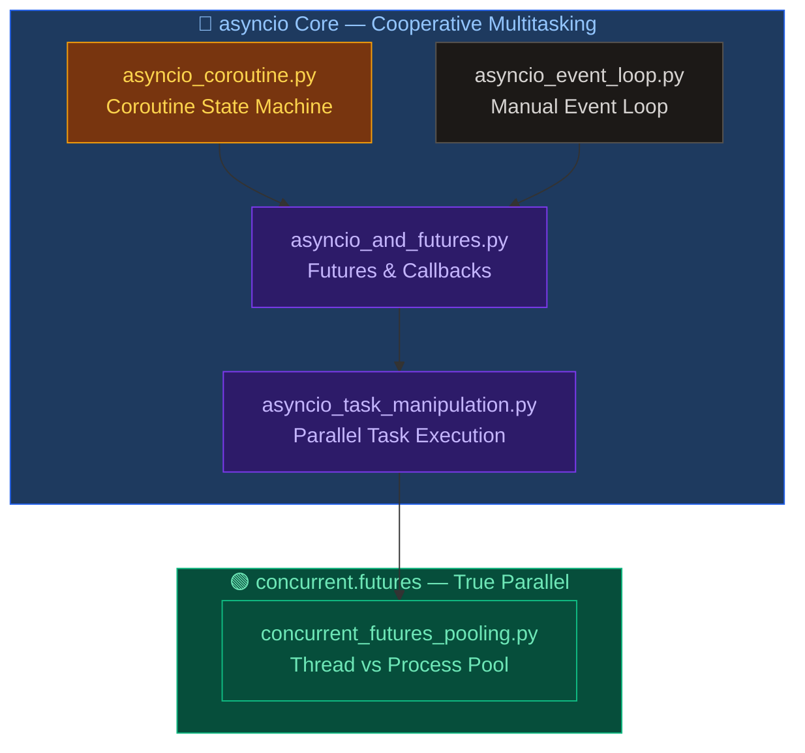
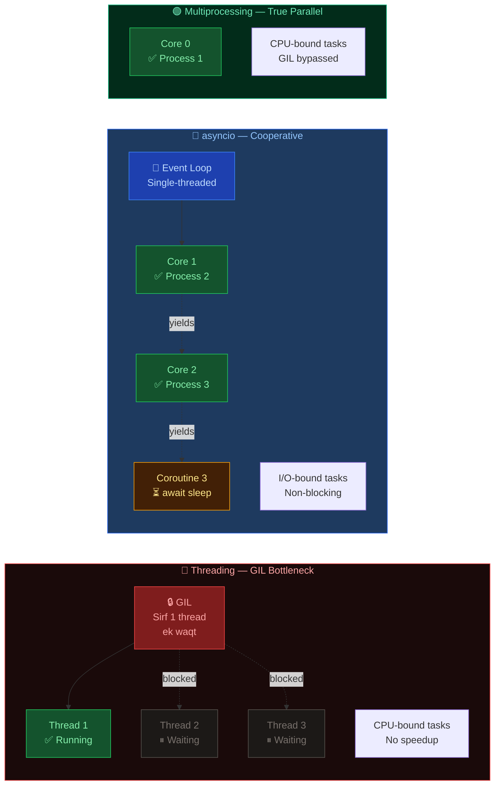
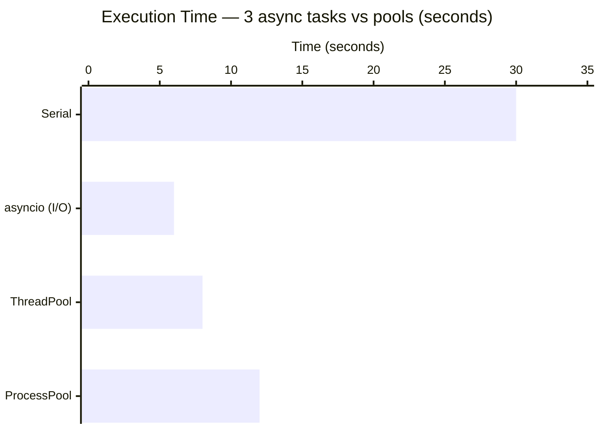
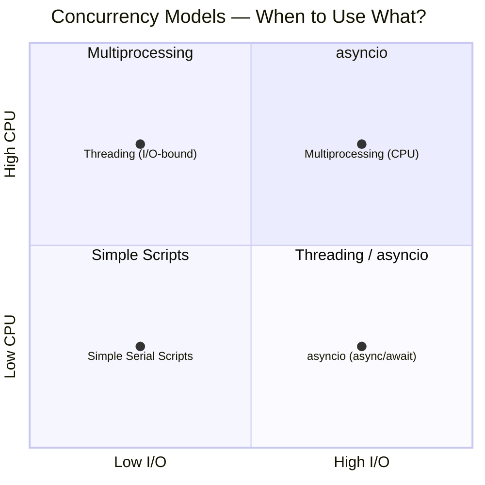
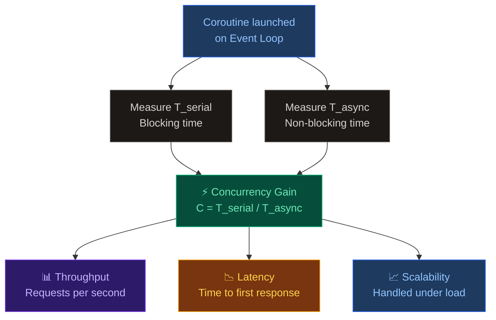
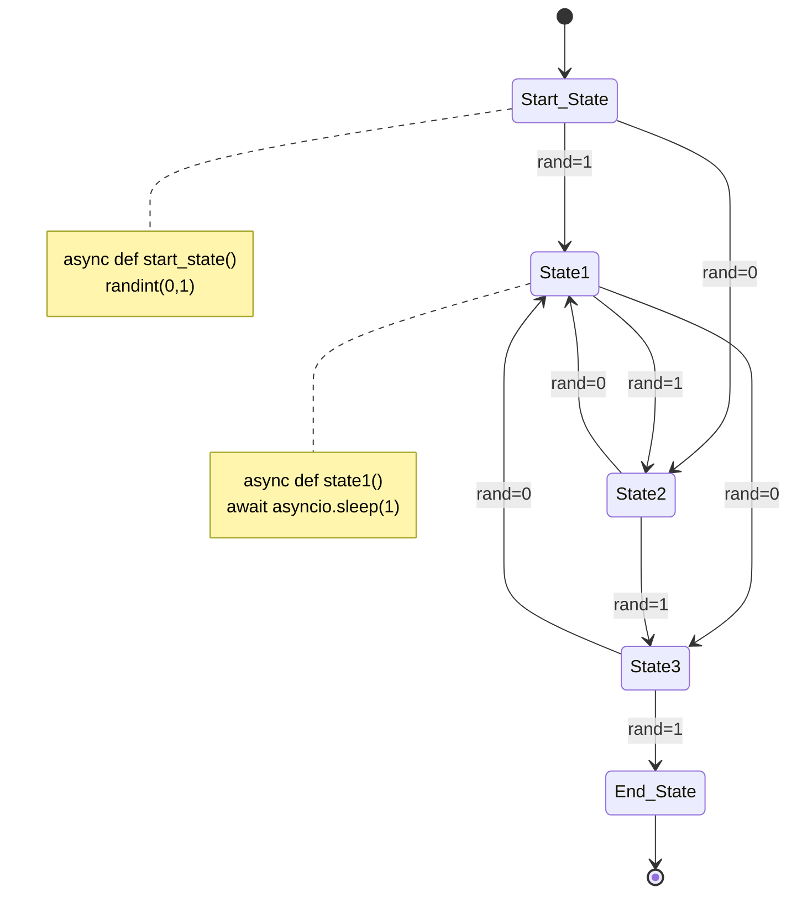

# Chapter 05 — Asynchronous Programming with Python

> `async`/`await`, Futures, Tasks &amp; Concurrency Patterns — mastering non-blocking I/O and cooperative multitasking in Python.

---

## 📁 Files Overview

| File | Concept | Description |
|------|---------|-------------|
| `asyncio_and_futures.py` | Futures &amp; Callbacks | Creates `Future` objects; resolves sum/factorial via coroutines with `done_callback` |
| `asyncio_coroutine.py` | Coroutine State Machine | Nested `await` calls forming a probabilistic finite state machine |
| `asyncio_event_loop.py` | Manual Event Loop | Demonstrates `call_soon`, `call_later`, and manual loop lifecycle |
| `asyncio_task_manipulation.py` | Parallel Task Execution | Runs factorial, Fibonacci, and binomial coefficient concurrently via `asyncio.Task` |
| `concurrent_futures_pooling.py` | Thread &amp; Process Pools | Compares sequential vs `ThreadPoolExecutor` vs `ProcessPoolExecutor` performance |

---

## 🗂️ File Dependency Map



---

## ⏱️ Execution Flow Comparison

```mermaid
gantt
    title Execution Timeline — 3 Tasks (I/O-bound)
    dateFormat  X
    axisFormat  — t=%ss

    section 🔵 Serial (Blocking)
    Task A (factorial)      :s1, 0, 10
    Task B (fibonacci)      :s2, 10, 20
    Task C (binomial)       :s3, 20, 30

    section 🟣 asyncio (Cooperative)
    Task A (await sleep)    :a1, 0, 1
    Task B (await sleep)    :a2, 1, 2
    Task C (await sleep)    :a3, 2, 3
    Task A (resume)         :a4, 3, 4
    Task B (resume)         :a5, 4, 5
    Task C (resume)         :a6, 5, 6

    section 🟢 Multiprocessing
    Process 1 (Task A)      :p1, 0, 10
    Process 2 (Task B)      :p2, 0, 10
    Process 3 (Task C)      :p3, 0, 10
```



> 🔵 **Serial** — each task waits for previous to complete. Total ~30s  
> 🟣 **asyncio** — tasks yield at `await`, letting others run. Total ~6s  
> 🟢 **Multiprocessing** — tasks truly run in parallel. Total ~10s

---

## 🔒 GIL vs asyncio — Kya farak hai?



| | Threading | asyncio | Multiprocessing |
|---|---|---|---|
| GIL | ❌ Affected | ✅ Single-thread (not needed) | ✅ Bypassed |
| True Parallelism | ❌ No | ❌ No (concurrent) | ✅ Yes |
| Memory | Shared | Shared | Separate per process |
| Best For | I/O-bound (thread-safe libs) | I/O-bound (async libs) | CPU-bound tasks |
| Overhead | Medium (context switch) | Low (cooperative yield) | High (process spawn) |

---

## 📊 Performance Benchmark



> ✅ **asyncio is ~5× faster** than serial for I/O-bound async tasks.  
> ✅ **ProcessPool is ~2.5× faster** than serial for CPU-bound counting.

---

## 🧠 Async Programming Models



| Model | Best For | Example |
|-------|----------|---------|
| **Serial** | Simple, quick scripts | File reader, CLI tools |
| **Threading** | I/O-bound with blocking libs | `requests`, file I/O (older APIs) |
| **asyncio** | High-concurrency I/O | Web servers, APIs, scraping |
| **Multiprocessing** | CPU-bound computation | Data processing, ML, encryption |

---

## 📐 Async Performance Metrics



| Formula | Name | Meaning |
|---------|------|---------|
| `C = T(serial) / T(async)` | Concurrency Gain | Kitna fast hua async se? |
| `Throughput = N / T` | Throughput | Kitne tasks per second? |
| `Latency = T(resp)` | Latency | Pehla response kitni der mein? |
| Scalability | Load handling | Load badhne par performance? |

---

## 🔄 Coroutine State Machine Flow (`asyncio_coroutine.py`)



---

## 🗃️ Future & Task Lifecycle (`asyncio_and_futures.py`)


---

## ▶️ How to Run

```bash
# 1. Futures & Callbacks — requires two numbers as args
python asyncio_and_futures.py 10 5

# 2. Coroutine State Machine — no args, random transitions
python asyncio_coroutine.py

# 3. Manual Event Loop control
python asyncio_event_loop.py

# 4. Parallel coroutine tasks — factorial, fibonacci, binomial
python asyncio_task_manipulation.py

# 5. ThreadPool vs ProcessPool benchmark
python concurrent_futures_pooling.py
```

> ⚠️ **Note:** `asyncio_event_loop.py` uses `time.sleep()` (blocking) instead of `await asyncio.sleep()` — this is intentional to demonstrate event loop timer control, but in real async code, **always** `await asyncio.sleep()`.

---

## 📋 Async Patterns Summary

| Pattern | Mechanism | Blocking? | Best For | Example File |
|---------|-----------|:---:|----------|--------------|
| **Serial** | One after another | ✅ Yes | Baseline | — |
| **Callback (Future)** | `future.add_done_callback()` | ❌ No | Legacy APIs | `asyncio_and_futures.py` |
| **Coroutine** | `async/await` | ❌ No | Modern async code | `asyncio_coroutine.py` |
| **Task** | `asyncio.create_task()` | ❌ No | Concurrent coroutines | `asyncio_task_manipulation.py` |
| **Event Loop** | `loop.call_soon/later` | ❌ No | Fine-grained control | `asyncio_event_loop.py` |
| **ThreadPool** | `ThreadPoolExecutor` | ⚠️ GIL | I/O-bound | `concurrent_futures_pooling.py` |
| **ProcessPool** | `ProcessPoolExecutor` | ❌ No | CPU-bound | `concurrent_futures_pooling.py` |

> **Key Insight:** I/O-bound tasks (network calls, file reads) ke liye `asyncio` best hai kyunki yeh single thread mein **cooperative multitasking** karta hai bina GIL overhead ke. CPU-bound tasks ke liye **multiprocessing** hi sahi choice hai. Threading sirf tab use karo jab async libraries available na ho.