# README – Chapter 03

# Python Parallel Programming Cookbook (Multiprocessing)

This chapter focuses on **Process-Based Parallelism using Python Multiprocessing**. Unlike threads, processes have separate memory spaces and can fully utilize multiple CPU cores for parallel execution.

---

## Chapter 03 


# spawning_processes.py

## Architecture

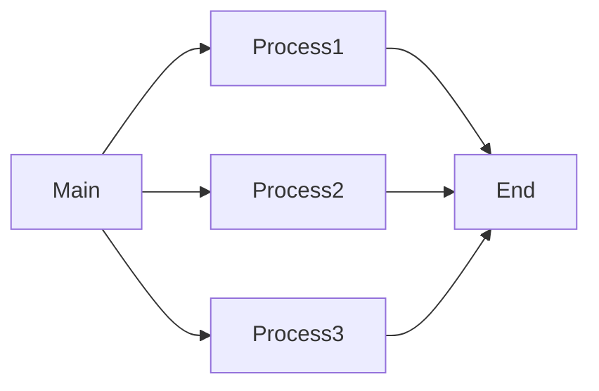

## Overview

Demonstrates **basic process creation using multiprocessing.Process**.

## What I Learned

* Creating processes
* Starting and joining processes
* Difference between threads and processes

## What This Program Does

1. Creates multiple processes
2. Assigns work to each process
3. Executes independently
4. Waits for all processes to finish

## How to Execute

```bash
python spawning_processes.py
```

## Advantages

* True parallel execution
* Utilizes CPU cores

## Disadvantages

* Higher memory usage

## Use Cases

* Data processing
* Scientific computing

## Summary

Shows how to create and run multiple processes.

---

# spawning_processes_namespace.py

## Architecture

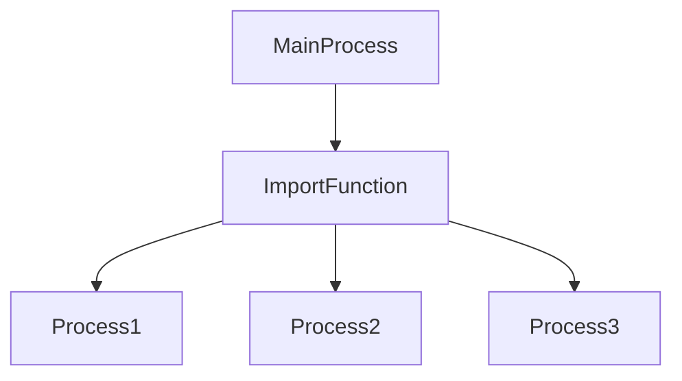

## Overview

Demonstrates executing imported functions inside processes.

## What I Learned

* Namespace handling
* Modular multiprocessing

## What This Program Does

1. Imports a function from another file
2. Creates multiple processes
3. Executes imported function

## How to Execute

```bash
python spawning_processes_namespace.py
```

## Advantages

* Modular code
* Reusability

## Disadvantages

* Requires external modules

## Summary

Shows how multiprocessing works with imported functions.

---

# myFunc.py

## Architecture

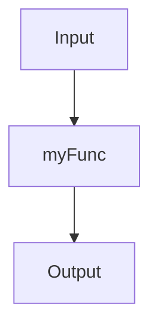

## Overview

Reusable function called by multiprocessing examples.

## What I Learned

* Function parameter passing
* Reusable modules

## Summary

Provides helper functions for process examples.

---

# naming_processes.py

## Architecture

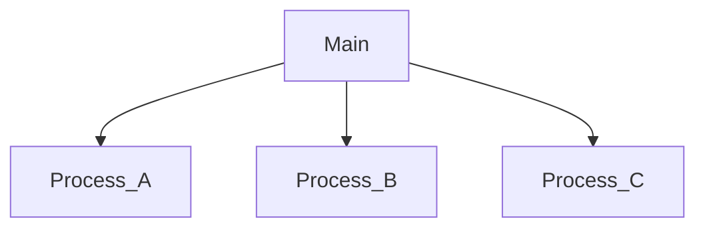

## Overview

Demonstrates custom process names.

## What I Learned

* Naming processes
* Process identification

## How to Execute

```bash
python naming_processes.py
```

## Summary

Shows how custom names improve debugging.

---

# process_in_subclass.py

## Architecture

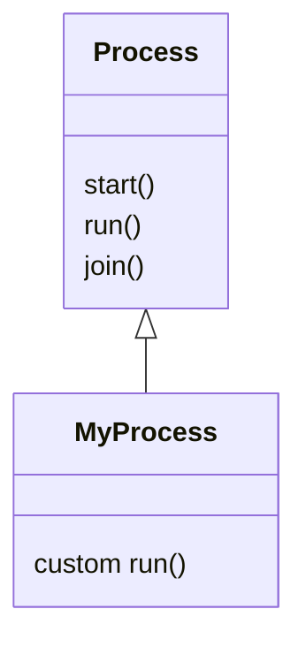

## Overview

Demonstrates subclassing Process.

## What I Learned

* OOP with multiprocessing
* Overriding run()

## How to Execute

```bash
python process_in_subclass.py
```

## Summary

Shows custom process implementation using inheritance.

---

# process_pool.py

## Architecture

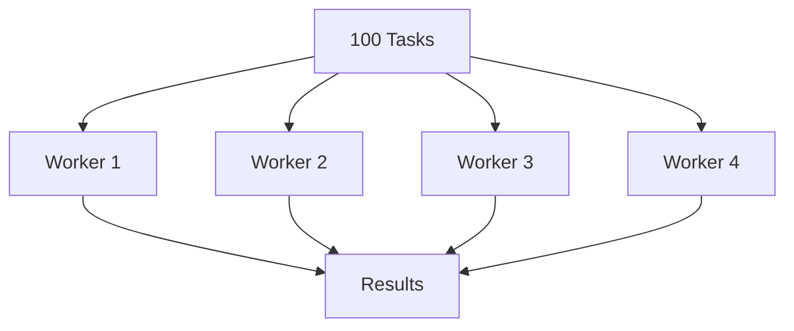

## Overview

Demonstrates Process Pool.

## What I Learned

* Worker pools
* Task distribution

## How to Execute

```bash
python process_pool.py
```

## Advantages

* Efficient parallel processing
* Automatic worker management

## Disadvantages

* Pool setup overhead

## Summary

Shows how tasks are distributed across worker processes.

---

# communicating_with_queue.py

## Architecture

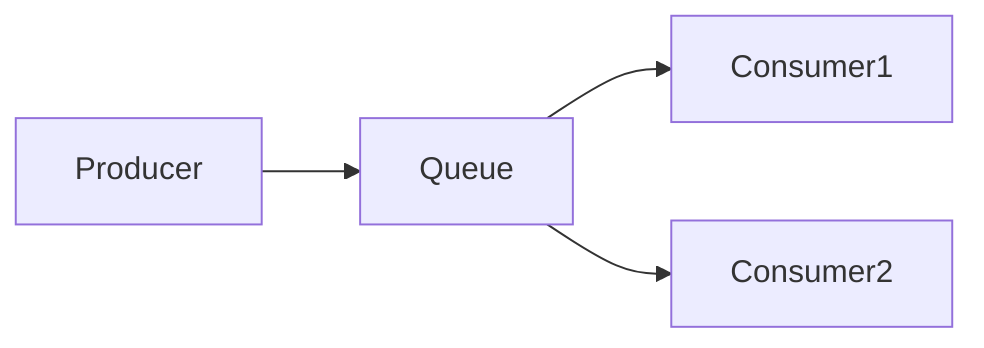

## Overview

Demonstrates Queue-based communication.

## What I Learned

* Producer-consumer model
* Shared queues

## How to Execute

```bash
python communicating_with_queue.py
```

## Summary

Shows safe communication using multiprocessing queues.

---

# communicating_with_pipe.py

## Architecture

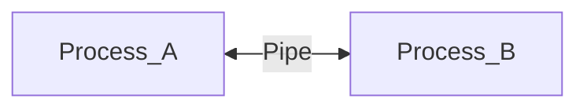

## Overview

Demonstrates Pipe communication.

## What I Learned

* Inter-process communication
* Bidirectional messaging

## How to Execute

```bash
python communicating_with_pipe.py
```

## Summary

Shows data exchange using multiprocessing pipes.

---

# run_background_processes.py

## Architecture

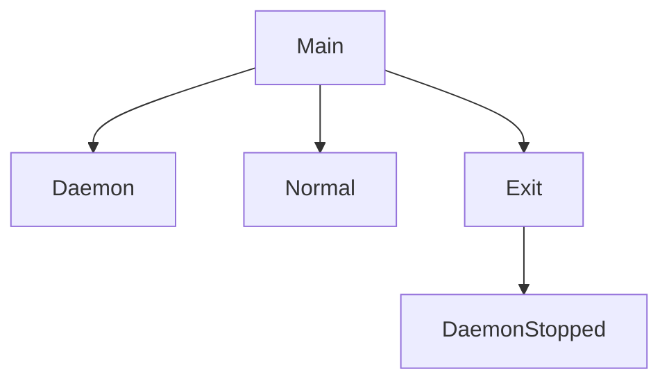

## Overview

Demonstrates daemon processes.

## What I Learned

* Background execution
* Daemon behavior

## How to Execute

```bash
python run_background_processes.py
```

## Summary

Shows how daemon processes terminate when the main process exits.

---

# run_background_processes_no_daemons.py

## Architecture

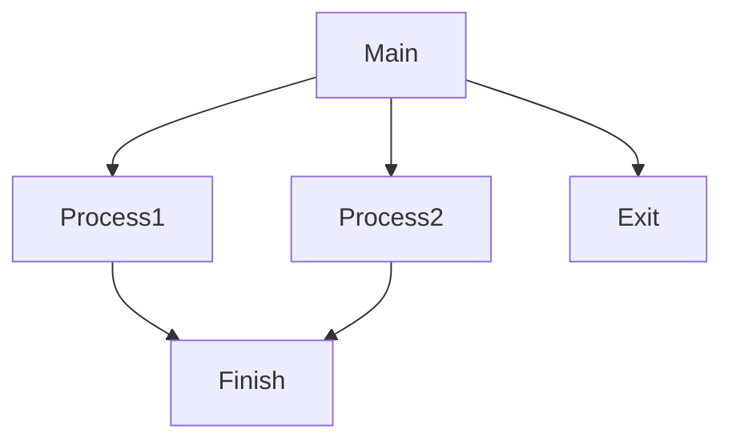

## Overview

Demonstrates non-daemon processes.

## What I Learned

* Independent process execution

## How to Execute

```bash
python run_background_processes_no_daemons.py
```

## Summary

Shows that normal processes continue until completion.

---

# killing_processes.py

## Architecture

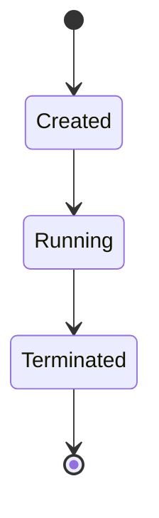

## Overview

Demonstrates process termination.

## What I Learned

* Process lifecycle
* Terminate operation

## How to Execute

```bash
python killing_processes.py
```

## Summary

Shows how running processes can be stopped programmatically.

---

# processes_barrier.py

## Architecture

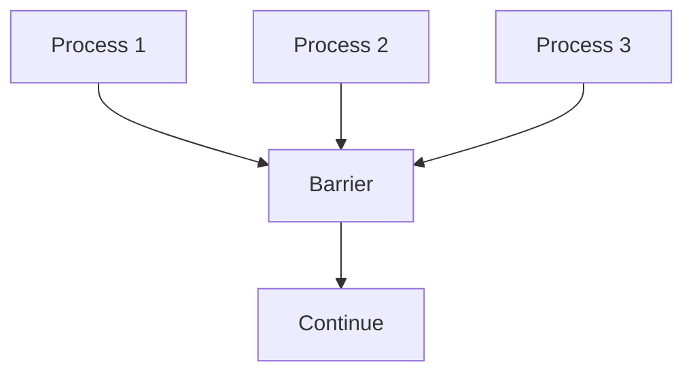

## Overview

Demonstrates Barrier synchronization.

## What I Learned

* Synchronization points
* Coordinated execution

## How to Execute

```bash
python processes_barrier.py
```

## Summary

Shows how processes wait until all participants arrive.

---

# FINAL CHAPTER SUMMARY

## Topics Covered


---

## Chapter 02 vs Chapter 03

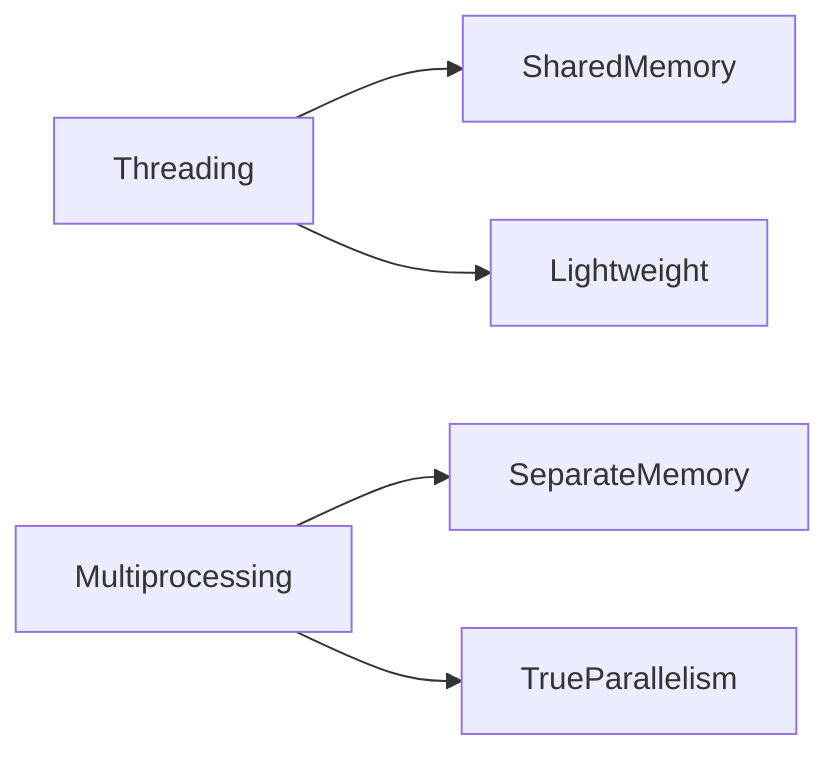

| Chapter 02 | Chapter 03 |
|------------|------------|
| Threading | Multiprocessing |
| Shared Memory | Separate Memory |
| Lightweight | Higher Resource Usage |
| Good for I/O Tasks | Good for CPU Tasks |
| Uses threading | Uses multiprocessing |

---

## Overall Understanding

Chapter 03 teaches how Python processes:

* Run in parallel
* Use multiple CPU cores
* Communicate through Queues and Pipes
* Synchronize with Barriers
* Execute background tasks
* Manage worker pools efficiently

This chapter provides the foundation for building scalable multiprocessing applications in Python.