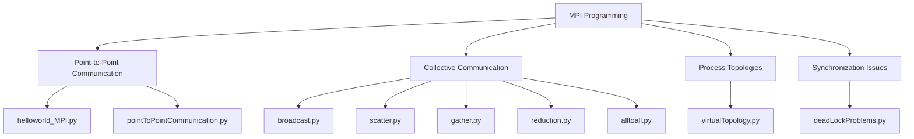
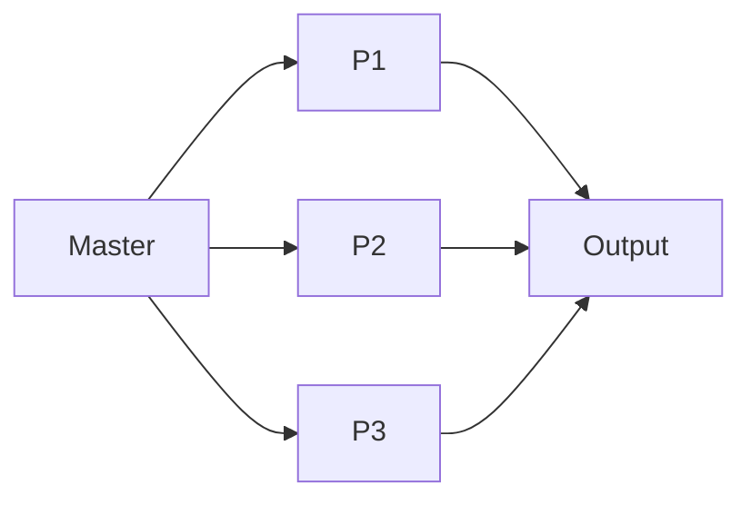
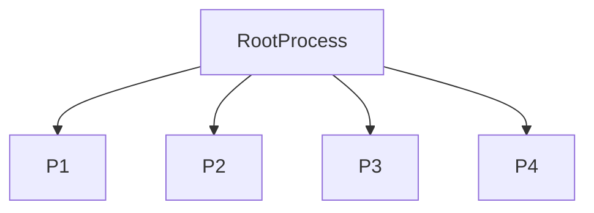
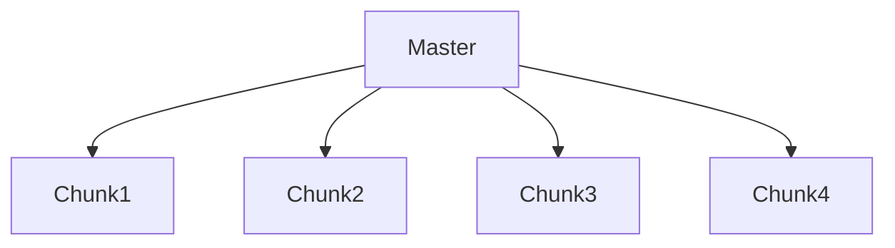
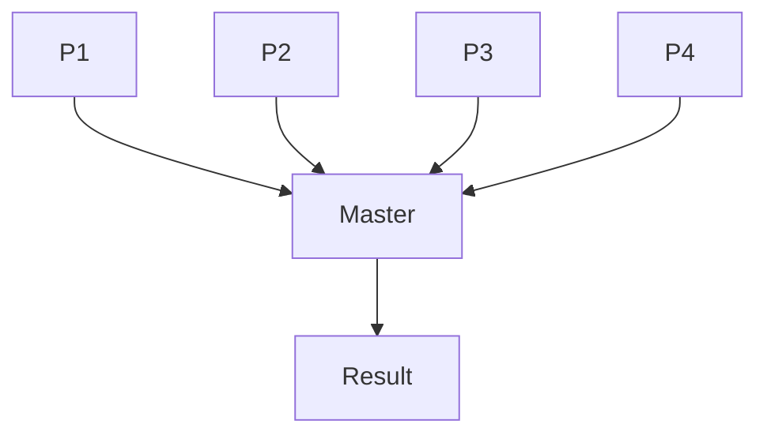
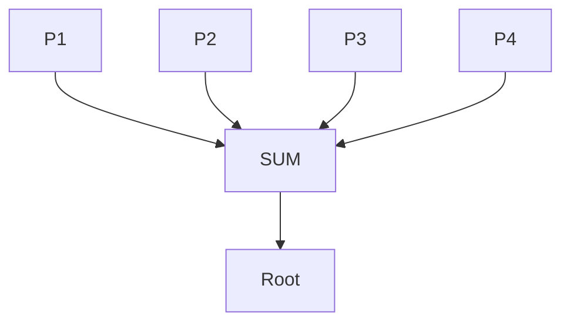
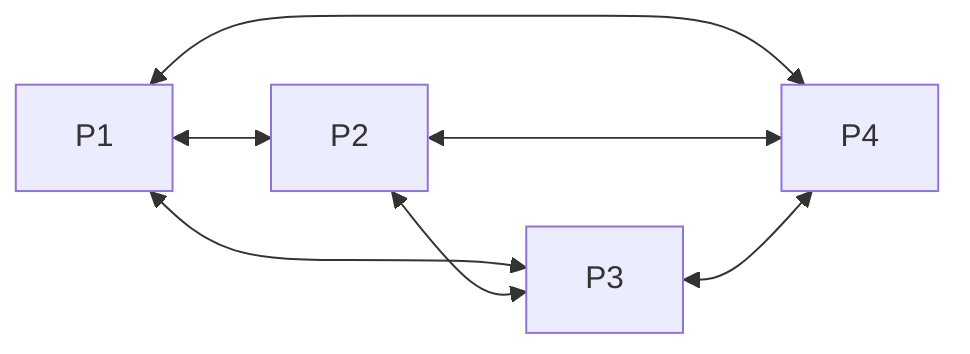
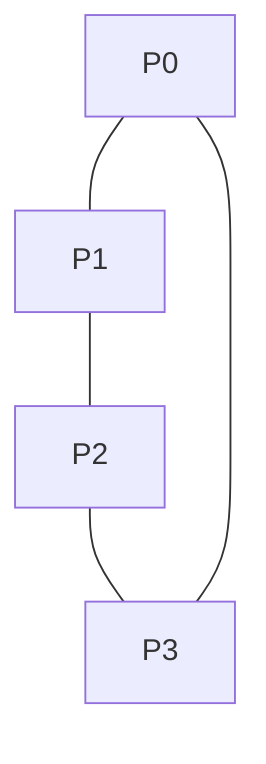
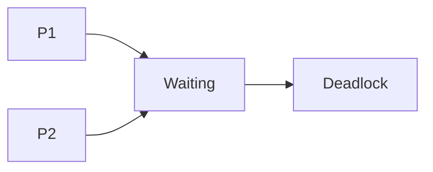

# README – Chapter 04

# Python Parallel Programming Cookbook (MPI – Message Passing Interface)

This chapter focuses on **MPI (Message Passing Interface)** using Python. MPI allows multiple processes running on different machines or CPU cores to communicate efficiently through message passing.

---

## Chapter 04 



---

# helloworld_MPI.py

## Architecture



## Overview

Basic MPI program demonstrating process creation and execution.

## What I Learned

* MPI initialization
* Process rank
* Process size

## What This Program Does

1. Starts MPI environment
2. Creates multiple MPI processes
3. Each process prints its rank
4. Displays total process count

## How to Execute

```bash
mpiexec -n 4 python helloworld_MPI.py
```

## Use Cases

* Learning MPI basics
* Distributed systems

## Summary

Demonstrates the fundamental MPI Hello World example.

---

# pointToPointCommunication.py

## Architecture


## Overview

Demonstrates direct communication between two MPI processes.

## What I Learned

* send()
* recv()
* Message passing

## What This Program Does

1. Process 0 creates data
2. Sends data to Process 1
3. Process 1 receives message
4. Prints received information

## How to Execute

```bash
mpiexec -n 2 python pointToPointCommunication.py
```

## Advantages

* Simple communication model
* Efficient for small messages

## Disadvantages

* Not scalable for many processes

## Summary

Shows direct communication between MPI processes.

---

# broadcast.py

## Architecture



## Overview

Demonstrates MPI Broadcast communication.

## What I Learned

* Broadcast operations
* Root process concept

## What This Program Does

1. Root process creates data
2. Broadcasts data to all processes
3. Every process receives identical copy

## How to Execute

```bash
mpiexec -n 4 python broadcast.py
```

## Advantages

* Efficient distribution
* Reduces communication code

## Disadvantages

* Same data sent to everyone

## Use Cases

* Configuration distribution
* Parallel initialization

## Summary

Shows how one process distributes information to all MPI processes.

---

# scatter.py

## Architecture



## Overview

Demonstrates Scatter operation.

## What I Learned

* Data partitioning
* Parallel workload distribution

## What This Program Does

1. Master process creates dataset
2. Splits data into chunks
3. Sends one chunk to each process
4. Processes work independently

## How to Execute

```bash
mpiexec -n 4 python scatter.py
```

## Advantages

* Balanced workload
* Better scalability

## Disadvantages

* Requires data partitioning

## Summary

Shows how data is divided among multiple processes.

---

# gather.py

## Architecture



## Overview

Demonstrates Gather operation.

## What I Learned

* Collecting distributed results
* Aggregation patterns

## What This Program Does

1. Processes generate results
2. Sends results to root process
3. Root collects everything
4. Displays final output

## How to Execute

```bash
mpiexec -n 4 python gather.py
```

## Advantages

* Centralized result collection

## Disadvantages

* Root process can become bottleneck

## Summary

Shows how distributed results are gathered into one process.

---

# reduction.py

## Architecture



## Overview

Demonstrates MPI Reduction operation.

## What I Learned

* MPI Reduce
* Parallel aggregation

## What This Program Does

1. Each process generates value
2. MPI combines values
3. Performs operation (sum, max, min)
4. Root receives final result

## How to Execute

```bash
mpiexec -n 4 python reduction.py
```

## Advantages

* Fast aggregation
* Optimized communication

## Disadvantages

* Limited to predefined operations

## Summary

Shows how multiple process values are reduced into one final result.

---

# alltoall.py

## Architecture



## Overview

Demonstrates All-to-All communication.

## What I Learned

* Full process communication
* Distributed data exchange

## What This Program Does

1. Every process creates data
2. Sends data to all other processes
3. Receives data from everyone
4. Displays exchanged information

## How to Execute

```bash
mpiexec -n 4 python alltoall.py
```

## Advantages

* Complete data sharing

## Disadvantages

* High communication overhead

## Summary

Shows communication between every pair of processes.

---

# virtualTopology.py

## Architecture



## Overview

Demonstrates Virtual Topology in MPI.

## What I Learned

* Cartesian topology
* Logical process organization

## What This Program Does

1. Creates virtual process network
2. Assigns coordinates
3. Establishes neighbors
4. Enables structured communication

## How to Execute

```bash
mpiexec -n 4 python virtualTopology.py
```

## Advantages

* Organized communication
* Better scalability

## Disadvantages

* More complex setup

## Summary

Shows how MPI processes can be arranged into logical topologies.

---

# deadLockProblems.py

## Architecture



## Overview

Demonstrates MPI deadlock situations.

## What I Learned

* Blocking communication
* Deadlock causes
* Deadlock prevention

## What This Program Does

1. Two processes wait for each other
2. Neither proceeds
3. Program becomes stuck
4. Demonstrates incorrect communication design

## How to Execute

```bash
mpiexec -n 2 python deadLockProblems.py
```

## Advantages

* Educational example
* Helps debugging

## Disadvantages

* Program intentionally blocks

## Summary

Shows how deadlocks occur in MPI systems.

---

# FINAL CHAPTER SUMMARY


## MPI Collective Operations


