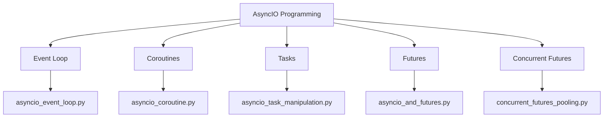
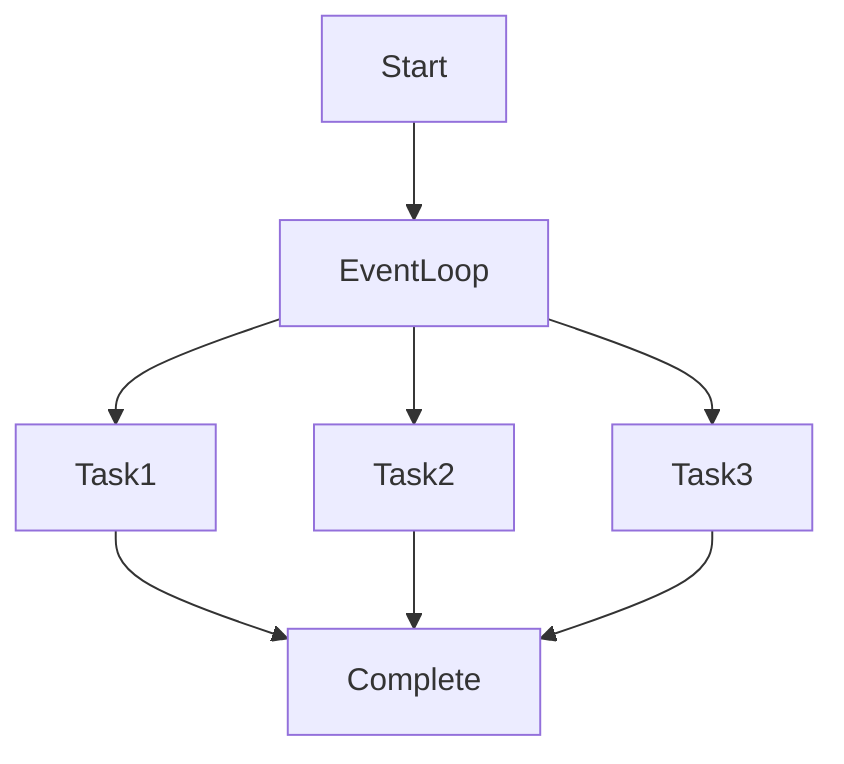
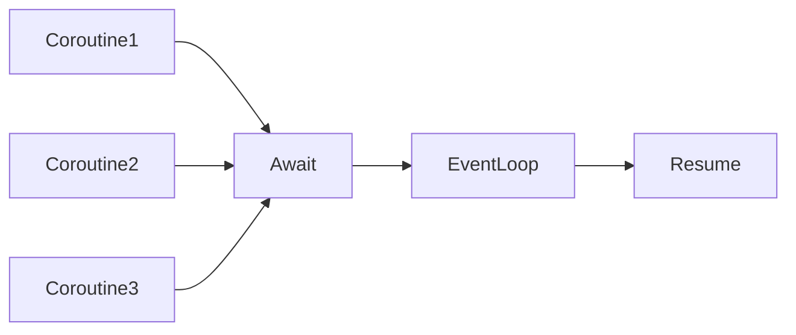
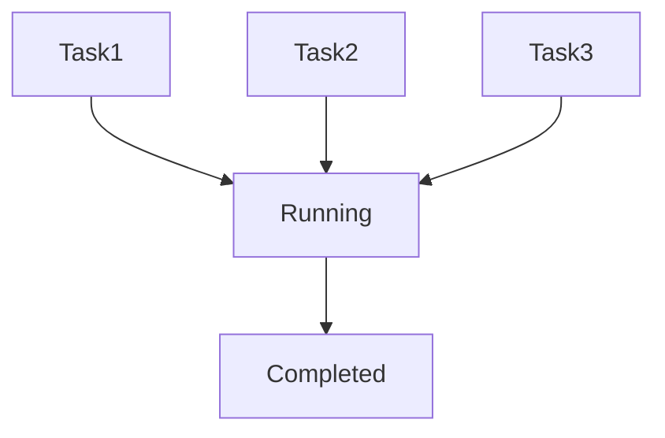
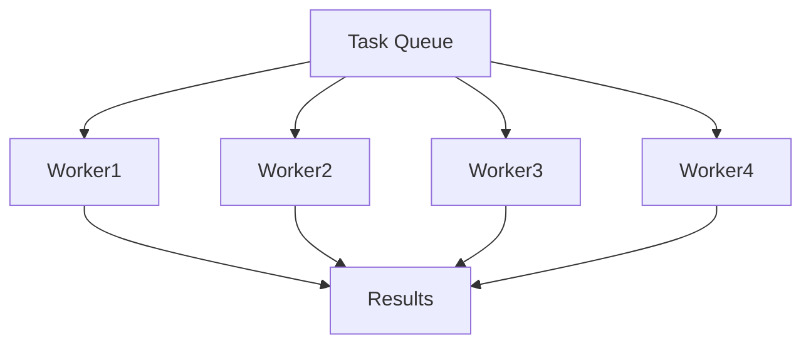
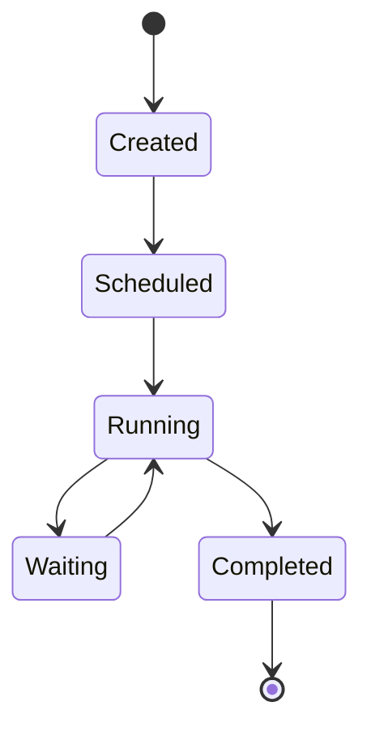
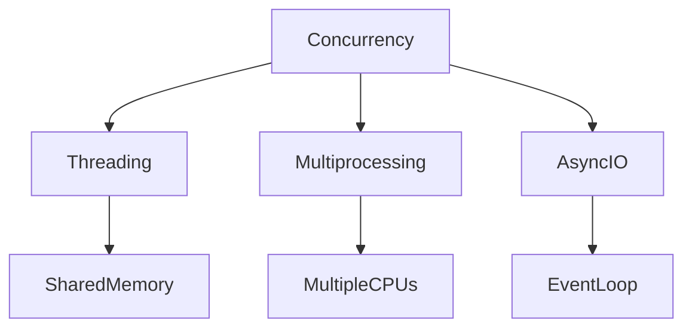
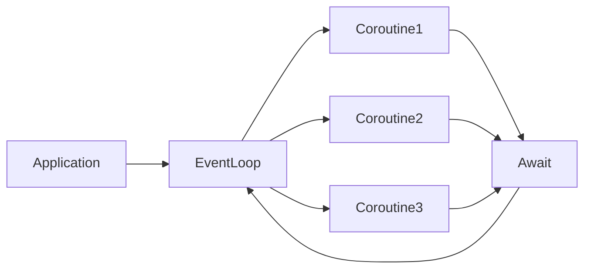

# README – Chapter 05

# Python Parallel Programming Cookbook (Async Programming with AsyncIO)

This chapter focuses on **Asynchronous Programming using AsyncIO**. Unlike threads and processes, AsyncIO allows a single thread to manage thousands of concurrent tasks efficiently through an event loop.

---

## Chapter 05 Roadmap



---

# asyncio_event_loop.py

## Architecture



## Overview

Demonstrates the **AsyncIO Event Loop**, which is the core engine behind asynchronous execution.

## What I Learned

* What an Event Loop is
* How AsyncIO schedules tasks
* Non-blocking execution

## What This Program Does

1. Creates an Event Loop
2. Schedules asynchronous work
3. Runs tasks
4. Waits for completion

## How to Execute

```bash
python asyncio_event_loop.py
```

## Advantages

* Efficient resource utilization
* Supports many concurrent operations

## Disadvantages

* More difficult than sequential programming

## Use Cases

* Web servers
* API clients
* Network applications

## Summary

Shows how AsyncIO uses an Event Loop to manage asynchronous tasks.

---

# asyncio_coroutine.py

## Architecture



## Overview

Demonstrates **Coroutines**, the foundation of AsyncIO.

## What I Learned

* async keyword
* await keyword
* Cooperative multitasking

## What This Program Does

1. Creates multiple coroutines
2. Uses await statements
3. Suspends execution temporarily
4. Resumes when ready

## How to Execute

```bash
python asyncio_coroutine.py
```

## Advantages

* Lightweight concurrency
* Easy task coordination

## Disadvantages

* Requires async-compatible libraries

## Use Cases

* HTTP requests
* Database queries
* Chat applications

## Summary

Shows how coroutines pause and resume execution without blocking the program.

---

# asyncio_task_manipulation.py

## Architecture



## Overview

Demonstrates creating and managing AsyncIO Tasks.

## What I Learned

* create_task()
* Task scheduling
* Concurrent execution

## What This Program Does

1. Creates multiple tasks
2. Schedules them concurrently
3. Tracks execution
4. Waits for completion

## How to Execute

```bash
python asyncio_task_manipulation.py
```

## Advantages

* Better task control
* Concurrent execution

## Disadvantages

* Task management complexity

## Use Cases

* Background jobs
* Real-time systems

## Summary

Shows how AsyncIO tasks are created, scheduled, and managed.

---

# asyncio_and_futures.py

## Architecture


## Overview

Demonstrates AsyncIO Futures.

## What I Learned

* Future objects
* Asynchronous results
* Deferred execution

## What This Program Does

1. Creates Future objects
2. Assigns results later
3. Waits asynchronously
4. Retrieves values

## How to Execute

```bash
python asyncio_and_futures.py
```

## Advantages

* Handles future results efficiently
* Supports asynchronous workflows

## Disadvantages

* Slightly more complex than tasks

## Use Cases

* Event-driven systems
* Async APIs

## Summary

Shows how Future objects represent values that become available later.

---

# concurrent_futures_pooling.py

## Architecture



## Overview

Demonstrates **Concurrent Futures Pooling**.

## What I Learned

* ThreadPoolExecutor
* ProcessPoolExecutor
* Task pooling

## What This Program Does

1. Creates worker pool
2. Submits tasks
3. Executes tasks concurrently
4. Collects results

## How to Execute

```bash
python concurrent_futures_pooling.py
```

## Advantages

* Simplifies parallel execution
* Automatic worker management

## Disadvantages

* Pool initialization overhead

## Use Cases

* Batch processing
* Parallel computations

## Summary

Shows how worker pools execute multiple tasks efficiently.

---

# AsyncIO Lifecycle Visualization



---

# AsyncIO vs Threading vs Multiprocessing



---

# AsyncIO Execution Model



---


# Async Programming Workflow


---

# Chapter Comparison

| Feature     | Threading      | Multiprocessing  | AsyncIO     |
| ----------- | -------------- | ---------------- | ----------- |
| Memory      | Shared         | Separate         | Shared      |
| CPU Usage   | Medium         | High             | Low         |
| Best For    | I/O Tasks      | CPU Tasks        | Massive I/O |
| Parallelism | Limited by GIL | True Parallelism | Cooperative |
| Lightweight | Medium         | No               | Yes         |
| Scalability | Medium         | Medium           | Very High   |

---

# FINAL CHAPTER SUMMARY

## Key Concepts Learned

* Event Loop
* Coroutines
* Async and Await
* Task Scheduling
* Future Objects
* Concurrent Futures
* Non-Blocking Execution

---

## Overall Understanding

This chapter teaches how Python handles **asynchronous programming** using AsyncIO.

The programs demonstrate:

* Running many tasks concurrently
* Event-driven execution
* Non-blocking operations
* Future result handling
* Task scheduling and management
* Worker pooling

AsyncIO is ideal for:

* Web servers
* API clients
* Chat applications
* Streaming systems
* Real-time dashboards
* High-concurrency network applications

---

## Learning Progress Across Chapters


**Chapter 05 completes the transition from Threads → Processes → Distributed Computing → Modern Asynchronous Programming in Python.**
