# README – Chapter 06

# Python Parallel Programming Cookbook (Distributed Computing & Remote Execution)

This chapter focuses on **Distributed Computing**, where programs communicate across machines using **Sockets, Pyro4 (Python Remote Objects), and Celery**. These technologies allow applications to execute tasks remotely and build scalable distributed systems.

---

## Chapter 06 Roadmap

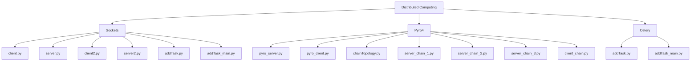

---

# SOCKET PROGRAMMING

## Socket Communication Architecture

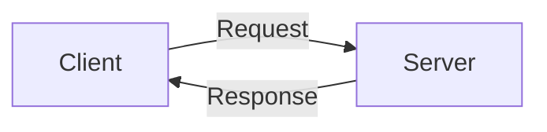

---

# client.py

## Overview

Demonstrates a basic socket client.

## Architecture

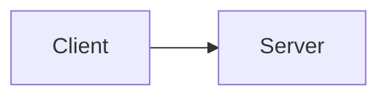

## What I Learned

* Creating socket clients
* Connecting to remote servers
* Sending requests

## What This Program Does

1. Creates socket
2. Connects to server
3. Sends message
4. Receives response

## How to Execute

```bash
python client.py
```

## Summary

Shows how a client connects to a socket server.

---

# server.py

## Architecture

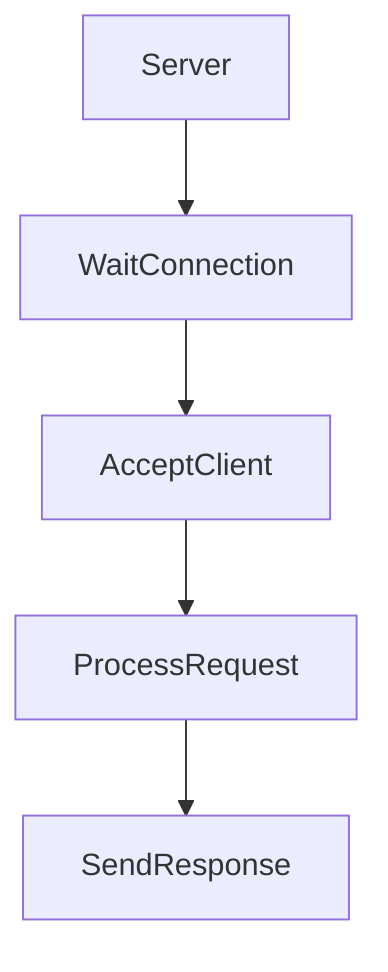

## Overview

Demonstrates a basic socket server.

## What I Learned

* Binding sockets
* Listening for clients
* Accepting connections

## Summary

Shows how a socket server handles incoming requests.

---

# client2.py

## Architecture


## Overview

Advanced socket client implementation.

## What I Learned

* File transfer operations
* Data streaming

## Summary

Demonstrates transferring larger data through sockets.

---

# server2.py

## Architecture

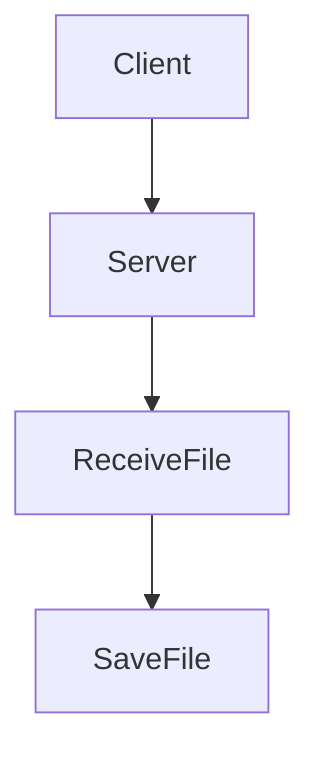

## Overview

Advanced socket server handling file transfer.

## What I Learned

* Receiving files
* Saving transmitted data

## Summary

Shows server-side file transfer implementation.

---

# addTask.py (Socket)

## Architecture

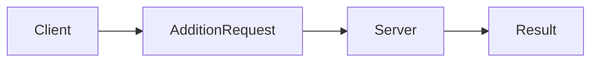

## Overview

Remote addition service using sockets.

## What I Learned

* Remote procedure execution
* Data serialization

## Summary

Shows distributed arithmetic processing.

---

# addTask_main.py (Socket)

## Overview

Main controller for remote addition task.

## Summary

Executes remote socket addition service.

---

# PYRO4 (Python Remote Objects)

## Pyro4 Architecture

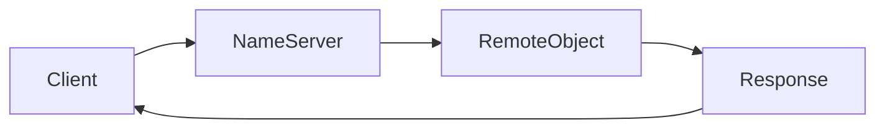

---

# pyro_server.py

## Architecture

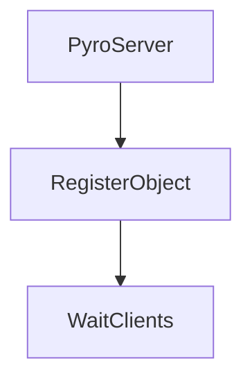

## Overview

Creates a Pyro4 server.

## What I Learned

* Remote object registration
* Pyro daemon

## Summary

Hosts remote Python objects.

---

# pyro_client.py

## Architecture

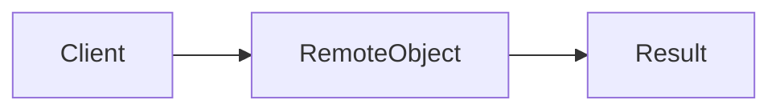

## Overview

Accesses remote Pyro objects.

## What I Learned

* Remote method invocation
* Object proxies

## Summary

Demonstrates calling remote methods.

---

# chainTopology.py

## Architecture

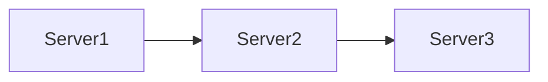

## Overview

Defines chain communication topology.

## What I Learned

* Distributed service chaining
* Message forwarding

## Summary

Creates a linked service architecture.

---

# server_chain_1.py

## Architecture

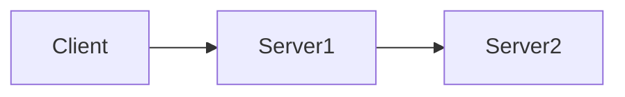

## Overview

First node in Pyro chain.

## Summary

Receives and forwards requests.

---

# server_chain_2.py

## Architecture


## Overview

Middle node in chain topology.

## Summary

Processes and forwards requests.

---

# server_chain_3.py

## Architecture

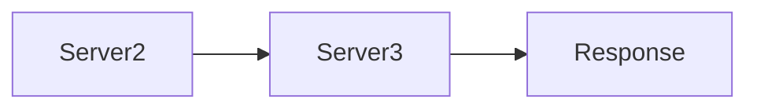

## Overview

Final node in chain.

## Summary

Generates final output.

---

# client_chain.py

## Architecture

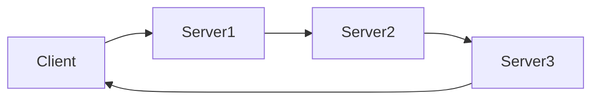

## Overview

Client for chain topology.

## What I Learned

* Multi-hop communication

## Summary

Shows end-to-end distributed execution.

---

# CELERY DISTRIBUTED TASK QUEUE

## Celery Architecture

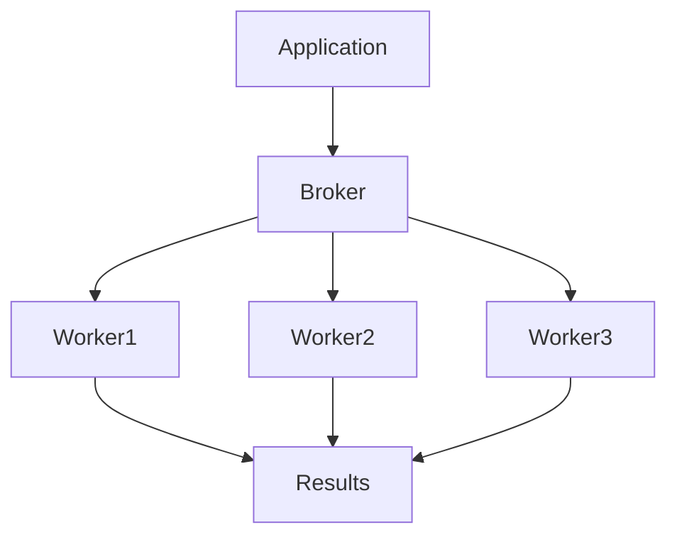

---

# addTask.py (Celery)

## Overview

Defines Celery asynchronous task.

## What I Learned

* Celery tasks
* Delayed execution

## What This Program Does

1. Defines task
2. Registers with Celery
3. Waits for execution

## Summary

Shows asynchronous task definition.

---

# addTask_main.py (Celery)

## Architecture

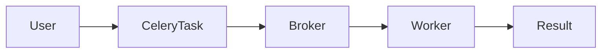

## Overview

Submits Celery task for execution.

## What I Learned

* Task scheduling
* Worker processing

## Summary

Demonstrates distributed task execution.

---

# Distributed Communication Comparison

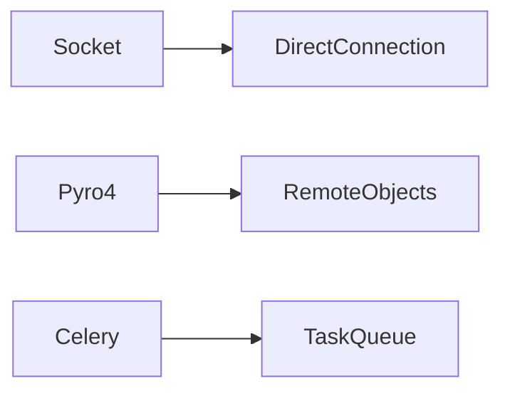

---

# Chapter Components Distribution

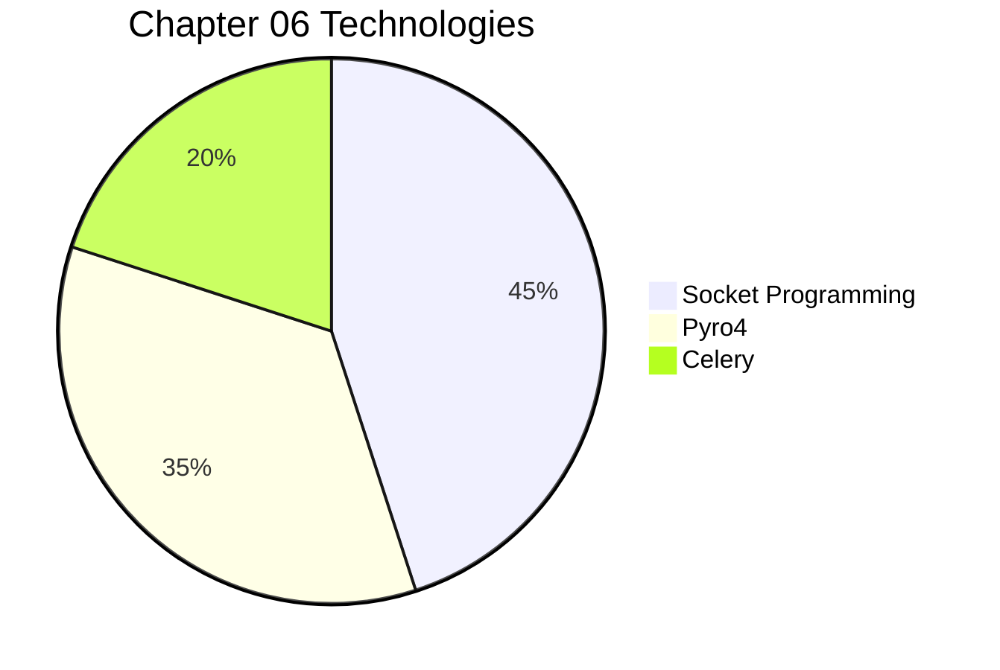

---

# Distributed Request Flow

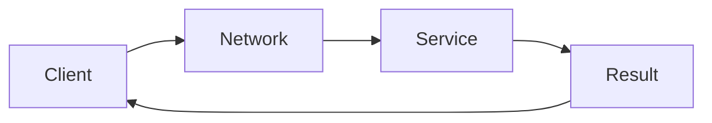

---

# Technology Comparison

| Technology | Communication Style  | Best For                |
| ---------- | -------------------- | ----------------------- |
| Socket     | Low-level networking | Custom protocols        |
| Pyro4      | Remote Objects       | Distributed Python apps |
| Celery     | Task Queues          | Background processing   |

---

# Evolution of Parallel Computing

```mermaid
graph LR

Threads --> Multiprocessing

Multiprocessing --> MPI

MPI --> AsyncIO

AsyncIO --> DistributedSystems
```

---

# FINAL CHAPTER SUMMARY

## Key Concepts Learned

* Socket Programming
* Client-Server Communication
* File Transfer
* Pyro4 Remote Objects
* Distributed Service Chaining
* Celery Task Queues
* Asynchronous Distributed Processing

---

## Overall Understanding

Chapter 06 introduces **Distributed Computing Technologies** in Python.

The examples demonstrate:

* Network communication using sockets
* Remote method invocation with Pyro4
* Distributed service topologies
* Asynchronous task execution with Celery
* Building scalable distributed systems

These technologies are commonly used in:

* Microservices
* Cloud Computing
* Distributed Systems
* Background Job Processing
* Enterprise Applications
* Network Services

---

## Learning Journey

```mermaid
graph LR

Chapter2[Threads]
--> Chapter3[Multiprocessing]

Chapter3
--> Chapter4[MPI]

Chapter4
--> Chapter5[AsyncIO]

Chapter5
--> Chapter6[Distributed Computing]
```

**Chapter 06 completes the journey from local parallelism to fully distributed computing systems.**
