# README – Chapter 07

# Python Parallel Programming Cookbook (Docker Containerization)

This chapter focuses on **Containerization using Docker**. Docker allows developers to package applications along with their dependencies into lightweight, portable containers that run consistently across different environments.

---

## Chapter 07 

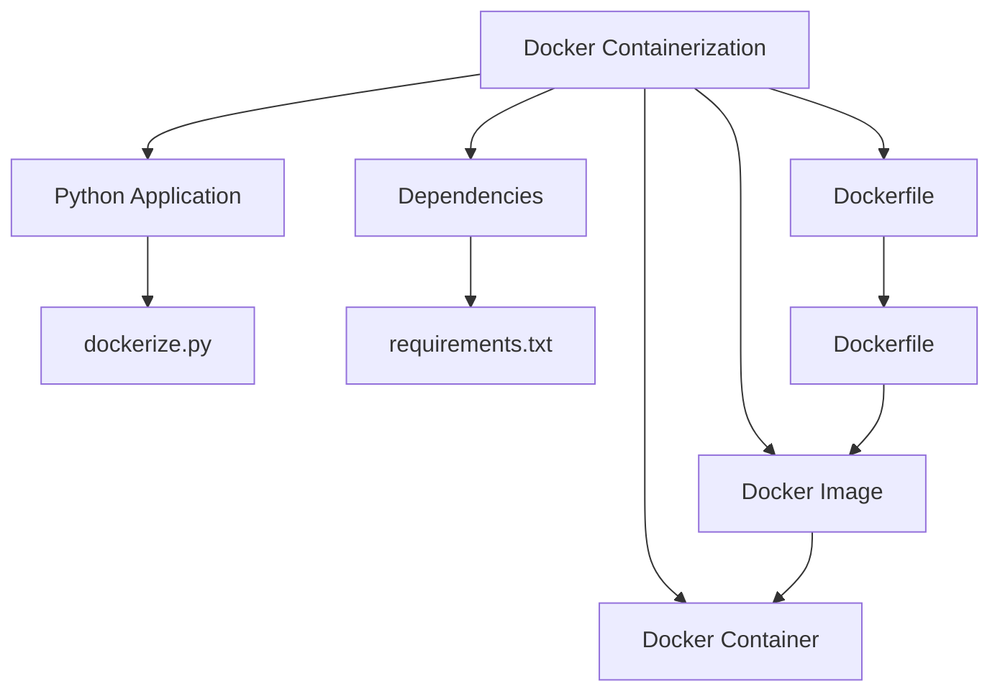

---

# Chapter Overview

## What is Containerization?

Containerization packages:

* Application Code
* Libraries
* Dependencies
* Runtime Environment

into a single deployable unit called a **Container**.

---

## Traditional Deployment vs Docker

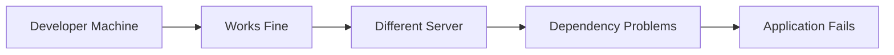

### With Docker

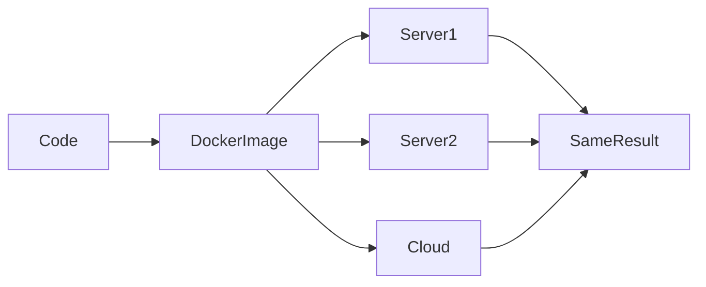

---

# dockerize.py

## Architecture

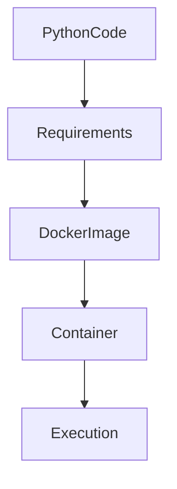

## Overview

This file contains the Python application that will be packaged inside a Docker container.

---

## What I Learned

* Dockerizing Python applications
* Container execution
* Packaging application code

---

## What This Program Does

1. Executes Python logic
2. Uses installed dependencies
3. Runs inside Docker container
4. Produces output independent of host machine

---

## How to Execute Normally

```bash
python dockerize.py
```

---

## How to Execute Through Docker

```bash
docker build -t mypythonapp .
docker run mypythonapp
```

---

## Advantages

* Consistent execution
* Portable deployment

---

## Disadvantages

* Requires Docker installation

---

## Use Cases

* Cloud deployment
* Production environments
* CI/CD pipelines

---

## Summary

This file represents the Python application packaged inside the Docker container.

---

# requirements.txt

## Architecture

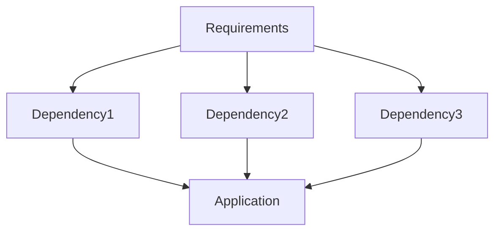

## Overview

Lists all Python dependencies required by the application.

---

## What I Learned

* Dependency management
* Reproducible environments

---

## What This File Does

1. Lists required libraries
2. Docker installs dependencies
3. Application uses installed packages

---

## Example

```txt
numpy
flask
requests
```

---

## Advantages

* Easy dependency tracking
* Consistent installations

---

## Disadvantages

* Requires maintenance

---

## Use Cases

* Python projects
* Deployment automation

---

## Summary

Ensures the application has all required dependencies.

---

# Dockerfile

## Architecture

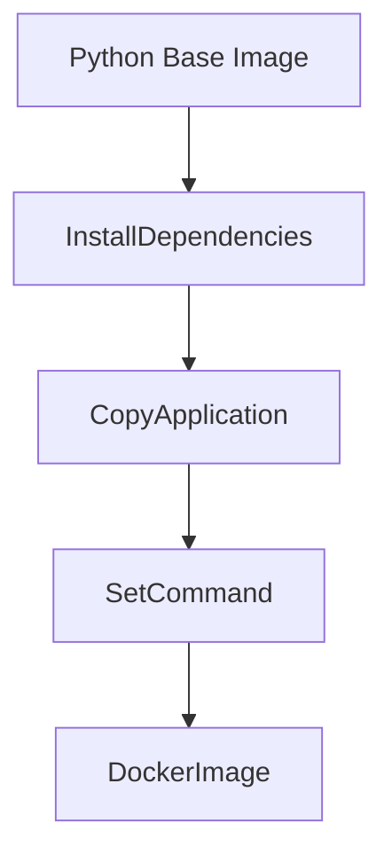

## Overview

The Dockerfile contains instructions for building the Docker image.

---

## What I Learned

* Docker image creation
* Layered architecture
* Build instructions

---

## What This File Does

1. Selects Python base image
2. Copies application files
3. Installs requirements
4. Defines startup command

---

## Typical Workflow

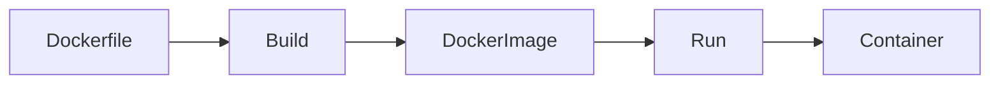

---

## How to Build

```bash
docker build -t mypythonapp .
```

---

## How to Run

```bash
docker run mypythonapp
```

---

## Advantages

* Reproducible environments
* Automated deployment

---

## Disadvantages

* Larger images if not optimized

---

## Use Cases

* Cloud applications
* Kubernetes deployments
* Microservices

---

## Summary

The Dockerfile defines how the Python application is packaged into a Docker image.

---

# Docker Build Process

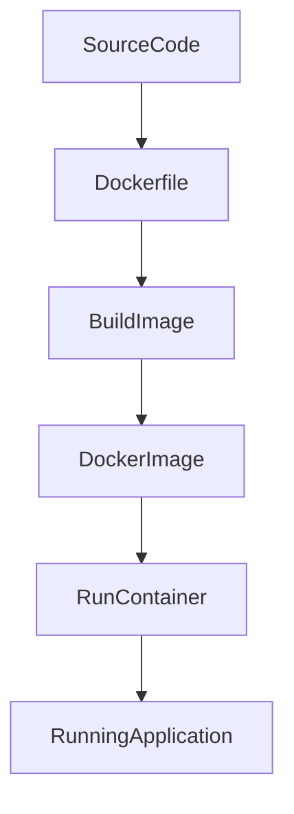

---

# Docker Architecture

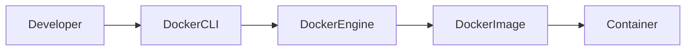

---

# Container Lifecycle

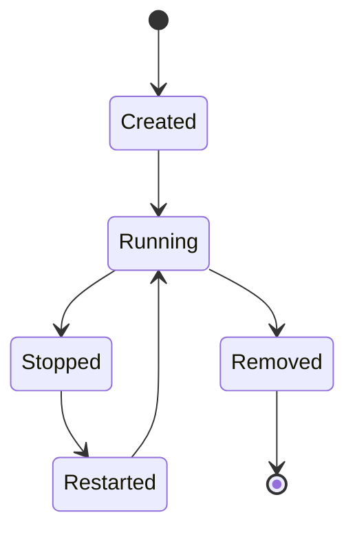

---

# Docker Components

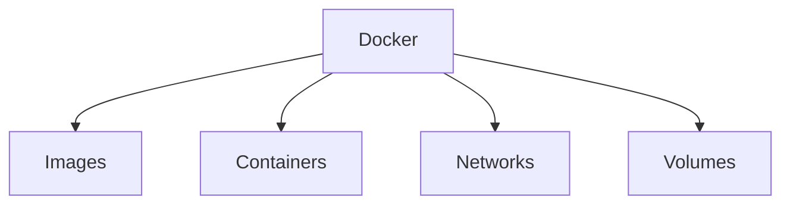

---

# Containerization Workflow

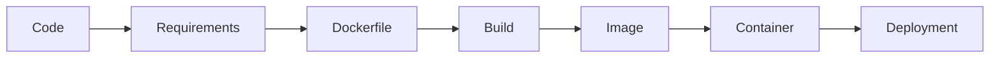

---

# Why Docker?

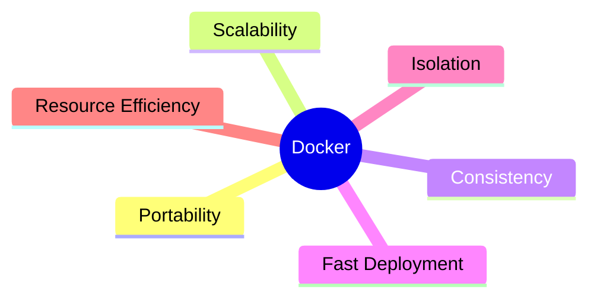

---

# Chapter Distribution

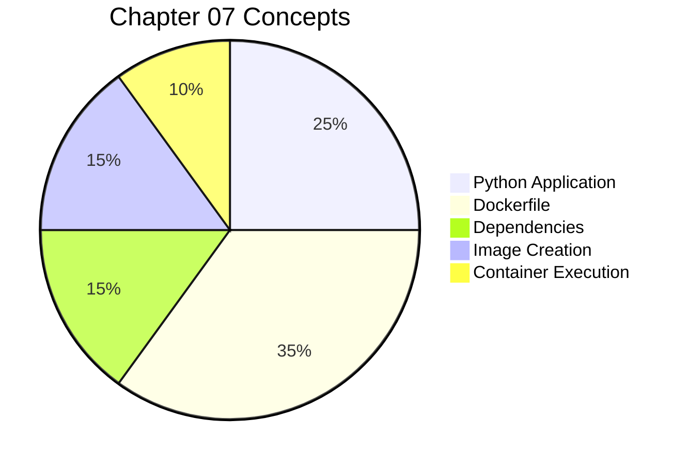

---

# Traditional Deployment vs Container Deployment

| Traditional Deployment        | Docker Deployment    |
| ----------------------------- | -------------------- |
| Install Dependencies Manually | Automated            |
| Environment Differences       | Same Everywhere      |
| Difficult Scaling             | Easy Scaling         |
| Dependency Conflicts          | Isolated Environment |
| Less Portable                 | Highly Portable      |

---

# Real World Workflow

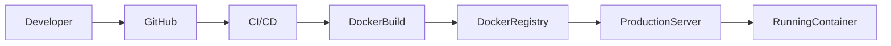

---

# FINAL CHAPTER SUMMARY

## Key Concepts Learned

* Docker Basics
* Containerization
* Dockerfile
* Python Packaging
* Dependency Management
* Docker Images
* Docker Containers
* Build and Run Process

---

## Overall Understanding

Chapter 07 introduces **Docker Containerization** for Python applications.

The examples demonstrate:

* Packaging Python applications
* Managing dependencies
* Creating Docker images
* Running containers
* Portable deployment

Docker solves the common problem:

> "It works on my machine but not on yours."

by ensuring the same environment runs everywhere.

